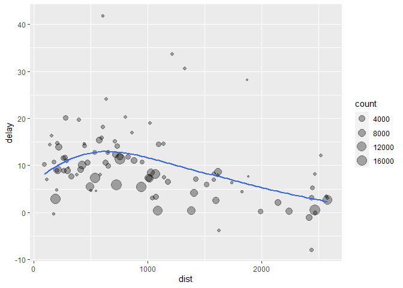
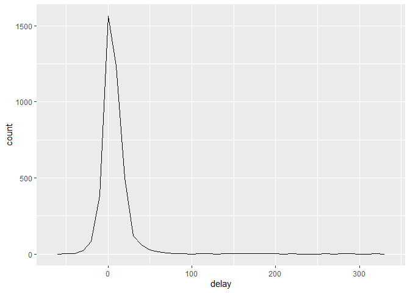
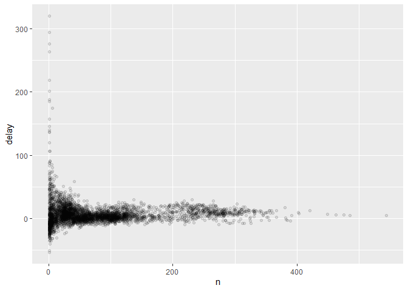
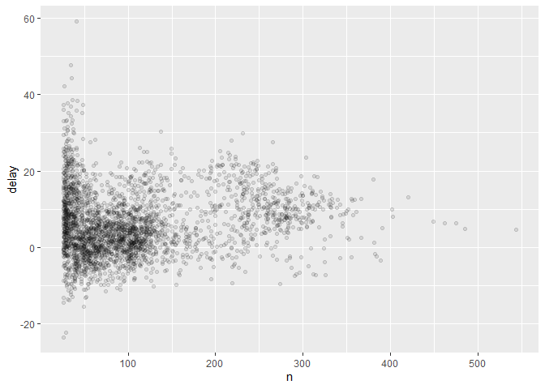
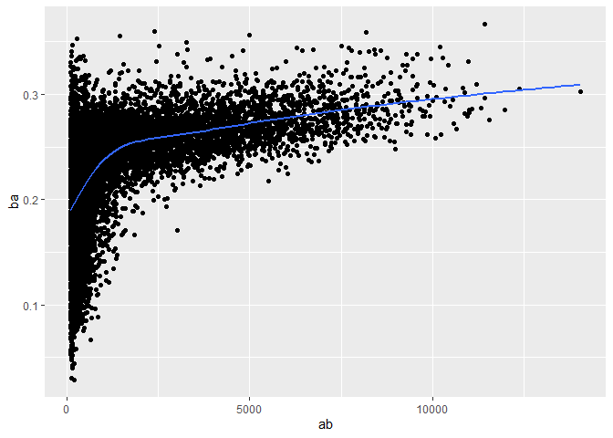

## 5.1 Pendahuluan

Visualisasi adalah alat yang penting untuk menghasilkan wawasan, tetapi
jarang sekali Anda mendapatkan data dalam bentuk yang tepat seperti yang
Anda butuhkan. Sering kali Anda perlu membuat beberapa variabel atau
ringkasan baru, atau mungkin Anda hanya ingin mengganti nama variabel
atau menyusun ulang pengamatan untuk membuat data lebih mudah digunakan.
Anda akan belajar bagaimana melakukan semua itu (dan banyak lagi!) dalam
bab ini, yang akan mengajarkan Anda bagaimana mengubah data Anda
menggunakan paket dplyr dan set data baru pada penerbangan yang
berangkat dari New York City pada tahun 2013.

### 5.1.1 Prasyarat

Pada bab ini kita akan fokus pada bagaimana menggunakan paket dplyr,
anggota inti lain dari tidyverse. Kita akan mengilustrasikan ide-ide
kunci dengan menggunakan data dari paket nycflights13, dan menggunakan
ggplot2 untuk membantu kita memahami data.

``` r
library(nycflights13)
library(tidyverse)
```

``` r
data(flights)
```

Perhatikan baik-baik pesan konflik yang tercetak ketika Anda memuat
tidyverse. Pesan ini memberitahu Anda bahwa dplyr menimpa beberapa
fungsi di dalam basis R. Jika Anda ingin menggunakan versi dasar dari
fungsi-fungsi ini setelah memuat dplyr, Anda harus menggunakan nama
lengkapnya: stats::filter() dan stats::lag().

### 5.1.2 nycflights13

Untuk mengeksplorasi kata kerja manipulasi data dasar dari dplyr, kita
akan menggunakan nycflights13::flights. Kerangka data ini berisi semua
336.776 penerbangan yang berangkat dari New York City pada tahun 2013.
Data tersebut berasal dari Biro Statistik Transportasi AS, dan
didokumentasikan dalam ?flights.

``` r
head(flights)
```

    ## # A tibble: 6 × 19
    ##    year month   day dep_time sched_dep_time dep_delay arr_time sched_arr_time
    ##   <int> <int> <int>    <int>          <int>     <dbl>    <int>          <int>
    ## 1  2013     1     1      517            515         2      830            819
    ## 2  2013     1     1      533            529         4      850            830
    ## 3  2013     1     1      542            540         2      923            850
    ## 4  2013     1     1      544            545        -1     1004           1022
    ## 5  2013     1     1      554            600        -6      812            837
    ## 6  2013     1     1      554            558        -4      740            728
    ## # ℹ 11 more variables: arr_delay <dbl>, carrier <chr>, flight <int>,
    ## #   tailnum <chr>, origin <chr>, dest <chr>, air_time <dbl>, distance <dbl>,
    ## #   hour <dbl>, minute <dbl>, time_hour <dttm>

Anda mungkin memperhatikan bahwa data frame ini mencetak sedikit berbeda
dari data frame lain yang mungkin pernah Anda gunakan sebelumnya: data
frame ini hanya menampilkan beberapa baris pertama dan semua kolom yang
muat di satu layar. (Untuk melihat seluruh dataset, Anda dapat
menjalankan View(flights) yang akan membuka dataset di penampil
RStudio). Dataset ini dicetak secara berbeda karena berbentuk tibble.
Tibble adalah bingkai data, tetapi sedikit diubah agar bekerja lebih
baik di tidyverse. Untuk saat ini, Anda tidak perlu khawatir tentang
perbedaannya; kita akan kembali ke tibble secara lebih rinci dalam
pembahasan berikutnya.

Anda mungkin juga telah memperhatikan deretan tiga (atau empat)
singkatan huruf di bawah nama kolom. Hal ini menjelaskan tipe dari
setiap variabel:

- int adalah singkatan dari bilangan bulat.

- dbl adalah singkatan dari double, atau bilangan real.

- chr adalah singkatan dari vektor karakter, atau string.

- dttm adalah singkatan dari tanggal-waktu (tanggal + waktu).

Ada tiga jenis variabel umum lainnya yang tidak digunakan dalam kumpulan
data ini, namun akan Anda temui nanti di dalam buku ini:

- lgl adalah singkatan dari logical, vektor yang hanya berisi TRUE atau
  FALSE.

- fctr adalah singkatan dari faktor, yang digunakan R untuk
  merepresentasikan variabel kategorikal dengan nilai yang tetap.

- date adalah singkatan dari tanggal.

### 5.1.3 dasar-dasar dplyr

Pada bab ini Anda akan mempelajari lima fungsi utama dplyr yang
memungkinkan Anda untuk menyelesaikan sebagian besar tantangan
manipulasi data Anda:

- Memilih observasi berdasarkan nilainya (filter()).

- Menyusun ulang baris (arrange()).

- Memilih variabel berdasarkan namanya (select()).

- Membuat variabel baru dengan fungsi dari variabel yang sudah ada
  (mutate()).

- Meringkas banyak nilai menjadi satu rangkuman (summarise()).

Semua fungsi ini dapat digunakan bersama dengan group_by() yang mengubah
cakupan setiap fungsi dari yang tadinya beroperasi pada seluruh dataset
menjadi beroperasi pada dataset per kelompok. Keenam fungsi ini
menyediakan kata kerja untuk bahasa manipulasi data.

Semua kata kerja bekerja dengan cara yang sama:

- Argumen pertama adalah kerangka data.

- Argumen berikutnya menjelaskan apa yang harus dilakukan dengan data
  frame, menggunakan nama variabel (tanpa tanda kutip).

- Hasilnya adalah sebuah bingkai data baru.

Bersama-sama, properti ini memudahkan untuk menggabungkan beberapa
langkah sederhana untuk mencapai hasil yang kompleks. Mari kita pelajari
dan lihat bagaimana cara kerja kata kerja ini.

## 5.2 Menyaring baris dengan filter()

filter() memungkinkan Anda untuk melakukan subset pengamatan berdasarkan
nilainya. Argumen pertama adalah nama bingkai data. Argumen kedua dan
selanjutnya adalah ekspresi yang menyaring bingkai data. Sebagai contoh,
kita dapat memilih semua penerbangan pada tanggal 1 Januari dengan:

``` r
head(filter(flights, month == 1, day == 1))
```

    ## # A tibble: 6 × 19
    ##    year month   day dep_time sched_dep_time dep_delay arr_time sched_arr_time
    ##   <int> <int> <int>    <int>          <int>     <dbl>    <int>          <int>
    ## 1  2013     1     1      517            515         2      830            819
    ## 2  2013     1     1      533            529         4      850            830
    ## 3  2013     1     1      542            540         2      923            850
    ## 4  2013     1     1      544            545        -1     1004           1022
    ## 5  2013     1     1      554            600        -6      812            837
    ## 6  2013     1     1      554            558        -4      740            728
    ## # ℹ 11 more variables: arr_delay <dbl>, carrier <chr>, flight <int>,
    ## #   tailnum <chr>, origin <chr>, dest <chr>, air_time <dbl>, distance <dbl>,
    ## #   hour <dbl>, minute <dbl>, time_hour <dttm>

Ketika Anda menjalankan baris kode tersebut, dplyr mengeksekusi operasi
penyaringan dan mengembalikan sebuah frame data baru. Fungsi-fungsi
dplyr tidak pernah memodifikasi input mereka, jadi jika Anda ingin
menyimpan hasilnya, Anda harus menggunakan operator penugasan, \<-:

``` r
jan1 <- filter(flights, month == 1, day == 1)
```

R dapat mencetak hasilnya, atau menyimpannya ke dalam variabel. Jika
Anda ingin melakukan keduanya, Anda dapat membungkus tugas dalam tanda
kurung:

``` r
(dec25 <- filter(flights, month == 12, day == 25)) %>% head()
```

    ## # A tibble: 6 × 19
    ##    year month   day dep_time sched_dep_time dep_delay arr_time sched_arr_time
    ##   <int> <int> <int>    <int>          <int>     <dbl>    <int>          <int>
    ## 1  2013    12    25      456            500        -4      649            651
    ## 2  2013    12    25      524            515         9      805            814
    ## 3  2013    12    25      542            540         2      832            850
    ## 4  2013    12    25      546            550        -4     1022           1027
    ## 5  2013    12    25      556            600        -4      730            745
    ## 6  2013    12    25      557            600        -3      743            752
    ## # ℹ 11 more variables: arr_delay <dbl>, carrier <chr>, flight <int>,
    ## #   tailnum <chr>, origin <chr>, dest <chr>, air_time <dbl>, distance <dbl>,
    ## #   hour <dbl>, minute <dbl>, time_hour <dttm>

### 5.2.1 Perbandingan

Untuk menggunakan pemfilteran secara efektif, Anda harus mengetahui cara
memilih pengamatan yang Anda inginkan dengan menggunakan operator
perbandingan. R menyediakan rangkaian standar: \>, \>=, \<, \<=, !=
(tidak sama), dan == (sama).

Ketika Anda mulai menggunakan R, kesalahan yang paling mudah dilakukan
adalah menggunakan = dan bukannya == ketika menguji kesetaraan. Ketika
hal ini terjadi, Anda akan mendapatkan sebuah kesalahan yang informatif:

``` r
head(filter(flights, month == 1))
```

    ## # A tibble: 6 × 19
    ##    year month   day dep_time sched_dep_time dep_delay arr_time sched_arr_time
    ##   <int> <int> <int>    <int>          <int>     <dbl>    <int>          <int>
    ## 1  2013     1     1      517            515         2      830            819
    ## 2  2013     1     1      533            529         4      850            830
    ## 3  2013     1     1      542            540         2      923            850
    ## 4  2013     1     1      544            545        -1     1004           1022
    ## 5  2013     1     1      554            600        -6      812            837
    ## 6  2013     1     1      554            558        -4      740            728
    ## # ℹ 11 more variables: arr_delay <dbl>, carrier <chr>, flight <int>,
    ## #   tailnum <chr>, origin <chr>, dest <chr>, air_time <dbl>, distance <dbl>,
    ## #   hour <dbl>, minute <dbl>, time_hour <dttm>

Ada masalah umum lain yang mungkin Anda temui ketika menggunakan ==:
bilangan floating point. Hasil ini mungkin akan mengejutkan Anda!

``` r
sqrt(2) ^ 2 == 2
```

    ## [1] FALSE

``` r
1 / 49 * 49 == 1
```

    ## [1] FALSE

Komputer menggunakan aritmatika presisi terbatas (mereka jelas tidak
dapat menyimpan jumlah digit yang tak terbatas!) jadi ingatlah bahwa
setiap angka yang Anda lihat adalah sebuah perkiraan. Daripada
mengandalkan ==, gunakanlah near():

``` r
near(sqrt(2) ^ 2, 2)
```

    ## [1] TRUE

``` r
near(1 / 49 * 49, 1)
```

    ## [1] TRUE

### 5.2.2 Operator logika

Beberapa argumen untuk filter() digabungkan dengan “and”: setiap
ekspresi harus bernilai benar agar sebuah baris disertakan dalam output.
Untuk jenis kombinasi lainnya, Anda harus menggunakan operator Boolean
sendiri: & adalah “dan”, \| adalah “atau”, dan ! adalah “tidak”. Gambar
5.1 menunjukkan set lengkap operasi Boolean.


Kode berikut ini menemukan semua penerbangan yang berangkat pada bulan
November atau Desember:

``` r
head(filter(flights, month == 11 | month == 12))
```

    ## # A tibble: 6 × 19
    ##    year month   day dep_time sched_dep_time dep_delay arr_time sched_arr_time
    ##   <int> <int> <int>    <int>          <int>     <dbl>    <int>          <int>
    ## 1  2013    11     1        5           2359         6      352            345
    ## 2  2013    11     1       35           2250       105      123           2356
    ## 3  2013    11     1      455            500        -5      641            651
    ## 4  2013    11     1      539            545        -6      856            827
    ## 5  2013    11     1      542            545        -3      831            855
    ## 6  2013    11     1      549            600       -11      912            923
    ## # ℹ 11 more variables: arr_delay <dbl>, carrier <chr>, flight <int>,
    ## #   tailnum <chr>, origin <chr>, dest <chr>, air_time <dbl>, distance <dbl>,
    ## #   hour <dbl>, minute <dbl>, time_hour <dttm>

Urutan operasi tidak bekerja seperti bahasa Inggris. Anda tidak dapat
menulis filter(flights, month == (11 \| 12)), yang secara harfiah dapat
diterjemahkan menjadi “menemukan semua penerbangan yang berangkat pada
bulan November atau Desember”. Sebaliknya, filter ini menemukan semua
bulan yang sama dengan 11 \| 12, sebuah ekspresi yang dievaluasi menjadi
TRUE. Dalam konteks numerik (seperti di sini), TRUE menjadi satu, jadi
ini menemukan semua penerbangan di bulan Januari, bukan November atau
Desember. Ini cukup membingungkan!

Cara singkat yang berguna untuk masalah ini adalah x %in% y. Ini akan
memilih setiap baris di mana x adalah salah satu nilai di y. Kita dapat
menggunakannya untuk menulis ulang kode di atas:

``` r
nov_dec <- filter(flights, month %in% c(11, 12))
```

Terkadang Anda dapat menyederhanakan subset yang rumit dengan mengingat
hukum De Morgan: !(x & y) sama dengan !x \| !y, dan !(x \| y) sama
dengan !x & !y. Sebagai contoh, jika Anda ingin menemukan penerbangan
yang tidak tertunda (pada saat kedatangan atau keberangkatan) lebih dari
dua jam, Anda dapat menggunakan salah satu dari dua filter berikut:

``` r
head(filter(flights, !(arr_delay > 120 | dep_delay > 120)))
```

    ## # A tibble: 6 × 19
    ##    year month   day dep_time sched_dep_time dep_delay arr_time sched_arr_time
    ##   <int> <int> <int>    <int>          <int>     <dbl>    <int>          <int>
    ## 1  2013     1     1      517            515         2      830            819
    ## 2  2013     1     1      533            529         4      850            830
    ## 3  2013     1     1      542            540         2      923            850
    ## 4  2013     1     1      544            545        -1     1004           1022
    ## 5  2013     1     1      554            600        -6      812            837
    ## 6  2013     1     1      554            558        -4      740            728
    ## # ℹ 11 more variables: arr_delay <dbl>, carrier <chr>, flight <int>,
    ## #   tailnum <chr>, origin <chr>, dest <chr>, air_time <dbl>, distance <dbl>,
    ## #   hour <dbl>, minute <dbl>, time_hour <dttm>

``` r
head(filter(flights, arr_delay <= 120, dep_delay <= 120))
```

    ## # A tibble: 6 × 19
    ##    year month   day dep_time sched_dep_time dep_delay arr_time sched_arr_time
    ##   <int> <int> <int>    <int>          <int>     <dbl>    <int>          <int>
    ## 1  2013     1     1      517            515         2      830            819
    ## 2  2013     1     1      533            529         4      850            830
    ## 3  2013     1     1      542            540         2      923            850
    ## 4  2013     1     1      544            545        -1     1004           1022
    ## 5  2013     1     1      554            600        -6      812            837
    ## 6  2013     1     1      554            558        -4      740            728
    ## # ℹ 11 more variables: arr_delay <dbl>, carrier <chr>, flight <int>,
    ## #   tailnum <chr>, origin <chr>, dest <chr>, air_time <dbl>, distance <dbl>,
    ## #   hour <dbl>, minute <dbl>, time_hour <dttm>

Selain & dan \|, R juga memiliki && dan \|\|. Jangan gunakan mereka di
sini! Anda akan belajar kapan Anda harus menggunakannya dalam eksekusi
bersyarat.

Kapanpun Anda mulai menggunakan ekspresi yang rumit dan banyak bagian
dalam filter(), pertimbangkan untuk menjadikannya sebagai variabel
eksplisit. Hal ini akan membuat Anda lebih mudah untuk memeriksa
pekerjaan Anda. Anda akan belajar bagaimana membuat variabel baru
segera.

### 5.2.3 Nilai yang hilang

Salah satu fitur penting dari R yang dapat membuat perbandingan menjadi
rumit adalah nilai yang hilang, atau NA (“tidak tersedia”). NA mewakili
nilai yang tidak diketahui sehingga nilai yang hilang bersifat
“menular”: hampir semua operasi yang melibatkan nilai yang tidak
diketahui juga akan menjadi tidak diketahui.

``` r
NA > 5
```

    ## [1] NA

``` r
10 == NA
```

    ## [1] NA

``` r
NA + 10
```

    ## [1] NA

``` r
NA / 2
```

    ## [1] NA

Hasil yang paling membingungkan adalah yang satu ini:

``` r
NA == NA
```

    ## [1] NA

Paling mudah untuk memahami mengapa hal ini benar dengan sedikit lebih
banyak konteks:

``` r
# Biarkan x menjadi usia Mary. Kita tidak tahu berapa umurnya.
x <- NA

# Biarkan y menjadi usia John. Kita tidak tahu berapa usianya.
y <- NA

# Apakah John dan Mary seumuran?
x == y
```

    ## [1] NA

Jika Anda ingin menentukan apakah sebuah nilai hilang, gunakan is.na():

``` r
is.na(x)
```

    ## [1] TRUE

filter() hanya menyertakan baris yang kondisinya TRUE; tidak termasuk
nilai FALSE dan NA. Jika Anda ingin mempertahankan nilai yang hilang,
tanyakan secara eksplisit:

``` r
df <- tibble(x = c(1, NA, 3))
filter(df, x > 1)
```

    ## # A tibble: 1 × 1
    ##       x
    ##   <dbl>
    ## 1     3

``` r
filter(df, is.na(x) | x > 1)
```

    ## # A tibble: 2 × 1
    ##       x
    ##   <dbl>
    ## 1    NA
    ## 2     3

### 5.2.4 Latihan

1.  Temukan semua penerbangan yang

Mengalami keterlambatan kedatangan dua jam atau lebih

``` r
head(filter(flights, arr_delay >= 120))
```

    ## # A tibble: 6 × 19
    ##    year month   day dep_time sched_dep_time dep_delay arr_time sched_arr_time
    ##   <int> <int> <int>    <int>          <int>     <dbl>    <int>          <int>
    ## 1  2013     1     1      811            630       101     1047            830
    ## 2  2013     1     1      848           1835       853     1001           1950
    ## 3  2013     1     1      957            733       144     1056            853
    ## 4  2013     1     1     1114            900       134     1447           1222
    ## 5  2013     1     1     1505           1310       115     1638           1431
    ## 6  2013     1     1     1525           1340       105     1831           1626
    ## # ℹ 11 more variables: arr_delay <dbl>, carrier <chr>, flight <int>,
    ## #   tailnum <chr>, origin <chr>, dest <chr>, air_time <dbl>, distance <dbl>,
    ## #   hour <dbl>, minute <dbl>, time_hour <dttm>

Terbang ke Houston (IAH atau HOU)

``` r
head(filter(flights, dest %in% c("IAH", "HOU")))
```

    ## # A tibble: 6 × 19
    ##    year month   day dep_time sched_dep_time dep_delay arr_time sched_arr_time
    ##   <int> <int> <int>    <int>          <int>     <dbl>    <int>          <int>
    ## 1  2013     1     1      517            515         2      830            819
    ## 2  2013     1     1      533            529         4      850            830
    ## 3  2013     1     1      623            627        -4      933            932
    ## 4  2013     1     1      728            732        -4     1041           1038
    ## 5  2013     1     1      739            739         0     1104           1038
    ## 6  2013     1     1      908            908         0     1228           1219
    ## # ℹ 11 more variables: arr_delay <dbl>, carrier <chr>, flight <int>,
    ## #   tailnum <chr>, origin <chr>, dest <chr>, air_time <dbl>, distance <dbl>,
    ## #   hour <dbl>, minute <dbl>, time_hour <dttm>

Dioperasikan oleh United, American, atau Delta

``` r
head(filter(flights, carrier %in% c("UA", "AA", "DL")))
```

    ## # A tibble: 6 × 19
    ##    year month   day dep_time sched_dep_time dep_delay arr_time sched_arr_time
    ##   <int> <int> <int>    <int>          <int>     <dbl>    <int>          <int>
    ## 1  2013     1     1      517            515         2      830            819
    ## 2  2013     1     1      533            529         4      850            830
    ## 3  2013     1     1      542            540         2      923            850
    ## 4  2013     1     1      554            600        -6      812            837
    ## 5  2013     1     1      554            558        -4      740            728
    ## 6  2013     1     1      558            600        -2      753            745
    ## # ℹ 11 more variables: arr_delay <dbl>, carrier <chr>, flight <int>,
    ## #   tailnum <chr>, origin <chr>, dest <chr>, air_time <dbl>, distance <dbl>,
    ## #   hour <dbl>, minute <dbl>, time_hour <dttm>

Berangkat pada musim panas (Juli, Agustus, dan September)

``` r
head(filter(flights, month %in% c(7, 8, 9)))
```

    ## # A tibble: 6 × 19
    ##    year month   day dep_time sched_dep_time dep_delay arr_time sched_arr_time
    ##   <int> <int> <int>    <int>          <int>     <dbl>    <int>          <int>
    ## 1  2013     7     1        1           2029       212      236           2359
    ## 2  2013     7     1        2           2359         3      344            344
    ## 3  2013     7     1       29           2245       104      151              1
    ## 4  2013     7     1       43           2130       193      322             14
    ## 5  2013     7     1       44           2150       174      300            100
    ## 6  2013     7     1       46           2051       235      304           2358
    ## # ℹ 11 more variables: arr_delay <dbl>, carrier <chr>, flight <int>,
    ## #   tailnum <chr>, origin <chr>, dest <chr>, air_time <dbl>, distance <dbl>,
    ## #   hour <dbl>, minute <dbl>, time_hour <dttm>

Tiba terlambat lebih dari dua jam, tetapi tidak berangkat terlambat

``` r
head(filter(flights, arr_delay > 120, dep_delay == 0))
```

    ## # A tibble: 3 × 19
    ##    year month   day dep_time sched_dep_time dep_delay arr_time sched_arr_time
    ##   <int> <int> <int>    <int>          <int>     <dbl>    <int>          <int>
    ## 1  2013    10     7     1350           1350         0     1736           1526
    ## 2  2013     5    23     1810           1810         0     2208           2000
    ## 3  2013     7     1      905            905         0     1443           1223
    ## # ℹ 11 more variables: arr_delay <dbl>, carrier <chr>, flight <int>,
    ## #   tailnum <chr>, origin <chr>, dest <chr>, air_time <dbl>, distance <dbl>,
    ## #   hour <dbl>, minute <dbl>, time_hour <dttm>

Tertunda setidaknya satu jam, tetapi lebih dari 30 menit dalam
penerbangan

``` r
head(filter(flights, dep_delay >= 60, air_time > 30))
```

    ## # A tibble: 6 × 19
    ##    year month   day dep_time sched_dep_time dep_delay arr_time sched_arr_time
    ##   <int> <int> <int>    <int>          <int>     <dbl>    <int>          <int>
    ## 1  2013     1     1      811            630       101     1047            830
    ## 2  2013     1     1      826            715        71     1136           1045
    ## 3  2013     1     1      848           1835       853     1001           1950
    ## 4  2013     1     1      957            733       144     1056            853
    ## 5  2013     1     1     1114            900       134     1447           1222
    ## 6  2013     1     1     1120            944        96     1331           1213
    ## # ℹ 11 more variables: arr_delay <dbl>, carrier <chr>, flight <int>,
    ## #   tailnum <chr>, origin <chr>, dest <chr>, air_time <dbl>, distance <dbl>,
    ## #   hour <dbl>, minute <dbl>, time_hour <dttm>

Berangkat antara tengah malam dan pukul 6 pagi (inklusif)

``` r
head(filter(flights, between(hour, 0, 6)))
```

    ## # A tibble: 6 × 19
    ##    year month   day dep_time sched_dep_time dep_delay arr_time sched_arr_time
    ##   <int> <int> <int>    <int>          <int>     <dbl>    <int>          <int>
    ## 1  2013     1     1      517            515         2      830            819
    ## 2  2013     1     1      533            529         4      850            830
    ## 3  2013     1     1      542            540         2      923            850
    ## 4  2013     1     1      544            545        -1     1004           1022
    ## 5  2013     1     1      554            600        -6      812            837
    ## 6  2013     1     1      554            558        -4      740            728
    ## # ℹ 11 more variables: arr_delay <dbl>, carrier <chr>, flight <int>,
    ## #   tailnum <chr>, origin <chr>, dest <chr>, air_time <dbl>, distance <dbl>,
    ## #   hour <dbl>, minute <dbl>, time_hour <dttm>

2.  Pembantu pemfilteran dplyr lain yang berguna adalah between(). Apa
    fungsinya? Dapatkah Anda menggunakannya untuk menyederhanakan kode
    yang diperlukan untuk menjawab tantangan sebelumnya?

Fungsi **`between()`** dalam paket **`dplyr`** digunakan untuk melakukan
pemfilteran berdasarkan rentang nilai pada suatu variabel. Fungsi ini
membantu memilih baris yang memenuhi kondisi rentang tertentu.

Dalam konteks tantangan sebelumnya yang melibatkan pemfilteran
penerbangan berdasarkan rentang nilai pada variabel tertentu, kita dapat
menggunakan **`between()`** untuk menyederhanakan kode.

Misalnya, jika kita ingin memfilter penerbangan berdasarkan rentang
nilai pada variabel ‘hour’, kita dapat menggunakan **`between()`**
sebagai berikut:

``` r
head(filter(flights, between(hour, 0, 6)))
```

    ## # A tibble: 6 × 19
    ##    year month   day dep_time sched_dep_time dep_delay arr_time sched_arr_time
    ##   <int> <int> <int>    <int>          <int>     <dbl>    <int>          <int>
    ## 1  2013     1     1      517            515         2      830            819
    ## 2  2013     1     1      533            529         4      850            830
    ## 3  2013     1     1      542            540         2      923            850
    ## 4  2013     1     1      544            545        -1     1004           1022
    ## 5  2013     1     1      554            600        -6      812            837
    ## 6  2013     1     1      554            558        -4      740            728
    ## # ℹ 11 more variables: arr_delay <dbl>, carrier <chr>, flight <int>,
    ## #   tailnum <chr>, origin <chr>, dest <chr>, air_time <dbl>, distance <dbl>,
    ## #   hour <dbl>, minute <dbl>, time_hour <dttm>

3.  Berapa banyak penerbangan yang memiliki dep_time yang hilang?
    Variabel apa lagi yang hilang? Apa yang mungkin diwakili oleh
    baris-baris ini?

``` r
missing_dep_time <- sum(is.na(flights$dep_time))

variable_missing <- colSums(is.na(flights))

print(missing_dep_time)
```

    ## [1] 8255

``` r
print(data.frame(variable_missing))
```

    ##                variable_missing
    ## year                          0
    ## month                         0
    ## day                           0
    ## dep_time                   8255
    ## sched_dep_time                0
    ## dep_delay                  8255
    ## arr_time                   8713
    ## sched_arr_time                0
    ## arr_delay                  9430
    ## carrier                       0
    ## flight                        0
    ## tailnum                    2512
    ## origin                        0
    ## dest                          0
    ## air_time                   9430
    ## distance                      0
    ## hour                          0
    ## minute                        0
    ## time_hour                     0

4.  Mengapa NA ^ 0 tidak hilang? Mengapa NA \| TRUE tidak hilang?
    Mengapa FALSE & NA tidak hilang? Dapatkah Anda mengetahui aturan
    umumnya? (NA \* 0 adalah contoh tandingan yang rumit!)

Mengapa NA ^ 0 tidak hilang? Ketika kita menggunakan operator pangkat
(^), R mengikuti aturan matematika bahwa nilai NA ditingkatkan ke kuasa
apa pun akan tetap NA. Ini dikarenakan nilai yang hilang (NA)
mengindikasikan ketidakpastian, dan hasil dari operasi matematika yang
melibatkan ketidakpastian tetap menjadi ketidakpastian. Dalam kasus ini,
NA ^ 0 dianggap sebagai nilai yang hilang (NA).

Mengapa NA \| TRUE tidak hilang? Operator logika OR (\|) mengikuti
aturan bahwa jika salah satu operand adalah TRUE, hasilnya akan selalu
TRUE. Dalam kasus ini, meskipun salah satu operandnya adalah nilai yang
hilang (NA), karena terdapat nilai TRUE, hasilnya tetap TRUE.

Mengapa FALSE & NA tidak hilang? Operator logika AND (&) mengikuti
aturan bahwa jika salah satu operand adalah FALSE, hasilnya akan selalu
FALSE. Dalam kasus ini, meskipun salah satu operandnya adalah nilai yang
hilang (NA), karena terdapat nilai FALSE, hasilnya tetap FALSE.

## 5.3 Mengatur baris dengan arrange()

arrange() bekerja mirip dengan filter() kecuali bahwa alih-alih memilih
baris, ia mengubah urutannya. Dibutuhkan sebuah bingkai data dan
sekumpulan nama kolom (atau ekspresi yang lebih rumit) untuk
mengurutkannya. Jika Anda memberikan lebih dari satu nama kolom, setiap
kolom tambahan akan digunakan untuk memutus hubungan nilai dari
kolom-kolom sebelumnya:

``` r
head(arrange(flights, year, month, day))
```

    ## # A tibble: 6 × 19
    ##    year month   day dep_time sched_dep_time dep_delay arr_time sched_arr_time
    ##   <int> <int> <int>    <int>          <int>     <dbl>    <int>          <int>
    ## 1  2013     1     1      517            515         2      830            819
    ## 2  2013     1     1      533            529         4      850            830
    ## 3  2013     1     1      542            540         2      923            850
    ## 4  2013     1     1      544            545        -1     1004           1022
    ## 5  2013     1     1      554            600        -6      812            837
    ## 6  2013     1     1      554            558        -4      740            728
    ## # ℹ 11 more variables: arr_delay <dbl>, carrier <chr>, flight <int>,
    ## #   tailnum <chr>, origin <chr>, dest <chr>, air_time <dbl>, distance <dbl>,
    ## #   hour <dbl>, minute <dbl>, time_hour <dttm>

Gunakan desc() untuk mengurutkan ulang berdasarkan kolom dalam urutan
menurun:

``` r
head(arrange(flights, desc(dep_delay)))
```

    ## # A tibble: 6 × 19
    ##    year month   day dep_time sched_dep_time dep_delay arr_time sched_arr_time
    ##   <int> <int> <int>    <int>          <int>     <dbl>    <int>          <int>
    ## 1  2013     1     9      641            900      1301     1242           1530
    ## 2  2013     6    15     1432           1935      1137     1607           2120
    ## 3  2013     1    10     1121           1635      1126     1239           1810
    ## 4  2013     9    20     1139           1845      1014     1457           2210
    ## 5  2013     7    22      845           1600      1005     1044           1815
    ## 6  2013     4    10     1100           1900       960     1342           2211
    ## # ℹ 11 more variables: arr_delay <dbl>, carrier <chr>, flight <int>,
    ## #   tailnum <chr>, origin <chr>, dest <chr>, air_time <dbl>, distance <dbl>,
    ## #   hour <dbl>, minute <dbl>, time_hour <dttm>

Nilai yang hilang selalu diurutkan di bagian akhir:

``` r
df <- tibble(x = c(5, 2, NA))
arrange(df, x)
```

    ## # A tibble: 3 × 1
    ##       x
    ##   <dbl>
    ## 1     2
    ## 2     5
    ## 3    NA

``` r
arrange(df, desc(x))
```

    ## # A tibble: 3 × 1
    ##       x
    ##   <dbl>
    ## 1     5
    ## 2     2
    ## 3    NA

### 5.3.1 Latihan

1.  Bagaimana Anda dapat menggunakan arrange() untuk mengurutkan semua
    nilai yang hilang dari awal? (Petunjuk: gunakan is.na()).

``` r
head(arrange(flights, desc(is.na(dep_delay))))
```

    ## # A tibble: 6 × 19
    ##    year month   day dep_time sched_dep_time dep_delay arr_time sched_arr_time
    ##   <int> <int> <int>    <int>          <int>     <dbl>    <int>          <int>
    ## 1  2013     1     1       NA           1630        NA       NA           1815
    ## 2  2013     1     1       NA           1935        NA       NA           2240
    ## 3  2013     1     1       NA           1500        NA       NA           1825
    ## 4  2013     1     1       NA            600        NA       NA            901
    ## 5  2013     1     2       NA           1540        NA       NA           1747
    ## 6  2013     1     2       NA           1620        NA       NA           1746
    ## # ℹ 11 more variables: arr_delay <dbl>, carrier <chr>, flight <int>,
    ## #   tailnum <chr>, origin <chr>, dest <chr>, air_time <dbl>, distance <dbl>,
    ## #   hour <dbl>, minute <dbl>, time_hour <dttm>

2.  Mengurutkan penerbangan untuk menemukan penerbangan yang paling
    banyak ditunda. Temukan penerbangan yang berangkat paling awal.

``` r
penerbangan_ditunda_terbanyak <- arrange(flights, desc(dep_delay))
head(penerbangan_ditunda_terbanyak, 1)
```

    ## # A tibble: 1 × 19
    ##    year month   day dep_time sched_dep_time dep_delay arr_time sched_arr_time
    ##   <int> <int> <int>    <int>          <int>     <dbl>    <int>          <int>
    ## 1  2013     1     9      641            900      1301     1242           1530
    ## # ℹ 11 more variables: arr_delay <dbl>, carrier <chr>, flight <int>,
    ## #   tailnum <chr>, origin <chr>, dest <chr>, air_time <dbl>, distance <dbl>,
    ## #   hour <dbl>, minute <dbl>, time_hour <dttm>

``` r
penerbangan_terawal <- arrange(flights, dep_time)

head(penerbangan_terawal, 1)
```

    ## # A tibble: 1 × 19
    ##    year month   day dep_time sched_dep_time dep_delay arr_time sched_arr_time
    ##   <int> <int> <int>    <int>          <int>     <dbl>    <int>          <int>
    ## 1  2013     1    13        1           2249        72      108           2357
    ## # ℹ 11 more variables: arr_delay <dbl>, carrier <chr>, flight <int>,
    ## #   tailnum <chr>, origin <chr>, dest <chr>, air_time <dbl>, distance <dbl>,
    ## #   hour <dbl>, minute <dbl>, time_hour <dttm>

3.  Mengurutkan penerbangan untuk menemukan penerbangan tercepat
    (kecepatan tertinggi).

``` r
penerbangan_tercepat <- arrange(flights, air_time)

head(penerbangan_tercepat, 1)
```

    ## # A tibble: 1 × 19
    ##    year month   day dep_time sched_dep_time dep_delay arr_time sched_arr_time
    ##   <int> <int> <int>    <int>          <int>     <dbl>    <int>          <int>
    ## 1  2013     1    16     1355           1315        40     1442           1411
    ## # ℹ 11 more variables: arr_delay <dbl>, carrier <chr>, flight <int>,
    ## #   tailnum <chr>, origin <chr>, dest <chr>, air_time <dbl>, distance <dbl>,
    ## #   hour <dbl>, minute <dbl>, time_hour <dttm>

4.  Penerbangan mana yang menempuh jarak terjauh? Penerbangan mana yang
    menempuh perjalanan terpendek?

``` r
penerbangan_jarak_terpendek <- arrange(flights, distance)
print(head(penerbangan_jarak_terpendek, 1))
```

    ## # A tibble: 1 × 19
    ##    year month   day dep_time sched_dep_time dep_delay arr_time sched_arr_time
    ##   <int> <int> <int>    <int>          <int>     <dbl>    <int>          <int>
    ## 1  2013     7    27       NA            106        NA       NA            245
    ## # ℹ 11 more variables: arr_delay <dbl>, carrier <chr>, flight <int>,
    ## #   tailnum <chr>, origin <chr>, dest <chr>, air_time <dbl>, distance <dbl>,
    ## #   hour <dbl>, minute <dbl>, time_hour <dttm>

## 5.4 Memilih kolom dengan select()

Tidak jarang kita mendapatkan kumpulan data dengan ratusan atau bahkan
ribuan variabel. Dalam kasus ini, tantangan pertama yang sering dihadapi
adalah mempersempit variabel yang benar-benar Anda minati. select()
memungkinkan Anda untuk dengan cepat memperbesar subset yang berguna
dengan menggunakan operasi berdasarkan nama-nama variabel.

select() tidak terlalu berguna pada data penerbangan karena kita hanya
memiliki 19 variabel, tetapi Anda masih bisa mendapatkan gambaran
umumnya:

``` r
# Pilih kolom berdasarkan nama
head(select(flights, year, month, day))
```

    ## # A tibble: 6 × 3
    ##    year month   day
    ##   <int> <int> <int>
    ## 1  2013     1     1
    ## 2  2013     1     1
    ## 3  2013     1     1
    ## 4  2013     1     1
    ## 5  2013     1     1
    ## 6  2013     1     1

``` r
# Pilih semua kolom antara tahun dan hari (inklusif)
head(select(flights, year:day))
```

    ## # A tibble: 6 × 3
    ##    year month   day
    ##   <int> <int> <int>
    ## 1  2013     1     1
    ## 2  2013     1     1
    ## 3  2013     1     1
    ## 4  2013     1     1
    ## 5  2013     1     1
    ## 6  2013     1     1

``` r
# Pilih semua kolom kecuali yang dari tahun ke hari (inklusif)
head(select(flights, -(year:day)))
```

    ## # A tibble: 6 × 16
    ##   dep_time sched_dep_time dep_delay arr_time sched_arr_time arr_delay carrier
    ##      <int>          <int>     <dbl>    <int>          <int>     <dbl> <chr>  
    ## 1      517            515         2      830            819        11 UA     
    ## 2      533            529         4      850            830        20 UA     
    ## 3      542            540         2      923            850        33 AA     
    ## 4      544            545        -1     1004           1022       -18 B6     
    ## 5      554            600        -6      812            837       -25 DL     
    ## 6      554            558        -4      740            728        12 UA     
    ## # ℹ 9 more variables: flight <int>, tailnum <chr>, origin <chr>, dest <chr>,
    ## #   air_time <dbl>, distance <dbl>, hour <dbl>, minute <dbl>, time_hour <dttm>

Ada beberapa fungsi pembantu yang dapat Anda gunakan dalam select():

- starts_with(“abc”): mencocokkan nama yang dimulai dengan “abc”.

- ends_with(“xyz”): mencocokkan nama yang diakhiri dengan “xyz”.

- contains(“ijk”): mencocokkan nama yang mengandung “ijk”.

- matches(“(.)\\\1”): memilih variabel yang cocok dengan ekspresi
  reguler. Fungsi ini cocok dengan variabel apa pun yang berisi karakter
  berulang. Anda akan mempelajari lebih lanjut tentang ekspresi reguler
  dalam string.

- num_range(“x”, 1:3): mencocokkan x1, x2 dan x3.

Lihat ?select untuk detail lebih lanjut.

select() dapat digunakan untuk mengganti nama variabel, tetapi jarang
berguna karena ia membuang semua variabel yang tidak disebutkan secara
eksplisit. Sebagai gantinya, gunakan rename(), yang merupakan varian
dari select() yang menyimpan semua variabel yang tidak disebutkan secara
eksplisit:

``` r
rename(flights, tail_num = tailnum) %>% head()
```

    ## # A tibble: 6 × 19
    ##    year month   day dep_time sched_dep_time dep_delay arr_time sched_arr_time
    ##   <int> <int> <int>    <int>          <int>     <dbl>    <int>          <int>
    ## 1  2013     1     1      517            515         2      830            819
    ## 2  2013     1     1      533            529         4      850            830
    ## 3  2013     1     1      542            540         2      923            850
    ## 4  2013     1     1      544            545        -1     1004           1022
    ## 5  2013     1     1      554            600        -6      812            837
    ## 6  2013     1     1      554            558        -4      740            728
    ## # ℹ 11 more variables: arr_delay <dbl>, carrier <chr>, flight <int>,
    ## #   tail_num <chr>, origin <chr>, dest <chr>, air_time <dbl>, distance <dbl>,
    ## #   hour <dbl>, minute <dbl>, time_hour <dttm>

Pilihan lainnya adalah dengan menggunakan select() bersama dengan
pembantu everything(). Ini berguna jika Anda memiliki beberapa variabel
yang ingin Anda pindahkan ke awal bingkai data.

``` r
select(flights, time_hour, air_time, everything()) %>% head()
```

    ## # A tibble: 6 × 19
    ##   time_hour           air_time  year month   day dep_time sched_dep_time
    ##   <dttm>                 <dbl> <int> <int> <int>    <int>          <int>
    ## 1 2013-01-01 05:00:00      227  2013     1     1      517            515
    ## 2 2013-01-01 05:00:00      227  2013     1     1      533            529
    ## 3 2013-01-01 05:00:00      160  2013     1     1      542            540
    ## 4 2013-01-01 05:00:00      183  2013     1     1      544            545
    ## 5 2013-01-01 06:00:00      116  2013     1     1      554            600
    ## 6 2013-01-01 05:00:00      150  2013     1     1      554            558
    ## # ℹ 12 more variables: dep_delay <dbl>, arr_time <int>, sched_arr_time <int>,
    ## #   arr_delay <dbl>, carrier <chr>, flight <int>, tailnum <chr>, origin <chr>,
    ## #   dest <chr>, distance <dbl>, hour <dbl>, minute <dbl>

### 5.4.1 Latihan

1.  Pikirkan sebanyak mungkin cara untuk memilih dep_time, dep_delay,
    arr_time, dan arr_delay dari penerbangan.

``` r
head(select(flights, dep_time, dep_delay, arr_time, arr_delay))
```

    ## # A tibble: 6 × 4
    ##   dep_time dep_delay arr_time arr_delay
    ##      <int>     <dbl>    <int>     <dbl>
    ## 1      517         2      830        11
    ## 2      533         4      850        20
    ## 3      542         2      923        33
    ## 4      544        -1     1004       -18
    ## 5      554        -6      812       -25
    ## 6      554        -4      740        12

``` r
head(select(flights, starts_with("dep"), starts_with("arr")))
```

    ## # A tibble: 6 × 4
    ##   dep_time dep_delay arr_time arr_delay
    ##      <int>     <dbl>    <int>     <dbl>
    ## 1      517         2      830        11
    ## 2      533         4      850        20
    ## 3      542         2      923        33
    ## 4      544        -1     1004       -18
    ## 5      554        -6      812       -25
    ## 6      554        -4      740        12

``` r
head(select(flights, contains("dep_"), contains("arr_"), -contains("sched_")))
```

    ## # A tibble: 6 × 4
    ##   dep_time dep_delay arr_time arr_delay
    ##      <int>     <dbl>    <int>     <dbl>
    ## 1      517         2      830        11
    ## 2      533         4      850        20
    ## 3      542         2      923        33
    ## 4      544        -1     1004       -18
    ## 5      554        -6      812       -25
    ## 6      554        -4      740        12

2.  Apa yang terjadi jika Anda menyertakan nama variabel beberapa kali
    dalam pemanggilan select()?

``` r
head(select(flights, dep_delay, dep_time, dep_delay))
```

    ## # A tibble: 6 × 2
    ##   dep_delay dep_time
    ##       <dbl>    <int>
    ## 1         2      517
    ## 2         4      533
    ## 3         2      542
    ## 4        -1      544
    ## 5        -6      554
    ## 6        -4      554

perilaku fungsi **`select()`** yang secara otomatis menghilangkan
duplikasi kolom. Dalam pemanggilan
**`select(flights, dep_delay, dep_time, dep_delay)`**, kolom dep_delay
hanya akan muncul satu kali dalam hasil pemilihan kolom, dan tidak akan
diulang.

2.  Apa yang dilakukan oleh fungsi any_of()? Mengapa fungsi ini dapat
    membantu dalam hubungannya dengan vektor ini?

``` r
vars <- c("year", "month", "day", "dep_delay", "arr_delay")
```

``` r
select(flights, one_of(vars)) %>% head()
```

    ## # A tibble: 6 × 5
    ##    year month   day dep_delay arr_delay
    ##   <int> <int> <int>     <dbl>     <dbl>
    ## 1  2013     1     1         2        11
    ## 2  2013     1     1         4        20
    ## 3  2013     1     1         2        33
    ## 4  2013     1     1        -1       -18
    ## 5  2013     1     1        -6       -25
    ## 6  2013     1     1        -4        12

Fungsi **`any_of()`** adalah salah satu fungsi yang disediakan oleh
library **`dplyr`** dalam bahasa pemrograman R. Fungsi ini digunakan
dalam konteks pemilihan kolom dengan tujuan memilih kolom-kolom yang
diinginkan berdasarkan nama kolom yang terkandung dalam vektor atau
daftar yang diberikan.

Dalam konteks yang diberikan, jika kita memiliki vektor **`vars`** yang
berisi nama kolom seperti: **`"year"`**, **`"month"`**, **`"day"`**,
**`"dep_delay"`**, dan **`"arr_delay"`**, kita dapat menggunakan fungsi
**`any_of()`** untuk memilih kolom-kolom yang terkandung dalam vektor
tersebut dari suatu dataset.

4.  Apakah hasil dari menjalankan kode berikut ini mengejutkan Anda?
    Bagaimana cara pembantu terpilih menangani kasus secara default?
    Bagaimana Anda dapat mengubah default tersebut?

``` r
head(select(flights, contains("TIME")))
```

    ## # A tibble: 6 × 6
    ##   dep_time sched_dep_time arr_time sched_arr_time air_time time_hour          
    ##      <int>          <int>    <int>          <int>    <dbl> <dttm>             
    ## 1      517            515      830            819      227 2013-01-01 05:00:00
    ## 2      533            529      850            830      227 2013-01-01 05:00:00
    ## 3      542            540      923            850      160 2013-01-01 05:00:00
    ## 4      544            545     1004           1022      183 2013-01-01 05:00:00
    ## 5      554            600      812            837      116 2013-01-01 06:00:00
    ## 6      554            558      740            728      150 2013-01-01 05:00:00

Tidak, hasil dari menjalankan kode
**`head(select(flights, contains("TIME")))`** tidak mengejutkan. Kode
tersebut akan menghasilkan subset dari dataset **`flights`** yang hanya
terdiri dari kolom-kolom yang mengandung kata “TIME” dalam namanya, dan
kemudian menampilkan 6 baris pertama dari subset tersebut menggunakan
fungsi **`head()`**.

Dalam kasus ini, fungsi **`contains()`** digunakan untuk memilih
kolom-kolom yang mengandung kata “TIME” dalam namanya. Jadi, hasilnya
akan berupa subset dataset **`flights`** yang hanya berisi kolom-kolom
yang memenuhi kriteria tersebut.

## 5.5 Menambahkan variabel baru dengan mutate()

Selain memilih kumpulan kolom yang sudah ada, sering kali berguna untuk
menambahkan kolom baru yang merupakan fungsi dari kolom yang sudah ada.
Itulah tugas dari mutate().

mutate() selalu menambahkan kolom baru di akhir dataset Anda, jadi kita
akan mulai dengan membuat dataset yang lebih sempit agar kita dapat
melihat variabel-variabel baru. Ingatlah bahwa ketika Anda berada di
RStudio, cara termudah untuk melihat semua kolom adalah dengan
menggunakan View().

``` r
flights_sml <- select(flights, year:day, ends_with("delay"), distance, air_time)

head(mutate(flights_sml,
       gain = dep_delay - arr_delay,
       speed = distance / air_time * 60))
```

    ## # A tibble: 6 × 9
    ##    year month   day dep_delay arr_delay distance air_time  gain speed
    ##   <int> <int> <int>     <dbl>     <dbl>    <dbl>    <dbl> <dbl> <dbl>
    ## 1  2013     1     1         2        11     1400      227    -9  370.
    ## 2  2013     1     1         4        20     1416      227   -16  374.
    ## 3  2013     1     1         2        33     1089      160   -31  408.
    ## 4  2013     1     1        -1       -18     1576      183    17  517.
    ## 5  2013     1     1        -6       -25      762      116    19  394.
    ## 6  2013     1     1        -4        12      719      150   -16  288.

Perhatikan bahwa Anda dapat merujuk ke kolom yang baru saja Anda buat:

``` r
head(mutate(flights, 
            gain = dep_delay - arr_delay,
            hours = air_time / 60,
            gain_per_hour = gain / hours))
```

    ## # A tibble: 6 × 22
    ##    year month   day dep_time sched_dep_time dep_delay arr_time sched_arr_time
    ##   <int> <int> <int>    <int>          <int>     <dbl>    <int>          <int>
    ## 1  2013     1     1      517            515         2      830            819
    ## 2  2013     1     1      533            529         4      850            830
    ## 3  2013     1     1      542            540         2      923            850
    ## 4  2013     1     1      544            545        -1     1004           1022
    ## 5  2013     1     1      554            600        -6      812            837
    ## 6  2013     1     1      554            558        -4      740            728
    ## # ℹ 14 more variables: arr_delay <dbl>, carrier <chr>, flight <int>,
    ## #   tailnum <chr>, origin <chr>, dest <chr>, air_time <dbl>, distance <dbl>,
    ## #   hour <dbl>, minute <dbl>, time_hour <dttm>, gain <dbl>, hours <dbl>,
    ## #   gain_per_hour <dbl>

### 5.5.1 Fungsi kreasi yang berguna

Ada banyak fungsi untuk membuat variabel baru yang dapat Anda gunakan
dengan mutate(). Properti utamanya adalah bahwa fungsi tersebut harus
berbentuk vektor: fungsi tersebut harus mengambil vektor nilai sebagai
masukan, mengembalikan vektor dengan jumlah nilai yang sama sebagai
keluaran. Tidak ada cara untuk membuat daftar semua fungsi yang mungkin
Anda gunakan, tetapi berikut adalah beberapa pilihan fungsi yang sering
digunakan:

- Operator aritmatika: +, -, \*, /, ^. Semua ini adalah vektor,
  menggunakan apa yang disebut “aturan daur ulang”. Jika salah satu
  parameter lebih pendek dari yang lain, maka secara otomatis akan
  diperpanjang menjadi panjang yang sama. Hal ini sangat berguna ketika
  salah satu argumennya berupa angka tunggal: air_time / 60, jam \* 60 +
  menit, dll.

- Operator aritmatika juga berguna dalam hubungannya dengan fungsi
  agregat yang akan Anda pelajari nanti. Misalnya, x / sum(x) menghitung
  proporsi total, dan y - mean(y) menghitung selisih dari rata-rata.

- Aritmatika modular: %/% (pembagian bilangan bulat) dan %% (sisa), di
  mana x == y \* (x %/% y) + (x %% y). Aritmatika modular adalah alat
  yang praktis karena memungkinkan Anda untuk memecah bilangan bulat
  menjadi beberapa bagian. Sebagai contoh, pada set data penerbangan,
  Anda dapat menghitung jam dan menit dari dep_time dengan:

``` r
transmute(flights,
          dep_time,
          hour = dep_time %/% 100,
          minute = dep_time %% 100) %>% head()
```

    ## # A tibble: 6 × 3
    ##   dep_time  hour minute
    ##      <int> <dbl>  <dbl>
    ## 1      517     5     17
    ## 2      533     5     33
    ## 3      542     5     42
    ## 4      544     5     44
    ## 5      554     5     54
    ## 6      554     5     54

- Log: log(), log2(), log10(). Logaritma adalah transformasi yang sangat
  berguna untuk menangani data yang memiliki rentang dalam berbagai
  urutan. Mereka juga mengubah hubungan perkalian menjadi aditif, sebuah
  fitur yang akan kita bahas kembali dalam pemodelan.

Dengan catatan, saya sarankan untuk menggunakan log2() karena mudah
untuk diinterpretasikan: selisih 1 pada skala log sama dengan
penggandaan pada skala asli dan selisih -1 sama dengan separuh.

- Offset: lead() dan lag() memungkinkan Anda untuk merujuk pada nilai
  terdepan atau tertinggal. Hal ini memungkinkan Anda untuk menghitung
  perbedaan yang sedang berjalan (contohnya x - lag(x)) atau menemukan
  kapan nilai berubah (x != lag(x)). Fungsi-fungsi ini sangat berguna
  dalam hubungannya dengan group_by(), yang akan Anda pelajari sebentar
  lagi.

``` r
(x <- 1:10)
```

    ##  [1]  1  2  3  4  5  6  7  8  9 10

``` r
lag(x)
```

    ##  [1] NA  1  2  3  4  5  6  7  8  9

``` r
lead(x)
```

    ##  [1]  2  3  4  5  6  7  8  9 10 NA

- Agregat kumulatif dan bergulir: R menyediakan fungsi-fungsi untuk
  menjalankan penjumlahan, produk, min dan maks: cumsum(), cumprod(),
  cummin(), cummax(); dan dplyr menyediakan cummean() untuk cara
  kumulatif. Jika Anda membutuhkan agregat bergulir (yaitu jumlah yang
  dihitung melalui jendela bergulir), cobalah paket RcppRoll.

``` r
x
```

    ##  [1]  1  2  3  4  5  6  7  8  9 10

``` r
cumsum(x)
```

    ##  [1]  1  3  6 10 15 21 28 36 45 55

``` r
cummean(x)
```

    ##  [1] 1.0 1.5 2.0 2.5 3.0 3.5 4.0 4.5 5.0 5.5

- Perbandingan logika, \<, \<=, \>, \>=, !=, dan ==, yang telah Anda
  pelajari sebelumnya. Jika Anda melakukan urutan operasi logika yang
  kompleks, sering kali merupakan ide yang baik untuk menyimpan nilai
  sementara dalam variabel baru sehingga Anda dapat memeriksa apakah
  setiap langkah berjalan sesuai dengan yang diharapkan.

- Pemeringkatan: ada beberapa fungsi pemeringkatan, tetapi Anda harus
  memulai dengan min_rank(). Fungsi ini melakukan jenis pemeringkatan
  yang paling umum (misal: 1, 2, 2, 4). Defaultnya memberikan nilai
  terkecil sebagai peringkat kecil; gunakan desc(x) untuk memberikan
  nilai terbesar sebagai peringkat terkecil.

``` r
y <- c(1, 2, 2, NA, 3, 4)
min_rank(y)
```

    ## [1]  1  2  2 NA  4  5

``` r
min_rank(desc(y))
```

    ## [1]  5  3  3 NA  2  1

Jika min_rank() tidak melakukan apa yang Anda butuhkan, lihatlah
varian-varian row_number(), dense_rank(), percent_rank(), cume_dist(),
ntile(). Lihat halaman bantuan mereka untuk lebih jelasnya.

``` r
row_number(y)
```

    ## [1]  1  2  3 NA  4  5

``` r
dense_rank(y)
```

    ## [1]  1  2  2 NA  3  4

``` r
percent_rank(y)
```

    ## [1] 0.00 0.25 0.25   NA 0.75 1.00

``` r
cume_dist(y)
```

    ## [1] 0.2 0.6 0.6  NA 0.8 1.0

### 5.5.2 Latihan

1.  Saat ini dep_time dan sched_dep_time nyaman untuk dilihat, namun
    sulit untuk dihitung karena bukan angka yang berkelanjutan. Ubahlah
    menjadi representasi yang lebih nyaman dari jumlah menit sejak
    tengah malam.

``` r
transmute(flights,
           dep_time,
           sched_dep_time,
           dep_time_minute = (dep_time %/% 100)*60 + (dep_time %% 100),
           sched_dep_time_minute = (sched_dep_time %/% 100)*60 + (sched_dep_time %% 100)) %>% head()
```

    ## # A tibble: 6 × 4
    ##   dep_time sched_dep_time dep_time_minute sched_dep_time_minute
    ##      <int>          <int>           <dbl>                 <dbl>
    ## 1      517            515             317                   315
    ## 2      533            529             333                   329
    ## 3      542            540             342                   340
    ## 4      544            545             344                   345
    ## 5      554            600             354                   360
    ## 6      554            558             354                   358

2.  Bandingkan air_time dengan arr_time - dep_time. Apa yang Anda
    harapkan untuk dilihat? Apa yang Anda lihat? Apa yang perlu Anda
    lakukan untuk memperbaikinya?

``` r
data_time <- transmute(flights, air_time, diff_time = arr_time - dep_time)
head(data_time)
```

    ## # A tibble: 6 × 2
    ##   air_time diff_time
    ##      <dbl>     <int>
    ## 1      227       313
    ## 2      227       317
    ## 3      160       381
    ## 4      183       460
    ## 5      116       258
    ## 6      150       186

``` r
#konversi diff_time
transmute(flights, air_time, diff_time = (((arr_time %/% 100)*60) + (arr_time %% 100)) - (((dep_time %/% 100)*60) + (dep_time %% 100)))
```

    ## # A tibble: 336,776 × 2
    ##    air_time diff_time
    ##       <dbl>     <dbl>
    ##  1      227       193
    ##  2      227       197
    ##  3      160       221
    ##  4      183       260
    ##  5      116       138
    ##  6      150       106
    ##  7      158       198
    ##  8       53        72
    ##  9      140       161
    ## 10      138       115
    ## # ℹ 336,766 more rows

3.  Bandingkan dep_time, sched_dep_time, dan dep_delay. Bagaimana Anda
    mengharapkan ketiga angka tersebut berhubungan?

``` r
dep_time_data <- transmute(flights, dep_time, sched_dep_time, dep_delay,
                           diff_time_minute = (((dep_time %/% 100)*60) + (dep_time %% 100) - (((sched_dep_time %/% 100)*60) + (sched_dep_time %% 100))))

head(dep_time_data)
```

    ## # A tibble: 6 × 4
    ##   dep_time sched_dep_time dep_delay diff_time_minute
    ##      <int>          <int>     <dbl>            <dbl>
    ## 1      517            515         2                2
    ## 2      533            529         4                4
    ## 3      542            540         2                2
    ## 4      544            545        -1               -1
    ## 5      554            600        -6               -6
    ## 6      554            558        -4               -4

4.  Cari 10 penerbangan yang paling sering mengalami keterlambatan
    dengan menggunakan fungsi pemeringkatan. Bagaimana Anda ingin
    menangani hubungan? Baca dengan seksama dokumentasi untuk
    min_rank().

``` r
top_rank_delay <- flights %>%
  transmute(dep_delay, delay_rank = min_rank(dep_delay)) %>%
  arrange(desc(delay_rank))

head(top_rank_delay)
```

    ## # A tibble: 6 × 2
    ##   dep_delay delay_rank
    ##       <dbl>      <int>
    ## 1      1301     328521
    ## 2      1137     328520
    ## 3      1126     328519
    ## 4      1014     328518
    ## 5      1005     328517
    ## 6       960     328516

5.  Apa yang dihasilkan oleh 1:3 + 1:10? Mengapa?

``` r
# mengembalikan kesalahan

1:3 + 1:10
```

    ##  [1]  2  4  6  5  7  9  8 10 12 11

``` r
# jika menambahkan ke kelipatan:
1:5 + 1:10
```

    ##  [1]  2  4  6  8 10  7  9 11 13 15

6.  Fungsi trigonometri apa saja yang disediakan oleh R?

Diambil dari dokumentasi R: “Fungsi-fungsi ini memberikan fungsi
trigonometri yang jelas. Fungsi-fungsi ini masing-masing menghitung
kosinus, sinus, tangen, busur-kosinus, busur-sinus, busur-tangen, dan
busur-tangen dua argumen.”

- sin(x): Menghitung sinus dari sudut x (dalam radian).
- cos(x): Menghitung kosinus dari sudut x (dalam radian).
- tan(x): Menghitung tangen dari sudut x (dalam radian).
- asin(x): Menghitung invers sinus dari x. Hasilnya dalam radian antara
  -π/2 hingga π/2.
- acos(x): Menghitung invers kosinus dari x. Hasilnya dalam radian
  antara 0 hingga π.
- atan(x): Menghitung invers tangen dari x. Hasilnya dalam radian antara
  -π/2 hingga π/2.
- atan2(y, x): Menghitung invers tangen dari y/x dengan mempertimbangkan
  kuadran sudut. Hasilnya dalam radian antara -π hingga π.
- sinh(x): Menghitung sinus hiperbolik dari x (dalam radian).
- cosh(x): Menghitung kosinus hiperbolik dari x (dalam radian).
- tanh(x): Menghitung tangen hiperbolik dari x (dalam radian).
- acosh(x): Menghitung invers kosinus hiperbolik dari x. Hasilnya dalam
  radian.
- asinh(x): Menghitung invers sinus hiperbolik dari x. Hasilnya dalam
  radian.
- atanh(x): Menghitung invers tangen hiperbolik dari x. Hasilnya dalam
  radian.

## 5.6 Rangkuman yang dikelompokkan dengan summarise()

Kata kerja kunci terakhir adalah summarise(). Fungsi ini menciutkan
bingkai data menjadi satu baris:

``` r
summarise(flights, delay = mean(dep_delay, na.rm = TRUE))
```

    ## # A tibble: 1 × 1
    ##   delay
    ##   <dbl>
    ## 1  12.6

(Kita akan kembali lagi pada apa arti dari na.rm = TRUE dalam waktu
dekat).

summarize() tidak terlalu berguna kecuali jika kita memasangkannya
dengan group_by(). Ini mengubah unit analisis dari kumpulan data lengkap
menjadi kelompok-kelompok individual. Kemudian, ketika Anda menggunakan
kata kerja dplyr pada kumpulan data yang telah dikelompokkan, kata kerja
tersebut akan secara otomatis diterapkan “berdasarkan kelompok”. Sebagai
contoh, jika kita menerapkan kode yang sama persis pada data frame yang
dikelompokkan berdasarkan tanggal, kita akan mendapatkan rata-rata
penundaan per tanggal:

``` r
by_day <- group_by(flights, year, month, day)
summarise(by_day, delay = mean(dep_delay, na.rm = TRUE))
```

    ## `summarise()` has grouped output by 'year', 'month'. You can override using the
    ## `.groups` argument.

    ## # A tibble: 365 × 4
    ## # Groups:   year, month [12]
    ##     year month   day delay
    ##    <int> <int> <int> <dbl>
    ##  1  2013     1     1 11.5 
    ##  2  2013     1     2 13.9 
    ##  3  2013     1     3 11.0 
    ##  4  2013     1     4  8.95
    ##  5  2013     1     5  5.73
    ##  6  2013     1     6  7.15
    ##  7  2013     1     7  5.42
    ##  8  2013     1     8  2.55
    ##  9  2013     1     9  2.28
    ## 10  2013     1    10  2.84
    ## # ℹ 355 more rows

Bersama-sama group_by() dan summarize() menyediakan salah satu alat yang
paling sering Anda gunakan ketika bekerja dengan dplyr: ringkasan yang
dikelompokkan. Namun sebelum kita melangkah lebih jauh dengan ini, kita
perlu memperkenalkan sebuah ide baru yang hebat: pipa.

### 5.6.1 Menggabungkan beberapa operasi dengan pipa

Bayangkan bahwa kita ingin mengeksplorasi hubungan antara jarak dan
rata-rata penundaan untuk setiap lokasi. Dengan menggunakan apa yang
Anda ketahui tentang dplyr, Anda dapat menulis kode seperti ini:

``` r
by_dest <- group_by(flights, dest)
delay <- summarise(by_dest,
                   count = n(),
                   dist = mean(distance, na.rm = TRUE),
                   delay = mean(arr_delay, na.rm = TRUE))

delay <- filter(delay, count > 20, dest != "HNL")

ggplot(data = delay, mapping = aes(x = dist, y = delay))+
  geom_point(mapping = aes(size = count), alpha = 1/3)+
  geom_smooth(se = FALSE)
```

    ## `geom_smooth()` using method = 'loess' and formula = 'y ~ x'

<!-- -->

Ada tiga langkah untuk menyiapkan data ini:

- Kelompokkan penerbangan berdasarkan tujuan.

- Rangkum untuk menghitung jarak, rata-rata penundaan, dan jumlah
  penerbangan.

- Filter untuk menghilangkan titik-titik bising dan bandara Honolulu,
  yang jaraknya hampir dua kali lipat dari bandara terdekat.

Kode ini sedikit membuat frustasi untuk ditulis karena kita harus
memberi nama pada setiap frame data perantara, meskipun kita tidak
peduli dengan hal itu. Memberi nama itu sulit, jadi ini memperlambat
analisis kita.

Ada cara lain untuk mengatasi masalah yang sama dengan pipa, %\>%:

``` r
delays <- flights %>%
  group_by(dest) %>%
  summarise(count = n(),
            dist = mean(distance, na.rm = TRUE),
            delay = mean(arr_delay, na.rm = TRUE)) %>%
  filter(delay > 20, dest != "HNL")
```

Ini berfokus pada transformasi, bukan pada apa yang ditransformasikan,
yang membuat kode lebih mudah dibaca. Anda dapat membacanya sebagai
serangkaian pernyataan imperatif: kelompokkan, lalu rangkum, lalu
saring. Seperti yang disarankan oleh pembacaan ini, cara yang baik untuk
mengucapkan %\>% saat membaca kode adalah “kemudian”.

Di belakang layar, x %\>% f(y) berubah menjadi f(x, y), dan x %\>% f(y)
%\>% g(z) berubah menjadi g(f(x, y), z), dan seterusnya. Anda dapat
menggunakan pipa untuk menulis ulang beberapa operasi dengan cara yang
dapat Anda baca dari kiri ke kanan, dari atas ke bawah. Kita akan sering
menggunakan piping mulai sekarang karena ini sangat meningkatkan
keterbacaan kode, dan kita akan kembali membahasnya secara lebih rinci
dalam pipa.

Bekerja dengan pipa adalah salah satu kriteria utama untuk menjadi
bagian dari tidyverse. Satu-satunya pengecualian adalah ggplot2: ditulis
sebelum pipa ditemukan. Sayangnya, iterasi berikutnya dari ggplot2,
ggvis, yang memang menggunakan pipa, belum siap untuk digunakan.

### 5.6.2 Nilai yang hilang

Anda mungkin bertanya-tanya tentang argumen na.rm yang kita gunakan di
atas. Apa yang terjadi jika kita tidak menyetelnya?

``` r
flights %>%
  group_by(year, month, day) %>%
  summarise(delay = mean(dep_delay)) %>%
  head()
```

    ## `summarise()` has grouped output by 'year', 'month'. You can override using the
    ## `.groups` argument.

    ## # A tibble: 6 × 4
    ## # Groups:   year, month [1]
    ##    year month   day delay
    ##   <int> <int> <int> <dbl>
    ## 1  2013     1     1    NA
    ## 2  2013     1     2    NA
    ## 3  2013     1     3    NA
    ## 4  2013     1     4    NA
    ## 5  2013     1     5    NA
    ## 6  2013     1     6    NA

Kami mendapatkan banyak nilai yang hilang! Hal ini karena fungsi
agregasi mematuhi aturan umum tentang nilai yang hilang: jika ada nilai
yang hilang pada inputnya, maka outputnya juga akan berupa nilai yang
hilang. Untungnya, semua fungsi agregasi memiliki argumen na.rm yang
menghapus nilai yang hilang sebelum komputasi:

``` r
flights %>%
  group_by(year, month, day) %>%
  summarise(delay = mean(dep_delay, na.rm = TRUE)) %>%
  head()
```

    ## `summarise()` has grouped output by 'year', 'month'. You can override using the
    ## `.groups` argument.

    ## # A tibble: 6 × 4
    ## # Groups:   year, month [1]
    ##    year month   day delay
    ##   <int> <int> <int> <dbl>
    ## 1  2013     1     1 11.5 
    ## 2  2013     1     2 13.9 
    ## 3  2013     1     3 11.0 
    ## 4  2013     1     4  8.95
    ## 5  2013     1     5  5.73
    ## 6  2013     1     6  7.15

Dalam kasus ini, di mana nilai yang hilang mewakili penerbangan yang
dibatalkan, kita juga dapat mengatasi masalah ini dengan terlebih dahulu
menghapus penerbangan yang dibatalkan. Kita akan menyimpan dataset ini
agar dapat digunakan kembali di beberapa contoh berikutnya.

``` r
not_cancelled <- flights %>%
  filter(!is.na(dep_delay), !is.na(arr_delay))

not_cancelled %>% 
  group_by(year, month, day) %>%
  summarise(delay = mean(dep_delay)) %>%
  head()
```

    ## `summarise()` has grouped output by 'year', 'month'. You can override using the
    ## `.groups` argument.

    ## # A tibble: 6 × 4
    ## # Groups:   year, month [1]
    ##    year month   day delay
    ##   <int> <int> <int> <dbl>
    ## 1  2013     1     1 11.4 
    ## 2  2013     1     2 13.7 
    ## 3  2013     1     3 10.9 
    ## 4  2013     1     4  8.97
    ## 5  2013     1     5  5.73
    ## 6  2013     1     6  7.15

### 5.6.3 Counts

Setiap kali Anda melakukan agregasi apa pun, selalu merupakan ide yang
baik untuk menyertakan hitungan (n()), atau hitungan nilai yang tidak
hilang (sum(!is.na(x))). Dengan begitu Anda dapat memeriksa bahwa Anda
tidak menarik kesimpulan berdasarkan jumlah data yang sangat kecil.
Sebagai contoh, mari kita lihat pesawat (diidentifikasi oleh nomor
ekornya) yang memiliki rata-rata keterlambatan tertinggi:

``` r
delays <- not_cancelled %>%
  group_by(tailnum) %>%
  summarise(delay = mean(arr_delay))

ggplot(data = delays, mapping = aes(x = delay))+
  geom_freqpoly(binwidth = 10)
```

<!-- -->
Wow, ada beberapa pesawat yang memiliki penundaan rata-rata 5 jam (300
menit)!

Ceritanya sebenarnya sedikit lebih bernuansa. Kita bisa mendapatkan
lebih banyak wawasan jika kita menggambar scatterplot jumlah penerbangan
vs rata-rata keterlambatan:

``` r
delays <- not_cancelled %>%
  group_by(tailnum) %>%
  summarise(delay = mean(arr_delay, na.rm = TRUE),
            n = n())

ggplot(data = delays, mapping = aes(x = n, y = delay))+
  geom_point(alpha = 1/10)
```

<!-- -->
Tidak mengherankan, ada variasi yang jatuh lebih besar dalam rata-rata
keterlambatan ketika ada sedikit penerbangan. Bentuk plot ini sangat
khas: setiap kali Anda memplot rata-rata (atau ringkasan lainnya) vs
ukuran kelompok, Anda akan melihat bahwa variasinya menurun seiring
dengan bertambahnya ukuran sampel.

Ketika melihat plot semacam ini, sering kali berguna untuk menyaring
kelompok dengan jumlah pengamatan terkecil, sehingga Anda dapat melihat
lebih banyak pola dan lebih sedikit variasi ekstrem dalam kelompok
terkecil. Inilah yang dilakukan oleh kode berikut ini, serta menunjukkan
kepada Anda sebuah pola yang berguna untuk mengintegrasikan ggplot2 ke
dalam aliran dplyr. Agak sedikit menyakitkan karena Anda harus beralih
dari %\>% ke +, tetapi setelah Anda menguasainya, ini cukup nyaman.

``` r
delays %>%
  filter(n > 25) %>%
  ggplot(mapping = aes(x = n, y = delay))+
  geom_point(alpha = 1/10)
```

<!-- -->
Tips RStudio: pintasan keyboard yang berguna adalah Cmd/Ctrl + Shift +
P. Ini akan mengirim ulang bagian yang sebelumnya dikirim dari editor ke
konsol. Ini sangat nyaman ketika Anda (misalnya) mengeksplorasi nilai n
dalam contoh di atas. Anda mengirim seluruh blok sekali dengan
Cmd/Ctrl + Enter, lalu Anda memodifikasi nilai n dan menekan Cmd/Ctrl +
Shift + P untuk mengirim ulang blok lengkap.

Ada variasi umum lainnya dari jenis pola ini. Mari kita lihat bagaimana
kinerja rata-rata pemukul dalam bisbol terkait dengan berapa kali mereka
memukul. Di sini saya menggunakan data dari paket Lahman untuk
menghitung rata-rata memukul (jumlah pukulan / jumlah percobaan) dari
setiap pemain bisbol liga utama.

Ketika saya memplot keterampilan pemukul (diukur dengan rata-rata
batting, ba) terhadap jumlah kesempatan untuk memukul bola (diukur
dengan at bat, ab), Anda akan melihat dua pola:

- Seperti di atas, variasi dalam agregat kami menurun saat kami
  mendapatkan lebih banyak titik data.

- Ada korelasi positif antara keterampilan (ba) dan peluang untuk
  memukul bola (ab). Hal ini karena tim mengontrol siapa yang akan
  bermain, dan jelas mereka akan memilih pemain terbaik mereka.

``` r
# Konversikan ke tibble agar dapat dicetak dengan baik
batting <- as_tibble(Lahman::Batting)
batters <- batting %>%
  group_by(playerID) %>%
  summarise(ba = sum(H, na.rm = TRUE) / sum(AB, na.rm = TRUE),
            ab = sum(AB, na.rm = TRUE))

batters %>%
  filter(ab > 100) %>%
  ggplot(mapping = aes(x = ab, y = ba))+
  geom_point()+
  geom_smooth(se = FALSE)
```

    ## `geom_smooth()` using method = 'gam' and formula = 'y ~ s(x, bs = "cs")'

<!-- -->
Hal ini juga memiliki implikasi penting untuk peringkat. Jika Anda
mengurutkan secara naif pada desc(ba), orang-orang dengan rata-rata
pemukul terbaik jelas beruntung, bukan terampil:

``` r
batters %>%
  arrange(desc(ba)) %>%
  head()
```

    ## # A tibble: 6 × 3
    ##   playerID     ba    ab
    ##   <chr>     <dbl> <int>
    ## 1 abramge01     1     1
    ## 2 alberan01     1     1
    ## 3 banisje01     1     1
    ## 4 bartocl01     1     1
    ## 5 bassdo01      1     1
    ## 6 birasst01     1     2

### 5.6.4 Fungsi summarize/ringkasan yang berguna

Hanya dengan menggunakan means, counts, dan sum dapat membantu Anda,
tetapi R menyediakan banyak fungsi ringkasan lain yang berguna:

- Ukuran lokasi: kita telah menggunakan mean(x), tetapi median(x) juga
  berguna. Rata-rata adalah jumlah dibagi dengan panjangnya; median
  adalah nilai di mana 50% dari x berada di atasnya, dan 50% di
  bawahnya.

Terkadang berguna untuk menggabungkan agregasi dengan subsetting logis.
Kita belum membahas tentang subsetting semacam ini, tetapi Anda akan
belajar lebih banyak tentang hal ini di subsetting.

``` r
not_cancelled %>%
  group_by(year, month, day) %>%
  summarise(avg_delay1 = mean(arr_delay),
            avg_delay2 = mean(arr_delay[arr_delay > 0])) %>%
  head() # rata-rata penundaan positif
```

    ## `summarise()` has grouped output by 'year', 'month'. You can override using the
    ## `.groups` argument.

    ## # A tibble: 6 × 5
    ## # Groups:   year, month [1]
    ##    year month   day avg_delay1 avg_delay2
    ##   <int> <int> <int>      <dbl>      <dbl>
    ## 1  2013     1     1      12.7        32.5
    ## 2  2013     1     2      12.7        32.0
    ## 3  2013     1     3       5.73       27.7
    ## 4  2013     1     4      -1.93       28.3
    ## 5  2013     1     5      -1.53       22.6
    ## 6  2013     1     6       4.24       24.4

- Ukuran penyebaran: sd(x), IQR(x), mad(x). Akar deviasi kuadrat
  rata-rata, atau deviasi standar sd(x), adalah ukuran standar
  penyebaran. Rentang interkuartil IQR(x) dan deviasi absolut median
  mad(x) adalah ekuivalen yang kuat yang mungkin lebih berguna jika Anda
  memiliki pencilan.

``` r
# Mengapa jarak ke beberapa tujuan lebih bervariasi daripada yang lain?

not_cancelled %>%
  group_by(dest) %>%
  summarise(distance_sd = sd(distance)) %>%
  arrange(desc(distance_sd)) %>%
  head()
```

    ## # A tibble: 6 × 2
    ##   dest  distance_sd
    ##   <chr>       <dbl>
    ## 1 EGE         10.5 
    ## 2 SAN         10.4 
    ## 3 SFO         10.2 
    ## 4 HNL         10.0 
    ## 5 SEA          9.98
    ## 6 LAS          9.91

- Ukuran peringkat: min(x), kuantil (x, 0,25), maks(x). Kuantil adalah
  generalisasi dari median. Sebagai contoh, kuantil(x, 0,25) akan
  menemukan nilai x yang lebih besar dari 25% nilai, dan kurang dari 75%
  sisanya.

``` r
not_cancelled %>%
  group_by(year, month, day) %>%
  summarise(first = min(dep_time),
            last = max(dep_time)) %>%
  head()
```

    ## `summarise()` has grouped output by 'year', 'month'. You can override using the
    ## `.groups` argument.

    ## # A tibble: 6 × 5
    ## # Groups:   year, month [1]
    ##    year month   day first  last
    ##   <int> <int> <int> <int> <int>
    ## 1  2013     1     1   517  2356
    ## 2  2013     1     2    42  2354
    ## 3  2013     1     3    32  2349
    ## 4  2013     1     4    25  2358
    ## 5  2013     1     5    14  2357
    ## 6  2013     1     6    16  2355

- Ukuran posisi: pertama (x), ke-n (x, 2), terakhir (x). Cara kerjanya
  mirip dengan x\[1\], x\[2\], dan x\[length(x)\], namun Anda dapat
  menetapkan nilai default jika posisi tersebut tidak ada (misalnya,
  Anda mencoba mendapatkan elemen ke-3 dari grup yang hanya memiliki dua
  elemen). Sebagai contoh, kita dapat menemukan keberangkatan pertama
  dan terakhir untuk setiap hari:

``` r
not_cancelled %>%
  group_by(year, month, day) %>%
  summarise(first_dep = first(dep_time),
            last_dep = last(dep_time)) %>%
  head()
```

    ## `summarise()` has grouped output by 'year', 'month'. You can override using the
    ## `.groups` argument.

    ## # A tibble: 6 × 5
    ## # Groups:   year, month [1]
    ##    year month   day first_dep last_dep
    ##   <int> <int> <int>     <int>    <int>
    ## 1  2013     1     1       517     2356
    ## 2  2013     1     2        42     2354
    ## 3  2013     1     3        32     2349
    ## 4  2013     1     4        25     2358
    ## 5  2013     1     5        14     2357
    ## 6  2013     1     6        16     2355

Fungsi-fungsi ini saling melengkapi dengan pemfilteran pada peringkat.
Pemfilteran memberi Anda semua variabel, dengan setiap pengamatan dalam
baris terpisah:

``` r
# menggunakan mutate() & filter()
not_cancelled %>%
  group_by(year, month, day) %>%
  mutate(r = min_rank(desc(dep_time))) %>%
  filter(r %in% range(r)) %>% head()
```

    ## # A tibble: 6 × 20
    ## # Groups:   year, month, day [3]
    ##    year month   day dep_time sched_dep_time dep_delay arr_time sched_arr_time
    ##   <int> <int> <int>    <int>          <int>     <dbl>    <int>          <int>
    ## 1  2013     1     1      517            515         2      830            819
    ## 2  2013     1     1     2356           2359        -3      425            437
    ## 3  2013     1     2       42           2359        43      518            442
    ## 4  2013     1     2     2354           2359        -5      413            437
    ## 5  2013     1     3       32           2359        33      504            442
    ## 6  2013     1     3     2349           2359       -10      434            445
    ## # ℹ 12 more variables: arr_delay <dbl>, carrier <chr>, flight <int>,
    ## #   tailnum <chr>, origin <chr>, dest <chr>, air_time <dbl>, distance <dbl>,
    ## #   hour <dbl>, minute <dbl>, time_hour <dttm>, r <int>

- Menghitung: Anda telah melihat n(), yang tidak membutuhkan argumen,
  dan mengembalikan ukuran dari grup saat ini. Untuk menghitung jumlah
  nilai yang tidak hilang, gunakan sum(!is.na(x)). Untuk menghitung
  jumlah nilai yang berbeda (unik), gunakan n_distinct(x).

``` r
# Destinasi mana yang memiliki maskapai paling banyak?
not_cancelled %>%
  group_by(dest) %>%
  summarise(carriers = n_distinct(carrier)) %>%
  arrange(desc(carriers)) %>% head()
```

    ## # A tibble: 6 × 2
    ##   dest  carriers
    ##   <chr>    <int>
    ## 1 ATL          7
    ## 2 BOS          7
    ## 3 CLT          7
    ## 4 ORD          7
    ## 5 TPA          7
    ## 6 AUS          6

Hitungan sangat berguna sehingga dplyr menyediakan penolong sederhana
jika yang Anda inginkan adalah hitungan:

``` r
not_cancelled %>%
  count(dest) %>% head()
```

    ## # A tibble: 6 × 2
    ##   dest      n
    ##   <chr> <int>
    ## 1 ABQ     254
    ## 2 ACK     264
    ## 3 ALB     418
    ## 4 ANC       8
    ## 5 ATL   16837
    ## 6 AUS    2411

Anda dapat memberikan variabel bobot secara opsional. Sebagai contoh,
Anda dapat menggunakan ini untuk “menghitung” (menjumlahkan) jumlah
total jarak tempuh pesawat:

``` r
not_cancelled %>%
  count(tailnum, wt = distance) %>% head()
```

    ## # A tibble: 6 × 2
    ##   tailnum      n
    ##   <chr>    <dbl>
    ## 1 D942DN    3418
    ## 2 N0EGMQ  239143
    ## 3 N10156  109664
    ## 4 N102UW   25722
    ## 5 N103US   24619
    ## 6 N104UW   24616

Menghitung dan proporsi nilai logika: sum(x \> 10), mean(y == 0). Ketika
digunakan dengan fungsi numerik, TRUE diubah menjadi 1 dan FALSE menjadi
0. Hal ini membuat sum() dan mean() menjadi sangat berguna: sum(x)
memberikan jumlah TRUE dalam x, dan mean(x) memberikan proporsinya.

``` r
# Berapa banyak penerbangan yang tersisa sebelum jam 5 pagi? (ini biasanya menunjukkan penundaan
# penerbangan dari hari sebelumnya)

not_cancelled %>%
  group_by(year, month, day) %>%
  summarise(n_early = sum(dep_time < 500)) %>% head()
```

    ## `summarise()` has grouped output by 'year', 'month'. You can override using the
    ## `.groups` argument.

    ## # A tibble: 6 × 4
    ## # Groups:   year, month [1]
    ##    year month   day n_early
    ##   <int> <int> <int>   <int>
    ## 1  2013     1     1       0
    ## 2  2013     1     2       3
    ## 3  2013     1     3       4
    ## 4  2013     1     4       3
    ## 5  2013     1     5       3
    ## 6  2013     1     6       2

``` r
# Berapa proporsi penerbangan yang ditunda lebih dari satu jam?

not_cancelled %>%
  group_by(year, month, day) %>%
  summarise(hour_prop = mean(arr_delay > 60)) %>%
  head()
```

    ## `summarise()` has grouped output by 'year', 'month'. You can override using the
    ## `.groups` argument.

    ## # A tibble: 6 × 4
    ## # Groups:   year, month [1]
    ##    year month   day hour_prop
    ##   <int> <int> <int>     <dbl>
    ## 1  2013     1     1    0.0722
    ## 2  2013     1     2    0.0851
    ## 3  2013     1     3    0.0567
    ## 4  2013     1     4    0.0396
    ## 5  2013     1     5    0.0349
    ## 6  2013     1     6    0.0470

### 5.6.5 Pengelompokan berdasarkan beberapa variabel

Ketika Anda mengelompokkan berdasarkan beberapa variabel, setiap
ringkasan mengupas satu tingkat pengelompokan. Hal ini memudahkan untuk
menggulung set data secara progresif:

``` r
daily <- group_by(flights, year, month, day)

(per_day <- summarise(daily, flights = n())) #%>% head()
```

    ## `summarise()` has grouped output by 'year', 'month'. You can override using the
    ## `.groups` argument.

    ## # A tibble: 365 × 4
    ## # Groups:   year, month [12]
    ##     year month   day flights
    ##    <int> <int> <int>   <int>
    ##  1  2013     1     1     842
    ##  2  2013     1     2     943
    ##  3  2013     1     3     914
    ##  4  2013     1     4     915
    ##  5  2013     1     5     720
    ##  6  2013     1     6     832
    ##  7  2013     1     7     933
    ##  8  2013     1     8     899
    ##  9  2013     1     9     902
    ## 10  2013     1    10     932
    ## # ℹ 355 more rows

``` r
(per_month <- summarise(per_day, flights = sum(flights))) %>% head()
```

    ## `summarise()` has grouped output by 'year'. You can override using the
    ## `.groups` argument.

    ## # A tibble: 6 × 3
    ## # Groups:   year [1]
    ##    year month flights
    ##   <int> <int>   <int>
    ## 1  2013     1   27004
    ## 2  2013     2   24951
    ## 3  2013     3   28834
    ## 4  2013     4   28330
    ## 5  2013     5   28796
    ## 6  2013     6   28243

``` r
(per_year <- summarise(per_month, flights = sum(flights)))
```

    ## # A tibble: 1 × 2
    ##    year flights
    ##   <int>   <int>
    ## 1  2013  336776

Berhati-hatilah saat menjumlahkan ringkasan secara progresif: tidak
masalah untuk jumlah dan jumlah, tetapi Anda perlu memikirkan tentang
pembobotan rata-rata dan varian, dan tidak mungkin melakukannya dengan
tepat untuk statistik berbasis peringkat seperti median. Dengan kata
lain, jumlah dari jumlah berkelompok adalah jumlah keseluruhan, tetapi
median dari median berkelompok bukanlah median keseluruhan.

### 5.6.6 Ungrouping

Jika Anda perlu menghapus pengelompokan, dan kembali ke operasi pada
data yang tidak dikelompokkan, gunakan ungroup().

``` r
daily %>%
  ungroup() %>%
  summarise(flights = n())
```

    ## # A tibble: 1 × 1
    ##   flights
    ##     <int>
    ## 1  336776

