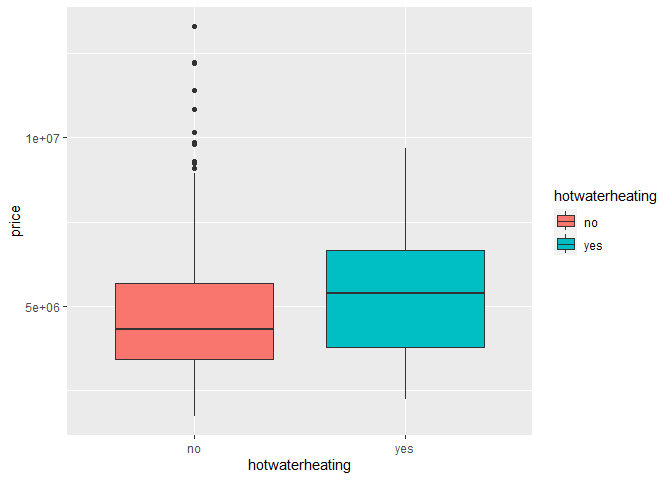

# Tentang Dataset

> [**Dataset**](https://www.kaggle.com/datasets/harishkumardatalab/housing-price-prediction)
> ini menyediakan informasi lengkap untuk prediksi harga rumah, dengan
> 13 nama kolom:
>
> - Price: Harga rumah.
> - Area: Luas total rumah dalam meter persegi.
> - Bedrooms: Jumlah kamar tidur di dalam rumah.
> - Bathrooms: Jumlah kamar mandi di dalam rumah.
> - Stories: Jumlah lantai di dalam rumah.
> - Mainroad: Apakah rumah tersebut terhubung dengan jalan utama
>   (Ya/Tidak).
> - Guestroom: Apakah rumah tersebut memiliki ruang tamu (Ya/Tidak).
> - Basement: Apakah rumah memiliki ruang bawah tanah (Ya/Tidak).
> - Hot water heating: Apakah rumah memiliki sistem pemanas air panas
>   (Ya/Tidak).
> - Airconditioning: Apakah rumah memiliki sistem pendingin udara
>   (Ya/Tidak).
> - Parking: Jumlah tempat parkir yang tersedia di dalam rumah.
> - Prefarea: Apakah rumah tersebut terletak di area yang disukai
>   (Ya/Tidak).
> - Furnishing status: Status perabotan rumah (Fully Furnished,
>   Semi-Furnished, Unfurnished).

## import dataset

``` r
housing <- read.csv("C:Housing.csv", stringsAsFactors = TRUE)
dim(housing)
```

    ## [1] 545  13

``` r
str(housing)
```

    ## 'data.frame':    545 obs. of  13 variables:
    ##  $ price           : int  13300000 12250000 12250000 12215000 11410000 10850000 10150000 10150000 9870000 9800000 ...
    ##  $ area            : int  7420 8960 9960 7500 7420 7500 8580 16200 8100 5750 ...
    ##  $ bedrooms        : int  4 4 3 4 4 3 4 5 4 3 ...
    ##  $ bathrooms       : int  2 4 2 2 1 3 3 3 1 2 ...
    ##  $ stories         : int  3 4 2 2 2 1 4 2 2 4 ...
    ##  $ mainroad        : Factor w/ 2 levels "no","yes": 2 2 2 2 2 2 2 2 2 2 ...
    ##  $ guestroom       : Factor w/ 2 levels "no","yes": 1 1 1 1 2 1 1 1 2 2 ...
    ##  $ basement        : Factor w/ 2 levels "no","yes": 1 1 2 2 2 2 1 1 2 1 ...
    ##  $ hotwaterheating : Factor w/ 2 levels "no","yes": 1 1 1 1 1 1 1 1 1 1 ...
    ##  $ airconditioning : Factor w/ 2 levels "no","yes": 2 2 1 2 2 2 2 1 2 2 ...
    ##  $ parking         : int  2 3 2 3 2 2 2 0 2 1 ...
    ##  $ prefarea        : Factor w/ 2 levels "no","yes": 2 1 2 2 1 2 2 1 2 2 ...
    ##  $ furnishingstatus: Factor w/ 3 levels "furnished","semi-furnished",..: 1 1 2 1 1 2 2 3 1 3 ...

## melihat nilai statistik deskriptif pada semua kelompok pengamatan dalam dataset

``` r
summary(housing)
```

    ##      price               area          bedrooms       bathrooms    
    ##  Min.   : 1750000   Min.   : 1650   Min.   :1.000   Min.   :1.000  
    ##  1st Qu.: 3430000   1st Qu.: 3600   1st Qu.:2.000   1st Qu.:1.000  
    ##  Median : 4340000   Median : 4600   Median :3.000   Median :1.000  
    ##  Mean   : 4766729   Mean   : 5151   Mean   :2.965   Mean   :1.286  
    ##  3rd Qu.: 5740000   3rd Qu.: 6360   3rd Qu.:3.000   3rd Qu.:2.000  
    ##  Max.   :13300000   Max.   :16200   Max.   :6.000   Max.   :4.000  
    ##     stories      mainroad  guestroom basement  hotwaterheating airconditioning
    ##  Min.   :1.000   no : 77   no :448   no :354   no :520         no :373        
    ##  1st Qu.:1.000   yes:468   yes: 97   yes:191   yes: 25         yes:172        
    ##  Median :2.000                                                                
    ##  Mean   :1.806                                                                
    ##  3rd Qu.:2.000                                                                
    ##  Max.   :4.000                                                                
    ##     parking       prefarea        furnishingstatus
    ##  Min.   :0.0000   no :417   furnished     :140    
    ##  1st Qu.:0.0000   yes:128   semi-furnished:227    
    ##  Median :0.0000             unfurnished   :178    
    ##  Mean   :0.6936                                   
    ##  3rd Qu.:1.0000                                   
    ##  Max.   :3.0000

# Tujuan

> Beberapa insight yang akan saya eksplorasi melalui distribusi
> visualisasi
>
> - Bagaimana distribusi harga rumah di dalam dataset? Apakah ada
>   outlier atau pola khusus dalam distribusinya?
>
> - Bagaimana hubungan antara harga rumah dan luas tanah? Apakah ada
>   tren kenaikan harga seiring bertambahnya luas tanah?
>
> - Apakah ada hubungan antara jumlah kamar tidur (Bedrooms) dan harga
>   rumah? Apakah jumlah kamar tidur mempengaruhi harga?
>
> - Bagaimana distribusi jumlah kamar mandi (Bathrooms) dalam rumah?
>   Apakah rumah dengan lebih banyak kamar mandi cenderung memiliki
>   harga yang lebih tinggi?
>
> - Apakah ada korelasi antara jumlah lantai (Stories) dalam rumah
>   dengan harga? Apakah rumah dengan lebih banyak lantai memiliki harga
>   yang lebih tinggi?
>
> - Apakah ada perbedaan harga antara rumah yang terhubung dengan jalan
>   utama (Mainroad) dan yang tidak terhubung dengan jalan utama?
>
> - Apakah ada perbedaan harga antara rumah yang memiliki ruang tamu
>   (Guestroom) dan yang tidak?
>
> - Apakah adanya ruang bawah tanah (Basement) berpengaruh pada harga
>   rumah?
>
> - Apakah adanya sistem pemanas air panas (Hot water heating) berdampak
>   pada harga rumah?
>
> - Bagaimana pengaruh adanya sistem pendingin udara (Airconditioning)
>   terhadap harga rumah?
>
> - Bagaimana distribusi jumlah tempat parkir (Parking) dalam rumah?
>   Apakah rumah dengan lebih banyak tempat parkir cenderung memiliki
>   harga yang lebih tinggi?
>
> - Apakah preferensi terhadap area (Prefarea) mempengaruhi harga rumah?
>   Apakah rumah di area yang disukai cenderung memiliki harga yang
>   lebih tinggi?
>
> - Apakah status perabotan rumah (Furnishing status) berhubungan dengan
>   harga rumah? Apakah rumah yang fully furnished memiliki harga yang
>   lebih tinggi daripada yang semi-furnished atau unfurnished?

## Bagaimana distribusi harga rumah di dalam dataset? Apakah ada outlier atau pola khusus dalam distribusinya?

``` r
library(tidyverse)
```

``` r
ggplot(data = housing, mapping = aes(x = price))+
  geom_histogram()
```
<!-- -->
terlihat pada grafik pengamatan, grafik cenderung right skewed, dengan
memiliki ekor outlier pada ujung kanan permukaan grafik, terlihat pula
beberapa nilai harga rumah yang tidak memiliki bar, puncak modus pada
grafik pengamatan terdiri dari dua puncak atau bimodal dengan jumlah
rumah hingga 70 rumah, dengan harga rumah yang cukup murah

``` r
ggplot(data = housing, mapping = aes(x = price))+
  geom_histogram(fill = "steelblue")+
  coord_cartesian(xlim = c(10000000, 13000000))
```

<!-- -->
ya, bar yang kosong pada price bukanlah nilai na, ataupun outlier, hanya
saja tidak ada rumah dengan harga berkisar \~10100000

``` r
ggplot(data = housing, mapping = aes(x = price, y = ..density..))+
  geom_freqpoly(mapping = aes(colour = basement))
```

<!-- -->

``` r
ggplot(data = housing, mapping = aes(x = price))+
  geom_freqpoly(mapping = aes(colour = basement))+
  xlim(0, 5000000)
```

<!-- -->

dengan freqpoly terlihat jumlah rumah dengan rentang harga antara
2500000 \~ 5000000, tanpa basement lebih banyak jumlahnya, dapat di
identifikasi bahwa tren pasar cenderung tinggi pada rumah tanpa ataupun
dengan basement pada harga 3500000 cenderung diminati

``` r
library(gridExtra)

plot1 <- ggplot(data = housing, mapping = aes(x = price))+
  geom_histogram(mapping = aes(fill = basement), position = "dodge")


plot2 <- ggplot(data = housing, mapping = aes(x = basement, y = price, fill = basement))+
  geom_boxplot()

grid.arrange(plot1, plot2, ncol = 2)
```

<!-- -->
dengan menggunakan histogram dan juga boxplot kita dapat
mengidentifikasi keberadaan sebenarnya dari outlier, selain itu saya
akan menghitung nilai outlier pada price

``` r
x <- data.frame(housing$price)
summary(x)
```

    ##  housing.price     
    ##  Min.   : 1750000  
    ##  1st Qu.: 3430000  
    ##  Median : 4340000  
    ##  Mean   : 4766729  
    ##  3rd Qu.: 5740000  
    ##  Max.   :13300000

``` r
IQR <- 5740000 - 3430000

TMIN <- 3430000 - (1.5*2310000)
TMAX <- 5740000 + (1.5*2310000)
IQR
```

    ## [1] 2310000

``` r
TMAX
```

    ## [1] 9205000

``` r
TMIN
```

    ## [1] -35000

``` r
housing %>%
  select(price, area) %>%
  filter(price < TMIN | price > TMAX) %>%
  arrange(price)
```

    ##       price  area
    ## 1   9240000  3500
    ## 2   9240000  7800
    ## 3   9310000  6550
    ## 4   9681000  6000
    ## 5   9800000  5750
    ## 6   9800000 13200
    ## 7   9870000  8100
    ## 8  10150000  8580
    ## 9  10150000 16200
    ## 10 10850000  7500
    ## 11 11410000  7420
    ## 12 12215000  7500
    ## 13 12250000  8960
    ## 14 12250000  9960
    ## 15 13300000  7420

terdapat 15 quartil atas pada data price

## Bagaimana hubungan antara harga rumah dan luas tanah? Apakah ada tren kenaikan harga seiring bertambahnya luas tanah?

``` r
ggplot(data = housing, mapping = aes(x = area, y = price))+
  geom_point(mapping = aes(color = basement), position = "jitter")+
  geom_smooth(se = FALSE)
```

<!-- -->
terlihat beberapa outlier pada pengamatan, dengan luas rumah
14000\~16500, terlihat juga hubungan yang positif antara harga dengan
area, semakin luas area semain besar harga yang dibayar, terlihat pula
point pengamatan pada rumah yang tidak memiliki basement lebih
bervariasi, tapi pada plot dapat disimpulkan hubungan antara harga rumah
dengan area positif lemah, ini terlihat dari point pengamatan yang
menyebar luas dan tidak konsisten pada line

## Apakah ada hubungan antara jumlah kamar tidur (Bedrooms) dan harga rumah? Apakah jumlah kamar tidur mempengaruhi harga?

``` r
housing_copy <- housing
```

``` r
housing_copy <- housing_copy %>%
  mutate(bathrooms_factor = recode(factor(bathrooms), 
                                   "1" = "kamar mandi1",
                                   "2" = "kamar mandi2",
                                   "3" = "kamar mandi3",
                                   "4" = "kamar mandi4"),
         bedrooms_factor = recode(factor(bedrooms), 
                                  "1" = "kamar tidur1",
                                  "2" = "kamar tidur2",
                                  "3" = "kamar tidur3",
                                  "4" = "kamar tidur4",
                                  "5" = "kamar tidur5",
                                  "6" = "kamar tidur6"),
         stories_factor = recode(factor(stories), 
                                 "1" = "satu lantai",
                                 "2" = "dua lantai",
                                 "3" = "tiga lantai",
                                 "4" = "empat lantai"))
```

``` r
ggplot(data = housing_copy, mapping = aes(x = bedrooms_factor, y = price, fill = bedrooms_factor))+
  geom_boxplot()
```

<!-- -->
terlihat rata-rata harga rumah dengan 4 dan 5 kamar tidur lebih tinggi
harganya jika dibandingkan dengan rumah lainnya, dan cenderung memiliki
variasi yang lebih besar, tetapi terdapat beberapa pencilan extrem pada
data, dimana rumah dengan 4 kamar tidur memiliki harga yang jauh lebih
tinggi dari pada rumah dengan 6 kamar tidur, ini menunjukan bahwa kamar
banyaknya kamar tidur tidak berpengaruh seberapa tinggi harga rumah

``` r
ggplot(data = housing_copy, mapping = aes(x = bedrooms, y = price))+
  geom_point(mapping = aes(color = bedrooms_factor), position = "jitter")+
  facet_wrap(~ bedrooms_factor, ncol = 3)
```

<!-- -->

``` r
cor_bedrooms_price <- cor(housing_copy$bedrooms, housing_copy$price, method = "pearson")

print("korelasi pearson :")
```

    ## [1] "korelasi pearson :"

``` r
print(cor_bedrooms_price)
```

    ## [1] 0.366494

berdasarkan korelasi, hubungan antara kamar tidur dengan harga rumah
tidak terlalu kuat atau cenderung lemah ini dapat dibuktikan dengan
nilai korelasi yang rendah antara keduanya, dapat diartikan banyaknya
kamar tidur tidak terlalu berpengaruh pada tingginya harga rumah

## Bagaimana distribusi jumlah kamar mandi (Bathrooms) dalam rumah? Apakah rumah dengan lebih banyak kamar mandi cenderung memiliki harga yang lebih tinggi?

``` r
ggplot(data = housing_copy, mapping = aes(x = bathrooms_factor, y = price))+
  geom_boxplot(mapping = aes(fill = bathrooms_factor))
```

<!-- -->

``` r
housing_copy %>%
  count(bathrooms_factor)
```

    ##   bathrooms_factor   n
    ## 1     kamar mandi1 401
    ## 2     kamar mandi2 133
    ## 3     kamar mandi3  10
    ## 4     kamar mandi4   1

ya bedasarkan boxplot yang dihasilkan rumah dengan banyak kamar mandi
memiliki rata-rata harga yang tinggi, terlihat juga pada data, rumah
dengan jumlah empat kamar mandi hanya tersedia satu rumah

``` r
ggplot(data = housing_copy, mapping = aes(x = bathrooms, y = price))+
  geom_point(mapping = aes(color = bathrooms_factor), position = "jitter")+
  geom_smooth(se = FALSE)
```

<!-- -->
pada scatterplot point pengamatan sedikit membingungkan, tetapi
berdasarkan line yang dihasilkan kedua variabel memiliki hubungan yang
positif dan cenderung lemah, semakin banyak kamar mandi semakin tinggi
harga rumah, tetapi terdapat beberapa outlier pada pengamatan, dimana
rumah dengan dua kamar memiliki harga yang sangat tinggi, saya masih
belum menemukan alasannya, karena bayak faktor yang dapat menentukan
tingginya harga rumah selain mengandalkan banyaknya kamar tidur

``` r
ggplot(data = housing_copy, mapping = aes(x = bathrooms, y = price))+
  geom_point(mapping = aes(color = bathrooms_factor), position = "jitter")+
  facet_wrap(~ bathrooms_factor, ncol = 2)
```

<!-- -->

``` r
cor_bathrooms_price <- cor(housing_copy$bathrooms, housing_copy$price, method = "pearson")

print("korelasi pearson :")
```

    ## [1] "korelasi pearson :"

``` r
print(cor_bathrooms_price)
```

    ## [1] 0.5175453

berdasarkan korelasi kedua variabel memiliki hubungan yang lemah,
dibuktikan dengan hasil korelasi sebesar 0.5

## Apakah ada korelasi antara jumlah lantai (Stories) dalam rumah dengan harga? Apakah rumah dengan lebih banyak lantai memiliki harga yang lebih tinggi?

``` r
ggplot(data = housing_copy, mapping = aes(x = stories_factor, y = price))+
  geom_boxplot(mapping = aes(fill = stories_factor))
```

<!-- -->

terlihat pada boxplot rumah dengan 4 lantai memiliki rata-rata harga
yang cenderung tinggi jika dibandingkan dengan rumah lainnya, tetapi
terlihat banyaknya outlier extrem yang dihasilkan pada point pengamatan,
dimana rumah dengan tiga lantai memiliki harga yang sangat tinggi

``` r
ggplot(data = housing_copy, mapping = aes(x = stories, y = price))+
  geom_point(mapping = aes(color = stories_factor), position = "jitter")+
  geom_smooth(se = FALSE)
```

<!-- -->
berdasarkan scatterplot pola line yang dihasilkan cenderung naik,
mengindikasikan kedua variabel memiliki hubungan yang positif dan lemah,
dan semua titik data tidak mengikuti pola line tersebut dengan ketat
sehingga hubungannya cenderung moderat dan lemah

``` r
ggplot(data = housing_copy, mapping = aes(x = stories, y = price))+
  geom_point(mapping = aes(color = stories_factor), position = "jitter")+
  facet_wrap(~ stories_factor, ncol = 2)
```

<!-- -->

``` r
cor_stories_price <- cor(housing_copy$stories, housing_copy$price, method = "pearson")

print("korelasi :")
```

    ## [1] "korelasi :"

``` r
print(cor_stories_price)
```

    ## [1] 0.4207124

pada korelasi yang dihasilkan menunjukan adanya hubungan yang positif
antara kedua variabel, namun hubungannya cenderung moderat dan kurang
konsisten antara kedua hubungan pengamatan, dapat diartikan masih
terdapat faktor lain yang dapat menjelaskan ketidakkonsistenan ini,
misalnya rumah dengan banyak lantai dan memiliki jalan utama memiliki
harga rumah yang sangat tinggi.

## Apakah ada perbedaan harga antara rumah yang terhubung dengan jalan utama (Mainroad) dan yang tidak terhubung dengan jalan utama?

``` r
ggplot(data = housing_copy, mapping = aes(x = mainroad, y = price))+
  geom_boxplot(mapping = aes(fill = mainroad))
```

<!-- -->

berdasarkan boxplot rumah dengan jalan utama memiliki harga yang
cenderung lebih tinggi daripada rumah yang tidak terhubung dengan jalan
utama, juga memiliki nilai IQR yang lebih tinggi dari pada rumah yang
tidak terhubung dengan jalan utama sehingga data pada rumah yang
terhubung dengan jalan lebih bervariasi

``` r
ggplot(data = housing_copy, mapping = aes(x = mainroad, y = price, fill = mainroad)) +
  geom_bar(stat = "summary", fun = "mean", color = "black") +
  labs(x = "jalan utama", y = "rata-rata harga") +
  ggtitle("rata-rata harga rumah berdasarkan adanya jalan utam")
```

<!-- -->

terlihat rumah dengan jalan utama memiliki rata-rata harga sebesar
5000000, lebih tinggi jika dibandingkan dengan rumah yang tidak
terhubung jalan utama yang memiliki rata-rata harga sebesar 3500000

## Apakah ada perbedaan harga antara rumah yang memiliki ruang tamu (Guestroom) dan yang tidak?

``` r
ggplot(data = housing_copy, mapping = aes(x = guestroom, y = price))+
  geom_boxplot(mapping = aes(fill = guestroom))
```

<!-- -->

terlihat pada boxplot banyaknya outlier pada data pengamatan, tetapi
bisa diperhatikan rata-rata rumah dengan ruang tamu memiliki harga yang
lebih tinggi jika dibandingkan dengan rumah yang tidak memiliki ruang
tamu, ini dilihat dari posisi IQR yang lebih tinggi

``` r
ggplot(data = housing_copy, mapping = aes(x = guestroom, y = price, fill = guestroom))+
  geom_bar(stat = "summary", fun = "mean", color = "black")+
  labs(x = "guestroom", y = "rata-rata harga")+
  ggtitle("rata-rata harga rumah dengan adanya ruang tamu")
```

<!-- -->


sudah sangat jelas pada grafik rumah dengan ruang tamu memiliki
rata-rata harga yang lebih tinggi dibandingkan dengan yang tidak
memiliki ruang tamu

## Apakah adanya ruang bawah tanah (Basement) berpengaruh pada harga rumah?

``` r
ggplot(data = housing_copy, mapping = aes(x = basement, y = price))+
  geom_boxplot(mapping = aes(fill = basement))
```

<!-- -->

``` r
ggplot(data = housing_copy, mapping = aes(x = basement, y = price, fill = basement))+
  geom_bar(stat = "summary", fun = "mean", colour = "black")
```

<!-- -->

berdasarkan boxplot dan barplot yang dihasilkan rumah dengan basement
memiliki rata-rata harga yang lebih tinggi dibandingkan dengan rumah
tanpa basement, tetapi terdapat banyak pencilan yang dihasilkan pada
pengamatan, dan terlihat pula median pada rumah tanpa basement cenderung
lebih condong pada quartil pertama dimana ini mengindikasikan terdapat
beberapa rumah tanpa basement yang memiliki harga yang sangat tinggi dan
sebagian besar rumah tanpa basement cenderung memiliki harga yang lebih
rendah

## Apakah adanya sistem pemanas air panas (Hot water heating) berdampak pada harga rumah?

``` r
ggplot(data = housing_copy, mapping = aes(x = hotwaterheating, y = price))+
  geom_boxplot(mapping = aes(fill = hotwaterheating))
```

<!-- -->

``` r
ggplot(data = housing_copy, mapping = aes(x = hotwaterheating, y = price, fill = hotwaterheating))+
  geom_bar(stat = "summary", fun = "mean", color = "black")
```

<!-- -->

terlihat bahwa rumah dengan pemanas air memiliki rata-rata harga yang
lebih tinggi jika dibandingkan dengan rumah tanpa pemanas air, tetapi
point pengamatan rumah dengan pemanas air lebih besar variasinya
dibandingkan dengan rumah tanpa pemanas air, ini mengindikasikan
lebarnya interval kepercayaan, sehingga menyebabkan tingkat kepercayaan
yang lebih rendah, dan sulit untuk mendapatkan keputusan

## Bagaimana pengaruh adanya sistem pendingin udara (Airconditioning) terhadap harga rumah?

``` r
ggplot(data = housing_copy, mapping = aes(x = airconditioning, y = price))+
  geom_boxplot(mapping = aes(fill = airconditioning))
```

<!-- -->

``` r
ggplot(data = housing_copy, mapping = aes(x = airconditioning, y = price, fill = airconditioning))+
  geom_bar(stat = "summary", fun = "mean", color = "black")
```

<!-- -->

pada barplot rumah dengan pendingin udara relatif memiliki harga yang
lebih tinggi, dan juga memiliki nilai Interkuartil yang lebih besar
sehingga data pengamatan lebih variatif, pada boxplot beberapa rumah
tanpa pendingin udara yang memiliki harga yang sangat tinggi dapat
dilihat dari median yang lebih condong ke quartil pertama dan sebagian
besar rumah tanpa pendingin udara relatif memiliki harga yang lebih
randah

## Bagaimana distribusi jumlah tempat parkir (Parking) dalam rumah? Apakah rumah dengan lebih banyak tempat parkir cenderung memiliki harga yang lebih tinggi?

``` r
housing_copy$parking_factor <- factor(housing_copy$parking, levels = c(0, 1, 2, 3), labels = c("0 lahan parkir", "1 lahan parkir", "2 lahan parkir", "3 lahan parkir"))
```

``` r
ggplot(data = housing_copy, mapping = aes(x = parking_factor, y = price))+
  geom_boxplot(mapping = aes(fill = parking_factor))
```

<!-- -->

``` r
ggplot(data = housing_copy, mapping = aes(x = reorder(parking_factor, price, FUN = "median"), y = price))+
  geom_boxplot(mapping = aes(fill = parking_factor))
```

<!-- -->

pada boxplot, sebagian besar rumah dengan tiga lahan parkir memiliki
harga yang relatif rendah ditandai dengan nilai median yang lebih
condong ke quartil pertama, tetapi terdapat nilai extrem diatas whisker
yang menunjukan adanya rumah dengan tiga lahan parkir yang memiliki
harga sangat tinggi, dapat disimpulkan rumah dengan banyak lahan parkir
tidak mempengaruhi tingginya harga rumah tersebut.

``` r
ggplot(data = housing_copy, mapping = aes(x = parking, y = price))+
  geom_point(mapping = aes(color = parking_factor), position = "jitter")+
  facet_wrap(~ parking_factor, nrow = 2)
```

<!-- -->

``` r
ggplot(data = housing_copy, mapping = aes(x = parking_factor, y = price, fill = parking_factor))+
  geom_bar(stat = "summary", fun = "mean", color = "black")
```

<!-- -->

berdasarkan barplot rumah dengan dua lahan parkir memiliki rata-rata
harga yang cukup tinggi disusul dengan rumah tiga lahan parkir

## Apakah preferensi terhadap area (Prefarea) mempengaruhi harga rumah? Apakah rumah di area yang disukai cenderung memiliki harga yang lebih tinggi?

``` r
ggplot(data = housing_copy, mapping = aes(x = reorder(prefarea, price, FUN = "median"), y = price))+
  geom_boxplot(mapping = aes(fill = prefarea))
```

<!-- -->


terlihat rumah dengan area yang disukai memiliki nilai tengah yang
cenderung tinggi, terdapat banyak outlier pada rumah tanpa prefarea dan
sangat extrem, dimana rumah-rumah tersebut memiliki harga yang sangat
tinggi di area yang tidak disukai, terlihat juga outlier pada rumah
dengan prefarea yang disukai cenderung memiliki harga yang sangat
tinggi, selain itu variasi rumah dengan prefarea rata terhadap median,
terlihat memiliki sebaran variasi yang normal artinya nilai tengah
membagi jumlah rumah dengan harga di bawah dan di atas 50% sama-rata.

``` r
ggplot(data = housing_copy, mapping = aes(x = prefarea, y = price, fill = prefarea))+
  geom_bar(stat= "summary", fun = "mean", color = "black")
```

<!-- -->


berdasarkan barplot rumah dengan prefarea yang disukai memiliki
rata-rata harga yang cenderung tinggi jika dibandingkan dengan rumah
tanpa prefarea dapat di artikan keduanya variable memiliki hubungan yang
positif, rumah dengan prefarea cenderung memiliki harga yang lebih
tinggi.

## Apakah status perabotan rumah (Furnishing status) berhubungan dengan harga rumah? Apakah rumah yang fully furnished memiliki harga yang lebih tinggi daripada yang semi-furnished atau unfurnished?

``` r
ggplot(data = housing_copy, mapping = aes(x = reorder(furnishingstatus, price, FUN = "median"), y = price))+
  geom_boxplot(mapping = aes(fill = furnishingstatus))
```

<!-- -->


terlihat pada boxplot rumah dengan fully furnished memiliki nilai tengah
tertinggi, sedangkan rumah tanpa furnished memiliki nilai tengah yang
rendah, terlihat juga beberapa outlier pada pengamatan baik furnished,
semi furnished, unfurnished, outlier-outlier extrim ini menunjukan
adanya beberapa rumah yang sangat tinggi, rumah tanpa furnished memiliki
lebih banyak harga yang sangat tinggi terlihat dari outliernya, selain
itu sebaran terbesar ada pada rumah dengan furninshed, mengindikasikan
variasi yang lebih besar, dilihat dari mediannya rumah dengan furnished
memiliki median sedikit condong ke quartil pertama dapat diartikan
sebagian besar rumah dengan furnished memiliki harga yang relatif
rendah, tapi kita tidak dapat langsung memutuskannya karena variasi data
yang lebih besar

``` r
ggplot(data = housing_copy, mapping = aes(x = furnishingstatus, y = price, fill = furnishingstatus))+
  geom_bar(stat = "summary", fun = "median", color = "black")
```

<!-- -->


terlihat pada data rumah dengan furnished status memiliki rata-rata
harga tertinggi, berdasarkan bar hubungan antara kedua variabel
cenderung positif

> Berdasarkan analisis visualisasi data pada dataset rumah, beberapa
> kesimpulan dapat diambil. Pertama, distribusi harga rumah cenderung
> memiliki ekor outlier pada ujung kanan grafik, menunjukkan adanya
> beberapa rumah dengan harga yang sangat tinggi. Kedua, terdapat
> hubungan positif antara harga rumah dan luas tanah, sehingga semakin
> luas tanah, semakin tinggi harga rumahnya. Namun, tidak ada hubungan
> yang jelas antara harga rumah dan jumlah kamar tidur atau jumlah
> lantai. Selain itu, rumah dengan basement, ruang tamu, sistem pemanas
> air panas, dan pendingin udara cenderung memiliki harga yang lebih
> tinggi. Di sisi lain, tidak ada hubungan yang jelas antara harga rumah
> dan jumlah tempat parkir. Selain itu, rumah di area yang disukai
> cenderung memiliki harga yang lebih tinggi, dan rumah dengan perabotan
> lengkap (fully furnished) memiliki harga yang lebih tinggi
> dibandingkan dengan rumah tanpa perabotan lengkap. Analisis ini
> memberikan wawasan penting bagi pemahaman lebih lanjut tentang
> faktor-faktor yang mempengaruhi harga rumah dan preferensi pasar.
> Namun, untuk mendapatkan kesimpulan yang lebih kuat, analisis
> statistik lanjutan mungkin perlu dilakukan untuk menguji signifikansi
> hubungan antar variabel secara formal.
