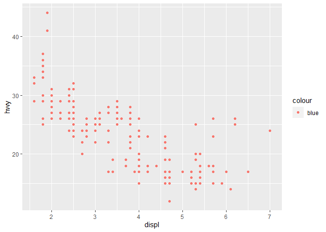
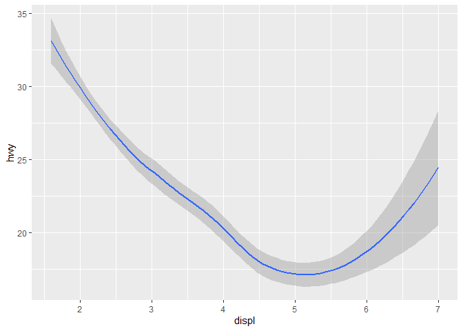
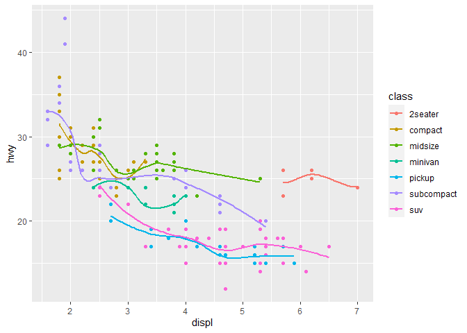
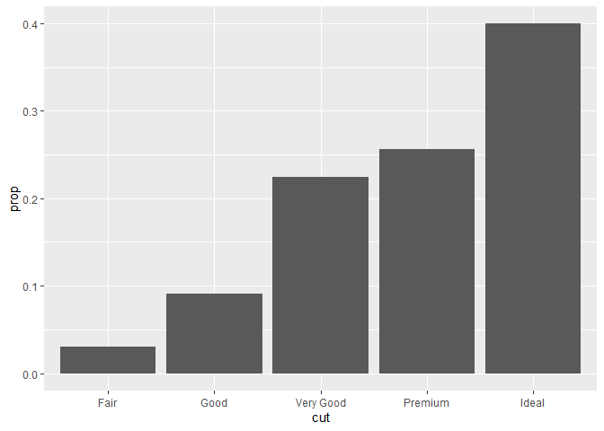
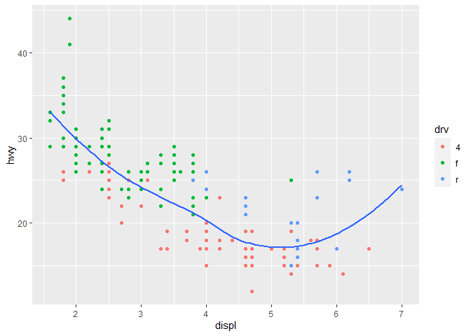
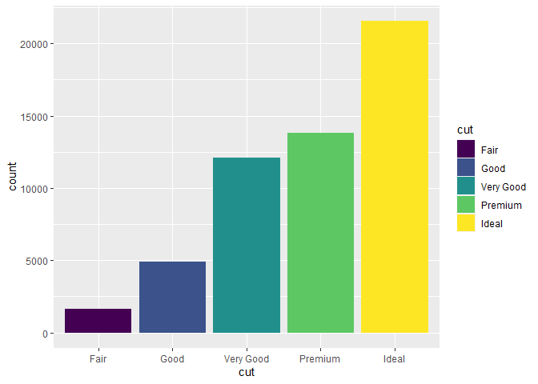
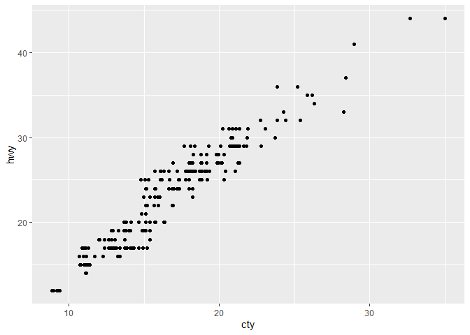
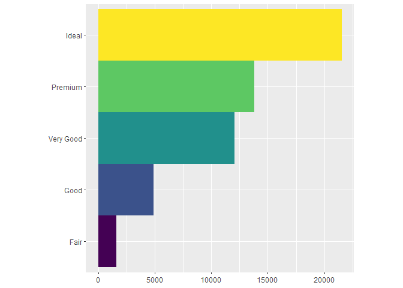

# 3. Data visualisation

## 3.1 Pendahuluan

> *“Grafik sederhana telah membawa lebih banyak informasi ke dalam
> pikiran analis data daripada perangkat lainnya.” - John Tukey*

Bab ini akan mengajarkan Anda bagaimana memvisualisasikan data Anda
menggunakan ggplot2. R memiliki beberapa sistem untuk membuat grafik,
tetapi ggplot2 adalah salah satu yang paling elegan dan paling
serbaguna. ggplot2 mengimplementasikan tata bahasa grafik, sebuah sistem
yang koheren untuk mendeskripsikan dan membangun grafik. Dengan ggplot2,
Anda dapat melakukan lebih banyak hal lebih cepat dengan mempelajari
satu sistem dan menerapkannya di banyak tempat.

Jika Anda ingin mempelajari lebih lanjut tentang dasar-dasar teoritis
dari ggplot2 sebelum memulai, saya sarankan untuk membaca “The Layered
Grammar of Graphics”,
[*http://vita.had.co.nz/papers/layered-grammar*](http://vita.had.co.nz/papers/layered-grammar.pdf)

### 3.1.1 syarat

Bab ini berfokus pada ggplot2, salah satu anggota inti dari tidyverse.
Untuk mengakses dataset, halaman bantuan, dan fungsi-fungsi yang akan
kita gunakan pada bab ini, muatlah tidyverse dengan menjalankan kode
berikut:

``` r
library(tidyverse)
```

Satu baris kode tersebut memuat tidyverse inti; paket-paket yang akan
Anda gunakan dalam hampir setiap analisis data. Kode ini juga memberi
tahu Anda fungsi-fungsi dari tidyverse yang bertentangan dengan
fungsi-fungsi di dalam basis R (atau dari paket-paket lain yang mungkin
telah Anda muat).

Jika Anda menjalankan kode ini dan mendapatkan pesan kesalahan “tidak
ada paket bernama ‘tidyverse’”, Anda harus menginstalnya terlebih
dahulu, lalu menjalankan library() sekali lagi.

``` r
install.packages("tidyverse")
```

``` r
library(tidyverse)
```

Anda hanya perlu menginstal sebuah paket sekali saja, tetapi Anda perlu
memuat ulang setiap kali Anda memulai sesi baru.

Jika kita perlu menjelaskan secara eksplisit dari mana sebuah fungsi
(atau kumpulan data) berasal, kita akan menggunakan bentuk khusus
package::function(). Sebagai contoh, ggplot2::ggplot() memberi tahu Anda
secara eksplisit bahwa kita menggunakan fungsi ggplot() dari paket
ggplot2.

## 3.2 Step pertama

Mari kita gunakan grafik pertama kita untuk menjawab sebuah pertanyaan:
Apakah mobil dengan mesin besar menggunakan lebih banyak bahan bakar
daripada mobil dengan mesin kecil? Anda mungkin sudah memiliki
jawabannya, tetapi cobalah untuk membuat jawaban Anda lebih tepat.
Seperti apa hubungan antara ukuran mesin dan efisiensi bahan bakar?
Apakah positif? Negatif? Linier? Tidak linier?

### 3.2.1 Dataset mpg

Anda dapat menguji jawaban Anda dengan data frame mpg yang terdapat pada
ggplot2 (alias ggplot2::mpg). Sebuah bingkai data adalah kumpulan
persegi panjang variabel (dalam kolom) dan pengamatan (dalam baris). mpg
berisi pengamatan yang dikumpulkan oleh Badan Perlindungan Lingkungan
Amerika Serikat pada 38 model mobil.

``` r
head(mpg)
```

    ## # A tibble: 6 × 11
    ##   manufacturer model displ  year   cyl trans      drv     cty   hwy fl    class 
    ##   <chr>        <chr> <dbl> <int> <int> <chr>      <chr> <int> <int> <chr> <chr> 
    ## 1 audi         a4      1.8  1999     4 auto(l5)   f        18    29 p     compa…
    ## 2 audi         a4      1.8  1999     4 manual(m5) f        21    29 p     compa…
    ## 3 audi         a4      2    2008     4 manual(m6) f        20    31 p     compa…
    ## 4 audi         a4      2    2008     4 auto(av)   f        21    30 p     compa…
    ## 5 audi         a4      2.8  1999     6 auto(l5)   f        16    26 p     compa…
    ## 6 audi         a4      2.8  1999     6 manual(m5) f        18    26 p     compa…

Di antara variabel dalam mpg adalah:

1.  displ, ukuran mesin mobil, dalam liter.

2.  hwy, efisiensi bahan bakar mobil di jalan raya, dalam mil per galon
    (mpg). Mobil dengan efisiensi bahan bakar rendah mengkonsumsi lebih
    banyak bahan bakar daripada mobil dengan efisiensi bahan bakar
    tinggi ketika mereka menempuh jarak yang sama.

Untuk mempelajari lebih lanjut tentang mpg, buka halaman bantuannya
dengan menjalankan ?mpg.

### 3.2.2 Membuat ggplot

Untuk memplot mpg, jalankan kode berikut ini untuk menempatkan displ
pada sumbu x dan hwy pada sumbu y:

``` r
ggplot(data = mpg) +
  geom_point(mapping = aes(x = displ, y = hwy))
```


Plot menunjukkan hubungan negatif antara ukuran mesin (displ) dan
efisiensi bahan bakar (hwy). Dengan kata lain, mobil dengan mesin besar
menggunakan lebih banyak bahan bakar. Apakah hal ini mengkonfirmasi atau
menyangkal hipotesis Anda mengenai efisiensi bahan bakar dan ukuran
mesin?

Dengan ggplot2, Anda memulai sebuah plot dengan fungsi ggplot().
ggplot() membuat sebuah sistem koordinat yang dapat Anda tambahkan
layer. Argumen pertama dari ggplot() adalah kumpulan data yang akan
digunakan pada grafik. Jadi ggplot(data = mpg) membuat sebuah grafik
kosong, namun ini tidak terlalu menarik jadi saya tidak akan
menunjukkannya di sini.

Anda melengkapi grafik Anda dengan menambahkan satu atau beberapa layer
pada ggplot(). Fungsi geom_point() menambahkan sebuah lapisan titik ke
plot Anda, yang membuat sebuah scatterplot. ggplot2 dilengkapi dengan
banyak fungsi geom yang masing-masing menambahkan jenis lapisan yang
berbeda pada sebuah plot. Anda akan mempelajari banyak sekali fungsi
tersebut pada bab ini.

Setiap fungsi geom pada ggplot2 membutuhkan sebuah argumen pemetaan. Hal
ini mendefinisikan bagaimana variabel pada dataset Anda dipetakan ke
properti visual. Argumen pemetaan selalu dipasangkan dengan aes(), dan
argumen x dan y dari aes() menentukan variabel mana yang akan dipetakan
ke sumbu x dan y. ggplot2 mencari variabel yang dipetakan pada argumen
data, pada kasus ini, mpg.

### 3.2.3 template grafik

Mari kita ubah kode ini menjadi sebuah template yang dapat digunakan
kembali untuk membuat grafik dengan ggplot2. Untuk membuat grafik, ganti
bagian dalam kurung pada kode di bawah ini dengan dataset, fungsi geom,
atau kumpulan pemetaan.

**ggplot(data =** <DATA>) + <GEOM_FUNCTION>(mapping = aes(<MAPPINGS>))

Sisa dari bab ini akan menunjukkan kepada Anda bagaimana melengkapi dan
memperluas template ini untuk membuat berbagai jenis grafik. Kita akan
mulai dengan komponen <MAPPINGS>.

### 3.2.4 Latihan

1.  **Jalankan ggplot(data = mpg). Apa yang Anda lihat?**

``` r
ggplot(data = mpg)
```


> Jika Anda menjalankan perintah ini tanpa menambahkan geometri apa pun,
> Anda akan mendapatkan sebuah plot kosong dengan sumbu x dan y, tetapi
> tidak ada data yang ditampilkan di dalamnya.

1.  **Berapa banyak baris dalam mpg? Berapa banyak kolom?**

``` r
nrow(mpg)
```

    ## [1] 234

3.  **Apa yang digambarkan oleh variabel drv? Baca bantuan untuk ?mpg
    untuk mengetahuinya.**

> Variabel drv dalam dataset mpg merupakan singkatan dari “drive,” yang
> mengindikasikan jenis penggerak kendaraan (f = front-wheel drive, r =
> rear-wheel drive, 4 = 4wd). Anda dapat membaca bantuan tentang
> variabel ini dengan menjalankan perintah berikut:

``` r
?mpg
```

    ## starting httpd help server ... done

4.  **Membuat diagram pencar/scatter plot hwy vs cyl.**

> Untuk membuat diagram pencar (scatter plot) antara variabel hwy
> (highway miles per gallon) dan cyl (number of cylinders), Anda dapat
> menggunakan ggplot sebagai berikut:

``` r
ggplot(data = mpg)+
  geom_point(mapping = aes(x = hwy, y = cyl))
```

<!-- -->

5.  **Apa yang terjadi jika Anda membuat diagram pencar/scatter plot
    class vs drv? Mengapa plot tersebut tidak berguna?**

``` r
ggplot(data = mpg)+
  geom_point(mapping = aes(x = class, y = drv))
```

<!-- -->

> Jika Anda membuat diagram pencar antara variabel class dan drv, maka
> Anda akan memiliki terlalu banyak titik yang tumpang tindih di dalam
> plot tersebut. Hal ini karena kedua variabel tersebut tidak memiliki
> hubungan berarti untuk dibuatkan scatter plot. Variabel class
> mengindikasikan kelas kendaraan seperti “compact”, “midsize”, “suv”,
> dll., sedangkan variabel drv mengindikasikan jenis penggerak seperti
> “f”, “r”, atau “4”. Karena kelas dan jenis penggerak tidak saling
> terkait secara numerik, plot scatter tidak memberikan informasi yang
> berguna dan akan menghasilkan tampilan yang kacau.

## 3.3 Pemetaan Estetika

> “Nilai terbesar dari sebuah foto adalah ketika foto tersebut memaksa
> kita untuk memperhatikan apa yang tidak pernah kita harapkan untuk
> dilihat.” - John Tukey

Pada plot di bawah ini, satu kelompok titik (disorot dengan warna merah)
tampaknya berada di luar tren linier. Mobil-mobil ini memiliki jarak
tempuh yang lebih tinggi dari yang Anda perkirakan. Bagaimana Anda bisa
menjelaskan mobil-mobil ini?


Mari kita berhipotesis bahwa mobil-mobil tersebut adalah hibrida. Salah
satu cara untuk menguji hipotesis ini adalah dengan melihat nilai kelas
untuk setiap mobil. Variabel kelas pada dataset mpg mengklasifikasikan
mobil ke dalam beberapa kelompok, seperti kompak, menengah, dan SUV.
Jika titik-titik terpencil adalah hibrida, mereka harus diklasifikasikan
sebagai mobil kompak atau, mungkin, mobil subkompak (perlu diingat bahwa
data ini dikumpulkan sebelum truk hibrida dan SUV menjadi populer).

Anda dapat menambahkan variabel ketiga, seperti kelas, ke dalam
scatterplot dua dimensi dengan memetakannya ke estetika. Estetika adalah
properti visual dari objek dalam plot Anda. Estetika mencakup hal-hal
seperti ukuran, bentuk, atau warna titik-titik Anda. Anda dapat
menampilkan sebuah titik (seperti di bawah ini) dengan cara yang berbeda
dengan mengubah nilai dari properti estetika. Karena kita telah
menggunakan kata “nilai” untuk mendeskripsikan data, mari kita gunakan
kata “level” untuk mendeskripsikan sifat estetika. Di sini kita mengubah
tingkat ukuran, bentuk, dan warna titik untuk membuat titik menjadi
kecil, segitiga, atau biru:

.png)

Anda dapat menyampaikan informasi mengenai data Anda dengan memetakan
estetika dalam plot Anda ke variabel dalam set data Anda. Sebagai
contoh, Anda dapat memetakan warna titik-titik Anda ke variabel kelas
untuk menunjukkan kelas setiap mobil.

``` r
ggplot(data = mpg)+
  geom_point(mapping = aes(x = displ, y = hwy, color = class))
```

<!-- -->

Untuk memetakan sebuah estetika ke sebuah variabel, kaitkan nama
estetika ke nama variabel di dalam aes(). ggplot2 secara otomatis akan
memberikan sebuah level unik dari estetika (di sini sebuah warna yang
unik) ke setiap nilai unik dari variabel, sebuah proses yang dikenal
dengan istilah penskalaan. ggplot2 juga akan menambahkan sebuah legenda
yang menjelaskan level yang mana yang sesuai dengan nilai yang mana.

Warna-warna tersebut menunjukkan bahwa banyak titik yang tidak biasa
adalah mobil dengan dua tempat duduk. Mobil-mobil ini tidak terlihat
seperti mobil hibrida, dan pada kenyataannya adalah mobil sport! Mobil
sport memiliki mesin besar seperti SUV dan truk pikap, tetapi bodi kecil
seperti mobil menengah dan kompak, yang meningkatkan jarak tempuh bensin
mereka. Jika dipikir-pikir, mobil-mobil ini tidak mungkin merupakan
mobil hibrida karena memiliki mesin besar.

Pada contoh di atas, kami memetakan kelas ke estetika warna, tetapi kami
juga bisa memetakan kelas ke estetika ukuran dengan cara yang sama.
Dalam kasus ini, ukuran yang tepat dari setiap titik akan mengungkapkan
afiliasi kelasnya. Kita mendapatkan peringatan di sini, karena memetakan
variabel yang tidak terurut (kelas) ke estetika yang terurut (ukuran)
bukanlah ide yang baik.

``` r
ggplot(data = mpg)+
  geom_point(mapping = aes(x = displ, y = hwy, size = class))
```

<!-- -->

Atau, kita bisa saja memetakan kelas ke estetika alfa, yang mengontrol
transparansi titik-titik, atau ke estetika bentuk, yang mengontrol
bentuk titik-titik.

``` r
#left
ggplot(data = mpg)+
  geom_point(mapping = aes(x = displ, y = hwy, alpha = class))
```
``` r
#right
ggplot(data = mpg)+
  geom_point(mapping = aes(x = displ, y = hwy, shape = class))
```
<div style="display: flex;">
    <div style="flex: 1;">
        
    </div>
    <div style="flex: 1;">
        
    </div>
</div>


Apa yang terjadi dengan SUV? ggplot2 hanya akan menggunakan enam bentuk
sekaligus. Secara default, kelompok tambahan tidak akan diplot ketika
Anda menggunakan estetika bentuk.

Untuk setiap bentuk, Anda menggunakan aes() untuk mengasosiasikan nama
bentuk dengan sebuah variabel yang akan ditampilkan. Fungsi aes()
mengumpulkan setiap pemetaan estetika yang digunakan oleh sebuah layer
dan meneruskannya ke argumen pemetaan layer. Sintaks ini menyoroti
wawasan yang berguna tentang x dan y: lokasi x dan y dari sebuah titik
adalah estetika, properti visual yang dapat Anda petakan ke variabel
untuk menampilkan informasi tentang data.

Setelah Anda memetakan sebuah estetika, ggplot2 akan melakukan sisanya.
Ia memilih skala yang masuk akal untuk digunakan dengan estetika, dan
membuat legenda yang menjelaskan pemetaan antara level dan nilai. Untuk
estetika x dan y, ggplot2 tidak membuat legenda, tetapi membuat garis
sumbu dengan tanda centang dan label. Garis sumbu bertindak sebagai
legenda; garis ini menjelaskan pemetaan antara lokasi dan nilai.

Anda juga dapat mengatur properti estetika dari geom Anda secara manual.
Sebagai contoh, kita dapat membuat semua titik pada plot kita berwarna
biru:

``` r
ggplot(data = mpg)+
  geom_point(mapping = aes(x = displ, y = hwy), color = "blue")
```

<!-- -->

Di sini, warna tidak memberikan informasi tentang variabel, tetapi hanya
mengubah tampilan plot. Untuk mengatur estetika secara manual, atur
estetika berdasarkan nama sebagai argumen dari fungsi geom Anda; yaitu
di luar aes(). Anda harus memilih level yang masuk akal untuk estetika
tersebut:

- Nama sebuah warna sebagai sebuah string karakter.

- Ukuran sebuah titik dalam mm.

- Bentuk sebuah titik sebagai sebuah angka, seperti yang ditunjukkan
  pada Gambar 3.1.


### 3.3.1 Latihan

1.  **Apa yang salah dengan kode ini? Mengapa titik-titiknya tidak
    berwarna biru?**

``` r
ggplot(data = mpg)+
  geom_point(mapping = aes(x = displ, y = hwy, color = "blue"))
```

<!-- -->

> Pada kode tersebut, titik-titik tidak berwarna biru karena Anda telah
> memetakan warna (color) ke sebuah string teks “blue” bukan ke variabel
> di dalam dataset. Saat Anda memberikan nilai string seperti itu dalam
> fungsi aes() untuk estetika warna, ggplot akan memperlakukan nilai
> tersebut sebagai label atau teks dan bukan sebagai nilai warna yang
> sebenarnya.
>
> Jika Anda ingin titik-titik berwarna biru, Anda perlu memetakan
> estetika warna (color) ke suatu variabel yang berisi nilai-nilai
> warna. Misalnya, jika Anda ingin semua titik berwarna biru, Anda dapat
> menggunakan fungsi scale_color_manual() untuk menetapkan skema warna
> secara manual dan mengatur warna yang diinginkan (misalnya, biru) ke
> semua titik.

2.  **Variabel mana dalam mpg yang bersifat kategorikal? Variabel mana
    yang bersifat kontinu? (Petunjuk: ketik ?mpg untuk membaca
    dokumentasi dataset). Bagaimana Anda dapat melihat informasi ini
    ketika Anda menjalankan mpg?**

> Berdasarkan dokumentasi dataset mpg, kita dapat melihat bahwa
> variabel-variabel berikut memiliki tipe data yang berbeda:
>
> Variabel Kategorikal:
>
> - manufacturer
> - model
> - trans
> - drv
> - fl
> - class

3.  **Petakan variabel kontinu ke warna, ukuran, dan bentuk. Bagaimana
    estetika ini berperilaku berbeda untuk variabel kategorikal vs
    variabel kontinu?**

> Variabel Kontinu:
>
> - displ
> - year
> - cyl
> - cty
> - hwy
>
> Untuk memetakan variabel kontinu ke warna, ukuran, dan bentuk, kita
> dapat menggunakan fungsi aes() dalam ggplot. Berikut adalah contoh
> penggunaannya:

``` r
ggplot(data = mpg)+
  geom_point(mapping = aes(x = displ, y = cty, color = hwy))
```
``` r
ggplot(data = mpg)+
  geom_point(mapping = aes(x = displ, y = cty, size = hwy))
```

<div style="display: flex;">
    <div style="flex: 1;">
        
    </div>
    <div style="flex: 1;">
        
    </div>
</div>

``` r
ggplot(data = mpg)+
  geom_point(mapping = aes(x = displ, y = cty, shape = class))
```

<!-- -->

> Estetika ini berperilaku berbeda untuk variabel kategorikal dan
> variabel kontinu:

4.  **Apa yang terjadi jika Anda memetakan variabel yang sama ke
    beberapa estetika?**

> Jika Anda memetakan variabel yang sama ke beberapa estetika dalam
> ggplot, maka estetika-estetika tersebut akan saling bersaing dan
> mempengaruhi penampilan plot secara bersamaan. Ini dapat menyebabkan
> plot yang kompleks dan sulit untuk dianalisis. Misalnya, misalkan Anda
> memetakan variabel hwy ke estetika warna (color) dan ukuran (size)
> pada plot. Berikut adalah contoh kode

``` r
ggplot(data = mpg)+
  geom_point(mapping = aes(x = displ, cty, color = hwy, size = hwy))
```

<!-- -->

> Dalam contoh ini, variabel hwy dimetakan ke estetika warna dan ukuran.
> Akibatnya, setiap titik akan memiliki warna dan ukuran yang berbeda,
> sesuai dengan nilai variabel hwy. Plot ini dapat menjadi rumit dan
> sulit untuk membedakan pola atau tren data.

5.  **Apa yang dilakukan oleh estetika goresan? Bentuk apa saja yang
    dapat digunakan? (Petunjuk: gunakan ?geom_point)**

> Estetika stroke dalam ggplot mengontrol ketebalan goresan atau
> pinggiran (border) dari bentuk titik pada plot. Estetika ini dapat
> digunakan dengan fungsi geom_point() untuk mengubah ketebalan goresan
> pada setiap titik.
>
> Bentuk-bentuk (shapes) yang bisa digunakan untuk estetika stroke pada
> titik adalah angka dari 0 hingga 25. Setiap angka mewakili bentuk yang
> berbeda. Berikut adalah beberapa contoh bentuk yang tersedia:
>
> - 0: Tidak ada goresan (tanpa pinggiran).
> - 1: Goresan lingkaran tanpa pengisian.
> - 16: Goresan lingkaran dengan pengisian.
> - 17: Goresan persegi tanpa pengisian.
> - 24: Goresan segitiga dengan pengisian.
> - 25: Goresan segitiga tanpa pengisian. Anda dapat melihat daftar
>   lengkap bentuk yang tersedia beserta contoh gambarnya dengan
>   menjalankan perintah berikut:

``` r
?geom_point
```

> Setelah itu, gulir ke bawah hingga Anda menemukan bagian “Aesthetic”
> dan cari bagian “stroke”. Di sana, Anda akan melihat contoh-contoh
> bentuk dan angka yang mewakili masing-masing bentuk. Anda dapat
> menggunakan angka-angka tersebut dalam geom_point() dengan memetakan
> variabel tertentu ke estetika stroke. Misalnya:

``` r
ggplot(data = mpg)+
  geom_point(mapping = aes(x = displ, y = hwy), stroke = 2, shape = 16)
```

<!-- -->

> Dalam contoh di atas, angka 2 pada stroke menandakan bahwa setiap
> titik akan memiliki ketebalan goresan sebesar 2, sementara bentuk
> titiknya adalah lingkaran dengan pengisian (shape = 16). Anda dapat
> mengganti angka pada stroke dengan nilai lain untuk mengubah ketebalan
> goresan sesuai preferensi Anda.

6.  **Apa yang terjadi jika Anda memetakan sebuah estetika ke sesuatu
    selain nama variabel, seperti aes(color = displ \< 5)? Catatan, Anda
    juga harus menentukan x dan y.**

> Jika Anda memetakan sebuah estetika ke sesuatu yang bukan nama
> variabel, seperti aes(color = displ \< 5), maka ggplot akan
> memperlakukan ekspresi kondisional tersebut sebagai kategori atau
> level untuk estetika warna (color). Hasilnya, ggplot akan memberikan
> warna yang berbeda untuk dua kategori yang mungkin muncul dari
> ekspresi kondisional tersebut, yaitu TRUE dan FALSE.

``` r
ggplot(data = mpg)+
  geom_point(mapping = aes(x = displ, y = hwy, color = displ < 5))
```

<!-- -->

> Dalam contoh ini, kita menggunakan ekspresi kondisional displ \< 5
> pada estetika warna (color). Artinya, setiap titik akan diberi warna
> berbeda berdasarkan apakah nilai displ kurang dari 5 atau tidak.
> Hasilnya, Anda akan mendapatkan plot dengan dua warna yang berbeda,
> mewakili dua kategori yang dihasilkan dari ekspresi kondisional
> tersebut (TRUE dan FALSE).

## 3.4 Masalah Umum

Ketika Anda mulai menjalankan kode R, Anda mungkin akan mengalami
masalah. Jangan khawatir - ini terjadi pada semua orang. Saya telah
menulis kode R selama bertahun-tahun, dan setiap hari saya masih menulis
kode yang tidak berfungsi!

Mulailah dengan membandingkan kode yang Anda jalankan dengan kode yang
ada di dalam buku. R sangat pemilih, dan karakter yang salah
penempatannya bisa membuat perbedaan besar. Pastikan bahwa setiap (
dipasangkan dengan a) dan setiap ” dipasangkan dengan “. Terkadang Anda
akan menjalankan kode dan tidak ada yang terjadi. Periksa sebelah kiri
konsol Anda: jika ada tanda +, itu berarti R tidak menganggap Anda telah
mengetikkan ekspresi yang lengkap dan menunggu Anda menyelesaikannya.
Dalam kasus ini, biasanya mudah untuk memulai dari awal lagi dengan
menekan ESCAPE untuk membatalkan pemrosesan perintah yang sedang
berjalan.

Salah satu masalah umum ketika membuat grafik ggplot2 adalah meletakkan
tanda + di tempat yang salah: tanda ini harus diletakkan di akhir baris,
bukan di awal. Dengan kata lain, pastikan Anda tidak secara tidak
sengaja menulis kode seperti ini:

> ggplot(data = mpg) +geom_point(mapping = aes(x = displ, y = hwy))

Jika Anda masih bingung, cobalah bantuan. Anda bisa mendapatkan bantuan
tentang fungsi R apa pun dengan menjalankan ?function_name di konsol,
atau memilih nama fungsi dan menekan F1 di RStudio. Jangan khawatir jika
bantuannya tidak terlalu membantu - langsung saja ke contoh-contohnya
dan cari kode yang sesuai dengan apa yang ingin Anda lakukan.

Jika itu tidak membantu, baca dengan cermat pesan kesalahan.
Kadang-kadang jawabannya ada di sana! Tetapi ketika Anda baru mengenal
R, jawabannya mungkin ada di pesan kesalahan tetapi Anda belum tahu
bagaimana memahaminya. Alat bantu lain yang hebat adalah Google: coba
cari pesan kesalahan tersebut di Google, karena kemungkinan ada orang
lain yang mengalami masalah yang sama, dan mendapatkan bantuan secara
online.

## 3.5 Facets

Salah satu cara untuk menambahkan variabel tambahan adalah dengan
estetika. Cara lain, terutama berguna untuk variabel kategorikal, adalah
dengan membagi plot Anda ke dalam **facet**, subplot yang masing-masing
menampilkan satu subset data.

Untuk membuat facet plot Anda dengan satu variabel, gunakan
facet_wrap(). Argumen pertama dari facet_wrap() haruslah sebuah formula,
yang Anda buat dengan \~ diikuti dengan nama variabel (di sini “formula”
adalah nama sebuah struktur data dalam R, bukan sinonim dari
“equation”). Variabel yang Anda berikan kepada facet_wrap() haruslah
diskrit.

``` r
ggplot(data = mpg)+
  geom_point(mapping = aes(x = displ, y = hwy))+
  facet_wrap(~ class, nrow = 2)
```

<!-- -->

Untuk membuat faset plot Anda pada kombinasi dua variabel, tambahkan
facet_grid() pada panggilan plot Anda. Argumen pertama dari facet_grid()
juga merupakan sebuah formula. Kali ini rumus tersebut harus berisi dua
nama variabel yang dipisahkan dengan tanda \~.

``` r
ggplot(data = mpg)+
  geom_point(mapping = aes(x = displ, y = hwy))+
  facet_wrap(drv ~ cyl)
```

<!-- -->

Jika Anda memilih untuk tidak membuat facet pada dimensi baris atau
kolom, gunakan . sebagai pengganti nama variabel, contoh: + facet_grid(.
\~ cyl).

``` r
ggplot(data = mpg)+
  geom_point(mapping = aes(x = displ, y = hwy))+
  facet_wrap(.~cyl)
```

<!-- -->

### 3.5.1 Latihan

1.  **Apa yang terjadi jika Anda melakukan facet pada variabel
    kontinu?**

> Jika Anda melakukan facet pada variabel kontinu, maka ggplot akan
> mencoba membagi data berdasarkan nilai-nilai unik dari variabel
> kontinu tersebut, sehingga menghasilkan beberapa panel atau sub-plot
> yang sesuai dengan nilai-nilai tersebut. Setiap panel akan mewakili
> rentang atau interval tertentu dari variabel kontinu yang di-facet.

``` r
ggplot(data = mpg)+
  geom_point(mapping = aes(x = displ, y = hwy))+
  facet_wrap(.~cty)
```

<!-- -->

> Faceting pada variabel kontinu sangat berguna untuk memahami pola dan
> tren dalam data yang berhubungan dengan perubahan nilai variabel
> kontinu. Hal ini memungkinkan kita untuk secara visual membandingkan
> pola di setiap interval atau rentang dari variabel kontinu secara
> terpisah.

2.  **Apa arti dari sel kosong pada plot dengan facet_grid(drv \~ cyl)?
    Bagaimana mereka berhubungan dengan plot ini?**

``` r
ggplot(data = mpg)+
  geom_point(mapping = aes(x = drv, y = cyl))
```

<!-- -->

> Pada plot dengan facet_grid(drv \~ cyl), sel kosong menunjukkan bahwa
> ada kombinasi faktor drv dan cyl yang tidak memiliki data atau tidak
> ada observasi dalam dataset Anda.

> Ketika Anda menggunakan facet_grid(), ggplot akan mencoba membuat grid
> dengan sel-sel yang merepresentasikan kombinasi unik dari faktor drv
> dan cyl. Namun, jika ada kombinasi tertentu yang tidak ada dalam data
> Anda, maka sel-sel tersebut akan tetap ada dalam plot, tetapi akan
> kosong karena tidak ada data yang sesuai.
>
> Misalnya, jika data Anda hanya memiliki tiga kombinasi drv yaitu “f”,
> “r”, dan “4”, serta dua kombinasi cyl yaitu “4” dan “6”, maka plot
> dengan facet_grid(drv \~ cyl) akan memiliki total 6 sel:
>
> 1.  Sel untuk kombinasi drv=f dan cyl=4.
> 2.  Sel untuk kombinasi drv=f dan cyl=6.
> 3.  Sel untuk kombinasi drv=r dan cyl=4.
> 4.  Sel untuk kombinasi drv=r dan cyl=6.
> 5.  Sel untuk kombinasi drv=4 dan cyl=4.
> 6.  Sel untuk kombinasi drv=4 dan cyl=6.
>
> Jika data Anda tidak memiliki observasi untuk beberapa kombinasi dari
> faktor drv dan cyl, maka sel-sel tersebut akan tetap ada dalam plot,
> tetapi akan kosong karena tidak ada data yang sesuai. Ini memberikan
> informasi tentang distribusi data yang ada dalam plot dan membantu
> Anda menyadari kombinasi faktor yang mungkin tidak tercakup dalam data
> Anda.
>
> Plot tanpa facet_grid() akan menampilkan semua data secara keseluruhan
> tanpa melakukan pemisahan atau faceting berdasarkan faktor-faktor
> tersebut. Dalam plot tersebut, Anda hanya akan melihat satu scatter
> plot yang mencakup semua data tanpa melihat adanya sel kosong karena
> tidak ada proses faceting atau pembagian berdasarkan faktor drv dan
> cyl.

3.  **Plot apa yang dibuat oleh kode berikut ini? Apa yang dilakukan
    oleh .?**

<div style="display: flex;">
    <div style="flex: 1;">
        
    </div>
    <div style="flex: 1;">
        
    </div>
</div>

> Pada kode pertama:
>
> ggplot(data = mpg) + geom_point(mapping = aes(x = displ, y = hwy)) +
> facet_grid(drv \~ .)
>
> Plot yang dihasilkan akan menampilkan scatter plot dengan sumbu x
> diisi oleh variabel displ (engine displacement) dan sumbu y diisi oleh
> variabel hwy (highway miles per gallon). Plot ini akan membagi data ke
> dalam beberapa panel berdasarkan kombinasi nilai pada variabel drv
> (front-wheel drive, rear-wheel drive, 4-wheel drive). Artinya, data
> akan dipisahkan menjadi tiga panel, masing-masing untuk setiap tipe
> penggerak (f, r, dan 4), dan setiap panel akan menampilkan scatter
> plot berdasarkan displ dan hwy untuk tipe penggerak yang bersesuaian.
>
> pada kode kedua
>
> Plot yang dihasilkan akan menampilkan scatter plot dengan sumbu x
> diisi oleh variabel displ dan sumbu y diisi oleh variabel hwy. Plot
> ini akan membagi data ke dalam beberapa panel berdasarkan kombinasi
> nilai pada variabel cyl (number of cylinders). Artinya, data akan
> dipisahkan menjadi dua panel, satu untuk masing-masing nilai cyl yaitu
> “4” dan “6”, dan setiap panel akan menampilkan scatter plot
> berdasarkan displ dan hwy untuk nilai cyl yang bersesuaian.

4.  **Ambil plot segi pertama di bagian ini:**

``` r
ggplot(data = mpg)+
  geom_point(mapping = aes(x = displ, y = hwy))+
  facet_wrap(~ class, nrow = 2)
```

<!-- -->

**Apa keuntungan menggunakan facet daripada estetika warna? Apa saja
kerugiannya? Bagaimana keseimbangannya akan berubah jika Anda memiliki
kumpulan data yang lebih besar?**

> Plot segi pertama dalam kode tersebut adalah plot scatter dengan sumbu
> x diisi oleh variabel displ (engine displacement) dan sumbu y diisi
> oleh variabel hwy (highway miles per gallon). Plot ini akan dipisahkan
> menjadi beberapa panel menggunakan facet_wrap() berdasarkan nilai unik
> dari variabel class, dengan setiap panel menampilkan scatter plot
> untuk setiap nilai class.
>
> Keuntungan menggunakan facet_wrap() daripada estetika warna untuk
> membagi data adalah:
>
> 1.  Visualisasi yang Terpisah: Faceting memungkinkan Anda melihat plot
>     untuk setiap kelompok secara terpisah, sehingga memudahkan dalam
>     memahami perbedaan antar kelompok tanpa adanya tumpang tindih atau
>     kebingungan.
>
> 2.  Pembandingan yang Mudah: Dengan faceting, Anda dapat dengan mudah
>     membandingkan pola dan tren di antara kelompok-kelompok yang
>     berbeda secara visual.
>
> 3.  Pengelompokan yang Jelas: Faceting memberikan cara yang jelas
>     untuk mengelompokkan data berdasarkan satu atau beberapa variabel,
>     dan ini membantu menyajikan informasi yang terorganisir dengan
>     baik.
>
> Namun, ada juga beberapa kerugian dalam menggunakan faceting:
>
> 1.  Ukuran Grafik: Jika jumlah kelompok atau kategori dalam variabel
>     faceting sangat besar, maka jumlah panel pada grafik juga akan
>     bertambah banyak. Hal ini dapat menyebabkan kesulitan dalam
>     membaca atau menginterpretasi plot jika jumlah panel terlalu
>     banyak.
>
> 2.  Pengurangan Informasi: Pada setiap panel, jumlah data dapat
>     berkurang tergantung pada jumlah kelompok atau kombinasi faktor
>     dalam variabel faceting. Plot di setiap panel mungkin tidak
>     mewakili seluruh data dengan baik jika kelompoknya cukup kecil.
>
> Jika Anda memiliki kumpulan data yang lebih besar dengan banyak
> kelompok atau kombinasi faktor dalam variabel faceting, keseimbangan
> antara keuntungan dan kerugian akan berubah:
>
> Keuntungan:
>
> - Faceting akan memudahkan eksplorasi dan pemahaman pola pada
>   kelompok-kelompok yang berbeda.
> - Kemampuan membandingkan kelompok-kelompok secara visual tetap
>   berguna dan penting untuk mengidentifikasi perbedaan atau kesamaan
>   di antara mereka.
>
> Kerugian:
>
> - Jumlah panel akan bertambah banyak, dan dapat menyulitkan dalam
>   membaca dan memahami informasi di plot.
> - Data di setiap panel mungkin menjadi lebih terbatas, dan plot
>   mungkin tidak mewakili keseluruhan data secara sempurna.
>
> Sebagai alternatif, dalam kasus kumpulan data yang lebih besar, Anda
> juga dapat menggunakan estetika warna (atau estetika lain) untuk
> membedakan kelompok-kelompok secara visual tanpa membagi plot menjadi
> banyak panel. Penggunaan estetika warna dapat lebih praktis jika ada
> banyak kelompok atau kategori dalam data, tetapi perlu diperhatikan
> juga untuk memilih skema warna yang jelas dan informatif agar tidak
> menyebabkan kesulitan dalam membedakan kelompok-kelompok tersebut.

5.  **Baca .facet_wrap. Apa yang dilakukan oleh nrow? Apa yang dilakukan
    ncol? Opsi lain apa yang mengontrol tata letak masing-masing panel?
    Mengapa facet_grid() tidak memiliki argumen nrow dan ncol?**

> Di dalam ggplot2, fungsi facet_wrap() digunakan untuk membagi plot
> menjadi beberapa panel berdasarkan nilai unik dari suatu variabel.
> Argumen nrow dan ncol adalah dua opsi yang mengontrol tata letak dari
> masing-masing panel. Opsi-opsi ini memungkinkan Anda untuk menentukan
> berapa banyak baris (nrow) atau kolom (ncol) yang akan digunakan untuk
> mengatur panel dalam plot.
>
> - nrow: Argumen ini digunakan untuk menentukan berapa banyak baris
>   yang akan digunakan untuk mengatur panel dalam plot yang dihasilkan
>   oleh facet_wrap(). Jika Anda menentukan nrow = 2, maka plot akan
>   diatur dalam dua baris, dan setiap baris akan berisi panel-panel
>   yang memiliki kombinasi nilai facet dari variabel yang diberikan.
>
> - ncol: Argumen ini digunakan untuk menentukan berapa banyak kolom
>   yang akan digunakan untuk mengatur panel dalam plot yang dihasilkan
>   oleh facet_wrap(). Jika Anda menentukan ncol = 3, maka plot akan
>   diatur dalam tiga kolom, dan setiap kolom akan berisi panel-panel
>   yang memiliki kombinasi nilai facet dari variabel yang diberikan.
>
> Contoh penggunaan facet_wrap() dengan nrow dan ncol:

``` r
ggplot(data = mpg) + 
  geom_point(mapping = aes(x = displ, y = hwy)) +
  facet_wrap(~ class, nrow = 2)
```

<!-- -->

> Namun, fungsi facet_grid() bekerja berbeda dari facet_wrap().
> facet_grid() membagi plot berdasarkan dua atau lebih variabel (faktor)
> dan tidak memiliki argumen nrow atau ncol. Daripada mengontrol tata
> letak masing-masing panel dengan argumen nrow dan ncol, Anda dapat
> menggunakan argumen pertama dan kedua di dalam facet_grid() untuk
> mengatur panel-panel yang sesuai dengan kombinasi nilai dari dua atau
> lebih faktor yang diberikan.
>
> Contoh penggunaan facet_grid():

``` r
ggplot(data = mpg) + 
  geom_point(mapping = aes(x = displ, y = hwy)) +
  facet_grid(drv ~ cyl)
```

<!-- -->

> Pada contoh di atas, **facet_grid(drv \~ cyl)** akan membagi plot
> berdasarkan dua faktor, yaitu **drv** dan **cyl**. Plot akan diatur
> dalam beberapa panel berdasarkan kombinasi nilai dari kedua faktor
> tersebut. **facet_grid()** memberikan tampilan yang lebih fleksibel
> dalam membagi data berdasarkan kombinasi nilai dari beberapa faktor,
> sedangkan **facet_wrap()** lebih cocok digunakan jika Anda ingin
> membagi plot berdasarkan satu variabel saja dengan mengontrol tata
> letak dengan opsi **nrow** atau **ncol**.

6.  **Ketika menggunakan facet_grid(), Anda biasanya harus meletakkan
    variabel dengan level yang lebih unik di dalam kolom. Mengapa?**

> Ketika menggunakan **facet_grid()** dalam ggplot2, biasanya Anda harus
> meletakkan variabel dengan level yang lebih unik di dalam kolom. Hal
> ini karena **facet_grid()** secara khusus mendukung pemetaan faktor
> pada sumbu kolom untuk mengatur panel-panel plot berdasarkan kombinasi
> unik dari nilai-nilai faktor tersebut.
>
> Ketika Anda meletakkan variabel dengan level yang lebih unik di dalam
> kolom (sebagai argumen kedua), **facet_grid()** akan membuat
> panel-panel horizontal di bawah satu sama lain yang menggambarkan
> kombinasi unik dari nilai-nilai variabel tersebut. Ini memberikan
> tampilan plot yang lebih jelas dan mudah dibaca karena panel-panel
> yang terletak di bawah satu sama lain berhubungan dengan level-level
> yang lebih spesifik dari variabel.
>
> Contoh penggunaan **facet_grid()** dengan variabel dengan level yang
> lebih unik di dalam kolom:

``` r
ggplot(data = mpg)+
  geom_point(mapping = aes(x = displ, y = hwy))+
  facet_grid(drv ~ cyl)
```

<!-- -->

> Pada contoh di atas, drv (tipe penggerak) yang memiliki 3 level (“f”,
> “r”, dan “4”) diletakkan di dalam kolom (argumen kedua), dan cyl
> (jumlah silinder) yang memiliki 2 level (“4” dan “6”) diletakkan
> sebagai argumen pertama. Hasilnya, plot akan memiliki panel-panel di
> bawah satu sama lain yang menggambarkan kombinasi unik dari
> nilai-nilai “drv” dan “cyl”.
>
> Jika Anda membalik posisi argumen dalam facet_grid(), artinya
> meletakkan variabel dengan level yang lebih unik di dalam baris, maka
> panel-panel akan diatur secara vertikal di samping satu sama lain, dan
> hasilnya mungkin tidak begitu jelas atau mudah dibaca, terutama jika
> jumlah level yang lebih unik sangat besar.
>
> Jadi, dengan meletakkan variabel dengan level yang lebih unik di dalam
> kolom, facet_grid() memberikan tampilan yang lebih rapi dan jelas
> dalam membagi plot berdasarkan kombinasi unik dari nilai-nilai faktor.

## 3.6 Objek geometris

Bagaimana kedua plot ini mirip?

<div style="display: flex;">
    <div style="flex: 1;">
        
    </div>
    <div style="flex: 1;">
        
    </div>
</div>


Kedua plot berisi variabel x yang sama, variabel y yang sama, dan
keduanya menggambarkan data yang sama. Namun, kedua plot tersebut tidak
identik. Setiap plot menggunakan objek visual yang berbeda untuk
merepresentasikan data. Pada sintaks ggplot2, kita mengatakan bahwa
mereka menggunakan geom yang berbeda.

Sebuah geom adalah objek geometris yang digunakan plot untuk
merepresentasikan data. Orang sering mendeskripsikan plot berdasarkan
jenis geom yang digunakan oleh plot tersebut. Misalnya, diagram batang
menggunakan geom bar, diagram garis menggunakan geom line, boxplot
menggunakan geom boxplot, dan seterusnya. Scatterplot mematahkan tren;
mereka menggunakan geom point. Seperti yang kita lihat di atas, Anda
dapat menggunakan geom yang berbeda untuk memplot data yang sama. Plot
di sebelah kiri menggunakan geom point, dan plot di sebelah kanan
menggunakan geom smooth, garis halus yang dipasang pada data.

Untuk mengubah geom pada plot Anda, ubah fungsi geom yang Anda tambahkan
pada ggplot(). Sebagai contoh, untuk membuat plot di atas, Anda dapat
menggunakan kode ini:

``` r
ggplot(data = mpg)+
  geom_point(mapping = aes(x = displ, y = hwy))
```

``` r
ggplot(data = mpg)+
  geom_smooth(mapping = aes(x = displ, y = hwy))
```
<div style="display: flex;">
    <div style="flex: 1;">
        
    </div>
    <div style="flex: 1;">
        
    </div>
</div>

Setiap fungsi geom pada ggplot2 membutuhkan sebuah argumen pemetaan.
Namun, tidak semua estetika dapat digunakan pada semua geom. Anda dapat
mengatur bentuk dari sebuah titik, namun Anda tidak dapat mengatur
“bentuk” dari sebuah garis. Di sisi lain, Anda dapat mengatur linetype
dari sebuah garis. geom_smooth() akan menggambar sebuah garis yang
berbeda, dengan linetype yang berbeda, untuk setiap nilai unik dari
variabel yang Anda petakan ke linetype.

``` r
ggplot(data = mpg)+
  geom_smooth(mapping = aes(x = displ, y = hwy, linetype = drv))
```

<!-- -->

Di sini geom_smooth() memisahkan mobil-mobil ke dalam tiga garis
berdasarkan nilai drv mereka, yang menggambarkan drivetrain mobil. Satu
garis menggambarkan semua titik dengan nilai 4, satu garis menggambarkan
semua titik dengan nilai f, dan satu garis menggambarkan semua titik
dengan nilai r. Di sini, 4 adalah singkatan dari penggerak empat roda, f
untuk penggerak roda depan, dan r untuk penggerak roda belakang.

Jika hal ini terdengar aneh, kita dapat membuatnya lebih jelas dengan
menumpangkan garis-garis tersebut di atas data mentah dan kemudian
mewarnai semuanya menurut drv.

.png)

Perhatikan bahwa plot ini berisi dua geom dalam grafik yang sama! Jika
hal ini membuat Anda bersemangat, tenanglah. Kita akan mempelajari
bagaimana menempatkan beberapa geom dalam plot yang sama.

ggplot2 menyediakan lebih dari 40 geom, dan paket ekstensi menyediakan
lebih banyak lagi (lihat
[**https://exts.ggplot2.tidyverse.org/gallery/**](https://exts.ggplot2.tidyverse.org/gallery/)
untuk contoh). Cara terbaik untuk mendapatkan gambaran umum yang
komprehensif adalah dengan menggunakan cheatsheet ggplot2, yang dapat
Anda temukan di
[**http://rstudio.com/resources/cheatsheets**](http://rstudio.com/resources/cheatsheets).
Untuk mempelajari lebih lanjut mengenai geom tunggal, gunakan help:
**?geom_smooth**.

Banyak geom, seperti **geom_smooth()**, menggunakan objek geometris
tunggal untuk menampilkan beberapa baris data. Untuk geom ini, Anda
dapat mengatur estetika kelompok ke variabel kategorikal untuk
menggambar beberapa objek. ggplot2 akan menggambar sebuah objek terpisah
untuk setiap nilai unik dari variabel pengelompokan. Pada prakteknya,
ggplot2 akan secara otomatis mengelompokkan data untuk geom tersebut
setiap kali Anda memetakan sebuah estetika ke variabel diskrit (seperti
pada contoh linetype). Lebih mudah untuk mengandalkan fitur ini karena
estetika kelompok dengan sendirinya tidak menambahkan legenda atau fitur
pembeda pada geom.

``` r
ggplot(data = mpg)+
  geom_smooth(mapping = aes(x = displ, y = hwy))
```
``` r
ggplot(data = mpg)+
  geom_smooth(mapping = aes(x = displ, y = hwy, group = drv))
```
``` r
ggplot(data = mpg)+
  geom_smooth(mapping = aes(x = displ, y = hwy, group = drv), show.legend = FALSE)
```

<style>
  .flex-container {
    display: flex;
  }
  .flex-item {
    flex: 1;
  }
</style>

<div class="flex-container">
    <div class="flex-item">
        
    </div>
    <div class="flex-item">
        
    </div>
    <div class="flex-item">
        
    </div>
</div>


Untuk menampilkan beberapa geom dalam plot yang sama, tambahkan beberapa
fungsi geom ke ggplot():

``` r
ggplot(data = mpg)+
  geom_point(mapping = aes(x = displ, y = hwy))+
  geom_smooth(mapping = aes(x = displ, y = hwy))
```

    ## `geom_smooth()` using method = 'loess' and formula = 'y ~ x'

<!-- -->

Namun, hal ini menyebabkan beberapa duplikasi pada kode kita. Bayangkan
jika Anda ingin mengubah sumbu y untuk menampilkan cty, bukan hwy. Anda
harus mengubah variabel di dua tempat, dan Anda mungkin lupa memperbarui
salah satunya. Anda dapat menghindari pengulangan seperti ini dengan
mengoper sekumpulan pemetaan ke ggplot(). ggplot2 akan memperlakukan
pemetaan-pemetaan ini sebagai pemetaan global yang berlaku pada setiap
geom pada grafik. Dengan kata lain, kode ini akan menghasilkan plot yang
sama dengan kode sebelumnya:

``` r
ggplot(data = mpg, mapping = aes(x = displ, y = hwy))+
  geom_point()+
  geom_smooth()
```

    ## `geom_smooth()` using method = 'loess' and formula = 'y ~ x'

<!-- -->

Jika Anda menempatkan pemetaan pada fungsi geom, ggplot2 akan
memperlakukannya sebagai pemetaan lokal untuk layer tersebut. Ia akan
menggunakan pemetaan ini untuk memperluas atau menimpa pemetaan global
untuk layer tersebut. Hal ini memungkinkan untuk menampilkan estetika
yang berbeda pada layer yang berbeda.

``` r
ggplot(data = mpg, mapping = aes(x = displ, y = hwy))+
  geom_point(mapping = aes(color = class))+
  geom_smooth()
```

    ## `geom_smooth()` using method = 'loess' and formula = 'y ~ x'

<!-- -->

Anda dapat menggunakan ide yang sama untuk menentukan data yang berbeda
untuk setiap lapisan. Di sini, garis halus kita hanya menampilkan
sebagian dari dataset mpg, yaitu mobil subkompak. Argumen data lokal
pada geom_smooth() menggantikan argumen data global pada ggplot() hanya
untuk layer tersebut.

``` r
ggplot(data = mpg, mapping = aes(x = displ, y = hwy))+
  geom_point(mapping = aes(color = class))+
  geom_smooth(data = filter(mpg, class == "subcompact"), se = FALSE)
```

    ## `geom_smooth()` using method = 'loess' and formula = 'y ~ x'

<!-- -->

### 3.6.1 Latihan

1.  **Geom apa yang akan Anda gunakan untuk menggambar diagram garis?
    Sebuah boxplot? Histogram? Grafik area?**

> Untuk menggambar diagram garis, saya akan menggunakan grafik garis.
>
> Grafik garis digunakan untuk menampilkan data dalam bentuk serangkaian
> titik data yang dihubungkan oleh garis lurus. Biasanya, sumbu x (sumbu
> horizontal) menunjukkan variabel independen atau kategori data,
> sedangkan sumbu y (sumbu vertikal) menunjukkan variabel dependen atau
> nilai data.
>
> Boxplot, histogram, dan grafik area adalah jenis grafik lain yang
> digunakan untuk tujuan analisis data yang berbeda:
>
> - Boxplot (Diagram Kotak Garis): Boxplot digunakan untuk meringkas
>   distribusi data dan menampilkan informasi tentang nilai tengah
>   (median), kuartil, serta nilai ekstrim (outliers). Boxplot sering
>   digunakan untuk membandingkan distribusi antara beberapa kelompok
>   atau variabel.
>
> - Histogram: Histogram digunakan untuk menggambarkan distribusi
>   frekuensi data numerik. Data dibagi menjadi interval atau “kotak”
>   dan tinggi dari setiap kotak menunjukkan frekuensi data yang jatuh
>   dalam interval tersebut. Histogram membantu dalam memahami bentuk
>   dan pola distribusi data.
>
> - Grafik Area: Grafik area adalah grafik garis yang diisi di bawah
>   garis, sehingga membentuk area di bawahnya. Grafik area berguna
>   untuk menunjukkan kontribusi relatif setiap kategori atau variabel
>   terhadap keseluruhan, khususnya ketika Anda ingin menyoroti
>   perubahan tren seiring waktu.
>
> Namun, jika Anda ingin menyoroti tren atau perubahan data seiring
> waktu, atau ingin melihat hubungan antara dua variabel, grafik garis
> adalah pilihan yang tepat. Jika Anda ingin mengeksplorasi distribusi
> data atau menampilkan data ekstrim, maka diagram kotak garis atau
> histogram mungkin lebih cocok. Sedangkan, jika Anda ingin menyoroti
> perubahan relatif dalam beberapa kategori, grafik area dapat
> memberikan informasi yang lebih relevan.

2.  **Jalankan kode ini di kepala Anda dan prediksi seperti apa
    hasilnya. Kemudian, jalankan kode tersebut di R dan periksa prediksi
    Anda.**

``` r
ggplot(data = mpg, mapping = aes(x = displ, y = hwy, color = class))+
  geom_point()+
  geom_smooth(se = FALSE)
```

<!-- -->

> hasilnya adalah bahwa plot akan menampilkan titik-titik data yang
> mewakili hubungan antara kapasitas mesin dan efisiensi bahan bakar di
> jalan raya. Setiap titik data akan diwarnai sesuai dengan jenis
> penggerak roda. Garis regresi atau kurva regresi juga akan ditambahkan
> untuk menunjukkan kecenderungan umum hubungan antara kapasitas mesin
> dan efisiensi bahan bakar.

3.  **Apa yang dilakukan oleh show.legend = FALSE? Apa yang terjadi jika
    Anda menghapusnya? Menurut Anda, mengapa saya menggunakannya di awal
    bab ini?**

> Dalam konteks kode ggplot2 di atas, “show.legend = FALSE” digunakan
> sebagai argumen dalam fungsi geom_smooth(). Argumen ini berfungsi
> untuk mengontrol apakah legenda (legend) akan ditampilkan atau
> disembunyikan dalam plot.
>
> Jika “show.legend = FALSE” digunakan:
>
> Artinya legenda tidak akan ditampilkan dalam plot, meskipun dalam kode
> terdapat mapping estetika (aes) warna pada geom_point(). Ini berarti
> titik data akan diwarnai berdasarkan jenis penggerak roda (drv),
> tetapi legenda yang biasanya akan menampilkan penjelasan tentang
> kategori drv tidak akan ditampilkan di plot. Jika “show.legend =
> FALSE” dihapus atau tidak digunakan:
>
> Secara default, ggplot2 akan menampilkan legenda di plot jika ada
> mapping estetika (aes) yang mengandung variabel atau faktor yang
> berbeda, seperti dalam contoh kode dengan mapping aes(color = drv).
> Jadi, jika “show.legend = FALSE” dihapus, legenda akan muncul dalam
> plot, memberikan penjelasan tentang kategori drv dan warna yang
> mewakili setiap jenis penggerak roda.

4.  **Apa yang dilakukan oleh argumen se pada geom_smooth()?**

> Argumen “se” (standard error) pada fungsi geom_smooth() dalam ggplot2
> digunakan untuk mengontrol apakah area bayangan (confidence interval)
> akan ditampilkan di sekitar garis regresi atau kurva regresi yang
> dihasilkan oleh fungsi tersebut.

5.  **Apakah kedua grafik ini akan terlihat berbeda? Mengapa/kenapa
    tidak?**

``` r
ggplot(data = mpg, mapping = aes(x = displ, y = hwy))+
  geom_point()+
  geom_smooth()
```
``` r
ggplot(data = mpg)+
  geom_point(mapping = aes(x = displ, y = hwy))+
  geom_smooth(mapping = aes(x = displ, y = hwy))
```

<div style="display: flex;">
    <div style="flex: 1;">
        
    </div>
    <div style="flex: 1;">
        
    </div>
</div>

> Kedua grafik tersebut akan menghasilkan tampilan yang sama. Alasan
> utamanya adalah karena kedua kode ggplot memiliki data dan mapping aes
> (aesthetic) yang sama untuk “x” dan “y” dalam fungsi geom_point() dan
> geom_smooth().

6.  **Buat ulang kode R yang diperlukan untuk menghasilkan grafik
    berikut.**

<div style="display: flex;">
    <div style="flex: 1;">
        
    </div>
    <div style="flex: 1;">
        
    </div>
</div>

<div style="display: flex;">
    <div style="flex: 1;">
        
    </div>
    <div style="flex: 1;">
        
    </div>
</div>

<div style="display: flex;">
    <div style="flex: 1;">
        
    </div>
    <div style="flex: 1;">
        
    </div>
</div>

``` r
ggplot(data = mpg, mapping = aes(x = displ, y = hwy))+
  geom_point()+
  geom_smooth(se = FALSE)
```
<!-- -->

``` r
ggplot(data = mpg, mapping = aes(x = displ, y = hwy))+
  geom_point()+
  geom_smooth(mapping = aes(group = drv), se = FALSE)
```
<!-- -->

``` r
ggplot(data = mpg, mapping = aes(x = displ, y = hwy, color = drv))+
  geom_point()+
  geom_smooth(se = FALSE)
```
<!-- -->

``` r
ggplot(data = mpg, mapping = aes(x = displ, y = hwy))+
  geom_point(mapping = aes(color = drv))+
  geom_smooth(se = FALSE)
```

``` r
ggplot(data = mpg, mapping = aes(x = displ, y = hwy))+
  geom_point(mapping = aes(color = drv))+
  geom_smooth(mapping = aes(linetype = drv), se = FALSE)
```

<!-- -->

``` r
ggplot(data = mpg, mapping = aes(x = displ, y = hwy, fill = drv))+
  geom_point(size = 3, shape = 21, stroke = 3, color = "white")
```

<!-- -->

## 3.7 transformasi statistik

Selanjutnya, mari kita lihat diagram batang. Diagram batang terlihat
sederhana, namun menarik karena diagram ini mengungkapkan sesuatu yang
tidak kentara tentang plot. Perhatikan diagram batang dasar, seperti
yang digambar dengan geom_bar(). Diagram berikut ini menampilkan jumlah
total berlian dalam dataset berlian, yang dikelompokkan berdasarkan
potongan. Dataset berlian tersedia dalam ggplot2 dan berisi informasi
mengenai \~54.000 berlian, termasuk harga, karat, warna, kejernihan, dan
potongan setiap berlian. Bagan ini menunjukkan bahwa lebih banyak
berlian yang tersedia dengan potongan berkualitas tinggi dibandingkan
dengan potongan berkualitas rendah.

``` r
ggplot(data = diamonds)+
  geom_bar(mapping = aes(x = cut))
```

<!-- -->

Pada sumbu x, grafik menampilkan potongan, sebuah variabel dari berlian.
Pada sumbu y, grafik menampilkan count, namun count bukanlah variabel
dalam berlian! Dari mana hitungan berasal? Banyak grafik, seperti
diagram pencar, memplot nilai mentah dari kumpulan data Anda. Grafik
lain, seperti diagram batang, menghitung nilai baru untuk diplot:

- diagram batang, histogram, dan poligon frekuensi mengelompokkan data
  Anda lalu memplot jumlah bin, yaitu jumlah titik yang berada di setiap
  kelompok.

- penghalus menyesuaikan model dengan data Anda dan kemudian memplot
  prediksi dari model tersebut.

- boxplots menghitung ringkasan distribusi yang kuat dan kemudian
  menampilkan kotak yang diformat secara khusus.

Algoritma yang digunakan untuk menghitung nilai baru untuk sebuah grafik
disebut stat, kependekan dari transformasi statistik. Gambar di bawah
ini menjelaskan bagaimana proses ini bekerja dengan geom_bar().


Anda dapat mengetahui stat yang digunakan geom dengan memeriksa nilai
default untuk argumen stat. Sebagai contoh, ?geom_bar menunjukkan bahwa
nilai default untuk stat adalah “count”, yang berarti bahwa geom_bar()
menggunakan stat_count(). stat_count() didokumentasikan pada halaman
yang sama dengan geom_bar(), dan jika Anda menggulirkan ke bawah, Anda
akan menemukan sebuah bagian yang disebut “Variabel yang dikalkulasi”.
Bagian tersebut menjelaskan bagaimana ia menghitung dua variabel baru:
count dan prop.

Anda biasanya dapat menggunakan geom dan statistik secara bergantian.
Sebagai contoh, Anda dapat membuat ulang plot sebelumnya dengan
menggunakan stat_count() sebagai pengganti geom_bar():

``` r
ggplot(data = diamonds)+
  stat_count(mapping = aes(x = cut))
```

<!-- -->

Hal ini berfungsi karena setiap geom memiliki stat default; dan setiap
stat memiliki geom default. Ini berarti bahwa Anda biasanya dapat
menggunakan geom tanpa mengkhawatirkan transformasi statistik yang
mendasarinya. Ada tiga alasan mengapa Anda mungkin perlu menggunakan
stat secara eksplisit:

1.  Anda mungkin ingin mengganti stat default. Pada kode di bawah ini,
    saya mengubah stat dari geom_bar() dari count (default) menjadi
    identity. Hal ini memungkinkan saya untuk memetakan tinggi batang ke
    nilai mentah dari y variabel y. Sayangnya, ketika orang berbicara
    tentang diagram batang secara umum, mereka mungkin mengacu pada
    jenis diagram batang ini, di mana tinggi batang sudah ada dalam
    data, atau diagram batang sebelumnya di mana tinggi batang
    dihasilkan dengan menghitung baris.

``` r
demo <- tribble(
  ~cut,         ~freq,
  "Fair",       1610,
  "Good",       4906,
  "Very Good",  12082,
  "Premium",    13791,
  "Ideal",      21551
)

ggplot(data = demo)+
  geom_bar(mapping = aes(x = cut, y = freq), stat = "identity")
```

<!-- -->

2.  Anda mungkin ingin mengganti pemetaan default dari variabel yang
    ditransformasikan ke estetika. Sebagai contoh, Anda mungkin ingin
    menampilkan diagram batang proporsi, daripada count:

``` r
ggplot(data = diamonds)+
  geom_bar(mapping = aes(x = cut, y = stat(prop), group = 1))
```

<!-- -->

Untuk menemukan variabel yang dihitung oleh stat, cari bagian bantuan
berjudul “variabel yang dihitung”

1.  Anda mungkin ingin menarik perhatian yang lebih besar pada
    transformasi statistik dalam kode Anda. Sebagai contoh, Anda dapat
    menggunakan stat_summary(), yang meringkas nilai y untuk setiap
    nilai x yang unik, untuk menarik perhatian pada ringkasan yang Anda
    hitung:

``` r
ggplot(data = diamonds) +
  stat_summary(
    mapping = aes(x = cut, y = depth),
    fun.ymin = min,
    fun.ymax = max,
    fun.y = median
  )
```

<!-- -->


``` r
ggplot(data = diamonds)+
  geom_boxplot(mapping = aes(x = cut, y = depth))
```

<!-- -->

Seperti yang Anda lihat, tata letak untuk stat_summary dan boxplot
identik. Jenis informasi yang disediakan oleh boxplot juga sangat mirip,
kecuali bahwa boxplot juga menyediakan kuartil pertama dan ketiga serta
titik-titik individu yang berada di luar. Saya yakin kita bisa
menambahkan informasi ini ke stat_summary()

### 3.7.1 Latihan

1.  **Apa geom default yang diasosiasikan dengan stat_summary()?
    Bagaimana Anda dapat menulis ulang plot sebelumnya untuk menggunakan
    fungsi geom tersebut, bukan fungsi stat?**

> Melihat halaman ?stat_summary, fungsi geom default yang terkait
> dengannya adalah “pointrange.” Di bawah ini adalah replikasi dari plot
> yang menggunakan fungsi geom_function ini:

``` r
ggplot(data = diamonds)+
  geom_pointrange(mapping = aes(x = cut, y = depth, ymin = depth, ymax = depth))
```

<!-- -->

> Plot ini terlihat mirip, tetapi tidak persis sama. Kita masih perlu
> menemukan cara untuk mengubah titik-titik menjadi sebuah garis dan
> memplot titik median.

2.  **Apa yang dilakukan oleh geom_col()? Apa bedanya dengan
    geom_bar()?**

> Fungsi “geom_col()” dan “geom_bar()” dalam ggplot2 adalah dua jenis
> geometri yang berbeda untuk membuat plot bar (grafik batang) dalam R.
> Meskipun keduanya sering digunakan untuk tujuan yang sama, yaitu
> menampilkan distribusi atau perbandingan data kategorikal, ada
> perbedaan penting dalam cara mereka menghasilkan plot:
>
> geom_col():
>
> - “geom_col()” digunakan untuk membuat grafik batang yang memiliki
>   tinggi sesuai dengan nilai data yang diwakili.
> - Fungsi ini cocok untuk menggambarkan data numerik atau diskrit, di
>   mana setiap batang mewakili kuantitas tertentu atau jumlah dari data
>   yang sesuai.
> - Umumnya, “geom_col()” digunakan ketika Anda memiliki data yang
>   terkait dengan variabel numerik, dan Anda ingin menampilkan jumlah
>   atau kuantitas dari setiap kategori.
>
> Contoh penggunaan “geom_col()”:

``` r
ggplot(data = diamonds)+
  geom_col(mapping = aes(x = cut, y = depth))
```

<!-- -->

> geom_bar():
>
> - “geom_bar()” digunakan untuk membuat grafik batang yang menunjukkan
>   frekuensi atau jumlah observasi dalam setiap kategori.
> - Fungsi ini lebih cocok digunakan ketika Anda memiliki data
>   kategorikal dan ingin menampilkan jumlah frekuensi atau distribusi
>   setiap kategori.
> - Secara default, “geom_bar()” akan menghitung frekuensi masing-masing
>   kategori sebelum membuat plot batang. Jika Anda ingin menggunakan
>   nilai yang sudah dihitung sebelumnya, Anda dapat menggunakan argumen
>   “stat =”identity”“.
>
> Contoh penggunaan “geom_bar()”:

``` r
ggplot(data = diamonds)+
  geom_bar(mapping = aes(x = cut, fill = cut))
```

<!-- -->

> Perbedaan utama antara “geom_col()” dan “geom_bar()” terletak pada
> bagaimana mereka menginterpretasikan nilai data yang diberikan. Jika
> Anda ingin menampilkan tinggi batang sesuai dengan nilai data numerik,
> gunakan “geom_col()”. Jika Anda ingin menampilkan frekuensi atau
> distribusi dari data kategorikal, gunakan “geom_bar()”.

3.  **Sebagian besar geom dan statistik hadir dalam bentuk pasangan yang
    hampir selalu digunakan secara bersamaan. Bacalah dokumentasi dan
    buatlah daftar semua pasangannya. Apa kesamaan yang mereka miliki?**

> Berikut adalah daftar beberapa pasangan geom dan statistik yang
> umumnya digunakan bersama dalam ggplot2:
>
> - Geom: geom_point() / Stat: stat_identity()
> - Geom: geom_boxplot() / Stat: stat_boxplot()
> - Geom: geom_violin() / Stat: stat_ydensity()
> - Geom: geom_histogram() / Stat: stat_bin()
> - Geom: geom_bar() / Stat: stat_count()
> - Geom: geom_line() / Stat: stat_identity()
> - Geom: geom_smooth() / Stat: stat_smooth()
> - Geom: geom_area() / Stat: stat_identity()
> - Geom: geom_density() / Stat: stat_density()
> - Geom: geom_freqpoly() / Stat: stat_bin() dengan argumen geom =
>   “line”
>
> Kesamaan yang dimiliki oleh sebagian besar pasangan geom dan statistik
> ini adalah bahwa statistik “identity” (misalnya stat_identity())
> digunakan untuk menggambarkan data mentah apa adanya sesuai dengan
> mapping aes yang telah ditentukan, sedangkan statistik lain (seperti
> stat_boxplot(), stat_bin(), stat_smooth(), dll.) digunakan untuk
> melakukan transformasi atau perhitungan tertentu pada data sebelum
> menampilkan hasilnya dalam plot.
>
> Dalam kasus pasangan geom dan statistik seperti geom_point() dengan
> stat_identity() atau geom_line() dengan stat_identity(), statnya
> adalah “identity”, yang berarti data asli (x, y) akan digunakan tanpa
> perubahan atau transformasi.

4.  **Variabel apa saja yang dihitung oleh stat_smooth()? Parameter apa
    saja yang mengontrol perilakunya?**

> stat_smooth() menghitung rata-rata bergerak dengan menggunakan
> beberapa pilihan metode. Anda dapat mengatur rentang waktu penghalusan
> yang akan dihitung, jumlah titik untuk mengevaluasi penghalusan, dan
> parameter lainnya. Di bawah ini saya menggunakan stat_smooth untuk
> mereplikasi salah satu grafik sebelumnya yang menggunakan
> geom_smooth().

``` r
ggplot(data = mpg, mapping = aes(x = displ, y = hwy))+
  geom_point(mapping = aes(color = drv))+
  stat_smooth(se = FALSE)
```

    ## `geom_smooth()` using method = 'loess' and formula = 'y ~ x'

<!-- -->

5.  **Pada diagram batang proporsi kita, kita perlu menetapkan grup = 1.
    Mengapa? Dengan kata lain, apa yang menjadi masalah pada kedua
    grafik ini?**

``` r
ggplot(data = diamonds)+
  geom_bar(mapping = aes(x = cut, y = after_stat(prop)))
```

<!-- -->

> Pada diagram batang proporsi, kita perlu menetapkan group = 1 untuk
> memastikan bahwa proporsi yang dihitung dalam setiap kategori bersifat
> mandiri, tidak saling berhubungan dengan variabel lain. group = 1
> menginformasikan ggplot2 bahwa proporsi dalam setiap kategori harus
> dihitung secara terpisah, tidak dipengaruhi oleh variabel lain dalam
> plot.
>
> Permasalahan yang muncul pada kedua grafik di atas adalah karena
> penggunaan fungsi after_stat(prop), yang mencoba menghitung proporsi
> di dalam fungsi geom_bar(). Namun, dalam kedua grafik tersebut, cara
> penggunaan fungsi after_stat(prop) tidak sesuai dengan tujuan dari
> plot batang proporsi.
>
> Grafik pertama:
>
> - Masalah: Pada grafik ini, kita menggunakan after_stat(prop) pada
>   sumbu y (aes(y = after_stat(prop))) untuk menghitung proporsi setiap
>   kategori pada sumbu x (cut). Namun, itu tidak benar karena proporsi
>   pada sumbu y sudah terhitung secara otomatis oleh geom_bar()
>   (proporsi dihitung berdasarkan frekuensi kemunculan setiap
>   kategori). Menggunakan after_stat(prop) di sini akan menyebabkan
>   perhitungan yang berlebihan dan menghasilkan grafik yang salah.

``` r
ggplot(data = diamonds)+
  geom_bar(mapping = aes(x = cut, fill = color, y = after_stat(prop)))
```

<!-- -->

> Grafik kedua:
> 
> - Masalah: Pada grafik ini, kita menambahkan estetika fill = color ke dalam aes(), yang berarti kita ingin mewarnai batang
>  berdasarkan variabel “color”. Namun, dalam kasus ini, variabel “color” tidak relevan untuk menghitung proporsi kategori pada sumbu
>  x. Selain itu, penggunaan after_stat(prop) di sumbu y juga menghasilkan perhitungan yang salah seperti pada grafik pertama.
>  Solusi yang benar adalah menghilangkan after_stat(prop) dan menggunakan argumen position = “fill” pada geom_bar() untuk
>  menghasilkan diagram batang proporsi yang benar. Dengan mengatur position = “fill”, geom_bar() akan menghitung proporsi secara
>  otomatis berdasarkan frekuensi masing-masing kategori pada sumbu x, dan batang akan ditampilkan sebagai proporsi dari keseluruhan
>  untuk setiap kategori. Berikut adalah contoh koreksi untuk kedua grafik: 
> 
> Koreksi untuk Grafik pertama:

``` r
ggplot(data = diamonds)+
  geom_bar(mapping = aes(x = cut, y = ..prop..), position = "fill")
```

<!-- -->

> Koreksi untuk Grafik kedua:

``` r
ggplot(data = diamonds)+
  geom_bar(mapping = aes(x = cut, fill = color), position = "fill")
```

<!-- -->

> Dengan koreksi ini, kedua grafik akan menampilkan diagram batang
> proporsi yang sesuai dan memperlihatkan proporsi relatif dari setiap
> kategori pada sumbu x.

## 3.8 Penyesuaian Posisi

Ada satu lagi keajaiban yang terkait dengan diagram batang. Anda dapat
mewarnai diagram batang menggunakan estetika warna, atau, yang lebih
bermanfaat, fill:

``` r
ggplot(data = diamonds)+
  geom_bar(mapping = aes(x = cut, colour = cut))
```
``` r
ggplot(data = diamonds)+
  geom_bar(mapping = aes(x = cut, fill = cut))
```
<div style="display: flex;">
    <div style="flex: 1;">
        
    </div>
    <div style="flex: 1;">
        
    </div>
</div>

Perhatikan, apa yang terjadi jika Anda memetakan estetika **fill** ke variabel lain, misalnya, **clarity**: bilah-bilah secara
otomatis ditumpuk. Setiap persegi panjang berwarna mewakili kombinasi **cut** dan **clarity**.

``` r
ggplot(data = diamonds)+
  geom_bar(mapping = aes(x = cut, fill = clarity))
```

<!-- -->

Penumpukan dilakukan secara otomatis oleh penyesuaian posisi yang ditentukan oleh argumen posisi. Jika Anda tidak menginginkan
diagram batang bertumpuk, Anda dapat menggunakan salah satu dari tiga opsi lainnya: “identity”, “dodge”, atau “fill”. position 
“identity” akan menempatkan setiap objek tepat pada tempatnya dalam konteks grafik. Hal ini tidak terlalu berguna untuk batang,
karena akan membuat batang menjadi tumpang tindih. Untuk melihat tumpang tindih tersebut, kita perlu membuat batan sedikit
transparan dengan mengatur alpha ke nilai yang kecil, atau sepenuhnya transparan dengan mengatur fill = NA.

``` r
ggplot(data = diamonds, mapping = aes(x = cut, fill = clarity))+
  geom_bar(alpha = 1/5, position = "identity")
```
``` r
ggplot(data = diamonds, mapping = aes(x = cut, colour = clarity))+
  geom_bar(fill = NA, position = "identity")
```
<div style="display: flex;">
    <div style="flex: 1;">
        
    </div>
    <div style="flex: 1;">
        
    </div>
</div>

Penyesuaian posisi identitas lebih berguna untuk geom 2d, seperti
points, di mana ini adalah default.

- position = “fill” berfungsi seperti penumpukan, tetapi membuat setiap
  set batang yang ditumpuk memiliki tinggi yang sama. Hal ini memudahkan
  untuk membandingkan proporsi antar kelompok.

``` r
ggplot(data = diamonds)+
  geom_bar(mapping = aes(x = cut, fill = clarity), position = "fill")
```

<!-- --> 

- position = “dodge” menempatkan objek yang tumpang tindih secara langsung di samping satu sama lain. Hal ini memudahkan untuk
membandingkan nilai individual.

``` r
ggplot(data = diamonds)+
  geom_bar(mapping = aes(x = cut, fill = clarity), position = "dodge")
```

<!-- --> 

Ada satu jenis penyesuaian lain yang tidak berguna untuk diagram batang, tetapi bisa
sangat berguna untuk scatterplot. Ingat kembali scatterplot pertama
kita. Apakah Anda memperhatikan bahwa plot tersebut hanya menampilkan
126 titik, meskipun ada 234 pengamatan dalam dataset?

.png)

Nilai hwy dan displ dibulatkan sehingga titik-titiknya muncul pada
kisi-kisi dan banyak titik yang saling tumpang-tindih. Masalah ini
dikenal sebagai overplotting. Pengaturan ini menyulitkan untuk melihat
di mana letak massa data. Apakah titik-titik data tersebar secara merata
di seluruh grafik, atau apakah ada satu kombinasi khusus dari hwy dan
displ yang berisi 109 nilai?

Anda dapat menghindari kisi-kisi ini dengan mengatur penyesuaian posisi
ke **“jitter”**. position = **“jitter”** menambahkan sejumlah kecil
noise acak ke setiap titik. Hal ini akan menyebarkan titik-titik karena
tidak ada dua titik yang akan menerima jumlah derau acak yang sama.

``` r
ggplot(data = mpg)+
  geom_point(mapping = aes(x = displ, y = hwy), position = "jitter")
```

<!-- --> 

Menambahkan keacakan tampaknya seperti cara yang aneh untuk meningkatkan plot Anda,
tetapi meskipun hal ini membuat grafik Anda kurang akurat pada skala
kecil, hal ini membuat grafik Anda lebih terbuka pada skala besar.
Karena ini adalah operasi yang sangat berguna, ggplot2 dilengkapi dengan
sebuah singkatan untuk **geom_point(position = “jitter”): geom_jitter()**.

Untuk mempelajari lebih lanjut mengenai penyesuaian posisi, lihat
halaman bantuan yang terkait dengan setiap penyesuaian:
**?position_dodge**, **?position_fill**, **?position_identity**,
**?position_jitter**, dan **?position_stack**.

### 3.8.1 Latihan

1.  **Apa masalahnya dengan plot ini? Bagaimana Anda bisa
    memperbaikinya?**

``` r
ggplot(data = mpg, mapping = aes(x = cty, y = hwy))+
  geom_point()
```

<!-- -->

> Terdapat overplotting karena ada beberapa pengamatan untuk setiap kombinasi nilai cty dan hwy. \> Saya akan memperbaiki plot dengan
> menggunakan penyesuaian posisi jitter untuk mengurangi overplotting.

``` r
ggplot(data = mpg, mapping = aes(x = cty, y = hwy))+
  geom_point(position = "jitter")
```

<!-- -->

> Hubungan antara **cty** dan **hwy** terlihat jelas bahkan tanpa adanya jitter pada titik-titik tersebut, tetapi jitter menunjukkan
> lokasi-lokasi yang memiliki lebih banyak pengamatan.

2.  **Parameter apa yang digunakan geom_jitter() untuk mengontrol jumlah
    jitter?**

> Dari dokumentasi **geom_jitter()**, ada dua argumen untuk jitter:
>
> - width mengontrol jumlah perpindahan horizontal, dan
> - tinggi mengontrol jumlah perpindahan vertikal.
>
> Nilai default lebar dan tinggi akan memperkenalkan noise pada kedua
> arah. Berikut ini adalah tampilan plot dengan nilai default tinggi dan
> lebar.

``` r
ggplot(data = mpg, mapping = aes(x = cty, y = hwy))+
  geom_point(position = position_jitter())
```

<!-- --> 

> Namun demikian, kita dapat mengubah parameter ini. Berikut ini beberapa contoh untuk memahami bagaimana parameter ini mempengaruhi
> jumlah jitter. Ketika width = 0, tidak ada jitter horizontal.

``` r
ggplot(data = mpg, mapping = aes(x = cty, y = hwy))+
  geom_jitter(width = 0)
```

<!-- --> 

> Apabila lebar = 20, terdapat terlalu banyak jitter horizontal.

``` r
ggplot(data = mpg, mapping = aes(x = cty, y = hwy))+
  geom_jitter(width = 20)
```

<!-- -->

> Apabila tinggi = 0, tidak ada jitter vertikal.

``` r
ggplot(data = mpg, mapping = aes(x = cty, y = hwy))+
  geom_jitter(height = 0)
```

<!-- --> 

> Apabila tinggi = 15, terdapat terlalu banyak jitter vertikal.

``` r
ggplot(data = mpg, mapping = aes(x = cty, y = hwy))+
  geom_jitter(height = 15)
```

<!-- -->

> Ketika lebar = 0 dan tinggi = 0, tidak ada jitter horizontal maupun
> vertikal, dan plot yang dihasilkan identik dengan plot yang dihasilkan
> dengan geom_point().

``` r
ggplot(data = mpg, mapping = aes(x = cty, y = hwy))+
  geom_jitter(height = 0, width = 0)
```

<!-- -->

> Perhatikan bahwa argumen tinggi dan lebar adalah dalam satuan data.
> Dengan demikian, tinggi = 1 (lebar = 1) sesuai dengan jumlah relatif
> jitter yang berbeda tergantung pada skala variabel y (x). Nilai
> default dari tinggi dan lebar didefinisikan sebagai 80% dari resolusi
> () data, yang merupakan jarak non-nol terkecil antara nilai yang
> berdekatan dari suatu variabel. Ketika x dan y adalah variabel
> diskrit, resolusinya sama dengan 1, dan tinggi = 0,4 dan lebar = 0,4
> karena jitter memindahkan titik ke arah positif dan negatif.
>
> Nilai default dari tinggi dan lebar pada geom_jitter() adalah bukan
> nol, jadi kecuali jika tinggi dan lebar secara eksplisit ditetapkan
> sebagai 0, maka akan terjadi jitter.

``` r
ggplot(data = mpg, mapping = aes(x = cty, y = hwy))+
  geom_jitter()
```

<!-- -->

3.  **Bandingkan dan bedakan geom_jitter() dengan geom_count().**

> Geom geom_jitter() menambahkan variasi acak pada titik-titik lokasi
> pada grafik. Dengan kata lain, metode ini “mengguncang” lokasi
> titik-titik sedikit. Metode ini mengurangi overplotting karena dua
> titik dengan lokasi yang sama tidak mungkin memiliki variasi acak yang
> sama.

``` r
ggplot(data = mpg, mapping = aes(x = cty, y = hwy))+
  geom_jitter()
```

<!-- --> 

> Namun, pengurangan tumpang tindih ini harus dibayar dengan sedikit mengubah nilai x dan y dari titik-titik tersebut. \> \> Geom
> geom_count() mengukur titik-titik relatif terhadap jumlah pengamatan. Kombinasi nilai (x, y) dengan lebih banyak pengamatan akan
> lebih besar daripada yang memiliki lebih sedikit pengamatan.

``` r
ggplot(data = mpg, mapping = aes(x = cty, y = hwy))+
  geom_count()
```

<!-- -->

> geom_count() tidak mengubah koordinat x dan y dari titik-titik. Namun,
> jika titik-titik tersebut berdekatan dan jumlahnya banyak, ukuran
> beberapa titik dapat membuat overplotting. Sebagai contoh, pada contoh
> berikut, variabel ketiga yang dipetakan ke warna ditambahkan ke dalam
> plot. Pada kasus ini, geom_count() kurang mudah dibaca dibandingkan
> geom_jitter() ketika menambahkan variabel ketiga sebagai estetika
> warna.

``` r
ggplot(data = mpg, mapping = aes(x = cty, y = hwy, color = class))+
  geom_jitter()
```

<!-- -->

``` r
ggplot(data = mpg, mapping = aes(x = cty, y = hwy, color = class))+
  geom_count()
```

<!-- --> \>

> Menggabungkan geom_count() dengan jitter, yang ditentukan dengan argumen
> posisi pada geom_count() dan bukan geom itu sendiri, akan sedikit
> membantu dalam melakukan overplotting.

``` r
ggplot(data = mpg, mapping = aes(x = cty, y = hwy, color = class))+
  geom_count(position = "jitter")
```

<!-- -->

4.  **Apa penyesuaian posisi default untuk geom_boxplot()? Buat
    visualisasi set data mpg yang menunjukkannya.**

> Posisi default untuk geom_boxplot() adalah “dodge2”, yang merupakan
> jalan pintas untuk position_dodge2. Penyesuaian posisi ini tidak
> mengubah posisi vertikal dari sebuah geom, namun memindahkan geom
> secara horizontal untuk menghindari tumpang tindih dengan geom
> lainnya. Lihat dokumentasi untuk position_dodge2() untuk diskusi
> tambahan tentang cara kerjanya.
>
> Ketika kita menambahkan color = class ke boxplpot, level yang berbeda
> dari variabel drv akan ditempatkan berdampingan, yaitu, dodged.

``` r
ggplot(data = mpg, mapping = aes(x = drv, y = hwy, colour = class))+
  geom_boxplot()
```

<!-- --> 

> Jika position_identity() digunakan, maka boxplot akan tumpang tindih.

``` r
ggplot(data = mpg, mapping = aes(x = drv, y = hwy, colour = class))+
  geom_boxplot(position = position_identity())
```

<!-- -->

## 3.9 Sistem koordinat

Sistem koordinat mungkin merupakan bagian yang paling rumit dari
ggplot2. Sistem koordinat default adalah sistem koordinat Kartesius di
mana posisi x dan y bekerja secara independen untuk menentukan lokasi
setiap titik. Terdapat beberapa sistem koordinat lain yang terkadang
berguna.

- **coord_flip()** mengganti sumbu x dan y. Hal ini berguna (sebagai
  contoh), jika Anda menginginkan boxplot horizontal. Ini juga berguna
  untuk label yang panjang: sulit untuk membuat label tersebut pas tanpa
  tumpang tindih pada sumbu x.

``` r
ggplot(data = mpg, mapping = aes(x = class, y = hwy))+
  geom_boxplot()
```
``` r
ggplot(data = mpg, mapping = aes(x = class, y = hwy))+
  geom_boxplot()+
  coord_flip()
```
<div style="display: flex;">
    <div style="flex: 1;">
        
    </div>
    <div style="flex: 1;">
        
    </div>
</div>

- **coord_quickmap()** mengatur rasio aspek dengan benar untuk peta. Hal
  ini sangat penting jika Anda memplot data spasial dengan ggplot2.

``` r
nz <- map_data("nz")

ggplot(data = nz, mapping = aes(x = long, y = lat, group = group))+
  geom_polygon(fill = "white", colour = "black")
```
``` r
ggplot(data = nz, mapping = aes(x = long, y = lat, group = group))+
  geom_polygon(fill = "white", colour = "black")+
  coord_quickmap()
```
<div style="display: flex;">
    <div style="flex: 1;">
        
    </div>
    <div style="flex: 1;">
        
    </div>
</div>

- **coord_polar()** menggunakan koordinat kutub. Koordinat kutub
  memperlihatkan hubungan yang menarik antara diagram batang dan diagram
  Coxcomb.

``` r
bar <- ggplot(data = diamonds)+
  geom_bar(
    mapping = aes(x = cut, fill = cut),
    show.legend = FALSE,
    width = 1
  )+
  theme(aspect.ratio = 1)+
  labs(x = NULL, y = NULL)

bar + coord_flip()
```
``` r
bar + coord_polar()
```
<div style="display: flex;">
    <div style="flex: 1;">
        
    </div>
    <div style="flex: 1;">
        
    </div>
</div>

### 3.9.1 Latihan

1.  **Mengubah diagram batang bertumpuk menjadi diagram lingkaran
    menggunakan coord_polar().**

> Diagram lingkaran adalah diagram batang bertumpuk dengan tambahan
> koordinat kutub. Ambil contoh diagram batang bertumpuk dengan satu
> kategori.

``` r
ggplot(data = mpg, mapping = aes(x = factor(1), fill = drv))+
  geom_bar()
```

<!-- -->

> Sekarang tambahkan coord_polar(theta=“y”) untuk membuat diagram lingkaran.

``` r
ggplot(data = mpg, mapping = aes(x = factor(1), fill = drv))+
  geom_bar(width = 1)+
  coord_polar(theta = "y")
```

<!-- --> 

> Argumen theta = “y” memetakan y ke sudut setiap bagian. Jika coord_polar() ditentukan tanpa theta = “y”, maka plot yang dihasilkan
> disebut grafik bulls-eye.

``` r
ggplot(data = mpg, mapping = aes(x = factor(1), fill = drv))+
  geom_bar(width = 1)+
  coord_polar()
```

<!-- -->

2.  **Apa yang dilakukan oleh labs()? Baca dokumentasinya.**

> Fungsi **labs** menambahkan judul sumbu, judul plot, dan keterangan
> pada plot.

``` r
ggplot(data = mpg, mapping = aes(x = class, y = hwy))+
  geom_boxplot()+
  coord_flip()+
  labs(y = "Highway class",
       x = "class",
       title = "Highway MPG by car class",
       subtitle = "1999 - 2000",
       caption = "Source: http://fueleconomy.gov")
```

<!-- --> 

> Argumen untuk labs() bersifat opsional, sehingga Anda dapat menambahkan sebanyak atau sesedikit mungkin sesuai kebutuhan. Fungsi labs
> () bukan satu-satunya fungsi yang menambahkan judul pada plot. Fungsi xlab(), ylab(), dan fungsi skala x dan y dapat menambahkan
> judul sumbu. Fungsi ggtitle() menambahkan judul plot.

3.  **Apa perbedaan antara coord_quickmap() dan coord_map()?**

> Fungsi coord_map() menggunakan proyeksi peta untuk memproyeksikan Bumi
> tiga dimensi ke bidang dua dimensi. Secara default, coord_map()
> menggunakan proyeksi Mercator. Proyeksi ini diterapkan pada semua geom
> di dalam plot. Fungsi coord_quickmap() menggunakan sebuah perkiraan
> tetapi proyeksi peta yang lebih cepat. Perkiraan ini mengabaikan
> kelengkungan Bumi dan menyesuaikan peta untuk rasio lintang/bujur.
> Proyek coord_quickmap() lebih cepat daripada coord_map() karena
> proyeksi lebih mudah secara komputasi, dan tidak seperti coord_map(),
> koordinat dari masing-masing geom tidak perlu ditransformasikan.
>
> Lihat dokumentasi coord_map() untuk informasi lebih lanjut mengenai
> fungsi-fungsi ini dan beberapa contoh.

4.  **Apa yang diceritakan oleh plot di bawah ini mengenai hubungan
    antara mpg kota dan jalan raya? Mengapa coord_fixed() penting? Apa
    yang dilakukan oleh geom_abline()?**

``` r
ggplot(data = mpg, mapping = aes(x = cty, y = hwy))+
  geom_point()+
  geom_abline()+
  coord_fixed()
```

<!-- -->

> Fungsi coord_fixed() memastikan bahwa garis yang dihasilkan oleh
> geom_abline() berada pada sudut 45 derajat. Garis 45 derajat
> memudahkan untuk membandingkan jarak tempuh jalan raya dan kota pada
> kasus di mana MPG kota dan jalan raya sama.

``` r
p <- ggplot(data = mpg, mapping = aes(x = cty, y = hwy))+
  geom_point()+
  geom_abline()

p + coord_fixed()
```

<!-- --> 

> Jika kita tidak menyertakan coord_fixed(), maka garis tidak lagi memiliki sudut 45 derajat.

``` r
p
```

<!-- -->

## 3.10 Tata bahasa grafis yang berlapis-lapis

Pada bagian sebelumnya, Anda telah mempelajari lebih dari sekedar cara
membuat scatterplot, diagram batang, dan boxplot. Anda telah mempelajari
sebuah pondasi yang dapat Anda gunakan untuk membuat semua jenis plot
dengan ggplot2. Untuk melihat hal ini, mari kita tambahkan penyesuaian
posisi, statistik, sistem koordinat, dan faceting pada template kode
kita:

> ggplot(data = <DATA>) + <GEOM_FUNCTION>( mapping = aes(<MAPPINGS>),
> stat = <STAT>, position = <POSITION> ) + <COORDINATE_FUNCTION> +
> <FACET_FUNCTION>

Template baru kita membutuhkan tujuh parameter, kata-kata dalam tanda
kurung yang muncul pada template. Pada praktiknya, Anda jarang perlu
memberikan ketujuh parameter untuk membuat grafik karena ggplot2 akan
memberikan default yang berguna untuk semua hal kecuali data, pemetaan,
dan fungsi geom.

Tujuh parameter dalam template menyusun tata bahasa grafik, sebuah
sistem formal untuk membangun plot. Tata bahasa grafis didasarkan pada
wawasan bahwa Anda dapat secara unik mendeskripsikan plot apa pun
sebagai kombinasi dari kumpulan data, geom, sekumpulan pemetaan, stat,
penyesuaian posisi, sistem koordinat, dan skema segi.

Untuk melihat bagaimana cara kerjanya, pertimbangkan bagaimana Anda
dapat membuat plot dasar dari awal: Anda dapat memulai dengan dataset
dan kemudian mengubahnya menjadi informasi yang ingin Anda tampilkan
(dengan stat).


Selanjutnya, Anda dapat memilih objek geometris untuk mewakili setiap
pengamatan dalam data yang ditransformasi. Anda kemudian dapat
menggunakan properti estetika dari geom untuk mewakili variabel dalam
data. Anda akan memetakan nilai setiap variabel ke tingkat estetika.


Anda kemudian akan memilih sistem koordinat untuk menempatkan geom. Anda
akan menggunakan lokasi objek (yang merupakan properti estetika) untuk
menampilkan nilai variabel x dan y. Pada titik tersebut, Anda akan
memiliki grafik yang lengkap, tetapi Anda dapat menyesuaikan lebih
lanjut posisi geom di dalam sistem koordinat (penyesuaian posisi) atau
membagi grafik ke dalam subplot (faceting). Anda juga dapat memperluas
plot dengan menambahkan satu atau beberapa layer tambahan, di mana
setiap layer tambahan menggunakan sebuah dataset, sebuah geom, satu set
pemetaan, sebuah stat, dan penyesuaian posisi.


Anda dapat menggunakan metode ini untuk membuat plot apa pun yang Anda
bayangkan. Dengan kata lain, Anda dapat menggunakan template kode yang
telah Anda pelajari di bab ini untuk membuat ratusan ribu plot unik.

