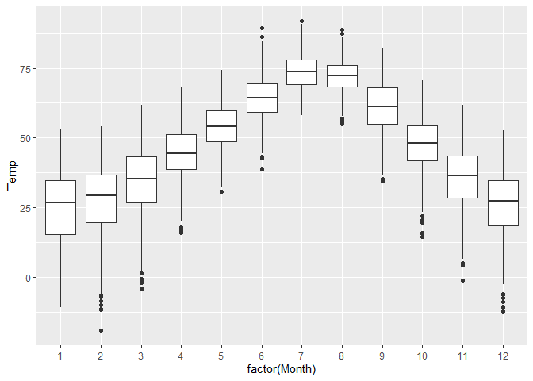
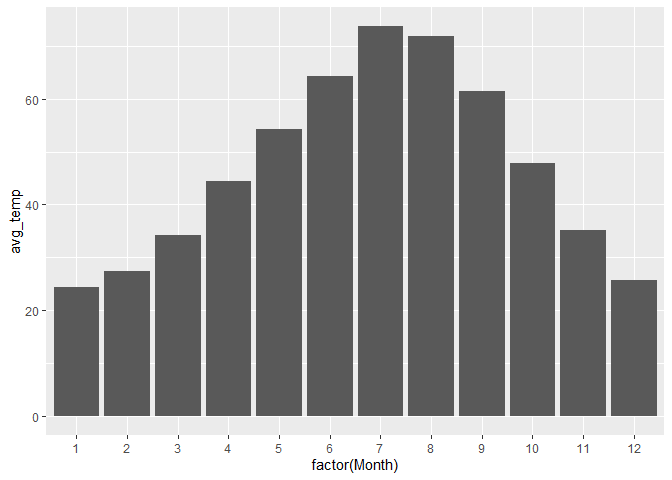
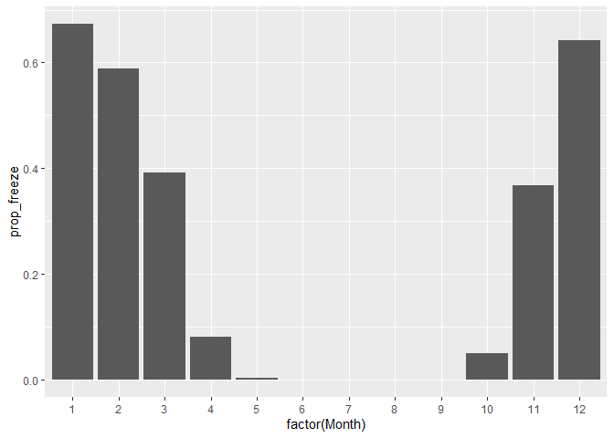
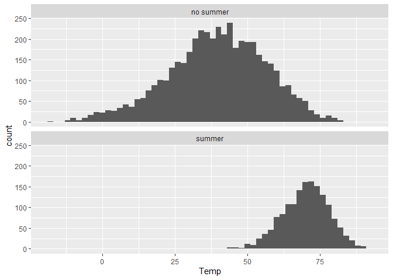
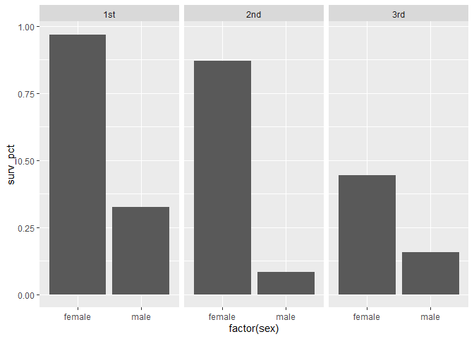
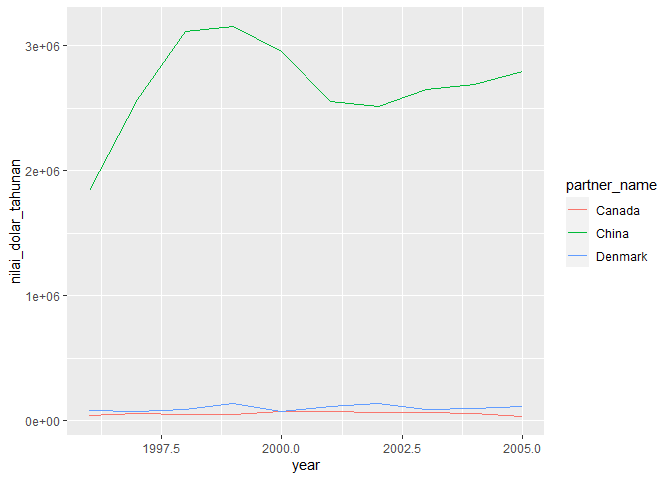
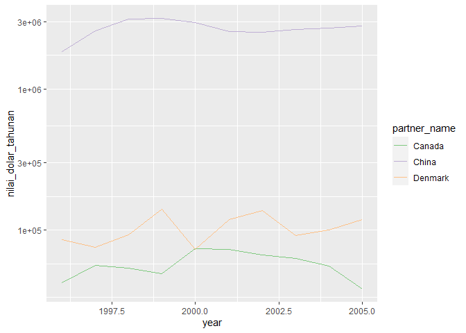
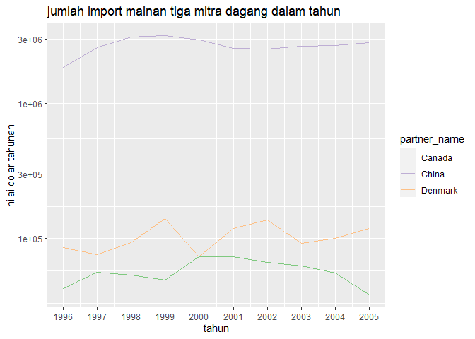

### 6 Data Wrangling

Data wrangling mengacu pada proses mengubah data Anda menjadi bentuk
yang berguna untuk visualisasi, ringkasan, dan pemodelan. Wrangling
adalah bagian penting dari ilmu data, karena data jarang sekali hadir
dalam bentuk yang sesuai dengan analisis tertentu. Misalnya, Anda
mungkin ingin fokus hanya pada baris atau kolom tertentu dari data Anda,
atau menghitung statistik ringkasan hanya untuk subkelompok tertentu.
Mungkin Anda ingin membuat variabel baru yang berasal dari variabel yang
sudah ada. Atau Anda hanya ingin mengurutkan baris berdasarkan beberapa
variabel, untuk membuat tabel lebih mudah dibaca. Semua tugas ini
melibatkan penguraian data Anda.

Untungnya, R - atau lebih spesifiknya, pustaka tidyverse - dilengkapi
dengan beberapa kata kerja data praktis yang menyederhanakan tugas-tugas
penguraian ini. Dalam pelajaran ini, Anda akan belajar untuk:

menggunakan enam kata kerja data utama (`summarize`, `group_by`,
`mutate`, `filter`, `select`, dan `arrange`) untuk mentransformasi data
Anda ke dalam bentuk yang lebih nyaman. menghitung statistik ringkasan
yang kompleks untuk subset data dan kombinasi variabel Anda.

``` r
library(tidyverse)
```

#### 6.1 Kata kerja data kunci

Sekarang, kita akan mempelajari lima kata kerja :

- `group_by`, untuk membagi kumpulan data menjadi beberapa kelompok.
- `filter`, untuk melihat baris (kasus) tertentu.
- `select`, untuk melihat kolom (variabel) tertentu.
- `mutate`, untuk mendefinisikan variabel baru dari variabel lama.
- `arrange`, untuk mengurutkan bingkai data menurut variabel tertentu.

berikut data
[rapidcsv](https://github.com/muhammadrendysa/dataset_tanpa_outlier/blob/main/rapidcity.csv)
yang akan digunakan dalam pembelajaran ini

##### Group By

Sebuah fitur yang bagus dari R adalah bahwa kita dapat menghitung
statistik ringkasan umum yang dikelompokkan berdasarkan nilai beberapa
variabel lain. contoh:

``` r
rapidcity %>%
  summarise(avg_temp = mean(Temp),
            sd_temp = sd(Temp),
            q05_temp = quantile(Temp, 0.05),
            q095_temp = quantile(Temp, 0.95)) %>%
  round(1)
```

    ##   avg_temp sd_temp q05_temp q095_temp
    ## 1     47.3    20.1     12.9      77.2

Ringkasan statistik ini memberikan informasi tentang apa yang terjadi
sepanjang tahun. Tetapi, bagaimana jika kita ingin tahu informasi serupa
untuk setiap bulannya? Hal ini penting karena, seperti yang bisa dilihat
dari boxplot sederhana, suhu di Rapid City berubah-ubah sepanjang tahun
dengan pola musiman yang jelas. Pada bulan-bulan musim panas, suhu
cenderung lebih tinggi, tetapi perubahan suhu dari hari ke hari juga
cenderung lebih konsisten.

``` r
ggplot(data = rapidcity, mapping = aes(x = factor(Month), y = Temp))+
  geom_boxplot()
```

<!-- -->

Untuk membuat rangkuman berdasarkan bulan, kita menggunakan pernyataan
“`group_by`” sebelum kita merangkum datanya. Contohnya seperti dalam
kode berikut:

``` r
rapidcity %>%
  group_by(Month) %>%
  summarise(avg_temp = mean(Temp),
            sd_temp = sd(Temp),
            q05_temp = quantile(Temp, 0.05),
            q095_temp = quantile(Temp, 0.95)) %>%
  round(1)
```

    ## # A tibble: 12 × 5
    ##    Month avg_temp sd_temp q05_temp q095_temp
    ##    <dbl>    <dbl>   <dbl>    <dbl>     <dbl>
    ##  1     1     24.4    13.5     -1.1      42.4
    ##  2     2     27.4    13        2.2      45.4
    ##  3     3     34.2    12.7      9        52.9
    ##  4     4     44.5     9.7     27.2      60  
    ##  5     5     54.3     8.3     41.1      68.8
    ##  6     6     64.3     7.7     52        77.6
    ##  7     7     73.7     6.6     62.5      85.1
    ##  8     8     71.9     6.1     60.6      82  
    ##  9     9     61.4     9.1     47.2      77.1
    ## 10    10     47.9     9.7     32.4      64  
    ## 11    11     35.1    11.5     14.7      52.6
    ## 12    12     25.7    12.4      1.1      42.3

Hasilnya adalah sebuah tabel yang memberikan ringkasan statistik untuk
setiap bulan. Dalam bahasa yang lebih sederhana, langkah-langkah dalam
blok kode ini adalah:

- Ambil kumpulan data tentang `rapidcity`.
- Bagi pengamatan ke dalam kelompok berdasarkan bulan.
- Hitung statistik ringkasan untuk setiap kelompok bulan.
- Bulatkan angka-angka hasil ke desimal pertama.

Yang paling penting, pastikan kita menggunakan “`group_by`” sebelum
“`summarize`” dalam blok kode ini. Ini penting karena urutan ini
mencerminkan alur logika dari operasi. Jika kita lebih dulu menggunakan
“`summarize`”, maka seluruh kumpulan data akan diringkas, bukan hanya
bagian-bagian yang berhubungan dengan bulan yang berbeda.

Konsep pengelompokan ini juga bisa diterapkan pada jenis ringkasan
statistik lainnya. Anda akan menemukan contoh-contoh lainnya di bawah
ini; untuk daftar lebih lengkapnya, Anda bisa mengetikkan “`?summarize`”
di konsol R Anda.

##### Bar plot

Kombinasi `group_by` dan `summarize` sangat berguna untuk membuat tabel
rangkuman statistik tingkat grup untuk dimasukkan ke dalam bar plot.
alur kerja umum untuk membuat plot batang sebenarnya memiliki dua tahap
yang berbeda: Ada dua langkah yang perlu diikuti:

- **Tahap Ringkasan**: Pertama, pisahkan data Anda menjadi
  kelompok-kelompok kecil dan hitung statistik penting untuk setiap
  kelompok ini.

- **Tahap Pembuatan Plot**: Kemudian, buatlah grafik batang yang
  menunjukkan statistik yang telah dihitung sebelumnya. Setiap kelompok
  akan diwakili oleh satu batang di dalam grafik ini.

Mari kita lihat contoh penggunaannya dalam data Rapid City. Di contoh
berikut, kami menghitung dua informasi penting untuk setiap bulan:
rata-rata suhu dan berapa banyak hari yang suhunya di bawah titik beku.
Hasil perhitungan ini kemudian kami simpan dalam sebuah variable bernama
“`rapidcity_summary`”.

``` r
rapidcity_summary <- rapidcity %>%
  group_by(Month) %>%
  summarise(avg_temp = mean(Temp),
            prop_freeze = sum(Temp <= 32)/n())
```

Sekarang mari kita buat plot batang untuk masing-masing dari dua
statistik ringkasan kita. Pertama, suhu rata-rata:

``` r
ggplot(data = rapidcity_summary, mapping = aes(x = factor(Month), y = avg_temp))+
  geom_col()
```

<!-- -->

Berikutnya, proporsi hari yang berada di bawah titik beku, rata-rata:

``` r
ggplot(data = rapidcity_summary, mapping = aes(x = factor(Month), y = prop_freeze))+
  geom_col()
```

<!-- -->

Anda mungkin memperhatikan hal aneh dalam kode ini: mengapa kita
menggunakan `factor(Month)` bukannya hanya `Month`? Ini karena saat
membuat grafik batang, kita perlu menggunakan variabel x yang bersifat
kategorikal untuk mengelompokkan dan menampilkan batang-batangnya.
Namun, dalam kumpulan data kita, kolom “Bulan” sebenarnya berisi angka:
1 untuk Januari, 2 untuk Februari, dan seterusnya. Secara bawaan, R akan
memperlakukan ini sebagai angka dan menghitung besaran numeriknya.
Namun, menggunakan perintah `factor` mengubah perilaku ini. Ia
memberitahu R untuk menganggap angka-angka tersebut sebagai label, bukan
nilai berurutan, sehingga kita bisa menggunakan mereka untuk
mengelompokkan data dengan benar dalam plot batang.

##### Filter

Filter kata kerja adalah cara kita memilih baris tertentu dari data
kita. Contohnya, jika kita hanya ingin melihat statistik suhu bulanan
pada tahun 2009 saja, kita bisa menggunakan filter untuk memilih hanya
data dari tahun tersebut.

``` r
rapidcity2009 <- rapidcity %>%
  filter(Year == 2009)
```

Anda mungkin bingung dengan dua jenis tanda sama dengan yang digunakan
di sini. Tanda sama dengan dua (`==`) dalam `filter` digunakan untuk
memeriksa apakah dua hal itu sama. Dalam kasus ini, kita menggunakan
`filter` untuk hanya memilih data dari tahun 2009. Tanda sama dengan
tunggal (=) digunakan untuk memberikan nilai pada objek. Ini sebenarnya
terjadi di akhir urutan perintah. Jadi, dalam bahasa yang lebih
sederhana, blok kode ini bekerja seperti ini:

- Mulai dengan kumpulan data rapidcity
- Kemudian pilih hanya baris-baris yang memiliki Tahun == 2009.
- Terakhir, simpan hasil pemilihan data dalam objek yang disebut
  rapidcity2009.

Anda bisa memeriksa bahwa ini berfungsi dengan melihat enam baris
pertama dari data yang telah difilter.

``` r
head(rapidcity2009)
```

    ##   Year Month Day Temp
    ## 1 2009     1   1 30.7
    ## 2 2009     1   2 20.3
    ## 3 2009     1   3 16.9
    ## 4 2009     1   4  8.0
    ## 5 2009     1   5 13.9
    ## 6 2009     1   6 28.2

Dalam pernyataan filter kita, kita bisa menggunakan tes logika berikut:

- `==` untuk memeriksa kesetaraan yang tepat, misalnya `Bulan == 3`
  untuk bulan `Maret`. Jika variabel menggunakan teks, kita perlu
  menempatkan tanda petik. Contohnya, `Bulan == "Maret"`.
- `!=` untuk memeriksa “tidak sama dengan.”
- `<` dan `<=` untuk memeriksa “`kurang dari`” dan
  “`kurang dari atau sama dengan`”. Contohnya, `Temp <= 50` berarti suhu
  kurang dari atau sama dengan 50 derajat.
- `>` dan `>=` untuk memeriksa “lebih besar dari” dan “lebih besar dari
  atau sama dengan”.
- `|` untuk “atau”. Contohnya, `Bulan == 1 | Bulan == 2` akan memberikan
  data dari Januari dan Februari.
- `&` untuk “dan”. Contohnya, `Bulan == 1 & Tahun == 2009` akan
  memberikan data Januari 2009.

Kita bisa menggabungkan filter dengan operasi lain, seperti pada kode di
bawah, di mana kita menghitung statistik bulanan dari
`data tahun 2006-2009`.

``` r
rapidcity %>%
  filter(Year >= 2006 & Year <= 2009) %>%
  group_by(Month) %>%
  summarise(avg_temp = mean(Temp),
            sd_temp = sd(Temp)) %>%
  round(1)
```

    ## # A tibble: 12 × 3
    ##    Month avg_temp sd_temp
    ##    <dbl>    <dbl>   <dbl>
    ##  1     1     27.4    12.6
    ##  2     2     25.3    12.4
    ##  3     3     36.2    11.9
    ##  4     4     44.2    11  
    ##  5     5     56.1     8.7
    ##  6     6     65.5     8.2
    ##  7     7     75.1     7.4
    ##  8     8     71.3     6.5
    ##  9     9     60.7     8.2
    ## 10    10     45.3     9.8
    ## 11    11     37.6    10.2
    ## 12    12     22      11.9

Dalam kata-kata yang lebih sederhana, blok kode ini melakukan hal-hal
berikut:

- Ambil data dari rapidcity.
- Pilih hanya data dari tahun 2006 hingga 2009 (termasuk).
- Kelompokkan data berdasarkan bulan.
- Hitung statistik ringkasan.
- Bulatkan angka-angka hasil ke angka setelah koma desimal pertama.

##### Select

Sementara itu, kata kerja “`select`” digunakan untuk mengambil kolom
(bagian) tertentu dari data Anda. Ini sangat berguna untuk menghilangkan
informasi yang tidak penting dan membuat tabel terlihat lebih rapi.
Misalnya, dalam data “`rapidcity2009`”, kita mungkin merasa bahwa kolom
“`Tahun`” tidak diperlukan, karena semua data berasal dari tahun 2009.
Kami bisa menggunakan “`select`” untuk hanya mengambil kolom yang ingin
kita simpan, dengan menyebutkan namanya dan memisahkannya dengan koma.

``` r
rapidcity %>%
  select(Month, Day, Temp) %>%
  head()
```

    ##   Month Day Temp
    ## 1     1   1 12.6
    ## 2     1   2 19.9
    ## 3     1   3  9.2
    ## 4     1   4  6.2
    ## 5     1   5 16.0
    ## 6     1   6 17.8

Kolom `Tahun` tidak lagi muncul dalam bingkai data kita. Perhatikan
bahwa kita dapat menyelesaikan tugas yang sama dengan mengatakan
`select(-Tahun)`, seperti ini:

``` r
rapidcity %>%
  select(-Year) %>%
  head()
```

    ##   Month Day Temp
    ## 1     1   1 12.6
    ## 2     1   2 19.9
    ## 3     1   3  9.2
    ## 4     1   4  6.2
    ## 5     1   5 16.0
    ## 6     1   6 17.8

Potongan kode ini memilih semua kolom kecuali `Tahun` dan mencetak enam
baris pertama dari dataframe yang difilter.

##### Mutate

Gunakan “`mutate`” untuk membuat variabel baru dari variabel yang sudah
ada sebelumnya. Contoh, jika kita ingin menambahkan sesuatu pada data
“`rapidcity`” kita, seperti variabel “`Summer`” yang menunjukkan apakah
suatu baris terjadi pada bulan Juni, Juli, atau Agustus. Caranya adalah
sebagai berikut:

``` r
rapidcity_augmented <- rapidcity %>%
  mutate(Summer = ifelse(Month == 6 | Month == 7 | Month == 8,
                         yes = "summer", no = "no summer"))
```

Dalam kata-kata yang lebih sederhana, blok kode ini melakukan hal
berikut:

- Ambil data dari “`rapidcity`”.
- Tambahkan variabel baru yang dinamai “`Summer`”. Cara membuatnya
  adalah sebagai berikut:
- Jika bulan bernilai `6, 7, atau 8`, atur variabel “`Summer`” menjadi
  “`summer`”.
- Jika tidak, atur variabel “`Summer`” menjadi “`not_summer`”.
- Simpan hasilnya dalam sebuah variabel data yang disebut
  “`rapidcity_augmented`”.

Mari kita periksa apakah ini bekerja dengan benar.

``` r
head(rapidcity_augmented)
```

    ##   Year Month Day Temp    Summer
    ## 1 1995     1   1 12.6 no summer
    ## 2 1995     1   2 19.9 no summer
    ## 3 1995     1   3  9.2 no summer
    ## 4 1995     1   4  6.2 no summer
    ## 5 1995     1   5 16.0 no summer
    ## 6 1995     1   6 17.8 no summer

Kelihatannya bagus!

Kita sekarang dapat menggunakan variabel `summer` seperti variabel asli
lainnya. Sebagai contoh, di sini kami menunjukkan histogram segi suhu
berdasarkan status `summer`:

``` r
ggplot(data = rapidcity_augmented)+
  geom_histogram(mapping = aes(x = Temp), binwidth = 2)+
  facet_wrap(~Summer, nrow = 2)
```

<!-- -->

##### Arange

Gunakan “`arrange`” untuk mengurutkan data berdasarkan variabel
tertentu. Ini berguna ketika Anda ingin melihat contoh teratas atau
terbawah dalam data Anda berdasarkan suatu ukuran. Ini juga bisa sangat
bermanfaat saat mengurutkan tabel data statistik.

Sebagai contoh, mari kita cari sepuluh hari dengan suhu `terendah` di
`Rapid City` selama periode tertentu:

``` r
rapidcity %>%
  arrange(Temp) %>%
  head(10)
```

    ##    Year Month Day  Temp
    ## 1  1996     2   2 -19.0
    ## 2  2008    12  15 -12.2
    ## 3  1996     2   3 -11.8
    ## 4  2006     2  18 -11.5
    ## 5  1996     1  30 -11.0
    ## 6  1996    12  26 -10.8
    ## 7  1996     1  19 -10.6
    ## 8  1996    12  24 -10.6
    ## 9  1996     1  29 -10.4
    ## 10 1997     1  11 -10.2

Jika kita ingin `sepuluh hari terpanas`, kita harus mengatur dalam
urutan `Temp` menggunakan `desc`, seperti ini:

``` r
rapidcity %>%
  arrange(desc(Temp)) %>%
  head(10)
```

    ##    Year Month Day Temp
    ## 1  2007     7   7 91.9
    ## 2  2006     7  16 90.7
    ## 3  2006     7  30 89.8
    ## 4  2007     7  23 89.5
    ## 5  2007     7  24 89.5
    ## 6  2002     6  29 89.4
    ## 7  2002     7  15 89.3
    ## 8  2006     7  15 89.0
    ## 9  2003     8  23 88.9
    ## 10 2002     7  16 88.4

#### 6.2 Rangkuman yang kompleks

Pada bagian ini kita akan melihat beberapa contoh bagaimana kita dapat
menggabungkan kata kerja data untuk melakukan tugas-tugas yang kompleks
dengan sangat ringkas.

> Kelola kompleksitas dengan memecah tugas-tugas yang rumit menjadi
> tugas-tugas yang sederhana, dan kemudian menggabungkan tugas-tugas
> sederhana tersebut.

Selalu ingat pedoman ini setiap kali Anda melihat contoh di bawah ini.
Fokuskan pada tiga pertanyaan berikut:

- Tugas-tugas besar dan penting apa yang harus diatasi?
- Bagaimana tugas-tugas besar itu bisa dibagi menjadi langkah-langkah
  yang lebih sederhana? (Apa langkah-langkahnya dan - bagaimana cara
  mengurutkannya)
- Bagaimana langkah-langkah yang lebih sederhana itu bisa diterjemahkan
  ke dalam perintah data, seperti “`group_by`”, “`summarize`”,
  “`filter`”, dan sebagainya?

##### Contoh 1: lima bulan terdingin

Untuk contoh pertama kita, tugas tingkat tinggi utama kita adalah
menemukan lima bulan terdingin dalam kumpulan data Rapid City, yang
mencakup tujuh belas tahun dari 1995 hingga 2011.

Tugas utama ini dibagi menjadi beberapa sub-tugas yang lebih sederhana
yang terlihat seperti berikut ini:

- Mengimpor set data (kita sudah melakukan ini).
- Membagi kumpulan data menjadi beberapa bulan dalam beberapa tahun:
  Januari 1995, Februari 1995, Maret 1995, dan seterusnya, hingga
  Desember 2011.
- Untuk setiap bulan, hitung rata-rata variabel Temp (bersama dengan
  ringkasan lain yang mungkin menarik bagi kita).
- Urutkan masing-masing bulan berdasarkan suhu rata-ratanya.
- Buatlah tabel lima bulan terdingin.

Cara kita menganalisis data ini, yang ditunjukkan di bawah, mengikuti
urutan yang masuk akal. Kita menggunakan serangkaian langkah, seperti
`group_by`, `summarize`, dan `arrange`, dan kemudian hasilnya diteruskan
ke `head` dan `round` (untuk membatasi tabel dan membulatkan angka).

``` r
rapidcity %>%
  group_by(Year, Month) %>%
  summarise(avg_temp = mean(Temp),
            coldest_day = min(Temp),
            warmest_day = max(Temp)) %>%
  arrange(avg_temp) %>%
  head(5) %>%
  round(1)
```
    ## # A tibble: 5 × 5
    ## # Groups:   Year [4]
    ##    Year Month avg_temp coldest_day warmest_day
    ##   <dbl> <dbl>    <dbl>       <dbl>       <dbl>
    ## 1  1996     1     14.9       -11          46.1
    ## 2  2009    12     16.4        -2.6        35.6
    ## 3  2000    12     17.3        -9          38.8
    ## 4  1996    12     17.5       -10.8        40.4
    ## 5  2001     2     17.6        -3.9        40.8

Tampaknya bulan Januari 1996 sangat dingin.

Bayangkan jika kita mengelompokkan data berdasarkan beberapa variabel,
seperti `Tahun` dan `Bulan`. Saat kita menggunakan perintah “`group_by`”
dengan beberapa variabel, itu akan membuat kelompok berdasarkan semua
kombinasi mungkin dari nilai-nilai variabel-variabel tersebut. Dalam
contoh ini, karena ada `17` tahun berbeda dan `12` bulan berbeda,
perintah “`group_by`” akan membagi data menjadi `204 kelompok`:

Kelompok 1: `Tahun = 1995`, `Bulan = 1` Kelompok 2: `Tahun = 1995`,
`Bulan = 2` … Kelompok 203: `Tahun = 2011`, `Bulan = 11` Kelompok 204:
Tahun = 2011`,`Bulan = 12\`

Setelah data dikelompokkan seperti ini, kode saya menghitung statistik
tertentu untuk setiap kelompok secara terpisah (dalam hal ini, suhu
rata-rata dan suhu harian min/max), dan kemudian mengurutkan kelompok
berdasarkan rata-rata suhu.

Yang penting juga adalah variabel dan statistik yang didefinisikan lebih
awal dalam langkah-langkah (pipeline) dapat digunakan dalam
langkah-langkah selanjutnya. Dalam contoh ini, perhitungan rata-rata
suhu dilakukan pada langkah ketiga, dan hasilnya digunakan untuk
mengurutkan pada langkah keempat, menggunakan perintah
“`arrange(avg_temp`)”.

Namun, urutan langkah-langkah sangatlah penting. Pipeline hanya bisa
menggunakan informasi dari langkah sebelumnya, tidak dari langkah
setelahnya. Ini adalah waktu yang baik untuk memahami dampak kesalahan.
Jika urutan “`summarize`” dan “`arrange`” tertukar, kita akan
mendapatkan pesan kesalahan yang kurang jelas daripada tabel yang berisi
bulan yang sangat dingin.

##### Contoh 2: bertahan hidup di atas kapal Titanic

Pada contoh ini, Anda akan menggunakan data yang ada dalam berkas
[titanic.csv](https://github.com/muhammadrendysa/dataset_tanpa_outlier/blob/main/titanic.csv)
Silakan impor kumpulan data ini ke dalam R dengan nama “`titanic`”
(biasanya akan menjadi nama default jika Anda menggunakan tombol “Import
Dataset”).

Jika Anda ingin melihat beberapa baris pertama dari data tersebut…

``` r
head(titanic)
```

    ##                              name survived    sex     age passengerClass
    ## 1   Allen, Miss. Elisabeth Walton      yes female 29.0000            1st
    ## 2  Allison, Master. Hudson Trevor      yes   male  0.9167            1st
    ## 3    Allison, Miss. Helen Loraine       no female  2.0000            1st
    ## 4 Allison, Mr. Hudson Joshua Crei       no   male 30.0000            1st
    ## 5 Allison, Mrs. Hudson J C (Bessi       no female 25.0000            1st
    ## 6             Anderson, Mr. Harry      yes   male 48.0000            1st

… Jika Anda melihat data beberapa baris pertama, Anda akan menemukan
bahwa setiap baris mewakili seorang individu, yaitu seorang penumpang di
kapal Titanic saat tenggelam pada tanggal 15 April 1912. Setiap kolom
berisi informasi tentang penumpang tersebut, seperti jenis kelamin,
usia, kelas tiket, dan apakah mereka selamat atau tidak selamat dari
bencana itu.

Pada contoh ini, kita akan mencoba menjawab pertanyaan: bagaimana
peluang bertahan hidup di antara penumpang dewasa berbeda tergantung
pada jenis kelamin dan kelas kabin? Ingatlah prinsip dasar ilmu data:…

> Kelola kompleksitas dengan memecah tugas-tugas kompleks menjadi
> tugas-tugas yang lebih sederhana dan kemudian menggabungkan
> tugas-tugas sederhana tersebut.

Di sini, tugas sederhana kita adalah:

Buat variabel baru, yang kita sebut “`Dewasa`”, untuk menandai apakah
seorang penumpang berusia 18 tahun atau lebih. Saring data agar hanya
memasukkan penumpang dewasa. Kelompokkan data yang sudah disaring
berdasarkan jenis kelamin dan kelas kabin (6 kelompok total - 2 jenis
kelamin × 3 kelas). Hitung persentase kelangsungan hidup untuk setiap
kelompok. Untuk melakukan semua ini, kita akan menggunakan perpaduan
langkah-langkah seperti membuat variabel baru (“`mutate`”), menyaring
data (“`filter`”), mengelompokkan data (“`group_by`”), dan menghitung
ringkasan data (“`summarize`”). Setelah itu, kita akan menggunakan
ggplot untuk mengubah ringkasan data menjadi diagram batang agar lebih
mudah dilihat dan lebih menarik secara visual.

Kita akan membagi tugas menjadi dua bagian. Bagian pertama ini berfokus
pada membuat tabel bernama “`surv_adults`”:

``` r
surv_adults = titanic %>%
  mutate(age_bracket = ifelse(age >= 18,
                              yes="adult", no="child")) %>%
  filter(age_bracket == "adult") %>%
  group_by(sex, passengerClass) %>%
  summarize(total_count = n(),
            surv_count = sum(survived == 'yes'),
            surv_pct = surv_count/total_count)
```

Ingatlah, tanda sama dengan (=) digunakan untuk memberi nilai pada
objek, sedangkan tanda sama dengan ganda (==) digunakan untuk memeriksa
kesetaraan. Perhatikan bahwa saat kita menggunakan langkah “filter”,
kita perlu menggunakan tanda petik di sekitar “adult”, karena
“age_bracket” adalah variabel kategorikal, bukan angka.

Bagian lain yang mungkin belum Anda kenal dalam langkah-langkah ini
mungkin adalah langkah “summarize”. Di sini, kita membuat tiga variabel
ringkasan:

- “`total_count`” dihitung dengan fungsi sederhana “`n()`”, yang
  menghitung total kasus dalam setiap kelompok. “`n()`” berperilaku
  mirip dengan “`xtabs`”, tetapi digunakan dalam pipeline.
- “`surv_count`” menghitung jumlah orang yang selamat dalam setiap
  kelompok, dengan menjumlahkan kasus di mana variabel “`survived`”
  adalah ‘`ya`’. Ini dilakukan melalui “`sum(survived == 'yes')`”.
- “`surv_pct`” kemudian dihitung sebagai rasio dari kedua angka ini:
  “`surv_count`” dibagi “`total_count`”.

Hasilnya adalah tabel ringkasan statistik yang kita perlukan untuk
setiap kombinasi jenis kelamin dan kelas penumpang.

``` r
surv_adults
```

    ## # A tibble: 6 × 5
    ## # Groups:   sex [2]
    ##   sex    passengerClass total_count surv_count surv_pct
    ##   <chr>  <chr>                <int>      <int>    <dbl>
    ## 1 female 1st                    125        121   0.968 
    ## 2 female 2nd                     85         74   0.871 
    ## 3 female 3rd                    106         47   0.443 
    ## 4 male   1st                    144         47   0.326 
    ## 5 male   2nd                    143         12   0.0839
    ## 6 male   3rd                    289         45   0.156

Tabel ini sebenarnya sudah bagus, tetapi jika Anda ingin membuatnya
lebih menarik secara visual, kita bisa menggunakan ggplot dalam bagian
1. Dengan `ggplot`, kita akan mengubah tabel ini menjadi plot batang
yang akan memperlihatkan perbandingan persentase kelangsungan hidup
berdasarkan jenis kelamin di tiga kelas penumpang.

``` r
ggplot(data = surv_adults, mapping = aes(x = factor(sex), y = surv_pct))+
  geom_col()+
  facet_wrap(~passengerClass, nrow = 1)
```

<!-- -->

##### Contoh 3: toy import

Untuk contoh terakhir, kita akan melihat data di
[toyimports.csv](https://github.com/muhammadrendysa/dataset_tanpa_outlier/blob/main/toyimports.csv),
yang melacak impor mainan ke Amerika Serikat dari 129 negara selama
periode 1996-2005. Berikut adalah sampel dari 10 baris dari kumpulan
data ini.

``` r
head(toyimports, 10)
```

    ##    partner year         partner_name product
    ## 1      ARE 1998 United Arab Emirates  950341
    ## 2      ARE 2000 United Arab Emirates  950349
    ## 3      ARE 2003 United Arab Emirates  950349
    ## 4      ARE 2005 United Arab Emirates  950320
    ## 5      ARG 1996            Argentina  950341
    ## 6      ARG 1996            Argentina  950310
    ## 7      ARG 1996            Argentina  950320
    ## 8      ARG 1997            Argentina  950349
    ## 9      ARG 1997            Argentina  950320
    ## 10     ARG 1997            Argentina  950299
    ##                           product_name US_report_import  pop2000 region
    ## 1  Toys representing animals or non-hu            1.060  3247000      7
    ## 2  Toys representing animals or non-hu           12.012  3247000      7
    ## 3  Toys representing animals or non-hu            4.650  3247000      7
    ## 4  Reduced-size ("scale") model assemb           49.236  3247000      7
    ## 5  Toys representing animals or non-hu            0.000 36895710      2
    ## 6   Electric trains, including tracks,           10.850 36895710      2
    ## 7  Reduced-size ("scale") model assemb            0.000 36895710      2
    ## 8  Toys representing animals or non-hu            3.708 36895710      2
    ## 9  Reduced-size ("scale") model assemb            8.729 36895710      2
    ## 10     Parts and accessories :-- Other          120.419 36895710      2

Setiap baris datanya menyimpan berapa banyak mainan yang diimpor ke
Amerika Serikat (AS), dalam bentuk ribuan dolar, untuk jenis mainan
tertentu dari suatu negara pada tahun tertentu. Jenis mainannya punya
kode dan nama yang menarik untuk anak-anak, misalnya “Suku cadang dan
aksesori: - Lainnya” atau “Mainan yang merepresentasikan figur hewan
atau non-manusia”.

Tujuannya adalah membuat grafik garis yang menunjukkan berapa total
impor mainan dari tahun ke tahun, dihitung dari semua jenis mainan,
untuk tiga negara mitra utama AS, berdasarkan total nilai dolar
imporannya.

Agar lebih mudah, kita perlu memecah tugas ini. Pertama, kita harus
mencari tahu tiga negara mitra terbesar berdasarkan nilai dolar
totalnya. Ini bisa dibagi lagi menjadi langkah-langkah lebih sederhana:

- Mengelompokkan data berdasarkan nama negara mitra (variabel
  partner_name).
- Untuk setiap negara mitra, kita hitung berapa total dolar impor dari
  semua jenis mainan dan tahun.
- Urutkan negara mitra berdasarkan total nilai dolarnya.

Kami dapat menggunakan kombinasi perintah `group_by`, `summarize`, dan
`arrange` dalam R untuk melakukan ini.

``` r
country_totals <- toyimports %>%
  group_by(partner_name) %>%
  summarise(total_nilai_dolar = sum(US_report_import))%>%
  arrange(desc(total_nilai_dolar))
```

Sekarang kita bisa melihat mitra dagang teratas:

``` r
head(country_totals)
```

    ## # A tibble: 6 × 2
    ##   partner_name     total_nilai_dolar
    ##   <chr>                        <dbl>
    ## 1 China                    26842305.
    ## 2 Denmark                   1034990.
    ## 3 Canada                     572309.
    ## 4 Hong Kong, China           545186.
    ## 5 Switzerland                400969.
    ## 6 Korea, Rep.                350612.

Jadi, 3 mitra dagang mainan teratas AS adalah Tiongkok, Denmark, dan
Kanada. Mari kita mengkodekan informasi tersebut ke dalam sebuah daftar,
dengan menggunakan nilai yang tepat seperti yang tercermin pada kolom
`parter_name` pada tabel di atas:

``` r
top3_partner_names <- c('China', 'Denmark', 'Canada')
```

Di sini, “`c`” berarti “menggabungkan,” dan ini adalah cara kita membuat
list yang berisi beberapa nama. list ini akan berguna ketika kita
melangkah ke langkah berikutnya, yaitu membuat grafik impor mainan dari
waktu ke waktu untuk setiap jenis, terpisah untuk tiga mitra dagang
utama.

Tugas berikutnya juga bisa dibagi menjadi beberapa langkah sederhana:

- Memilih hanya data dari tiga mitra dagang teratas.
- Mengelompokkan data berdasarkan mitra dagang dan tahun.
- Dalam setiap kelompok, menjumlahkan impor mainan dari semua jenis.

Berikut ini adalah bagaimana langkah-langkah ini diimplementasikan
menggunakan kode R, serta enam baris pertama dari data yang dihasilkan:

``` r
top3_berdasarkan_tahun <- toyimports %>%
  filter(partner_name %in% top3_partner_names) %>%
  group_by(year, partner_name) %>%
  summarise(nilai_dolar_tahunan = sum(US_report_import))
```

``` r
head(top3_berdasarkan_tahun)
```

    ## # A tibble: 6 × 3
    ## # Groups:   year [2]
    ##    year partner_name nilai_dolar_tahunan
    ##   <int> <chr>                      <dbl>
    ## 1  1996 Canada                    42650.
    ## 2  1996 China                   1842478.
    ## 3  1996 Denmark                   85972.
    ## 4  1997 Canada                    56189.
    ## 5  1997 China                   2574251.
    ## 6  1997 Denmark                   75918.

Sekarang kita bisa membuat grafik garis dari
`nilai_dollar_per tahun versus tahun`. Kita akan memberi warna pada
setiap garis sesuai dengan mitra dagang, seperti ini:

``` r
ggplot(data = top3_berdasarkan_tahun, mapping = aes(x = year, y = nilai_dolar_tahunan))+
  geom_line(mapping = aes(color = partner_name))
```

<!-- -->
Tetapi, ini tidak bagus karena dua alasan:

- Skala warna tidak ramah bagi mereka yang buta warna. Kita akan
  memperbaikinya dengan menggunakan `scale_color_brewer`
- Garis untuk Denmark dan Kanada dikerdilkan oleh garis untuk Cina. Kita
  akan memperbaikinya dengan memplot data pada sumbu logaritmik, yang
  merupakan cara yang lebih alami untuk membandingkan jumlah pada skala
  yang sangat berbeda.

Kita dapat melakukan hal ini sebagai berikut:

``` r
ggplot(data = top3_berdasarkan_tahun, mapping = aes(x = year, y = nilai_dolar_tahunan, color = partner_name))+
  geom_line()+
  scale_color_brewer(type = 'qual')+
  scale_y_log10()
```

<!-- -->

Terdapat satu masalah terakhir, yaitu label pada sumbu grafik yang
ditempatkan kurang baik oleh `ggplot`. Kita bisa memperbaikinya dengan
mudah dan sekaligus menambahkan label sumbu yang memberikan informasi
yang lebih jelas:

``` r
ggplot(data = top3_berdasarkan_tahun, mapping = aes(x = year, y = nilai_dolar_tahunan, color = partner_name))+
  geom_line()+
  scale_color_brewer(type="qual")+
  scale_y_log10()+
  scale_x_continuous(breaks = 1196:2005)+
  labs(x = "tahun", y = "nilai dolar tahunan", title = "jumlah import mainan tiga mitra dagang dalam tahun")
```

<!-- -->

Dan kita sudah selesai! Sekarang kita bisa membandingkan antar negara,
serta memeriksa perubahan dari waktu ke waktu di dalam negara.

#### 6.3 Pintasan ringkasan

Setelah melihat beberapa contoh peringkasan yang sulit, sekarang kita
akan mengakhiri bagian ini dengan hal yang lebih mudah: beberapa cara
cepat untuk membuat peringkasan sederhana hanya dalam satu baris kode.

Agar pintasan ini dapat bekerja, Anda perlu memuat pustaka `mosaik`:

``` r
library(mosaic)
```
Berikut adalah jalan pintas dasar, yang diilustrasikan pada data
`titanic`. Untuk menghitung rata-rata dari sebuah variabel, Anda dapat
menggunakan `mean` secara langsung, seperti ini:

``` r
mean(~ age, data = titanic)
```

    ## [1] 29.88113

Pernyataan ini menghitung nilai rata-rata variabel usia untuk semua
orang dalam kumpulan data titanic. Jangan lupa tanda tilde (`~`) di
depan usia.

Anda juga dapat menghitung `rata-rata` yang dikelompokkan berdasarkan
beberapa variabel pengelompokan lainnya, seperti ini:

``` r
mean(age ~ sex, data = titanic)
```

    ##   female     male 
    ## 28.68707 30.58523

Ini memberi tahu kita rata-rata dari variabel `usia` untuk pria dan
wanita secara terpisah. Jika yang Anda pedulikan adalah perbedaan antara
mean, Anda dapat menggunakan `diffmean`:

``` r
diffmean(age ~ sex, data = titanic)
```

    ## diffmean 
    ## 1.898162

Ini mengatakan bahwa rata-rata usia di antara laki-laki sekitar 1,9
tahun lebih tinggi daripada perempuan. (`diffmean` hanya bekerja jika
variabel di sebelah kanan tanda tilde memiliki dua tingkat persis).

Pintasan yang sama juga bisa digunakan untuk menghitung proporsi dengan
menggunakan proporsi. Sebagai contoh, di bawah ini adalah proporsi total
orang yang meninggal dalam peristiwa `Titanic` (yaitu di mana status
`survived` adalah “`no`”):

``` r
prop(~survived, data = titanic)
```

    ##   prop_no 
    ## 0.5917782

Berikut adalah proporsi yang sama yang dikelompokkan berdasarkan `sex`:

``` r
prop(survived ~ sex, data = titanic)
```

    ## prop_no.female   prop_no.male 
    ##      0.2474227      0.7948328

Dan inilah perbedaan kedua proporsi tersebut, dengan menggunakan
`diffprop`:

``` r
diffprop(survived ~ sex, data = titanic)
```

    ##  diffprop 
    ## 0.5474101

Ini berarti bahwa kemungkinan bertahan hidup di antara perempuan sekitar
55% lebih tinggi dibandingkan dengan laki-laki.

Semua rangkuman di bawah ini menggunakan pendekatan yang sama:

- `median`
- `rentang`, `standar deviasi`, dan `IQR` untuk mengukur sebaran data
- nilai `maksimum` dan `minimum`
- `favstats` untuk kumpulan berbagai statistik ringkasan

Sebagai contoh:

``` r
favstats(age ~ sex, data = titanic)
```

    ##      sex    min Q1 median Q3 max     mean       sd   n missing
    ## 1 female 0.1667 19     27 38  76 28.68707 14.57700 388       0
    ## 2   male 0.3333 21     28 39  80 30.58523 14.28057 658       0
