## Identifikasi Outlier pada Dataset Prediksi Persetujuan Pinjaman

### Tentang Dataset

[**Dataset**](https://www.kaggle.com/datasets/architsharma01/loan-approval-prediction-dataset)
persetujuan pinjaman adalah kumpulan catatan keuangan dan informasi
terkait yang digunakan untuk menentukan kelayakan individu atau
organisasi untuk mendapatkan pinjaman dari lembaga pemberi pinjaman.
Dataset ini mencakup berbagai faktor seperti skor cibil, pendapatan,
status pekerjaan, jangka waktu pinjaman, jumlah pinjaman, nilai aset,
dan status pinjaman. Dataset ini biasanya digunakan dalam pembelajaran
mesin dan analisis data untuk mengembangkan model dan algoritma yang
memprediksi kemungkinan persetujuan pinjaman berdasarkan fitur yang
diberikan.

> Variabel list: 
>
> - Loan_id : id pinjaman 
>
> - no_of_dependents : jumlah tanggungan anggota keluarga 
>
> - education : status pendidikan perguruan tinggi peminjam 
>
> - self_employed : apakah pelamar memiliki bisnis mandiri atau tidak 
>
> - income_annum : pendapatan tahunan peminjam 
>
> - loan_amount : jumlah pinjaman yang diajukan peminjam 
>
> - loan_term : jangka waktu atau durasi pinjaman yang diajukan peminjam 
>
> - cibil_score : informasi skor kredit peminjam 
>
> - residential_assets_value : informasi tentang nilai aset tempat tinggal peminjam 
>
> - commercial_assets_value : informasi tentang nilai aset comersial baik bisnis dan lainnya dari peminjam 
>
> - luxury_assets_value : informasi tentang nilai aset mewah(mobil, investasi, perhiasan, dll) dari peminjam 
>
> - bank_assets_value : informasi tentang nilai aset bank(rekening tabungan, deposito, saham, obligasi, dll) dari peminjam 
>
> - loan_status : informasi status peminjam, disetujui atau tidak 

#### Import Dataset

``` r
data_loan <- read.csv("C:/loan_approval_dataset.csv", stringsAsFactors = TRUE)
dim(data_loan)
```

    ## [1] 4269   13

``` r
library(tidyverse)
```

#### Identifikasi Outlier dengan histogram dan boxplot

``` r
summary(data_loan)
```

    ##     loan_id     no_of_dependents         education    self_employed
    ##  Min.   :   1   Min.   :0.000     Graduate    :2144    No :2119    
    ##  1st Qu.:1068   1st Qu.:1.000     Not Graduate:2125    Yes:2150    
    ##  Median :2135   Median :3.000                                      
    ##  Mean   :2135   Mean   :2.499                                      
    ##  3rd Qu.:3202   3rd Qu.:4.000                                      
    ##  Max.   :4269   Max.   :5.000                                      
    ##   income_annum      loan_amount         loan_term     cibil_score   
    ##  Min.   : 200000   Min.   :  300000   Min.   : 2.0   Min.   :300.0  
    ##  1st Qu.:2700000   1st Qu.: 7700000   1st Qu.: 6.0   1st Qu.:453.0  
    ##  Median :5100000   Median :14500000   Median :10.0   Median :600.0  
    ##  Mean   :5059124   Mean   :15133450   Mean   :10.9   Mean   :599.9  
    ##  3rd Qu.:7500000   3rd Qu.:21500000   3rd Qu.:16.0   3rd Qu.:748.0  
    ##  Max.   :9900000   Max.   :39500000   Max.   :20.0   Max.   :900.0  
    ##  residential_assets_value commercial_assets_value luxury_assets_value
    ##  Min.   : -100000         Min.   :       0        Min.   :  300000   
    ##  1st Qu.: 2200000         1st Qu.: 1300000        1st Qu.: 7500000   
    ##  Median : 5600000         Median : 3700000        Median :14600000   
    ##  Mean   : 7472617         Mean   : 4973155        Mean   :15126306   
    ##  3rd Qu.:11300000         3rd Qu.: 7600000        3rd Qu.:21700000   
    ##  Max.   :29100000         Max.   :19400000        Max.   :39200000   
    ##  bank_asset_value      loan_status  
    ##  Min.   :       0    Approved:2656  
    ##  1st Qu.: 2300000    Rejected:1613  
    ##  Median : 4600000                   
    ##  Mean   : 4976692                   
    ##  3rd Qu.: 7100000                   
    ##  Max.   :14700000

``` r
str(data_loan)
```

    ## 'data.frame':    4269 obs. of  13 variables:
    ##  $ loan_id                 : int  1 2 3 4 5 6 7 8 9 10 ...
    ##  $ no_of_dependents        : int  2 0 3 3 5 0 5 2 0 5 ...
    ##  $ education               : Factor w/ 2 levels " Graduate"," Not Graduate": 1 2 1 1 2 1 1 1 1 2 ...
    ##  $ self_employed           : Factor w/ 2 levels " No"," Yes": 1 2 1 1 2 2 1 2 2 1 ...
    ##  $ income_annum            : int  9600000 4100000 9100000 8200000 9800000 4800000 8700000 5700000 800000 1100000 ...
    ##  $ loan_amount             : int  29900000 12200000 29700000 30700000 24200000 13500000 33000000 15000000 2200000 4300000 ...
    ##  $ loan_term               : int  12 8 20 8 20 10 4 20 20 10 ...
    ##  $ cibil_score             : int  778 417 506 467 382 319 678 382 782 388 ...
    ##  $ residential_assets_value: int  2400000 2700000 7100000 18200000 12400000 6800000 22500000 13200000 1300000 3200000 ...
    ##  $ commercial_assets_value : int  17600000 2200000 4500000 3300000 8200000 8300000 14800000 5700000 800000 1400000 ...
    ##  $ luxury_assets_value     : int  22700000 8800000 33300000 23300000 29400000 13700000 29200000 11800000 2800000 3300000 ...
    ##  $ bank_asset_value        : int  8000000 3300000 12800000 7900000 5000000 5100000 4300000 6000000 600000 1600000 ...
    ##  $ loan_status             : Factor w/ 2 levels " Approved"," Rejected": 1 2 2 2 2 2 1 2 1 2 ...

``` r
data_loan %>%
  count(no_of_dependents)
```

    ##   no_of_dependents   n
    ## 1                0 712
    ## 2                1 697
    ## 3                2 708
    ## 4                3 727
    ## 5                4 752
    ## 6                5 673

``` r
data_loan_copy <- data_loan

data_loan_copy$no_of_dependents_factor <- factor(data_loan_copy$no_of_dependents, levels = c(0, 1, 2, 3, 4, 5), labels = c("0 tanggungan", "1 tanggungan", "2 tanggungan", "3 tanggungan", "4 tanggungan", "5 tanggungan"))

str(data_loan_copy)
```

    ## 'data.frame':    4269 obs. of  14 variables:
    ##  $ loan_id                 : int  1 2 3 4 5 6 7 8 9 10 ...
    ##  $ no_of_dependents        : int  2 0 3 3 5 0 5 2 0 5 ...
    ##  $ education               : Factor w/ 2 levels " Graduate"," Not Graduate": 1 2 1 1 2 1 1 1 1 2 ...
    ##  $ self_employed           : Factor w/ 2 levels " No"," Yes": 1 2 1 1 2 2 1 2 2 1 ...
    ##  $ income_annum            : int  9600000 4100000 9100000 8200000 9800000 4800000 8700000 5700000 800000 1100000 ...
    ##  $ loan_amount             : int  29900000 12200000 29700000 30700000 24200000 13500000 33000000 15000000 2200000 4300000 ...
    ##  $ loan_term               : int  12 8 20 8 20 10 4 20 20 10 ...
    ##  $ cibil_score             : int  778 417 506 467 382 319 678 382 782 388 ...
    ##  $ residential_assets_value: int  2400000 2700000 7100000 18200000 12400000 6800000 22500000 13200000 1300000 3200000 ...
    ##  $ commercial_assets_value : int  17600000 2200000 4500000 3300000 8200000 8300000 14800000 5700000 800000 1400000 ...
    ##  $ luxury_assets_value     : int  22700000 8800000 33300000 23300000 29400000 13700000 29200000 11800000 2800000 3300000 ...
    ##  $ bank_asset_value        : int  8000000 3300000 12800000 7900000 5000000 5100000 4300000 6000000 600000 1600000 ...
    ##  $ loan_status             : Factor w/ 2 levels " Approved"," Rejected": 1 2 2 2 2 2 1 2 1 2 ...
    ##  $ no_of_dependents_factor : Factor w/ 6 levels "0 tanggungan",..: 3 1 4 4 6 1 6 3 1 6 ...

``` r
ggplot(data = data_loan_copy, mapping = aes(x = reorder(no_of_dependents_factor, income_annum, FUN = "median"), y = income_annum))+
  geom_boxplot(mapping = aes(fill = no_of_dependents_factor), color = "black")
```

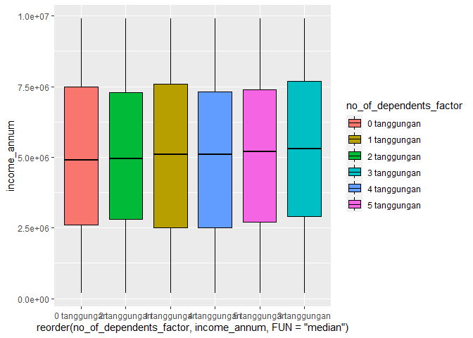<!-- -->

``` r
ggplot(data = data_loan_copy, mapping = aes(x = income_annum))+
  geom_histogram(fill = "aquamarine", color = "black", bins = 30)
```

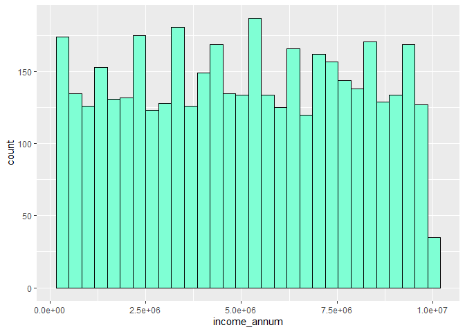<!-- -->

``` r
ggplot(data = data_loan_copy, mapping = aes(x = "", y = income_annum))+
  geom_boxplot(fill = "aquamarine")
```

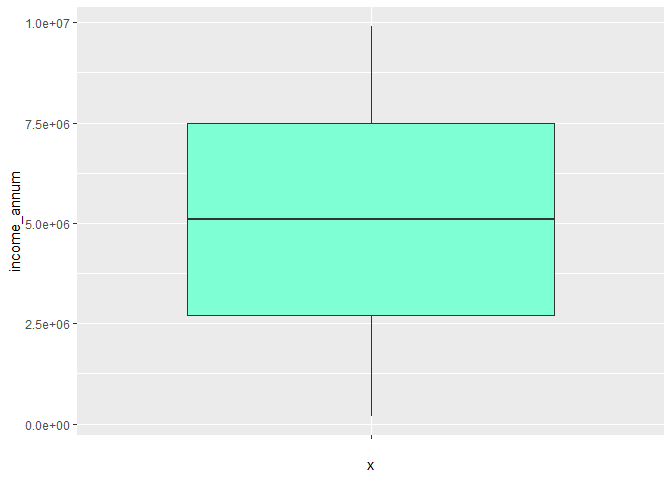<!-- -->

``` r
ggplot(data = data_loan_copy, mapping = aes(x = "", y = no_of_dependents))+
  geom_boxplot(fill = "aquamarine")
```

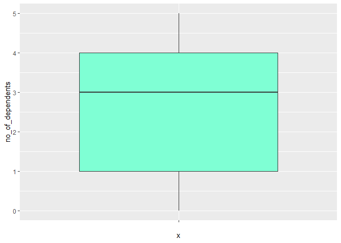<!-- -->

``` r
ggplot(data = data_loan_copy, mapping = aes(x = education, y = loan_amount))+
  geom_boxplot(mapping = aes(fill = education))
```

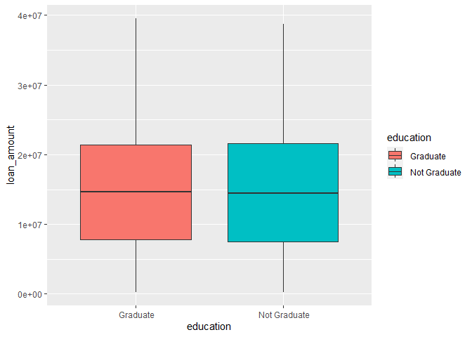<!-- -->

``` r
ggplot(data = data_loan_copy, mapping = aes(x = loan_amount))+
  geom_histogram(fill = "aquamarine", color = "black", bins = 30)
```

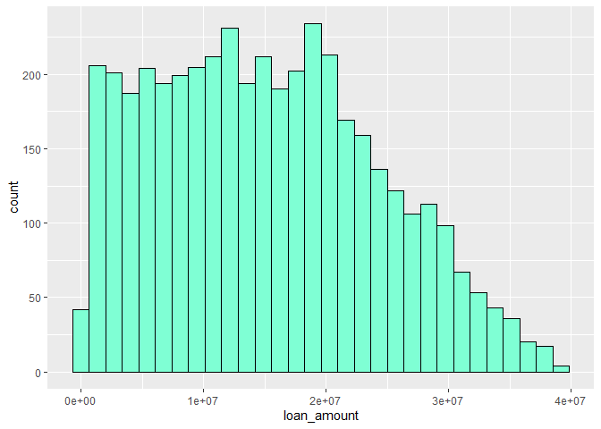<!-- -->

``` r
ggplot(data = data_loan_copy, mapping = aes(x = "", y = loan_amount))+
  geom_boxplot(fill = "aquamarine")
```

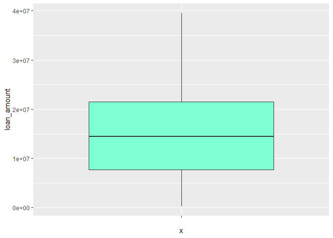<!-- -->

``` r
data_loan_copy %>%
  count(loan_term)
```

    ##    loan_term   n
    ## 1          2 404
    ## 2          4 447
    ## 3          6 490
    ## 4          8 386
    ## 5         10 436
    ## 6         12 456
    ## 7         14 405
    ## 8         16 412
    ## 9         18 422
    ## 10        20 411

``` r
ggplot(data = data_loan_copy, mapping = aes(x = "", y = loan_term))+
  geom_boxplot(fill = "aquamarine")
```

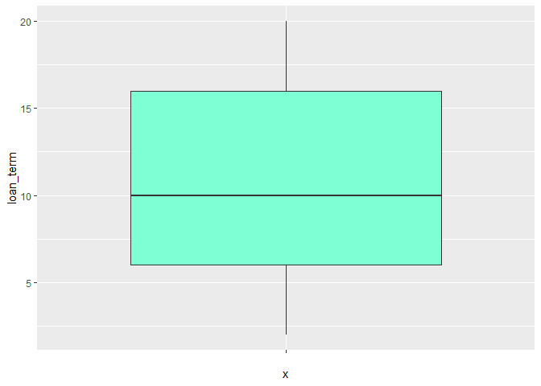<!-- -->

``` r
ggplot(data = data_loan_copy, mapping = aes(x = cibil_score))+
  geom_histogram(fill = "aquamarine", color = "black", bins = 30)
```

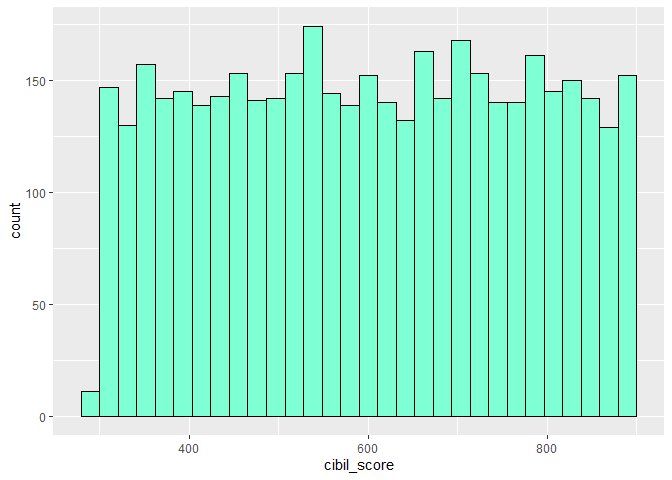<!-- -->

``` r
ggplot(data = data_loan_copy, mapping = aes(x = "", y = cibil_score))+
  geom_boxplot(fill = "aquamarine")
```

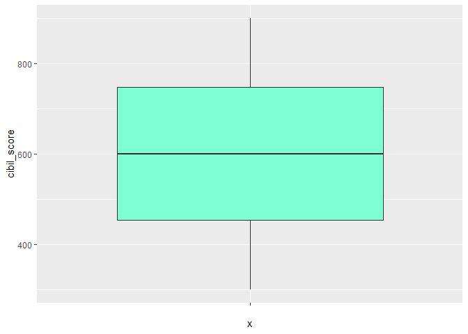<!-- -->

``` r
ggplot(data = data_loan_copy, mapping = aes(x = residential_assets_value))+
  geom_histogram(fill = "aquamarine", color = "black", bins = 30)
```

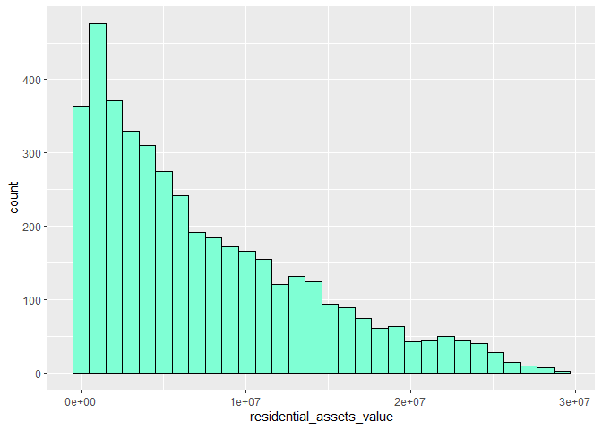<!-- -->

``` r
ggplot(data = data_loan_copy, mapping = aes(x = "", y = residential_assets_value))+
  geom_boxplot(fill = "aquamarine")
```

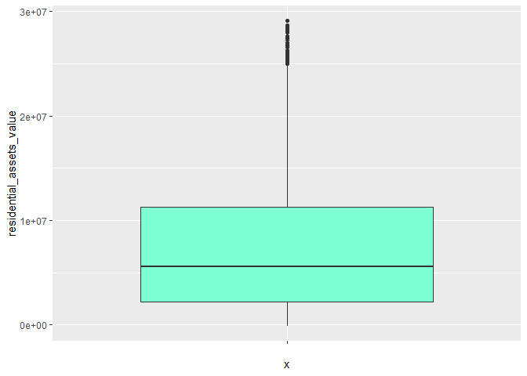<!-- -->

pada variable residential_assets_value terlihat adanya outlier di atas
whisker, dimana niai tersebut lebih tinggi jika dibandingkan dengan
nilai lainnya

``` r
ggplot(data = data_loan_copy, mapping = aes(x = commercial_assets_value))+
  geom_histogram(fill = "aquamarine", color = "black", bins = 30)
```

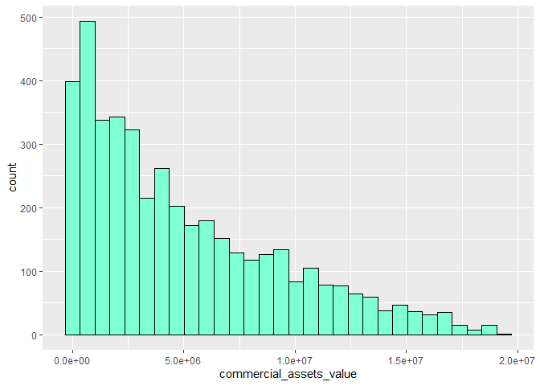<!-- -->

``` r
ggplot(data = data_loan_copy, mapping = aes(x = "", y = commercial_assets_value))+
  geom_boxplot(fill = "aquamarine")
```

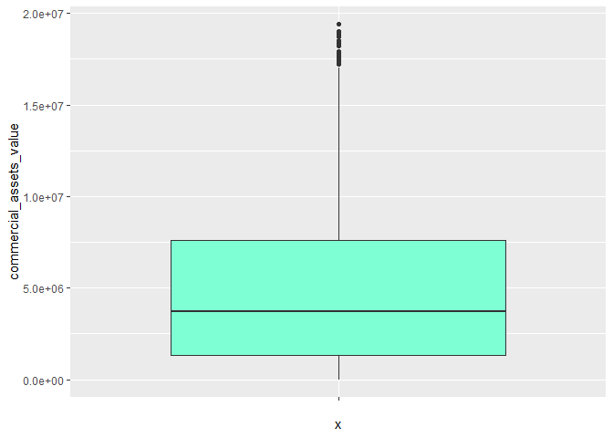<!-- -->

pada variable commercial_assets_value terlihat juga beberapa pencilan
outlier

``` r
ggplot(data = data_loan_copy, mapping = aes(x = luxury_assets_value))+
  geom_histogram(fill = "aquamarine", color = "black", bins = 30)
```

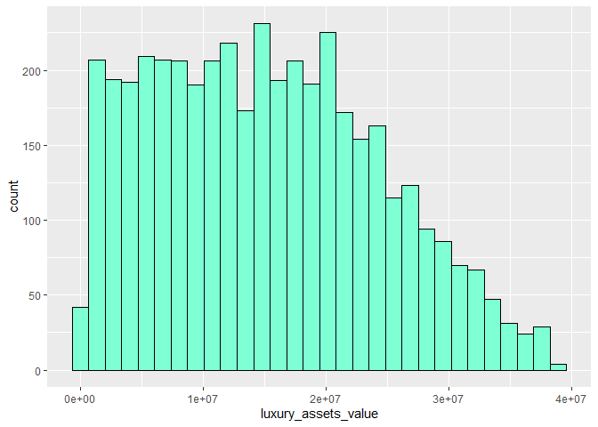<!-- -->

``` r
ggplot(data = data_loan_copy, mapping = aes(x = "", y = luxury_assets_value))+
  geom_boxplot(fill = "aquamarine")
```

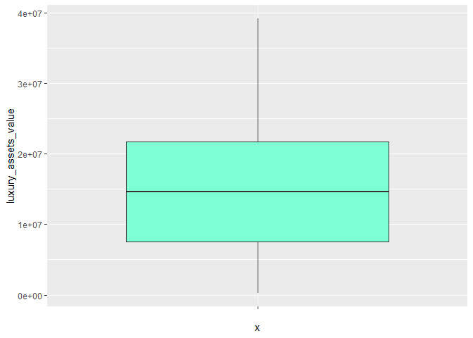<!-- -->

``` r
ggplot(data = data_loan_copy, mapping = aes(x = bank_asset_value))+
  geom_histogram(fill = "aquamarine", color = "black", bins = 30)
```

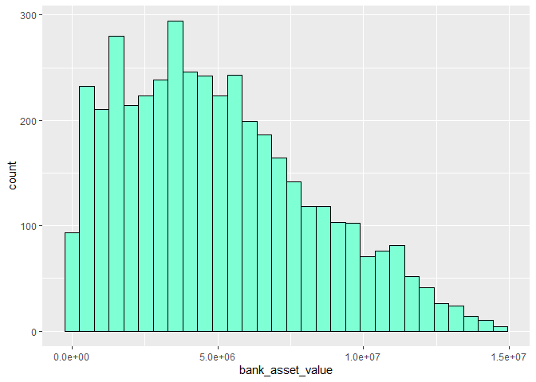<!-- -->

``` r
ggplot(data = data_loan_copy, mapping = aes(x = "", y = bank_asset_value))+
  geom_boxplot(fill = "aquamarine")
```

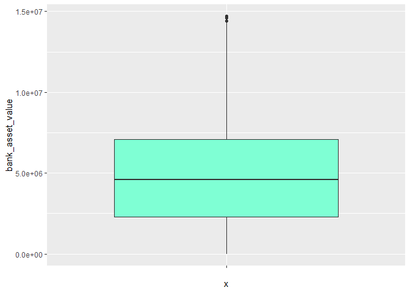<!-- -->

pada variable bank_asset_value terlihat beberapa outlier dengan nilai
yang sangat tinggi

``` r
ggplot(data = data_loan_copy, mapping = aes(x = loan_status, y = luxury_assets_value))+
  geom_boxplot(mapping = aes(fill = loan_status))
```

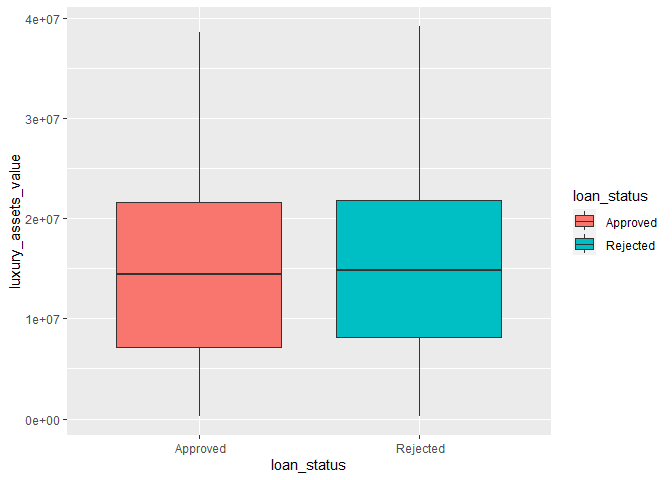<!-- -->

list variable yang terlihat memiliki outlier pada boxplot: -
bank_asset_value - commercial_assets_value - residential_assets_value

##### Residential assets value Outlier

``` r
boxplot.stats(data_loan_copy$residential_assets_value)$out
```

    ##  [1] 25500000 25900000 26800000 25500000 25600000 25400000 28300000 26300000
    ##  [9] 27600000 28700000 25300000 25800000 25500000 25300000 28200000 25200000
    ## [17] 25800000 25700000 25500000 27000000 28500000 26300000 28400000 27000000
    ## [25] 25900000 28500000 26600000 26200000 28000000 25800000 25500000 26900000
    ## [33] 25200000 27600000 25300000 26100000 29100000 25400000 28200000 25100000
    ## [41] 25600000 25400000 26100000 27500000 25000000 25500000 25400000 26200000
    ## [49] 25100000 27400000 27300000 26200000

``` r
out <- boxplot.stats(data_loan_copy$residential_assets_value)$out

out_ind <- which(data_loan_copy$residential_assets_value %in% c(out))
out_ind
```

    ##  [1]   83   99  124  229  263  694  715  782  893  906  920  925  954  957  988
    ## [16]  998 1003 1398 1420 1469 1592 1626 1966 1998 2186 2319 2385 2413 2587 2716
    ## [31] 2819 2829 2923 2928 2931 2941 3120 3158 3235 3311 3499 3632 3764 3783 3861
    ## [46] 3869 3873 3881 4028 4043 4075 4238

terlihat beberapa peminjam dengan nomor loan_id 83 merupakan outlier

``` r
filter(data_loan_copy, residential_assets_value %in% c(out)) %>% head()
```

    ##   loan_id no_of_dependents     education self_employed income_annum loan_amount
    ## 1      83                2  Not Graduate           Yes      9900000    21200000
    ## 2      99                4      Graduate            No      9400000    29400000
    ## 3     124                0  Not Graduate           Yes      9000000    18700000
    ## 4     229                1  Not Graduate           Yes      8700000    27000000
    ## 5     263                3      Graduate            No      9200000    34300000
    ## 6     694                0      Graduate            No      9200000    25400000
    ##   loan_term cibil_score residential_assets_value commercial_assets_value
    ## 1        16         363                 25500000                11400000
    ## 2        12         562                 25900000                15200000
    ## 3        18         865                 26800000                       0
    ## 4        10         717                 25500000                 8600000
    ## 5        18         523                 25600000                 4000000
    ## 6         2         783                 25400000                 2000000
    ##   luxury_assets_value bank_asset_value loan_status no_of_dependents_factor
    ## 1            26600000          6800000    Rejected            2 tanggungan
    ## 2            36400000          7100000    Approved            4 tanggungan
    ## 3            20900000         11300000    Approved            0 tanggungan
    ## 4            17500000          9100000    Approved            1 tanggungan
    ## 5            29100000          8800000    Rejected            3 tanggungan
    ## 6            19600000         12400000    Approved            0 tanggungan

terdapat `52` observasi residential assets value menurut
boxplot.assets()

##### Commercial assets value Outlier

``` r
boxplot.stats(data_loan_copy$commercial_assets_value)$out
```

    ##  [1] 17600000 18700000 17500000 19000000 17200000 18500000 18800000 17800000
    ##  [9] 18500000 17900000 18300000 17300000 17300000 18900000 18400000 18200000
    ## [17] 17300000 19000000 19400000 17800000 17500000 17900000 17400000 18500000
    ## [25] 17600000 19000000 17700000 18800000 18400000 17200000 18400000 17700000
    ## [33] 18500000 17600000 17600000 17900000 17600000

``` r
out1 <- boxplot.stats(data_loan_copy$commercial_assets_value)$out

out_ind1 <- which(data_loan_copy$commercial_assets_value %in% c(out1))
out_ind1
```

    ##  [1]    1  158  232  259  324  368  555  792  896  906 1030 1132 1195 1255 1273
    ## [16] 1305 1610 1762 1769 1813 2005 2303 2350 2915 2934 2941 2977 3001 3440 3542
    ## [31] 3791 3828 3883 3950 4011 4121 4206

``` r
filter(data_loan_copy, commercial_assets_value %in% c(out1)) %>% head()
```

    ##   loan_id no_of_dependents     education self_employed income_annum loan_amount
    ## 1       1                2      Graduate            No      9600000    29900000
    ## 2     158                5  Not Graduate           Yes      9900000    33300000
    ## 3     232                2      Graduate            No      9800000    32400000
    ## 4     259                0      Graduate            No      9800000    38800000
    ## 5     324                3  Not Graduate           Yes      9500000    24200000
    ## 6     368                1  Not Graduate           Yes      9400000    29800000
    ##   loan_term cibil_score residential_assets_value commercial_assets_value
    ## 1        12         778                  2400000                17600000
    ## 2         6         364                  5300000                18700000
    ## 3         2         543                 24200000                17500000
    ## 4         8         652                 23200000                19000000
    ## 5         8         879                  3100000                17200000
    ## 6        10         377                 24100000                18500000
    ##   luxury_assets_value bank_asset_value loan_status no_of_dependents_factor
    ## 1            22700000          8000000    Approved            2 tanggungan
    ## 2            27800000          8300000    Rejected            5 tanggungan
    ## 3            25700000          7700000    Approved            2 tanggungan
    ## 4            29700000          5400000    Approved            0 tanggungan
    ## 5            26400000         12700000    Approved            3 tanggungan
    ## 6            30900000         11700000    Rejected            1 tanggungan

terdapat `37` observasi pada commercial assets value

##### Bank asset value Outlier

``` r
boxplot.stats(data_loan_copy$bank_asset_value)$out
```

    ## [1] 14400000 14700000 14600000 14600000 14700000

``` r
out2 <- boxplot.stats(data_loan_copy$bank_asset_value)$out

out_ind2 <- which(data_loan_copy$bank_asset_value %in% c(out2))
out_ind2
```

    ## [1]  201 1273 1634 1675 1806

``` r
filter(data_loan_copy, bank_asset_value %in% c(out2))
```

    ##   loan_id no_of_dependents     education self_employed income_annum loan_amount
    ## 1     201                4  Not Graduate           Yes      9800000    21200000
    ## 2    1273                5  Not Graduate            No      9900000    35800000
    ## 3    1634                0      Graduate           Yes      9800000    23200000
    ## 4    1675                1  Not Graduate            No      9800000    21300000
    ## 5    1806                5  Not Graduate            No      9900000    33600000
    ##   loan_term cibil_score residential_assets_value commercial_assets_value
    ## 1        20         355                 22000000                 8900000
    ## 2        20         470                  9500000                18400000
    ## 3        10         573                 23900000                 3300000
    ## 4         2         356                 23000000                12300000
    ## 5        20         580                  7000000                10800000
    ##   luxury_assets_value bank_asset_value loan_status no_of_dependents_factor
    ## 1            31800000         14400000    Rejected            4 tanggungan
    ## 2            39100000         14700000    Rejected            5 tanggungan
    ## 3            23600000         14600000    Approved            0 tanggungan
    ## 4            25700000         14600000    Rejected            1 tanggungan
    ## 5            37400000         14700000    Approved            5 tanggungan

terdapat `5` observasi pada bank asset value

#### Identifikasi Outlier dengan Persentil

##### Residential assets value Outlier With persentil

``` r
lower_bound0 <- quantile(data_loan_copy$residential_assets_value, 0.025)
upper_bound0 <- quantile(data_loan_copy$residential_assets_value, 0.975)

print(paste("lower : ", lower_bound0))
```

    ## [1] "lower :  1e+05"

``` r
print(paste("upper : ", upper_bound0))
```

    ## [1] "upper :  23300000"

``` r
outlier_ind0 <- filter(data_loan_copy, residential_assets_value < lower_bound0 | residential_assets_value > upper_bound0)
outlier_ind0 %>% head()
```

    ##   loan_id no_of_dependents     education self_employed income_annum loan_amount
    ## 1      60                4  Not Graduate           Yes      5500000    18200000
    ## 2      61                2  Not Graduate            No      8500000    18900000
    ## 3      63                5  Not Graduate           Yes      8800000    28900000
    ## 4      83                2  Not Graduate           Yes      9900000    21200000
    ## 5      90                2  Not Graduate            No      9800000    37600000
    ## 6      99                4      Graduate            No      9400000    29400000
    ##   loan_term cibil_score residential_assets_value commercial_assets_value
    ## 1        16         797                  -100000                 4900000
    ## 2        18         478                 23800000                16300000
    ## 3         6         365                 24400000                 8600000
    ## 4        16         363                 25500000                11400000
    ## 5        10         641                 24100000                       0
    ## 6        12         562                 25900000                15200000
    ##   luxury_assets_value bank_asset_value loan_status no_of_dependents_factor
    ## 1            18600000          4800000    Approved            4 tanggungan
    ## 2            25900000         11400000    Rejected            2 tanggungan
    ## 3            27400000          4700000    Rejected            5 tanggungan
    ## 4            26600000          6800000    Rejected            2 tanggungan
    ## 5            23400000          7600000    Approved            2 tanggungan
    ## 6            36400000          7100000    Approved            4 tanggungan

berdasarkan data terdapat `178` observasi yang adalah outlier menurut
outlier pada variable pengamatan residential assets value ini lebih
banyak jika dibandingkan pada `boxplot.stats()` sebelumnya

##### Commercial assets value Outlier identification with persentil

``` r
lower_bound1 <- quantile(data_loan_copy$commercial_assets_value, 0.05)
upper_bound1 <- quantile(data_loan_copy$commercial_assets_value, 0.95)

print(paste("lower : ", lower_bound1))
```

    ## [1] "lower :  2e+05"

``` r
print(paste("upper : ", upper_bound1))
```

    ## [1] "upper :  13900000"

``` r
outlier_ind1 <- filter(data_loan_copy, commercial_assets_value < lower_bound1 | commercial_assets_value > upper_bound1)
outlier_ind1 %>% head()
```

    ##   loan_id no_of_dependents     education self_employed income_annum loan_amount
    ## 1       1                2      Graduate            No      9600000    29900000
    ## 2       7                5      Graduate            No      8700000    33000000
    ## 3      14                2      Graduate           Yes      9100000    31500000
    ## 4      17                2      Graduate           Yes       500000     1600000
    ## 5      19                2      Graduate            No      2700000    10300000
    ## 6      53                5  Not Graduate            No      3800000     7600000
    ##   loan_term cibil_score residential_assets_value commercial_assets_value
    ## 1        12         778                  2400000                17600000
    ## 2         4         678                 22500000                14800000
    ## 3        14         679                 10800000                16600000
    ## 4         4         663                  1300000                  100000
    ## 5        10         736                  1000000                       0
    ## 6         4         689                  8700000                  100000
    ##   luxury_assets_value bank_asset_value loan_status no_of_dependents_factor
    ## 1            22700000          8000000    Approved            2 tanggungan
    ## 2            29200000          4300000    Approved            5 tanggungan
    ## 3            20900000          5000000    Approved            2 tanggungan
    ## 4             1300000           700000    Approved            2 tanggungan
    ## 5             6200000          3300000    Approved            2 tanggungan
    ## 6             9300000          3400000    Approved            5 tanggungan

terdapat `418` outlier pada variabel commercial assets value lebih
banyak jumlahnya jika dibandingkan dengan menggunakan `boxplot.stats()`

##### Bank asset value Outlier Identification with persentil

``` r
lower_bound2 <- quantile(data_loan_copy$bank_asset_value, 0.01)
upper_bound2 <- quantile(data_loan_copy$bank_asset_value, 0.99)

print(paste("lower : ", lower_bound2))
```

    ## [1] "lower :  2e+05"

``` r
print(paste("upper : ", upper_bound2))
```

    ## [1] "upper :  13100000"

``` r
outlier_ind2 <- filter(data_loan_copy, bank_asset_value < lower_bound2 | bank_asset_value > upper_bound2)
outlier_ind2 %>% head()
```

    ##   loan_id no_of_dependents     education self_employed income_annum loan_amount
    ## 1     101                4  Not Graduate            No       400000      900000
    ## 2     111                0  Not Graduate            No       300000     1100000
    ## 3     126                3      Graduate            No       200000      600000
    ## 4     131                0  Not Graduate           Yes      9500000    20800000
    ## 5     140                0      Graduate            No       200000      700000
    ## 6     201                4  Not Graduate           Yes      9800000    21200000
    ##   loan_term cibil_score residential_assets_value commercial_assets_value
    ## 1        12         478                   700000                  100000
    ## 2         8         778                   800000                  200000
    ## 3        16         821                   400000                  100000
    ## 4        14         565                 15100000                11900000
    ## 5         8         501                   500000                  200000
    ## 6        20         355                 22000000                 8900000
    ##   luxury_assets_value bank_asset_value loan_status no_of_dependents_factor
    ## 1             1200000           100000    Rejected            4 tanggungan
    ## 2              900000           100000    Approved            0 tanggungan
    ## 3              500000           100000    Approved            3 tanggungan
    ## 4            33900000         13400000    Approved            0 tanggungan
    ## 5              700000           100000    Rejected            0 tanggungan
    ## 6            31800000         14400000    Rejected            4 tanggungan

terdapat `80` observasi outlier pada data, lebih banyak jika dari
sebelumnya yang hanya terdapat `5` outlier

#### Identifikasi Outlier dengan hampel filter

##### Residential assets value Outlier identification hampel filter

``` r
lower_bound3 <- median(data_loan_copy$residential_assets_value) - 3 * mad(data_loan_copy$residential_assets_value, constant = 1)
lower_bound3
```

    ## [1] -6700000

``` r
upper_bound3 <- median(data_loan_copy$residential_assets_value) + 3 * mad(data_loan_copy$residential_assets_value, constant = 1)
upper_bound3
```

    ## [1] 17900000

menurut metode hampel filter data diatas dan dibawah lower bound, upper
bound adalah outlier

``` r
outlier_ind3 <- filter(data_loan_copy, residential_assets_value < lower_bound3 | residential_assets_value > upper_bound3)
outlier_ind3 %>% head()
```

    ##   loan_id no_of_dependents     education self_employed income_annum loan_amount
    ## 1       4                3      Graduate            No      8200000    30700000
    ## 2       7                5      Graduate            No      8700000    33000000
    ## 3      30                3  Not Graduate           Yes      9000000    31500000
    ## 4      31                2  Not Graduate            No      9800000    25300000
    ## 5      42                2  Not Graduate            No      9100000    24900000
    ## 6      45                5      Graduate            No      6500000    13400000
    ##   loan_term cibil_score residential_assets_value commercial_assets_value
    ## 1         8         467                 18200000                 3300000
    ## 2         4         678                 22500000                14800000
    ## 3        10         850                 21800000                12400000
    ## 4        12         313                 20200000                 5200000
    ## 5        16         822                 22300000                12100000
    ## 6        18         787                 18200000                  300000
    ##   luxury_assets_value bank_asset_value loan_status no_of_dependents_factor
    ## 1            23300000          7900000    Rejected            3 tanggungan
    ## 2            29200000          4300000    Approved            5 tanggungan
    ## 3            33700000          8000000    Approved            3 tanggungan
    ## 4            25500000          9300000    Rejected            2 tanggungan
    ## 5            31000000          5200000    Approved            2 tanggungan
    ## 6            16200000          5400000    Approved            5 tanggungan

menurut hampel filter terdapat outlier upper bound sebanyak `384` baris
lebih banyak jika dibandingkan dengan kedua metode sebelumnya

##### Commercial assets value Outlier identification hampel filter

``` r
lower_bound4 <- median(data_loan_copy$commercial_assets_value) - 3 * mad(data_loan_copy$commercial_assets_value, constant = 1)
lower_bound4
```

    ## [1] -4700000

``` r
upper_bound4 <- median(data_loan_copy$commercial_assets_value) + 3 * mad(data_loan_copy$commercial_assets_value, constant = 1)
upper_bound4
```

    ## [1] 12100000

``` r
outlier_ind4 <- filter(data_loan_copy, commercial_assets_value < lower_bound4 | commercial_assets_value > upper_bound4)
outlier_ind4 %>% head()
```

    ##   loan_id no_of_dependents     education self_employed income_annum loan_amount
    ## 1       1                2      Graduate            No      9600000    29900000
    ## 2       7                5      Graduate            No      8700000    33000000
    ## 3      14                2      Graduate           Yes      9100000    31500000
    ## 4      30                3  Not Graduate           Yes      9000000    31500000
    ## 5      54                1  Not Graduate           Yes      8400000    23000000
    ## 6      61                2  Not Graduate            No      8500000    18900000
    ##   loan_term cibil_score residential_assets_value commercial_assets_value
    ## 1        12         778                  2400000                17600000
    ## 2         4         678                 22500000                14800000
    ## 3        14         679                 10800000                16600000
    ## 4        10         850                 21800000                12400000
    ## 5        12         657                 15400000                14800000
    ## 6        18         478                 23800000                16300000
    ##   luxury_assets_value bank_asset_value loan_status no_of_dependents_factor
    ## 1            22700000          8000000    Approved            2 tanggungan
    ## 2            29200000          4300000    Approved            5 tanggungan
    ## 3            20900000          5000000    Approved            2 tanggungan
    ## 4            33700000          8000000    Approved            3 tanggungan
    ## 5            31900000          8200000    Approved            1 tanggungan
    ## 6            25900000         11400000    Rejected            2 tanggungan

terdapat `374` observasi outlier pada variable commercial assets value
dengan metode hampel filter

##### Bank asset value Outlier identification hampel filter

``` r
lower_bound5 <- median(data_loan_copy$bank_asset_value) - 3 * mad(data_loan_copy$bank_asset_value, constant = 1)
lower_bound5
```

    ## [1] -2600000

``` r
upper_bound5 <- median(data_loan_copy$bank_asset_value) + 3 * mad(data_loan_copy$bank_asset_value, constant = 1)
upper_bound5
```

    ## [1] 11800000

``` r
outlier_ind5 <- filter(data_loan_copy, bank_asset_value < lower_bound5 | bank_asset_value > upper_bound5)
outlier_ind5 %>% head()
```

    ##   loan_id no_of_dependents     education self_employed income_annum loan_amount
    ## 1       3                3      Graduate            No      9100000    29700000
    ## 2      67                3  Not Graduate            No      8300000    29100000
    ## 3      92                4      Graduate            No      8800000    20700000
    ## 4     131                0  Not Graduate           Yes      9500000    20800000
    ## 5     201                4  Not Graduate           Yes      9800000    21200000
    ## 6     207                2      Graduate            No      9800000    20900000
    ##   loan_term cibil_score residential_assets_value commercial_assets_value
    ## 1        20         506                  7100000                 4500000
    ## 2        10         715                  6100000                11900000
    ## 3        18         540                 19200000                 3200000
    ## 4        14         565                 15100000                11900000
    ## 5        20         355                 22000000                 8900000
    ## 6        12         768                  3400000                10200000
    ##   luxury_assets_value bank_asset_value loan_status no_of_dependents_factor
    ## 1            33300000         12800000    Rejected            3 tanggungan
    ## 2            24100000         11900000    Approved            3 tanggungan
    ## 3            22400000         12700000    Rejected            4 tanggungan
    ## 4            33900000         13400000    Approved            0 tanggungan
    ## 5            31800000         14400000    Rejected            4 tanggungan
    ## 6            38600000         13400000    Approved            2 tanggungan

terdapat `133` baris outlier ketika menggunakan hampel filter

#### Menghapus Outlier

``` r
loan_no_outlier <- data_loan
dim(loan_no_outlier)
```

    ## [1] 4269   13

``` r
loan_no_outlier <- filter(loan_no_outlier, !(residential_assets_value < lower_bound3 | residential_assets_value > upper_bound3))

dim(loan_no_outlier)
```

    ## [1] 3885   13

``` r
loan_no_outlier <- filter(loan_no_outlier, !(commercial_assets_value < lower_bound4 | commercial_assets_value > upper_bound4))

dim(loan_no_outlier)
```

    ## [1] 3616   13

``` r
loan_no_outlier <- filter(loan_no_outlier, !(bank_asset_value < lower_bound5 | bank_asset_value > upper_bound5))
dim(loan_no_outlier)
```

    ## [1] 3558   13

``` r
ggplot(data = loan_no_outlier, mapping = aes(x = "", y = residential_assets_value))+
  geom_boxplot(fill = "aquamarine")
```

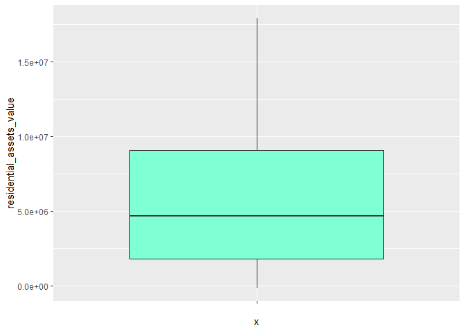<!-- -->

``` r
ggplot(data = loan_no_outlier, mapping = aes(x = "", y = commercial_assets_value))+
  geom_boxplot(fill = "aquamarine")
```

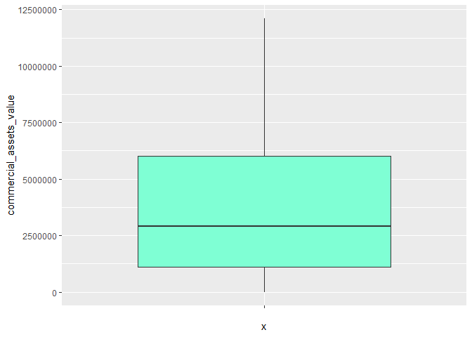<!-- -->

``` r
ggplot(data = loan_no_outlier, mapping = aes(x = "", y = bank_asset_value))+
  geom_boxplot(fill = "aquamarine")
```

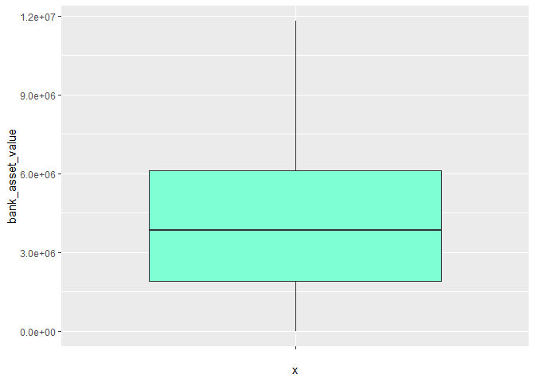<!-- -->

berikut
[**dataset**](https://github.com/muhammadrendysa/dataset_tanpa_outlier/blob/main/loan_approval_noOutlier.xlsx)
loan approval tanpa Outlier
