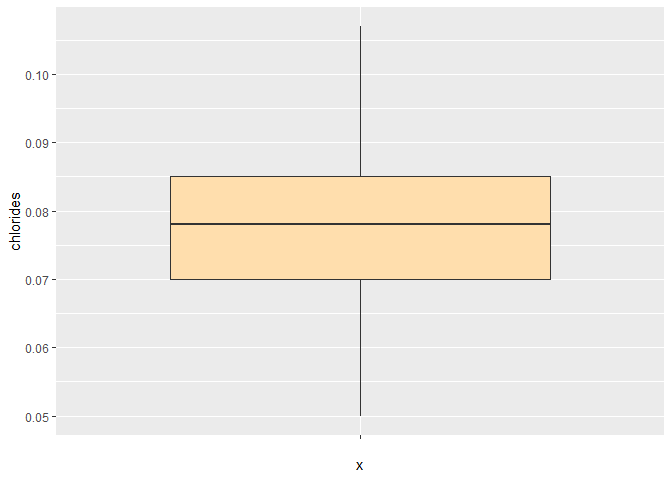

## Identifikasi Outlier pada dataset winequality red

### Tentang Dataset

Dataset “winequality-red” adalah kumpulan data yang berisi informasi
tentang berbagai atribut kimia dan parameter kualitas dari sampel anggur
merah. Dataset ini telah dikumpulkan dan disusun untuk mendukung
analisis dan pemahaman lebih lanjut tentang kualitas anggur merah
berdasarkan karakteristik kimianya. Setiap baris dalam dataset mewakili
satu sampel anggur merah, sedangkan kolom-kolomnya mencakup berbagai
variabel seperti tingkat keasaman tetap, tingkat keasaman yang terlarut,
kadar alkohol, pH, kadar sulfur dioksida, dan lain-lain. Dataset ini
berfungsi sebagai alat penting bagi para peneliti, ilmuwan data, dan
ahli industri anggur untuk mengidentifikasi pola dan tren yang berkaitan
dengan kualitas anggur merah. Dengan menggunakan teknik analisis data
dan kecerdasan buatan, dataset “winequality-red” dapat memberikan
wawasan berharga untuk mengoptimalkan proses produksi anggur,
meningkatkan kualitas produk, dan memberikan pengalaman anggur yang
lebih memuaskan bagi para konsumen.

> Variable dalam dataset :
>
> - fixed acidity : tingkat keasaman tetap dari sampel anggur merah
>
> - volatile acidity : tingkat keasaman volatile(ukuran kandungan asam
>   yang mudah menguap dalam anggur) dari sampel anggur merah
>
> - citric acid : tingkat asam nitrat(salah satu jenis asam organik yang
>   terdapat secara alami dalam buah-buahan, termasuk jeruk dan lemon)
>   dalam sampel anggur merah
>
> - residual sugar : jumlah gula yang tersisa dalam sampel anggur merah
>   setelah proses fermentasi selesai
>
> - chlorides : tingkat klorida(bentuk garam dari unsur klorin dan hadir
>   dalam anggur sebagai salah satu komponen kimia.) dalam sampel anggur
>   merah
>
> - free sulfur dioxide : tingkat sulfur dioksida (senyawa kimia yang
>   sering digunakan sebagai pengawet dan antioksidan dalam industri
>   anggur untuk melindungi anggur dari oksidasi dan pertumbuhan
>   mikroorganisme yang tidak diinginkan.) bebas dalam sampel anggur
>   merah
>
> - total sulfur dioxide : jumlah total sulfur dioksoda dalam sampel
>   anggur merah
>
> - density : densitas(ukuran massa per unit volume, dan dalam konteks
>   anggur, densitas sering diukur dalam satuan g/cm³ (gram per
>   sentimeter kubik) atau kg/L (kilogram per liter).) dalam sampel
>   anggur merah
>
> - pH : tingkat keasaman hidrogen(pH) dari sampel anggur merah. pH
>   adalah ukuran yang digunakan untuk mengukur tingkat keasaman atau
>   kebasaan suatu larutan
>
> - sulphates : tingkat sulfat(senyawa kimia yang mengandung atom sulfur
>   dan oksigen, dan dalam anggur, sulfat sering digunakan sebagai bahan
>   tambahan untuk berbagai tujuan.) dalam sampel anggur
>
> - alcohol : tingkat kandungan alkohol (alcohol by volume atau ABV)
>   dalam sampel anggur merah. Kandungan alkohol dalam anggur merah
>   adalah hasil dari proses fermentasi, di mana gula dalam anggur
>   diubah menjadi alkohol dan karbon dioksida oleh ragi yang terlibat
>   dalam fermentasi.

#### Import Data

``` r
library(tidyverse)
```
``` r
wine_data <- read.csv("C:/winequality-red.csv")
dim(wine_data)
```

    ## [1] 1599   12

``` r
str(wine_data)
```

    ## 'data.frame':    1599 obs. of  12 variables:
    ##  $ fixed.acidity       : num  7.4 7.8 7.8 11.2 7.4 7.4 7.9 7.3 7.8 7.5 ...
    ##  $ volatile.acidity    : num  0.7 0.88 0.76 0.28 0.7 0.66 0.6 0.65 0.58 0.5 ...
    ##  $ citric.acid         : num  0 0 0.04 0.56 0 0 0.06 0 0.02 0.36 ...
    ##  $ residual.sugar      : num  1.9 2.6 2.3 1.9 1.9 1.8 1.6 1.2 2 6.1 ...
    ##  $ chlorides           : num  0.076 0.098 0.092 0.075 0.076 0.075 0.069 0.065 0.073 0.071 ...
    ##  $ free.sulfur.dioxide : num  11 25 15 17 11 13 15 15 9 17 ...
    ##  $ total.sulfur.dioxide: num  34 67 54 60 34 40 59 21 18 102 ...
    ##  $ density             : num  0.998 0.997 0.997 0.998 0.998 ...
    ##  $ pH                  : num  3.51 3.2 3.26 3.16 3.51 3.51 3.3 3.39 3.36 3.35 ...
    ##  $ sulphates           : num  0.56 0.68 0.65 0.58 0.56 0.56 0.46 0.47 0.57 0.8 ...
    ##  $ alcohol             : num  9.4 9.8 9.8 9.8 9.4 9.4 9.4 10 9.5 10.5 ...
    ##  $ quality             : int  5 5 5 6 5 5 5 7 7 5 ...

#### Identifikasi Outlier dengan Histogram dan Boxplot

``` r
wine_data_copy <- wine_data
```

``` r
ggplot(data = wine_data_copy, mapping = aes(x = "", y = fixed.acidity))+
  geom_boxplot(fill = "navajowhite")
```

<!-- -->

``` r
ggplot(data = wine_data_copy, mapping = aes(x = fixed.acidity))+
  geom_histogram(fill = "navajowhite", color = "black", bins = 30)
```

<!-- -->

terlihat beberapa outlier pada variable fixed acidity

``` r
ggplot(data = wine_data_copy, mapping = aes(x = "", y = volatile.acidity))+
  geom_boxplot(fill = "mistyrose")
```

<!-- -->

``` r
ggplot(data = wine_data_copy, mapping = aes(x = volatile.acidity))+
  geom_histogram(fill = "mistyrose", color = "black", bins = 30)
```

<!-- -->

terdapat beberapa outlier dalam variable volatile.acidity

``` r
ggplot(data = wine_data_copy, mapping = aes(x = "", y = citric.acid))+
  geom_boxplot(fill = "aquamarine")
```

<!-- -->

``` r
ggplot(data = wine_data_copy, mapping = aes(x = citric.acid))+
  geom_histogram(fill = "aquamarine", color = "black", bins = 30)
```

<!-- -->

terlihat satu pencilan dengan nilai tinggi dalam variable citric.acid

``` r
ggplot(data = wine_data_copy, mapping = aes(x = "", y = residual.sugar))+
  geom_boxplot(fill = "navajowhite")
```

<!-- -->

``` r
ggplot(data = wine_data_copy, mapping = aes(x = residual.sugar))+
  geom_histogram(fill = "navajowhite", color = "black", bins =  30)
```

<!-- -->

terlihat banyaknya pencilan dalam variabel residual.sugar dan kecilnya
nilai Interkuartil menandakan kecilnya variabilitas

``` r
ggplot(data = wine_data_copy, mapping = aes(x = "", y = chlorides))+
  geom_boxplot(fill = "mistyrose")
```

<!-- -->

``` r
ggplot(data = wine_data_copy, mapping = aes(x = chlorides))+
  geom_histogram(fill = "mistyrose", color = "black", bins = 30)
```

<!-- -->

terlihat banyaknya outlier dengan nilai yang extrem pada variable
chlorides

``` r
ggplot(data = wine_data_copy, mapping = aes(x = "", y = free.sulfur.dioxide))+
  geom_boxplot(fill = "aquamarine")
```

<!-- -->

``` r
ggplot(data = wine_data_copy, mapping = aes(x = free.sulfur.dioxide))+
  geom_histogram(fill = "aquamarine", color = "black", bins = 30)
```

<!-- -->

terlihat banyaknya outlier extrem pada variable free sulfur dioxide

``` r
ggplot(data = wine_data_copy, mapping = aes(x = "", y = total.sulfur.dioxide))+
  geom_boxplot(fill = "navajowhite")
```

<!-- -->

``` r
ggplot(data = wine_data_copy, mapping = aes(x = total.sulfur.dioxide))+
  geom_histogram(fill = "navajowhite", color = "black", bins = 30)
```

<!-- -->

``` r
ggplot(data = wine_data_copy, mapping = aes(x = "", y = density))+
  geom_boxplot(fill = "mistyrose")
```

<!-- -->

``` r
ggplot(data = wine_data_copy, mapping = aes(x = density))+
  geom_histogram(fill = "mistyrose", color =  "black", bins = 30)
```

<!-- -->

``` r
ggplot(data = wine_data_copy, mapping = aes(x = "", y = pH))+
  geom_boxplot(fill = "aquamarine")
```

<!-- -->

``` r
ggplot(data = wine_data_copy, mapping = aes(x = pH))+
  geom_histogram(fill = "aquamarine", color = "black", bins = 30)
```

<!-- -->

``` r
ggplot(data = wine_data_copy, mapping = aes(x = "", y = sulphates))+
  geom_boxplot(fill = "navajowhite")
```

<!-- -->

``` r
ggplot(data = wine_data_copy, mapping = aes(x = sulphates))+
  geom_histogram(fill = "navajowhite", color = "black", bins = 30)
```

<!-- -->

``` r
ggplot(data = wine_data_copy, mapping = aes(x = "", y = alcohol))+
  geom_boxplot(fill = "mistyrose")
```

<!-- -->

``` r
ggplot(data = wine_data_copy, mapping = aes(x = alcohol))+
  geom_histogram(fill = "mistyrose", color = "black", bins = 30)
```

<!-- -->

semua variable kecuali quality dalam dataset cenderung memiliki outlier

``` r
out0 <- boxplot.stats(wine_data_copy$fixed.acidity)$out

outlier_ind0 <- filter(wine_data_copy, fixed.acidity %in% c(out0))
outlier_ind0 %>% head()
```

    ##   fixed.acidity volatile.acidity citric.acid residual.sugar chlorides
    ## 1          12.8             0.30        0.74            2.6     0.095
    ## 2          12.8             0.30        0.74            2.6     0.095
    ## 3          15.0             0.21        0.44            2.2     0.075
    ## 4          15.0             0.21        0.44            2.2     0.075
    ## 5          12.5             0.56        0.49            2.4     0.064
    ## 6          13.3             0.34        0.52            3.2     0.094
    ##   free.sulfur.dioxide total.sulfur.dioxide density   pH sulphates alcohol
    ## 1                   9                   28 0.99940 3.20      0.77    10.8
    ## 2                   9                   28 0.99940 3.20      0.77    10.8
    ## 3                  10                   24 1.00005 3.07      0.84     9.2
    ## 4                  10                   24 1.00005 3.07      0.84     9.2
    ## 5                   5                   27 0.99990 3.08      0.87    10.9
    ## 6                  17                   53 1.00140 3.05      0.81     9.5
    ##   quality
    ## 1       7
    ## 2       7
    ## 3       7
    ## 4       7
    ## 5       5
    ## 6       6

terdapat `49` observasi outlier dalam variabel fixed acidity

``` r
out1 <- boxplot.stats(wine_data_copy$volatile.acidity)$out

outlier_ind1 <- filter(wine_data_copy, volatile.acidity %in% c(out1))
outlier_ind1 %>% head()
```

    ##   fixed.acidity volatile.acidity citric.acid residual.sugar chlorides
    ## 1           5.7             1.13        0.09            1.5     0.172
    ## 2           5.0             1.02        0.04            1.4     0.045
    ## 3           7.3             1.07        0.09            1.7     0.178
    ## 4           8.2             1.33        0.00            1.7     0.081
    ## 5           8.1             1.33        0.00            1.8     0.082
    ## 6           7.9             1.04        0.05            2.2     0.084
    ##   free.sulfur.dioxide total.sulfur.dioxide density   pH sulphates alcohol
    ## 1                   7                   19  0.9940 3.50      0.48     9.8
    ## 2                  41                   85  0.9938 3.75      0.48    10.5
    ## 3                  10                   89  0.9962 3.30      0.57     9.0
    ## 4                   3                   12  0.9964 3.53      0.49    10.9
    ## 5                   3                   12  0.9964 3.54      0.48    10.9
    ## 6                  13                   29  0.9959 3.22      0.55     9.9
    ##   quality
    ## 1       4
    ## 2       4
    ## 3       5
    ## 4       5
    ## 5       5
    ## 6       6

terdapat `19` baris outlier pada variabel volatile acidity

``` r
out2 <- boxplot.stats(wine_data_copy$citric.acid)$out

outlier_ind2 <- filter(wine_data_copy, citric.acid %in% c(out2))
outlier_ind2
```

    ##   fixed.acidity volatile.acidity citric.acid residual.sugar chlorides
    ## 1           9.2             0.52           1            3.4      0.61
    ##   free.sulfur.dioxide total.sulfur.dioxide density   pH sulphates alcohol
    ## 1                  32                   69  0.9996 2.74         2     9.4
    ##   quality
    ## 1       4

hanya terdapat `1` outlier dalam variabel citric acid

``` r
out3 <- boxplot.stats(wine_data_copy$residual.sugar)$out

outlier_ind3 <- filter(wine_data_copy, residual.sugar %in% c(out3))
outlier_ind3 %>% head()
```

    ##   fixed.acidity volatile.acidity citric.acid residual.sugar chlorides
    ## 1           7.5            0.500        0.36            6.1     0.071
    ## 2           7.5            0.500        0.36            6.1     0.071
    ## 3           8.9            0.620        0.18            3.8     0.176
    ## 4           8.9            0.620        0.19            3.9     0.170
    ## 5           7.4            0.590        0.08            4.4     0.086
    ## 6           6.9            0.605        0.12           10.7     0.073
    ##   free.sulfur.dioxide total.sulfur.dioxide density   pH sulphates alcohol
    ## 1                  17                  102  0.9978 3.35      0.80    10.5
    ## 2                  17                  102  0.9978 3.35      0.80    10.5
    ## 3                  52                  145  0.9986 3.16      0.88     9.2
    ## 4                  51                  148  0.9986 3.17      0.93     9.2
    ## 5                   6                   29  0.9974 3.38      0.50     9.0
    ## 6                  40                   83  0.9993 3.45      0.52     9.4
    ##   quality
    ## 1       5
    ## 2       5
    ## 3       5
    ## 4       5
    ## 5       4
    ## 6       6

terdapat `155` observasi outlier dalam variabel residual sugar sesuai
dengan grafik sebelumnya

``` r
out4 <- boxplot.stats(wine_data_copy$chlorides)$out

outlier_ind4 <- filter(wine_data_copy, chlorides %in% c(out4))
outlier_ind4 %>% head()
```

    ##   fixed.acidity volatile.acidity citric.acid residual.sugar chlorides
    ## 1           8.9             0.62        0.18            3.8     0.176
    ## 2           8.9             0.62        0.19            3.9     0.170
    ## 3           8.1             0.56        0.28            1.7     0.368
    ## 4           7.9             0.32        0.51            1.8     0.341
    ## 5           5.7             1.13        0.09            1.5     0.172
    ## 6           7.5             0.49        0.20            2.6     0.332
    ##   free.sulfur.dioxide total.sulfur.dioxide density   pH sulphates alcohol
    ## 1                  52                  145  0.9986 3.16      0.88     9.2
    ## 2                  51                  148  0.9986 3.17      0.93     9.2
    ## 3                  16                   56  0.9968 3.11      1.28     9.3
    ## 4                  17                   56  0.9969 3.04      1.08     9.2
    ## 5                   7                   19  0.9940 3.50      0.48     9.8
    ## 6                   8                   14  0.9968 3.21      0.90    10.5
    ##   quality
    ## 1       5
    ## 2       5
    ## 3       5
    ## 4       6
    ## 5       4
    ## 6       6

terdapat `112` outlier dalam variabel chlorides

``` r
out5 <- boxplot.stats(wine_data_copy$free.sulfur.dioxide)$out

outlier_ind5 <- filter(wine_data_copy, free.sulfur.dioxide %in% c(out5))
outlier_ind5 %>% head()
```

    ##   fixed.acidity volatile.acidity citric.acid residual.sugar chlorides
    ## 1           8.9            0.620        0.18            3.8     0.176
    ## 2           8.9            0.620        0.19            3.9     0.170
    ## 3           7.5            0.630        0.12            5.1     0.111
    ## 4           6.6            0.735        0.02            7.9     0.122
    ## 5           6.6            0.735        0.02            7.9     0.122
    ## 6           7.2            0.340        0.32            2.5     0.090
    ##   free.sulfur.dioxide total.sulfur.dioxide density   pH sulphates alcohol
    ## 1                  52                  145  0.9986 3.16      0.88     9.2
    ## 2                  51                  148  0.9986 3.17      0.93     9.2
    ## 3                  50                  110  0.9983 3.26      0.77     9.4
    ## 4                  68                  124  0.9994 3.47      0.53     9.9
    ## 5                  68                  124  0.9994 3.47      0.53     9.9
    ## 6                  43                  113  0.9966 3.32      0.79    11.1
    ##   quality
    ## 1       5
    ## 2       5
    ## 3       5
    ## 4       5
    ## 5       5
    ## 6       5

terdapat `30` observasi outlier dalam variabel free sulfur dioxide

``` r
out6 <- boxplot.stats(wine_data_copy$total.sulfur.dioxide)$out

outlier_ind6 <- filter(wine_data_copy, total.sulfur.dioxide %in% c(out6))
outlier_ind6 %>% head()
```

    ##   fixed.acidity volatile.acidity citric.acid residual.sugar chlorides
    ## 1           8.9             0.62        0.18            3.8     0.176
    ## 2           8.9             0.62        0.19            3.9     0.170
    ## 3           8.6             0.49        0.28            1.9     0.110
    ## 4           9.3             0.39        0.44            2.1     0.107
    ## 5           7.9             0.52        0.26            1.9     0.079
    ## 6           8.6             0.49        0.28            1.9     0.110
    ##   free.sulfur.dioxide total.sulfur.dioxide density   pH sulphates alcohol
    ## 1                  52                  145  0.9986 3.16      0.88     9.2
    ## 2                  51                  148  0.9986 3.17      0.93     9.2
    ## 3                  20                  136  0.9972 2.93      1.95     9.9
    ## 4                  34                  125  0.9978 3.14      1.22     9.5
    ## 5                  42                  140  0.9964 3.23      0.54     9.5
    ## 6                  20                  136  0.9972 2.93      1.95     9.9
    ##   quality
    ## 1       5
    ## 2       5
    ## 3       6
    ## 4       5
    ## 5       5
    ## 6       6

terdapat `55` observasi quartile dalam variabel total sulfur dioxide

``` r
out7 <- boxplot.stats(wine_data_copy$density)$out

outlier_ind7 <- filter(wine_data_copy, density %in% c(out7))
outlier_ind7 %>% head()
```

    ##   fixed.acidity volatile.acidity citric.acid residual.sugar chlorides
    ## 1           5.2             0.34        0.00            1.8     0.050
    ## 2           5.2             0.34        0.00            1.8     0.050
    ## 3          13.3             0.34        0.52            3.2     0.094
    ## 4          10.0             0.49        0.20           11.0     0.071
    ## 5          10.0             0.49        0.20           11.0     0.071
    ## 6          13.5             0.53        0.79            4.8     0.120
    ##   free.sulfur.dioxide total.sulfur.dioxide density   pH sulphates alcohol
    ## 1                  27                   63  0.9916 3.68      0.79    14.0
    ## 2                  27                   63  0.9916 3.68      0.79    14.0
    ## 3                  17                   53  1.0014 3.05      0.81     9.5
    ## 4                  13                   50  1.0015 3.16      0.69     9.2
    ## 5                  13                   50  1.0015 3.16      0.69     9.2
    ## 6                  23                   77  1.0018 3.18      0.77    13.0
    ##   quality
    ## 1       6
    ## 2       6
    ## 3       6
    ## 4       6
    ## 5       6
    ## 6       5

terdapat `45` baris outlier pada variabel density

``` r
out8 <- boxplot.stats(wine_data_copy$pH)$out

outlier_ind8 <- filter(wine_data_copy, pH %in% c(out8))
outlier_ind8 %>% head()
```

    ##   fixed.acidity volatile.acidity citric.acid residual.sugar chlorides
    ## 1           4.6             0.52        0.15            2.1     0.054
    ## 2           5.0             1.02        0.04            1.4     0.045
    ## 3           4.7             0.60        0.17            2.3     0.058
    ## 4           9.2             0.52        1.00            3.4     0.610
    ## 5           6.9             0.54        0.04            3.0     0.077
    ## 6           6.9             0.54        0.04            3.0     0.077
    ##   free.sulfur.dioxide total.sulfur.dioxide density   pH sulphates alcohol
    ## 1                   8                   65  0.9934 3.90      0.56    13.1
    ## 2                  41                   85  0.9938 3.75      0.48    10.5
    ## 3                  17                  106  0.9932 3.85      0.60    12.9
    ## 4                  32                   69  0.9996 2.74      2.00     9.4
    ## 5                   7                   27  0.9987 3.69      0.91     9.4
    ## 6                   7                   27  0.9987 3.69      0.91     9.4
    ##   quality
    ## 1       4
    ## 2       4
    ## 3       6
    ## 4       4
    ## 5       6
    ## 6       6

terdapat `35` baris outlier dalam variabel pH

``` r
out9 <- boxplot.stats(wine_data_copy$sulphates)$out

outlier_ind9 <- filter(wine_data_copy, sulphates %in% c(out9))
outlier_ind9 %>% head()
```

    ##   fixed.acidity volatile.acidity citric.acid residual.sugar chlorides
    ## 1           7.8            0.610        0.29            1.6     0.114
    ## 2           8.1            0.560        0.28            1.7     0.368
    ## 3           7.9            0.320        0.51            1.8     0.341
    ## 4           8.1            0.660        0.22            2.2     0.069
    ## 5           8.3            0.625        0.20            1.5     0.080
    ## 6           7.8            0.430        0.70            1.9     0.464
    ##   free.sulfur.dioxide total.sulfur.dioxide density   pH sulphates alcohol
    ## 1                   9                   29  0.9974 3.26      1.56     9.1
    ## 2                  16                   56  0.9968 3.11      1.28     9.3
    ## 3                  17                   56  0.9969 3.04      1.08     9.2
    ## 4                   9                   23  0.9968 3.30      1.20    10.3
    ## 5                  27                  119  0.9972 3.16      1.12     9.1
    ## 6                  22                   67  0.9974 3.13      1.28     9.4
    ##   quality
    ## 1       5
    ## 2       5
    ## 3       6
    ## 4       5
    ## 5       4
    ## 6       5

terdapat `59` outlier dalam variabel sulphates

``` r
out10 <- boxplot.stats(wine_data_copy$alcohol)$out

outlier_ind10 <- filter(wine_data_copy, alcohol %in% c(out10))
outlier_ind10 %>% head
```

    ##   fixed.acidity volatile.acidity citric.acid residual.sugar chlorides
    ## 1           5.2             0.34        0.00            1.8     0.050
    ## 2           5.2             0.34        0.00            1.8     0.050
    ## 3           8.8             0.46        0.45            2.6     0.065
    ## 4           5.0             0.42        0.24            2.0     0.060
    ## 5          15.9             0.36        0.65            7.5     0.096
    ## 6           4.9             0.42        0.00            2.1     0.048
    ##   free.sulfur.dioxide total.sulfur.dioxide density   pH sulphates alcohol
    ## 1                  27                   63 0.99160 3.68      0.79    14.0
    ## 2                  27                   63 0.99160 3.68      0.79    14.0
    ## 3                   7                   18 0.99470 3.32      0.79    14.0
    ## 4                  19                   50 0.99170 3.72      0.74    14.0
    ## 5                  22                   71 0.99760 2.98      0.84    14.9
    ## 6                  16                   42 0.99154 3.71      0.74    14.0
    ##   quality
    ## 1       6
    ## 2       6
    ## 3       6
    ## 4       8
    ## 5       5
    ## 6       7

terdapat `13` baris outlier pada variabel alcohol, selanjutnya saya akan
medeteksi keberadaan outlier dengan persentil

#### Identifikasi Outlier dengan Persentil

``` r
lower_bound0 <- quantile(wine_data_copy$fixed.acidity, 0.01)
upper_bound0 <- quantile(wine_data_copy$fixed.acidity, 0.99)

print(paste("lower : ", lower_bound0))
```

    ## [1] "lower :  5.2"

``` r
print(paste("upper : ", upper_bound0))
```

    ## [1] "upper :  13.3"

``` r
outlier_pst0 <- filter(wine_data_copy, fixed.acidity < lower_bound0 | fixed.acidity > upper_bound0)
outlier_pst0 %>% head()
```

    ##   fixed.acidity volatile.acidity citric.acid residual.sugar chlorides
    ## 1           4.6             0.52        0.15            2.1     0.054
    ## 2           5.0             1.02        0.04            1.4     0.045
    ## 3           4.7             0.60        0.17            2.3     0.058
    ## 4          15.0             0.21        0.44            2.2     0.075
    ## 5          15.0             0.21        0.44            2.2     0.075
    ## 6          13.4             0.27        0.62            2.6     0.082
    ##   free.sulfur.dioxide total.sulfur.dioxide density   pH sulphates alcohol
    ## 1                   8                   65 0.99340 3.90      0.56    13.1
    ## 2                  41                   85 0.99380 3.75      0.48    10.5
    ## 3                  17                  106 0.99320 3.85      0.60    12.9
    ## 4                  10                   24 1.00005 3.07      0.84     9.2
    ## 5                  10                   24 1.00005 3.07      0.84     9.2
    ## 6                   6                   21 1.00020 3.16      0.67     9.7
    ##   quality
    ## 1       4
    ## 2       4
    ## 3       6
    ## 4       7
    ## 5       7
    ## 6       6

terdapat `27` outlier pada variabel ficed acidity jika menggunakan
metode persentil

``` r
lower_bound1 <- quantile(wine_data_copy$volatile.acidity, 0.01)
upper_bound1 <- quantile(wine_data_copy$volatile.acidity, 0.99)

print(paste("lower : ", lower_bound1))
```

    ## [1] "lower :  0.19"

``` r
print(paste("upper : ", upper_bound1))
```

    ## [1] "upper :  1.02"

``` r
outlier_pst1 <- filter(wine_data_copy, volatile.acidity < lower_bound1 | volatile.acidity > upper_bound1)
outlier_pst1 %>% head()
```

    ##   fixed.acidity volatile.acidity citric.acid residual.sugar chlorides
    ## 1           5.7             1.13        0.09            1.5     0.172
    ## 2           7.3             1.07        0.09            1.7     0.178
    ## 3           8.2             1.33        0.00            1.7     0.081
    ## 4           8.1             1.33        0.00            1.8     0.082
    ## 5           7.9             1.04        0.05            2.2     0.084
    ## 6           6.9             1.09        0.06            2.1     0.061
    ##   free.sulfur.dioxide total.sulfur.dioxide density   pH sulphates alcohol
    ## 1                   7                   19  0.9940 3.50      0.48     9.8
    ## 2                  10                   89  0.9962 3.30      0.57     9.0
    ## 3                   3                   12  0.9964 3.53      0.49    10.9
    ## 4                   3                   12  0.9964 3.54      0.48    10.9
    ## 5                  13                   29  0.9959 3.22      0.55     9.9
    ## 6                  12                   31  0.9948 3.51      0.43    11.4
    ##   quality
    ## 1       4
    ## 2       5
    ## 3       5
    ## 4       5
    ## 5       6
    ## 6       4

terdapat `30` baris outlier pada variabel volatile acidity berdasarkan
dengan metode persentil

``` r
lower_bound2 <- quantile(wine_data_copy$citric.acid, 0.01)
upper_bound2 <- quantile(wine_data_copy$citric.acid, 0.99)

print(paste("lower : ", lower_bound2))
```

    ## [1] "lower :  0"

``` r
print(paste("upper : ", upper_bound2))
```

    ## [1] "upper :  0.7002"

``` r
outlier_pst2 <- filter(wine_data_copy, citric.acid < lower_bound2 | citric.acid > upper_bound2)
outlier_pst2 %>% head()
```

    ##   fixed.acidity volatile.acidity citric.acid residual.sugar chlorides
    ## 1           9.2             0.52        1.00            3.4     0.610
    ## 2          12.8             0.30        0.74            2.6     0.095
    ## 3          12.8             0.30        0.74            2.6     0.095
    ## 4           7.7             0.41        0.76            1.8     0.611
    ## 5          13.5             0.53        0.79            4.8     0.120
    ## 6          11.5             0.54        0.71            4.4     0.124
    ##   free.sulfur.dioxide total.sulfur.dioxide density   pH sulphates alcohol
    ## 1                  32                   69  0.9996 2.74      2.00     9.4
    ## 2                   9                   28  0.9994 3.20      0.77    10.8
    ## 3                   9                   28  0.9994 3.20      0.77    10.8
    ## 4                   8                   45  0.9968 3.06      1.26     9.4
    ## 5                  23                   77  1.0018 3.18      0.77    13.0
    ## 6                   6                   15  0.9984 3.01      0.83    11.8
    ##   quality
    ## 1       4
    ## 2       7
    ## 3       7
    ## 4       5
    ## 5       5
    ## 6       7

terdapat `16` baris observasi pada citric acid

``` r
lower_bound3 <- quantile(wine_data_copy$residual.sugar, 0.01)
upper_bound3 <- quantile(wine_data_copy$residual.sugar, 0.99)

print(paste("lower : ", lower_bound3))
```

    ## [1] "lower :  1.4"

``` r
print(paste("upper : ", upper_bound3))
```

    ## [1] "upper :  8.306"

``` r
outlier_pst3 <- filter(wine_data_copy, residual.sugar < lower_bound3 | residual.sugar > upper_bound3)
outlier_pst3 %>% head()
```

    ##   fixed.acidity volatile.acidity citric.acid residual.sugar chlorides
    ## 1           7.3            0.650        0.00            1.2     0.065
    ## 2           6.9            0.605        0.12           10.7     0.073
    ## 3           7.6            0.680        0.02            1.3     0.072
    ## 4           5.4            0.835        0.08            1.2     0.046
    ## 5          10.0            0.490        0.20           11.0     0.071
    ## 6          10.0            0.490        0.20           11.0     0.071
    ##   free.sulfur.dioxide total.sulfur.dioxide density   pH sulphates alcohol
    ## 1                  15                   21  0.9946 3.39      0.47    10.0
    ## 2                  40                   83  0.9993 3.45      0.52     9.4
    ## 3                   9                   20  0.9965 3.17      1.08     9.2
    ## 4                  13                   93  0.9924 3.57      0.85    13.0
    ## 5                  13                   50  1.0015 3.16      0.69     9.2
    ## 6                  13                   50  1.0015 3.16      0.69     9.2
    ##   quality
    ## 1       7
    ## 2       6
    ## 3       4
    ## 4       7
    ## 5       6
    ## 6       6

terdapat `31` observasi outlier dalam variabel residual sugar

``` r
lower_bound4 <- quantile(wine_data_copy$chlorides, 0.01)
upper_bound4 <- quantile(wine_data_copy$chlorides, 0.99)

print(paste("lower : ", lower_bound4))
```

    ## [1] "lower :  0.04298"

``` r
print(paste("upper : ", upper_bound4))
```

    ## [1] "upper :  0.36016"

``` r
outlier_pst4 <- filter(wine_data_copy, chlorides < lower_bound4 | chlorides > upper_bound4)
outlier_pst4 %>% head()
```

    ##   fixed.acidity volatile.acidity citric.acid residual.sugar chlorides
    ## 1           8.1             0.56        0.28            1.7     0.368
    ## 2           7.8             0.43        0.70            1.9     0.464
    ## 3           7.3             0.67        0.26            1.8     0.401
    ## 4           7.8             0.41        0.68            1.7     0.467
    ## 5           9.2             0.52        1.00            3.4     0.610
    ## 6           9.7             0.53        0.60            2.0     0.039
    ##   free.sulfur.dioxide total.sulfur.dioxide density   pH sulphates alcohol
    ## 1                  16                   56 0.99680 3.11      1.28     9.3
    ## 2                  22                   67 0.99740 3.13      1.28     9.4
    ## 3                  16                   51 0.99690 3.16      1.14     9.4
    ## 4                  18                   69 0.99730 3.08      1.31     9.3
    ## 5                  32                   69 0.99960 2.74      2.00     9.4
    ## 6                   5                   19 0.99585 3.30      0.86    12.4
    ##   quality
    ## 1       5
    ## 2       5
    ## 3       5
    ## 4       5
    ## 5       4
    ## 6       6

terdapat `32` observasi dengan menggunakan persentil pada variabel
chlorides

``` r
lower_bound5 <- quantile(wine_data_copy$free.sulfur.dioxide, 0.01)
upper_bound5 <- quantile(wine_data_copy$free.sulfur.dioxide, 0.99)

print(paste("lower : ", lower_bound5))
```

    ## [1] "lower :  3"

``` r
print(paste("upper : ", upper_bound5))
```

    ## [1] "upper :  50.02"

``` r
outlier_pst5 <- filter(wine_data_copy, free.sulfur.dioxide < lower_bound5 | free.sulfur.dioxide > upper_bound5)
outlier_pst5 %>% head()
```

    ##   fixed.acidity volatile.acidity citric.acid residual.sugar chlorides
    ## 1           8.9            0.620        0.18            3.8     0.176
    ## 2           8.9            0.620        0.19            3.9     0.170
    ## 3           6.6            0.735        0.02            7.9     0.122
    ## 4           6.6            0.735        0.02            7.9     0.122
    ## 5           9.1            0.220        0.24            2.1     0.078
    ## 6           9.1            0.220        0.24            2.1     0.078
    ##   free.sulfur.dioxide total.sulfur.dioxide density   pH sulphates alcohol
    ## 1                  52                  145  0.9986 3.16      0.88     9.2
    ## 2                  51                  148  0.9986 3.17      0.93     9.2
    ## 3                  68                  124  0.9994 3.47      0.53     9.9
    ## 4                  68                  124  0.9994 3.47      0.53     9.9
    ## 5                   1                   28  0.9990 3.41      0.87    10.3
    ## 6                   1                   28  0.9990 3.41      0.87    10.3
    ##   quality
    ## 1       5
    ## 2       5
    ## 3       5
    ## 4       5
    ## 5       6
    ## 6       6

terdapat `20` baris outlier pada dataset free sulfur dioxide

``` r
lower_bound6 <- quantile(wine_data_copy$total.sulfur.dioxide, 0.01)
upper_bound6 <- quantile(wine_data_copy$total.sulfur.dioxide, 0.99)

print(paste("lower : ", lower_bound6))
```

    ## [1] "lower :  8"

``` r
print(paste("upper : ", upper_bound6))
```

    ## [1] "upper :  145"

``` r
outlier_pst6 <- filter(wine_data_copy, total.sulfur.dioxide < lower_bound6 | total.sulfur.dioxide > upper_bound6)
outlier_pst6 %>% head()
```

    ##   fixed.acidity volatile.acidity citric.acid residual.sugar chlorides
    ## 1           8.9            0.620        0.19            3.9     0.170
    ## 2           8.1            0.785        0.52            2.0     0.122
    ## 3           6.1            0.210        0.40            1.4     0.066
    ## 4           8.5            0.655        0.49            6.1     0.122
    ## 5           6.6            0.390        0.49            1.7     0.070
    ## 6           9.6            0.880        0.28            2.4     0.086
    ##   free.sulfur.dioxide total.sulfur.dioxide density   pH sulphates alcohol
    ## 1                51.0                  148  0.9986 3.17      0.93     9.2
    ## 2                37.0                  153  0.9969 3.21      0.69     9.3
    ## 3                40.5                  165  0.9912 3.25      0.59    11.9
    ## 4                34.0                  151  1.0010 3.31      1.14     9.3
    ## 5                23.0                  149  0.9922 3.12      0.50    11.5
    ## 6                30.0                  147  0.9979 3.24      0.53     9.4
    ##   quality
    ## 1       5
    ## 2       5
    ## 3       6
    ## 4       5
    ## 5       6
    ## 6       5

tedapat `22` baris outlier dalam variabel total sulfur dioxide lebih
sedikit jika dibandingkan dengan menggunakan metode boxplot dalam
mengidentifikasi

``` r
lower_bound7 <- quantile(wine_data_copy$density, 0.01)
upper_bound7 <- quantile(wine_data_copy$density, 0.99)

print(paste("lower : ", lower_bound7))
```

    ## [1] "lower :  0.99182"

``` r
print(paste("upper : ", upper_bound7))
```

    ## [1] "upper :  1.001506"

``` r
outlier_pst7 <- filter(wine_data_copy, density < lower_bound7 | density > upper_bound7)
outlier_pst7 %>% head()
```

    ##   fixed.acidity volatile.acidity citric.acid residual.sugar chlorides
    ## 1           5.2            0.340        0.00            1.8     0.050
    ## 2           5.2            0.340        0.00            1.8     0.050
    ## 3          13.5            0.530        0.79            4.8     0.120
    ## 4           6.1            0.210        0.40            1.4     0.066
    ## 5          12.8            0.615        0.66            5.8     0.083
    ## 6          12.8            0.615        0.66            5.8     0.083
    ##   free.sulfur.dioxide total.sulfur.dioxide density   pH sulphates alcohol
    ## 1                27.0                   63  0.9916 3.68      0.79    14.0
    ## 2                27.0                   63  0.9916 3.68      0.79    14.0
    ## 3                23.0                   77  1.0018 3.18      0.77    13.0
    ## 4                40.5                  165  0.9912 3.25      0.59    11.9
    ## 5                 7.0                   42  1.0022 3.07      0.73    10.0
    ## 6                 7.0                   42  1.0022 3.07      0.73    10.0
    ##   quality
    ## 1       6
    ## 2       6
    ## 3       5
    ## 4       6
    ## 5       7
    ## 6       7

terdapat `31` baris outlier pada variabel density

``` r
lower_bound8 <- quantile(wine_data_copy$pH, 0.01)
upper_bound8 <- quantile(wine_data_copy$pH, 0.99)

print(paste("lower : ", lower_bound8))
```

    ## [1] "lower :  2.93"

``` r
print(paste("upper : ", upper_bound8))
```

    ## [1] "upper :  3.7002"

``` r
outlier_pst8 <- filter(wine_data_copy, pH < lower_bound8 | pH > upper_bound8)
outlier_pst8 %>% head()
```

    ##   fixed.acidity volatile.acidity citric.acid residual.sugar chlorides
    ## 1           4.6             0.52        0.15            2.1     0.054
    ## 2           5.0             1.02        0.04            1.4     0.045
    ## 3           4.7             0.60        0.17            2.3     0.058
    ## 4           9.2             0.52        1.00            3.4     0.610
    ## 5          12.6             0.31        0.72            2.2     0.072
    ## 6          14.3             0.31        0.74            1.8     0.075
    ##   free.sulfur.dioxide total.sulfur.dioxide density   pH sulphates alcohol
    ## 1                   8                   65  0.9934 3.90      0.56    13.1
    ## 2                  41                   85  0.9938 3.75      0.48    10.5
    ## 3                  17                  106  0.9932 3.85      0.60    12.9
    ## 4                  32                   69  0.9996 2.74      2.00     9.4
    ## 5                   6                   29  0.9987 2.88      0.82     9.8
    ## 6                   6                   15  1.0008 2.86      0.79     8.4
    ##   quality
    ## 1       4
    ## 2       4
    ## 3       6
    ## 4       4
    ## 5       8
    ## 6       6

terdapat `30` baris outlier pada variabel pH

``` r
lower_bound9 <- quantile(wine_data_copy$sulphates, 0.01)
upper_bound9 <- quantile(wine_data_copy$sulphates, 0.99)

print(paste("lower : ", lower_bound9))
```

    ## [1] "lower :  0.42"

``` r
print(paste("upper : ", upper_bound9))
```

    ## [1] "upper :  1.2604"

``` r
outlier_pst9 <- filter(wine_data_copy, sulphates < lower_bound9 | sulphates > upper_bound9)
outlier_pst9 %>% head()
```

    ##   fixed.acidity volatile.acidity citric.acid residual.sugar chlorides
    ## 1           7.8            0.610        0.29           1.60     0.114
    ## 2           8.1            0.560        0.28           1.70     0.368
    ## 3           7.2            0.725        0.05           4.65     0.086
    ## 4           7.2            0.725        0.05           4.65     0.086
    ## 5           7.8            0.430        0.70           1.90     0.464
    ## 6           8.6            0.490        0.28           1.90     0.110
    ##   free.sulfur.dioxide total.sulfur.dioxide density   pH sulphates alcohol
    ## 1                   9                   29  0.9974 3.26      1.56     9.1
    ## 2                  16                   56  0.9968 3.11      1.28     9.3
    ## 3                   4                   11  0.9962 3.41      0.39    10.9
    ## 4                   4                   11  0.9962 3.41      0.39    10.9
    ## 5                  22                   67  0.9974 3.13      1.28     9.4
    ## 6                  20                  136  0.9972 2.93      1.95     9.9
    ##   quality
    ## 1       5
    ## 2       5
    ## 3       5
    ## 4       5
    ## 5       5
    ## 6       6

terdapat `29` baris outlier pada variabel sulphates

``` r
lower_bound10 <- quantile(wine_data_copy$alcohol, 0.01)
upper_bound10 <- quantile(wine_data_copy$alcohol, 0.99)

print(paste("lower : ", lower_bound10))
```

    ## [1] "lower :  9"

``` r
print(paste("upper : ", upper_bound10))
```

    ## [1] "upper :  13.4"

``` r
outlier_pst10 <- filter(wine_data_copy, alcohol < lower_bound10 | alcohol > upper_bound10)
outlier_pst10 %>% head()
```

    ##   fixed.acidity volatile.acidity citric.acid residual.sugar chlorides
    ## 1           5.2             0.34        0.00            1.8     0.050
    ## 2           5.2             0.34        0.00            1.8     0.050
    ## 3           7.9             0.24        0.40            1.6     0.056
    ## 4           8.8             0.46        0.45            2.6     0.065
    ## 5          10.4             0.61        0.49            2.1     0.200
    ## 6           8.2             0.42        0.49            2.6     0.084
    ##   free.sulfur.dioxide total.sulfur.dioxide density   pH sulphates alcohol
    ## 1                  27                   63  0.9916 3.68      0.79    14.0
    ## 2                  27                   63  0.9916 3.68      0.79    14.0
    ## 3                  11                   25  0.9967 3.32      0.87     8.7
    ## 4                   7                   18  0.9947 3.32      0.79    14.0
    ## 5                   5                   16  0.9994 3.16      0.63     8.4
    ## 6                  32                   55  0.9988 3.34      0.75     8.7
    ##   quality
    ## 1       6
    ## 2       6
    ## 3       6
    ## 4       6
    ## 5       3
    ## 6       6

terdapat `21` baris outlier pada variabel alcohol

#### Identifikasi Outlier menggunakan hampel filter

``` r
lower0 <- median(wine_data_copy$fixed.acidity) - 3 * mad(wine_data_copy$fixed.acidity, constant = 1)
upper0 <- median(wine_data_copy$fixed.acidity) + 3 * mad(wine_data_copy$fixed.acidity, constant = 1)

print(paste("lower : ", lower0))
```

    ## [1] "lower :  4.9"

``` r
print(paste("upper : ", upper0))
```

    ## [1] "upper :  10.9"

``` r
outlier_hf0 <- filter(wine_data_copy, fixed.acidity < lower0 | fixed.acidity > upper0)
outlier_hf0 %>% head()
```

    ##   fixed.acidity volatile.acidity citric.acid residual.sugar chlorides
    ## 1          11.2             0.28        0.56            1.9     0.075
    ## 2           4.6             0.52        0.15            2.1     0.054
    ## 3           4.7             0.60        0.17            2.3     0.058
    ## 4          11.5             0.30        0.60            2.0     0.067
    ## 5          12.8             0.30        0.74            2.6     0.095
    ## 6          12.8             0.30        0.74            2.6     0.095
    ##   free.sulfur.dioxide total.sulfur.dioxide density   pH sulphates alcohol
    ## 1                  17                   60  0.9980 3.16      0.58     9.8
    ## 2                   8                   65  0.9934 3.90      0.56    13.1
    ## 3                  17                  106  0.9932 3.85      0.60    12.9
    ## 4                  12                   27  0.9981 3.11      0.97    10.1
    ## 5                   9                   28  0.9994 3.20      0.77    10.8
    ## 6                   9                   28  0.9994 3.20      0.77    10.8
    ##   quality
    ## 1       6
    ## 2       4
    ## 3       6
    ## 4       6
    ## 5       7
    ## 6       7

terdapat `140` baris outlier dalam variabel fixed acidity lebih banyak
jika dibandingkan dengan metode lainnya

``` r
lower1 <- median(wine_data_copy$volatile.acidity) - 3 * mad(wine_data_copy$volatile.acidity, constant = 1)
upper1 <- median(wine_data_copy$volatile.acidity) + 3 * mad(wine_data_copy$volatile.acidity, constant = 1)

print(paste("lower : ", lower1))
```

    ## [1] "lower :  0.16"

``` r
print(paste("upper : ", upper1))
```

    ## [1] "upper :  0.88"

``` r
outlier_hf1 <- filter(wine_data_copy, volatile.acidity < lower1 | volatile.acidity > upper1)
outlier_hf1 %>% head()
```

    ##   fixed.acidity volatile.acidity citric.acid residual.sugar chlorides
    ## 1           5.7            1.130        0.09            1.5     0.172
    ## 2           7.7            0.935        0.43            2.2     0.114
    ## 3           5.0            1.020        0.04            1.4     0.045
    ## 4           7.6            0.900        0.06            2.5     0.079
    ## 5           7.3            1.070        0.09            1.7     0.178
    ## 6           8.2            1.330        0.00            1.7     0.081
    ##   free.sulfur.dioxide total.sulfur.dioxide density   pH sulphates alcohol
    ## 1                   7                   19  0.9940 3.50      0.48     9.8
    ## 2                  22                  114  0.9970 3.25      0.73     9.2
    ## 3                  41                   85  0.9938 3.75      0.48    10.5
    ## 4                   5                   10  0.9967 3.39      0.56     9.8
    ## 5                  10                   89  0.9962 3.30      0.57     9.0
    ## 6                   3                   12  0.9964 3.53      0.49    10.9
    ##   quality
    ## 1       4
    ## 2       5
    ## 3       4
    ## 4       5
    ## 5       5
    ## 6       5

terdapat `61` baris outlier pada variabel volatile acidity

``` r
lower2 <- median(wine_data_copy$citric.acid) - 3 * mad(wine_data_copy$citric.acid, constant = 1)
upper2 <- median(wine_data_copy$citric.acid) + 3 * mad(wine_data_copy$citric.acid, constant = 1)

print(paste("lower : ", lower2))
```

    ## [1] "lower :  -0.25"

``` r
print(paste("upper : ", upper2))
```

    ## [1] "upper :  0.77"

``` r
outlier_hf2 <- filter(wine_data_copy, citric.acid < lower2 | citric.acid > upper2)
outlier_hf2
```

    ##   fixed.acidity volatile.acidity citric.acid residual.sugar chlorides
    ## 1           9.2             0.52        1.00            3.4     0.610
    ## 2          13.5             0.53        0.79            4.8     0.120
    ## 3           5.6             0.31        0.78           13.9     0.074
    ##   free.sulfur.dioxide total.sulfur.dioxide density   pH sulphates alcohol
    ## 1                  32                   69 0.99960 2.74      2.00     9.4
    ## 2                  23                   77 1.00180 3.18      0.77    13.0
    ## 3                  23                   92 0.99677 3.39      0.48    10.5
    ##   quality
    ## 1       4
    ## 2       5
    ## 3       6

pada variabel citric acid hanya terdapat `3` outlier

``` r
lower3 <- median(wine_data_copy$residual.sugar) - 3 * mad(wine_data_copy$residual.sugar, constant = 1)
upper3 <- median(wine_data_copy$residual.sugar) + 3 * mad(wine_data_copy$residual.sugar, constant = 1)

print(paste("lower : ", lower3))
```

    ## [1] "lower :  1.3"

``` r
print(paste("upper : ", upper3))
```

    ## [1] "upper :  3.1"

``` r
outlier_hf3 <- filter(wine_data_copy, residual.sugar < lower3 | residual.sugar > upper3)
outlier_hf3 %>% head()
```

    ##   fixed.acidity volatile.acidity citric.acid residual.sugar chlorides
    ## 1           7.3             0.65        0.00            1.2     0.065
    ## 2           7.5             0.50        0.36            6.1     0.071
    ## 3           7.5             0.50        0.36            6.1     0.071
    ## 4           8.9             0.62        0.18            3.8     0.176
    ## 5           8.9             0.62        0.19            3.9     0.170
    ## 6           7.4             0.59        0.08            4.4     0.086
    ##   free.sulfur.dioxide total.sulfur.dioxide density   pH sulphates alcohol
    ## 1                  15                   21  0.9946 3.39      0.47    10.0
    ## 2                  17                  102  0.9978 3.35      0.80    10.5
    ## 3                  17                  102  0.9978 3.35      0.80    10.5
    ## 4                  52                  145  0.9986 3.16      0.88     9.2
    ## 5                  51                  148  0.9986 3.17      0.93     9.2
    ## 6                   6                   29  0.9974 3.38      0.50     9.0
    ##   quality
    ## 1       7
    ## 2       5
    ## 3       5
    ## 4       5
    ## 5       5
    ## 6       4

terdapat `218` baris dengan outlier pada variabel residual sugar saat
identification menggunakan hampel filter

``` r
lower4 <- median(wine_data_copy$chlorides) - 3 * mad(wine_data_copy$chlorides, constant = 1)
upper4 <- median(wine_data_copy$chlorides) + 3 * mad(wine_data_copy$chlorides, constant = 1)

print(paste("lower : ", lower4))
```

    ## [1] "lower :  0.049"

``` r
print(paste("upper : ", upper4))
```

    ## [1] "upper :  0.109"

``` r
outlier_hf4 <- filter(wine_data_copy, chlorides < lower4 | chlorides > upper4)
outlier_hf4 %>% head()
```

    ##   fixed.acidity volatile.acidity citric.acid residual.sugar chlorides
    ## 1           7.8             0.61        0.29            1.6     0.114
    ## 2           8.9             0.62        0.18            3.8     0.176
    ## 3           8.9             0.62        0.19            3.9     0.170
    ## 4           8.1             0.56        0.28            1.7     0.368
    ## 5           7.9             0.32        0.51            1.8     0.341
    ## 6           5.7             1.13        0.09            1.5     0.172
    ##   free.sulfur.dioxide total.sulfur.dioxide density   pH sulphates alcohol
    ## 1                   9                   29  0.9974 3.26      1.56     9.1
    ## 2                  52                  145  0.9986 3.16      0.88     9.2
    ## 3                  51                  148  0.9986 3.17      0.93     9.2
    ## 4                  16                   56  0.9968 3.11      1.28     9.3
    ## 5                  17                   56  0.9969 3.04      1.08     9.2
    ## 6                   7                   19  0.9940 3.50      0.48     9.8
    ##   quality
    ## 1       5
    ## 2       5
    ## 3       5
    ## 4       5
    ## 5       6
    ## 6       4

terdapat `211` baris outlier pada variabel chlorides

``` r
lower5 <- median(wine_data_copy$free.sulfur.dioxide) - 3 * mad(wine_data_copy$free.sulfur.dioxide, constant = 1)
upper5 <- median(wine_data_copy$free.sulfur.dioxide) + 3 * mad(wine_data_copy$free.sulfur.dioxide, constant = 1)

print(paste("lower : ", lower5))
```

    ## [1] "lower :  -7"

``` r
print(paste("upper : ", upper5))
```

    ## [1] "upper :  35"

``` r
outlier_hf5 <- filter(wine_data_copy, free.sulfur.dioxide < lower5 | free.sulfur.dioxide > upper5)
outlier_hf5 %>% head()
```

    ##   fixed.acidity volatile.acidity citric.acid residual.sugar chlorides
    ## 1           8.9            0.620        0.18            3.8     0.176
    ## 2           8.9            0.620        0.19            3.9     0.170
    ## 3           6.9            0.605        0.12           10.7     0.073
    ## 4           7.5            0.630        0.12            5.1     0.111
    ## 5           7.9            0.520        0.26            1.9     0.079
    ## 6           5.0            1.020        0.04            1.4     0.045
    ##   free.sulfur.dioxide total.sulfur.dioxide density   pH sulphates alcohol
    ## 1                  52                  145  0.9986 3.16      0.88     9.2
    ## 2                  51                  148  0.9986 3.17      0.93     9.2
    ## 3                  40                   83  0.9993 3.45      0.52     9.4
    ## 4                  50                  110  0.9983 3.26      0.77     9.4
    ## 5                  42                  140  0.9964 3.23      0.54     9.5
    ## 6                  41                   85  0.9938 3.75      0.48    10.5
    ##   quality
    ## 1       5
    ## 2       5
    ## 3       6
    ## 4       5
    ## 5       5
    ## 6       4

terdapat `77` baris outlier dalam variabe free sulfur dioxide

``` r
lower6 <- median(wine_data_copy$total.sulfur.dioxide) - 3 * mad(wine_data_copy$total.sulfur.dioxide, constant = 1)
upper6 <- median(wine_data_copy$total.sulfur.dioxide) + 3 * mad(wine_data_copy$total.sulfur.dioxide, constant = 1)

print(paste("lower : ", lower6))
```

    ## [1] "lower :  -16"

``` r
print(paste("upper : ", upper6))
```

    ## [1] "upper :  92"

``` r
outlier_hf6 <- filter(wine_data_copy, total.sulfur.dioxide < lower6 | total.sulfur.dioxide > upper6)
outlier_hf6 %>% head()
```

    ##   fixed.acidity volatile.acidity citric.acid residual.sugar chlorides
    ## 1           7.5            0.500        0.36            6.1     0.071
    ## 2           7.5            0.500        0.36            6.1     0.071
    ## 3           8.9            0.620        0.18            3.8     0.176
    ## 4           8.9            0.620        0.19            3.9     0.170
    ## 5           8.5            0.280        0.56            1.8     0.092
    ## 6           8.3            0.655        0.12            2.3     0.083
    ##   free.sulfur.dioxide total.sulfur.dioxide density   pH sulphates alcohol
    ## 1                  17                  102  0.9978 3.35      0.80    10.5
    ## 2                  17                  102  0.9978 3.35      0.80    10.5
    ## 3                  52                  145  0.9986 3.16      0.88     9.2
    ## 4                  51                  148  0.9986 3.17      0.93     9.2
    ## 5                  35                  103  0.9969 3.30      0.75    10.5
    ## 6                  15                  113  0.9966 3.17      0.66     9.8
    ##   quality
    ## 1       5
    ## 2       5
    ## 3       5
    ## 4       5
    ## 5       7
    ## 6       5

terdapat `162` baris outlier dalam variable total sulfur dioxide

``` r
lower7 <- median(wine_data_copy$density) - 3 * mad(wine_data_copy$density, constant = 1)
upper7 <- median(wine_data_copy$density) + 3 * mad(wine_data_copy$density, constant = 1)

print(paste("lower : ", lower7))
```

    ## [1] "lower :  0.99336"

``` r
print(paste("upper : ", upper7))
```

    ## [1] "upper :  1.00014"

``` r
outlier_hf7 <- filter(wine_data_copy, density < lower7 | density > upper7)
outlier_hf7 %>% head()
```

    ##   fixed.acidity volatile.acidity citric.acid residual.sugar chlorides
    ## 1           4.7            0.600        0.17            2.3     0.058
    ## 2           5.2            0.340        0.00            1.8     0.050
    ## 3           5.2            0.340        0.00            1.8     0.050
    ## 4           5.4            0.835        0.08            1.2     0.046
    ## 5           5.2            0.480        0.04            1.6     0.054
    ## 6           8.1            0.870        0.00            3.3     0.096
    ##   free.sulfur.dioxide total.sulfur.dioxide density   pH sulphates alcohol
    ## 1                  17                  106 0.99320 3.85      0.60    12.9
    ## 2                  27                   63 0.99160 3.68      0.79    14.0
    ## 3                  27                   63 0.99160 3.68      0.79    14.0
    ## 4                  13                   93 0.99240 3.57      0.85    13.0
    ## 5                  19                  106 0.99270 3.54      0.62    12.2
    ## 6                  26                   61 1.00025 3.60      0.72     9.8
    ##   quality
    ## 1       6
    ## 2       6
    ## 3       6
    ## 4       7
    ## 5       7
    ## 6       4

terdapat `121` baris outlier pada variable density

``` r
lower8 <- median(wine_data_copy$pH) - 3 * mad(wine_data_copy$pH, constant = 1)
upper8 <- median(wine_data_copy$pH) + 3 * mad(wine_data_copy$pH, constant = 1)

print(paste("lower : ", lower8))
```

    ## [1] "lower :  3.01"

``` r
print(paste("upper : ", upper8))
```

    ## [1] "upper :  3.61"

``` r
outlier_hf8 <- filter(wine_data_copy, pH < lower8 | pH > upper8)
outlier_hf8 %>% head()
```

    ##   fixed.acidity volatile.acidity citric.acid residual.sugar chlorides
    ## 1           4.6             0.52        0.15            2.1     0.054
    ## 2           8.6             0.49        0.28            1.9     0.110
    ## 3           8.6             0.49        0.28            1.9     0.110
    ## 4           8.6             0.49        0.29            2.0     0.110
    ## 5           5.0             1.02        0.04            1.4     0.045
    ## 6           4.7             0.60        0.17            2.3     0.058
    ##   free.sulfur.dioxide total.sulfur.dioxide density   pH sulphates alcohol
    ## 1                   8                   65  0.9934 3.90      0.56    13.1
    ## 2                  20                  136  0.9972 2.93      1.95     9.9
    ## 3                  20                  136  0.9972 2.93      1.95     9.9
    ## 4                  19                  133  0.9972 2.93      1.98     9.8
    ## 5                  41                   85  0.9938 3.75      0.48    10.5
    ## 6                  17                  106  0.9932 3.85      0.60    12.9
    ##   quality
    ## 1       4
    ## 2       6
    ## 3       6
    ## 4       5
    ## 5       4
    ## 6       6

terdapat `75` baris data yang bisa dipastikan outlier dalam variable pH

``` r
lower9 <- median(wine_data_copy$sulphates) - 3 * mad(wine_data_copy$sulphates, constant = 1)
upper9 <- median(wine_data_copy$sulphates) + 3 * mad(wine_data_copy$sulphates, constant = 1)

print(paste("lower : ", lower9))
```

    ## [1] "lower :  0.38"

``` r
print(paste("upper : ", upper9))
```

    ## [1] "upper :  0.86"

``` r
outlier_hf9 <- filter(wine_data_copy, sulphates < lower9 | sulphates > upper9)
outlier_hf9 %>% head()
```

    ##   fixed.acidity volatile.acidity citric.acid residual.sugar chlorides
    ## 1           7.8             0.61        0.29            1.6     0.114
    ## 2           8.9             0.62        0.18            3.8     0.176
    ## 3           8.9             0.62        0.19            3.9     0.170
    ## 4           8.1             0.56        0.28            1.7     0.368
    ## 5           7.9             0.32        0.51            1.8     0.341
    ## 6           7.9             0.43        0.21            1.6     0.106
    ##   free.sulfur.dioxide total.sulfur.dioxide density   pH sulphates alcohol
    ## 1                   9                   29  0.9974 3.26      1.56     9.1
    ## 2                  52                  145  0.9986 3.16      0.88     9.2
    ## 3                  51                  148  0.9986 3.17      0.93     9.2
    ## 4                  16                   56  0.9968 3.11      1.28     9.3
    ## 5                  17                   56  0.9969 3.04      1.08     9.2
    ## 6                  10                   37  0.9966 3.17      0.91     9.5
    ##   quality
    ## 1       5
    ## 2       5
    ## 3       5
    ## 4       5
    ## 5       6
    ## 6       5

terdapat `153` baris data yang dapat diperkirakan adalah outlier dalam
variable sulphates

``` r
lower10 <- median(wine_data_copy$alcohol) - 3 * mad(wine_data_copy$alcohol, constant = 1)
upper10 <- median(wine_data_copy$alcohol) + 3 * mad(wine_data_copy$alcohol, constant = 1)

print(paste("lower : ", lower10))
```

    ## [1] "lower :  8.1"

``` r
print(paste("upper : ", upper10))
```

    ## [1] "upper :  12.3"

``` r
outlier_hf10 <- filter(wine_data_copy, alcohol < lower10 | alcohol > upper10)
outlier_hf10 %>% head()
```

    ##   fixed.acidity volatile.acidity citric.acid residual.sugar chlorides
    ## 1           4.6             0.52        0.15            2.1     0.054
    ## 2           4.7             0.60        0.17            2.3     0.058
    ## 3           5.6             0.50        0.09            2.3     0.049
    ## 4           5.6             0.50        0.09            2.3     0.049
    ## 5           5.2             0.34        0.00            1.8     0.050
    ## 6           5.2             0.34        0.00            1.8     0.050
    ##   free.sulfur.dioxide total.sulfur.dioxide density   pH sulphates alcohol
    ## 1                   8                   65  0.9934 3.90      0.56    13.1
    ## 2                  17                  106  0.9932 3.85      0.60    12.9
    ## 3                  17                   99  0.9937 3.63      0.63    13.0
    ## 4                  17                   99  0.9937 3.63      0.63    13.0
    ## 5                  27                   63  0.9916 3.68      0.79    14.0
    ## 6                  27                   63  0.9916 3.68      0.79    14.0
    ##   quality
    ## 1       4
    ## 2       6
    ## 3       5
    ## 4       5
    ## 5       6
    ## 6       6

terdapat `104` baris outlier yang dapat di identifikasi dalam variabel
alcohol

#### Remove Outlier

``` r
wine_data1 <- wine_data
dim(wine_data1)
```

    ## [1] 1599   12

``` r
wine_data1 <- filter(wine_data1, !(fixed.acidity < lower0 | fixed.acidity > upper0))
dim(wine_data1)
```

    ## [1] 1459   12

``` r
wine_data1 <- filter(wine_data1, !(volatile.acidity < lower1 | volatile.acidity > upper1))
dim(wine_data1)
```

    ## [1] 1398   12

``` r
wine_data1 <- filter(wine_data1, !(citric.acid < lower2 | citric.acid > upper2))
dim(wine_data1)
```

    ## [1] 1396   12

``` r
wine_data1 <- filter(wine_data1, !(residual.sugar < lower3 | residual.sugar > upper3))
dim(wine_data1)
```

    ## [1] 1217   12

``` r
wine_data1 <- filter(wine_data1, !(chlorides < lower4 | chlorides > upper4))
dim(wine_data1)
```

    ## [1] 1072   12

``` r
wine_data1 <- filter(wine_data1, !(free.sulfur.dioxide < lower5 | free.sulfur.dioxide > upper5))
dim(wine_data1)
```

    ## [1] 1027   12

``` r
wine_data1 <- filter(wine_data1, !(total.sulfur.dioxide < lower6 | total.sulfur.dioxide > upper6))
dim(wine_data1)
```

    ## [1] 948  12

``` r
wine_data1 <- filter(wine_data1, !(density < lower7 | density > upper7))
dim(wine_data1)
```

    ## [1] 916  12

``` r
wine_data1 <- filter(wine_data1, !(pH < lower8 | pH > upper8))
dim(wine_data1)
```

    ## [1] 896  12

``` r
wine_data1 <- filter(wine_data1, !(sulphates < lower9 | sulphates > upper9))
dim(wine_data1)
```

    ## [1] 845  12

``` r
wine_data1 <- filter(wine_data1, !(alcohol < lower10 | alcohol > upper10))
dim(wine_data1)
```

    ## [1] 816  12

#### Test Data tanpa Outlier

``` r
ggplot(data = wine_data1, mapping = aes(x = "", y = fixed.acidity))+
  geom_boxplot(fill = "aquamarine")
```

<!-- -->

``` r
ggplot(data = wine_data1, mapping = aes(x = fixed.acidity))+
  geom_histogram(fill = "aquamarine", color = "black", bins = 30)
```

<!-- -->

``` r
ggplot(data = wine_data1, mapping = aes(x = "", y = volatile.acidity))+
  geom_boxplot(fill = "navajowhite")
```

<!-- -->

``` r
ggplot(data = wine_data1, mapping = aes(x = volatile.acidity))+
  geom_histogram(fill = "navajowhite", color = "black", bins = 30)
```

<!-- -->

``` r
ggplot(data = wine_data1, mapping = aes(x = "", y = citric.acid))+
  geom_boxplot(fill = "mistyrose")
```

<!-- -->

``` r
ggplot(data = wine_data1, mapping = aes(x = citric.acid))+
  geom_histogram(fill = "mistyrose", color = "black", bins = 30)
```

<!-- -->

``` r
ggplot(data = wine_data1, mapping = aes(x = "", y = residual.sugar))+
  geom_boxplot(fill = "aquamarine")
```

<!-- -->

``` r
ggplot(data = wine_data1, mapping = aes(x = residual.sugar))+
  geom_histogram(fill = "aquamarine", color = "black", bins = 30)
```

<!-- -->

``` r
ggplot(data = wine_data1, mapping = aes(x = "", y = chlorides))+
  geom_boxplot(fill = "navajowhite")
```

<!-- -->

``` r
ggplot(data = wine_data1, mapping = aes(x = chlorides))+
  geom_histogram(fill = "navajowhite", color = "black", bins = 30)
```

<!-- -->

``` r
ggplot(data = wine_data1, mapping = aes(x = "", y = free.sulfur.dioxide))+
  geom_boxplot(fill = "mistyrose")
```

<!-- -->

``` r
ggplot(data = wine_data1, mapping = aes(x = free.sulfur.dioxide))+
  geom_histogram(fill = "mistyrose", color = "black", bins = 30)
```

<!-- -->

``` r
ggplot(data = wine_data1, mapping = aes(x = "", y = total.sulfur.dioxide))+
  geom_boxplot(fill = "aquamarine")
```

<!-- -->

``` r
ggplot(data = wine_data1, mapping = aes(x = total.sulfur.dioxide))+
  geom_histogram(fill = "aquamarine", color = "black", bins = 30)
```

<!-- -->

``` r
ggplot(data = wine_data1, mapping = aes(x = "", y = density))+
  geom_boxplot(fill = "navajowhite")
```

<!-- -->

``` r
ggplot(data = wine_data1, mapping = aes(x = density))+
  geom_histogram(fill = "navajowhite", color = "black", bins = 30)
```

<!-- -->
terlihat masih terdapat pencilan dalam variabel density

``` r
outlier <- boxplot.stats(wine_data1$density)$out

outlier_density <- filter(wine_data1, density %in% c(outlier))
outlier_density
```

    ##   fixed.acidity volatile.acidity citric.acid residual.sugar chlorides
    ## 1          10.8              0.5        0.46            2.5     0.073
    ##   free.sulfur.dioxide total.sulfur.dioxide density   pH sulphates alcohol
    ## 1                   5                   27  1.0001 3.05      0.64     9.5
    ##   quality
    ## 1       5

``` r
wine_data1 <- filter(wine_data1, !(density %in% c(outlier)))
```

``` r
ggplot(data = wine_data1, mapping = aes(x = "", y = density))+
  geom_boxplot(fill = "navajowhite")
```

<!-- -->

``` r
ggplot(data = wine_data1, mapping = aes(x = "", y = pH))+
  geom_boxplot(fill = "mistyrose")
```

<!-- -->

``` r
ggplot(data = wine_data1, mapping = aes(x = pH))+
  geom_histogram(fill = "mistyrose", color = "black", bins = 30)
```

<!-- -->

``` r
ggplot(data = wine_data1, mapping = aes(x = "", y = sulphates))+
  geom_boxplot(fill = "aquamarine")
```

<!-- -->

``` r
ggplot(data = wine_data1, mapping = aes(x = sulphates))+
  geom_histogram(fill = "aquamarine", color = "black", bins = 30)
```

<!-- -->

``` r
ggplot(data = wine_data1, mapping = aes(x = "", y = alcohol))+
  geom_boxplot(fill = "navajowhite")
```

<!-- -->

``` r
ggplot(data = wine_data1, mapping = aes(x = alcohol))+
  geom_histogram(fill = "navajowhite", color = "black", bins = 30)
```

<!-- -->

berikut
[dataset](https://github.com/muhammadrendysa/dataset_tanpa_outlier/blob/main/winequality-red_noOutlier.xlsx)
wine tanpa outlier
