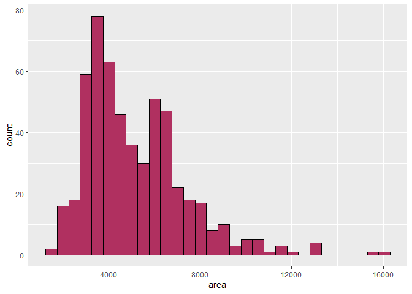

## Identifikasi Outlier Pada Dataset Housing Price

### Tentang Dataset

> [**Dataset**](https://www.kaggle.com/datasets/harishkumardatalab/housing-price-prediction)
> ini menyediakan informasi lengkap untuk prediksi harga rumah, dengan
> 13 nama kolom:
>
> - Price: Harga rumah.
> - Area: Luas total rumah dalam meter persegi.
> - Bedrooms: Jumlah kamar tidur di dalam rumah.
> - Bathrooms: Jumlah kamar mandi di dalam rumah.
> - Stories: Jumlah lantai di dalam rumah.
> - Mainroad: Apakah rumah tersebut terhubung dengan jalan utama
>   (Ya/Tidak).
> - Guestroom: Apakah rumah tersebut memiliki ruang tamu (Ya/Tidak).
> - Basement: Apakah rumah memiliki ruang bawah tanah (Ya/Tidak).
> - Hot water heating: Apakah rumah memiliki sistem pemanas air panas
>   (Ya/Tidak).
> - Airconditioning: Apakah rumah memiliki sistem pendingin udara
>   (Ya/Tidak).
> - Parking: Jumlah tempat parkir yang tersedia di dalam rumah.
> - Prefarea: Apakah rumah tersebut terletak di area yang disukai
>   (Ya/Tidak).
> - Furnishing status: Status perabotan rumah (Fully Furnished,
>   Semi-Furnished, Unfurnished).

### Import Dataset

``` r
housing_data <- read.csv("C:/Housing.csv", stringsAsFactors = TRUE)
dim(housing_data)
```

    ## [1] 545  13

``` r
library(tidyverse)
```

``` r
summary(housing_data)
```

    ##      price               area          bedrooms       bathrooms    
    ##  Min.   : 1750000   Min.   : 1650   Min.   :1.000   Min.   :1.000  
    ##  1st Qu.: 3430000   1st Qu.: 3600   1st Qu.:2.000   1st Qu.:1.000  
    ##  Median : 4340000   Median : 4600   Median :3.000   Median :1.000  
    ##  Mean   : 4766729   Mean   : 5151   Mean   :2.965   Mean   :1.286  
    ##  3rd Qu.: 5740000   3rd Qu.: 6360   3rd Qu.:3.000   3rd Qu.:2.000  
    ##  Max.   :13300000   Max.   :16200   Max.   :6.000   Max.   :4.000  
    ##     stories      mainroad  guestroom basement  hotwaterheating airconditioning
    ##  Min.   :1.000   no : 77   no :448   no :354   no :520         no :373        
    ##  1st Qu.:1.000   yes:468   yes: 97   yes:191   yes: 25         yes:172        
    ##  Median :2.000                                                                
    ##  Mean   :1.806                                                                
    ##  3rd Qu.:2.000                                                                
    ##  Max.   :4.000                                                                
    ##     parking       prefarea        furnishingstatus
    ##  Min.   :0.0000   no :417   furnished     :140    
    ##  1st Qu.:0.0000   yes:128   semi-furnished:227    
    ##  Median :0.0000             unfurnished   :178    
    ##  Mean   :0.6936                                   
    ##  3rd Qu.:1.0000                                   
    ##  Max.   :3.0000

``` r
str(housing_data)
```

    ## 'data.frame':    545 obs. of  13 variables:
    ##  $ price           : int  13300000 12250000 12250000 12215000 11410000 10850000 10150000 10150000 9870000 9800000 ...
    ##  $ area            : int  7420 8960 9960 7500 7420 7500 8580 16200 8100 5750 ...
    ##  $ bedrooms        : int  4 4 3 4 4 3 4 5 4 3 ...
    ##  $ bathrooms       : int  2 4 2 2 1 3 3 3 1 2 ...
    ##  $ stories         : int  3 4 2 2 2 1 4 2 2 4 ...
    ##  $ mainroad        : Factor w/ 2 levels "no","yes": 2 2 2 2 2 2 2 2 2 2 ...
    ##  $ guestroom       : Factor w/ 2 levels "no","yes": 1 1 1 1 2 1 1 1 2 2 ...
    ##  $ basement        : Factor w/ 2 levels "no","yes": 1 1 2 2 2 2 1 1 2 1 ...
    ##  $ hotwaterheating : Factor w/ 2 levels "no","yes": 1 1 1 1 1 1 1 1 1 1 ...
    ##  $ airconditioning : Factor w/ 2 levels "no","yes": 2 2 1 2 2 2 2 1 2 2 ...
    ##  $ parking         : int  2 3 2 3 2 2 2 0 2 1 ...
    ##  $ prefarea        : Factor w/ 2 levels "no","yes": 2 1 2 2 1 2 2 1 2 2 ...
    ##  $ furnishingstatus: Factor w/ 3 levels "furnished","semi-furnished",..: 1 1 2 1 1 2 2 3 1 3 ...

``` r
housing_data_copy <- housing_data
```

#### Identification Outlier With Histogram And Boxplot

``` r
housing_data_copy$bedrooms_factor <- factor(housing_data_copy$bedrooms, levels = c(1, 2, 3, 4, 5, 6), labels = c("kamar1", "kamar2", "kamar3", "kamar4", "kamar5", "kamar6"))

housing_data_copy$bathrooms_factor <- factor(housing_data_copy$bathrooms, levels = c(1, 2, 3, 4), labels = c("kamar mandi1", "kamar mandi2", "kamar mandi3", "kamar mandi4"))

housing_data_copy$stories_factor <- factor(housing_data_copy$stories, levels = c(1, 2, 3, 4), labels = c("satu lantai", "dua lantai", "tiga lantai", "empat lantai"))

housing_data_copy$parking_factor <- factor(housing_data_copy$parking, levels = c(0, 1, 2, 3), labels = c("tanpa parkir" ,"satu parkir", "dua parkir", "tiga parkir"))
```

``` r
head(housing_data_copy)
```

    ##      price area bedrooms bathrooms stories mainroad guestroom basement
    ## 1 13300000 7420        4         2       3      yes        no       no
    ## 2 12250000 8960        4         4       4      yes        no       no
    ## 3 12250000 9960        3         2       2      yes        no      yes
    ## 4 12215000 7500        4         2       2      yes        no      yes
    ## 5 11410000 7420        4         1       2      yes       yes      yes
    ## 6 10850000 7500        3         3       1      yes        no      yes
    ##   hotwaterheating airconditioning parking prefarea furnishingstatus
    ## 1              no             yes       2      yes        furnished
    ## 2              no             yes       3       no        furnished
    ## 3              no              no       2      yes   semi-furnished
    ## 4              no             yes       3      yes        furnished
    ## 5              no             yes       2       no        furnished
    ## 6              no             yes       2      yes   semi-furnished
    ##   bedrooms_factor bathrooms_factor stories_factor parking_factor
    ## 1          kamar4     kamar mandi2    tiga lantai     dua parkir
    ## 2          kamar4     kamar mandi4   empat lantai    tiga parkir
    ## 3          kamar3     kamar mandi2     dua lantai     dua parkir
    ## 4          kamar4     kamar mandi2     dua lantai    tiga parkir
    ## 5          kamar4     kamar mandi1     dua lantai     dua parkir
    ## 6          kamar3     kamar mandi3    satu lantai     dua parkir

``` r
ggplot(data = housing_data_copy, mapping = aes(x = "", y = price))+
  geom_boxplot(fill = "maroon")
```

<!-- -->

terdapat pencilan pada variabel price

``` r
ggplot(data = housing_data_copy, mapping = aes(x = price))+
  geom_histogram(fill = "maroon", color = "black", bins = 30)
```

<!-- -->

``` r
ggplot(data = housing_data_copy, mapping = aes(x = "", y = area))+
  geom_boxplot(fill = "maroon")
```

<!-- -->

terdapat pencilan pada variable area

``` r
ggplot(data = housing_data_copy, mapping = aes(x = area))+
  geom_histogram(fill = "maroon", color = "black", bins = 30)
```

<!-- -->

variable selain area dan price lebih tepat jika disebut dengan variabel
kategorikal/faktor, maupun ordinal, bukan variabel numerik dengan skala
interval dan rasio yang dapat diukur secara kontinu, maka dari itu ada
kemungkinan tidak adanya outlier pada variabel-variabel tersebut.

``` r
boxplot.stats(housing_data_copy$price)$out
```

    ##  [1] 13300000 12250000 12250000 12215000 11410000 10850000 10150000 10150000
    ##  [9]  9870000  9800000  9800000  9681000  9310000  9240000  9240000

``` r
out <- boxplot.stats(housing_data_copy$price)$out

outlier_ind <- filter(housing_data_copy, price %in% c(out))
outlier_ind
```

    ##       price  area bedrooms bathrooms stories mainroad guestroom basement
    ## 1  13300000  7420        4         2       3      yes        no       no
    ## 2  12250000  8960        4         4       4      yes        no       no
    ## 3  12250000  9960        3         2       2      yes        no      yes
    ## 4  12215000  7500        4         2       2      yes        no      yes
    ## 5  11410000  7420        4         1       2      yes       yes      yes
    ## 6  10850000  7500        3         3       1      yes        no      yes
    ## 7  10150000  8580        4         3       4      yes        no       no
    ## 8  10150000 16200        5         3       2      yes        no       no
    ## 9   9870000  8100        4         1       2      yes       yes      yes
    ## 10  9800000  5750        3         2       4      yes       yes       no
    ## 11  9800000 13200        3         1       2      yes        no      yes
    ## 12  9681000  6000        4         3       2      yes       yes      yes
    ## 13  9310000  6550        4         2       2      yes        no       no
    ## 14  9240000  3500        4         2       2      yes        no       no
    ## 15  9240000  7800        3         2       2      yes        no       no
    ##    hotwaterheating airconditioning parking prefarea furnishingstatus
    ## 1               no             yes       2      yes        furnished
    ## 2               no             yes       3       no        furnished
    ## 3               no              no       2      yes   semi-furnished
    ## 4               no             yes       3      yes        furnished
    ## 5               no             yes       2       no        furnished
    ## 6               no             yes       2      yes   semi-furnished
    ## 7               no             yes       2      yes   semi-furnished
    ## 8               no              no       0       no      unfurnished
    ## 9               no             yes       2      yes        furnished
    ## 10              no             yes       1      yes      unfurnished
    ## 11              no             yes       2      yes        furnished
    ## 12             yes              no       2       no   semi-furnished
    ## 13              no             yes       1      yes   semi-furnished
    ## 14             yes              no       2       no        furnished
    ## 15              no              no       0      yes   semi-furnished
    ##    bedrooms_factor bathrooms_factor stories_factor parking_factor
    ## 1           kamar4     kamar mandi2    tiga lantai     dua parkir
    ## 2           kamar4     kamar mandi4   empat lantai    tiga parkir
    ## 3           kamar3     kamar mandi2     dua lantai     dua parkir
    ## 4           kamar4     kamar mandi2     dua lantai    tiga parkir
    ## 5           kamar4     kamar mandi1     dua lantai     dua parkir
    ## 6           kamar3     kamar mandi3    satu lantai     dua parkir
    ## 7           kamar4     kamar mandi3   empat lantai     dua parkir
    ## 8           kamar5     kamar mandi3     dua lantai   tanpa parkir
    ## 9           kamar4     kamar mandi1     dua lantai     dua parkir
    ## 10          kamar3     kamar mandi2   empat lantai    satu parkir
    ## 11          kamar3     kamar mandi1     dua lantai     dua parkir
    ## 12          kamar4     kamar mandi3     dua lantai     dua parkir
    ## 13          kamar4     kamar mandi2     dua lantai    satu parkir
    ## 14          kamar4     kamar mandi2     dua lantai     dua parkir
    ## 15          kamar3     kamar mandi2     dua lantai   tanpa parkir

terdapat `15` outlier pada variable price

``` r
out1 <- boxplot.stats(housing_data_copy$area)$out

outlier_ind1 <- filter(housing_data_copy, area %in% c(out1))
outlier_ind1
```

    ##       price  area bedrooms bathrooms stories mainroad guestroom basement
    ## 1  10150000 16200        5         3       2      yes        no       no
    ## 2   9800000 13200        3         1       2      yes        no      yes
    ## 3   7343000 11440        4         1       2      yes        no      yes
    ## 4   7000000 11175        3         1       1      yes        no      yes
    ## 5   6930000 13200        2         1       1      yes        no      yes
    ## 6   6790000 12090        4         2       2      yes        no       no
    ## 7   5943000 15600        3         1       1      yes        no       no
    ## 8   5873000 11460        3         1       3      yes        no       no
    ## 9   5110000 11410        2         1       2      yes        no       no
    ## 10  5040000 10700        3         1       2      yes       yes      yes
    ## 11  4900000 12900        3         1       1      yes        no       no
    ## 12  3500000 12944        3         1       1      yes        no       no
    ##    hotwaterheating airconditioning parking prefarea furnishingstatus
    ## 1               no              no       0       no      unfurnished
    ## 2               no             yes       2      yes        furnished
    ## 3               no              no       1      yes   semi-furnished
    ## 4               no             yes       1      yes        furnished
    ## 5              yes              no       1       no        furnished
    ## 6               no              no       2      yes        furnished
    ## 7               no             yes       2       no   semi-furnished
    ## 8               no              no       2      yes   semi-furnished
    ## 9               no              no       0      yes        furnished
    ## 10              no              no       0       no   semi-furnished
    ## 11              no              no       2       no        furnished
    ## 12              no              no       0       no      unfurnished
    ##    bedrooms_factor bathrooms_factor stories_factor parking_factor
    ## 1           kamar5     kamar mandi3     dua lantai   tanpa parkir
    ## 2           kamar3     kamar mandi1     dua lantai     dua parkir
    ## 3           kamar4     kamar mandi1     dua lantai    satu parkir
    ## 4           kamar3     kamar mandi1    satu lantai    satu parkir
    ## 5           kamar2     kamar mandi1    satu lantai    satu parkir
    ## 6           kamar4     kamar mandi2     dua lantai     dua parkir
    ## 7           kamar3     kamar mandi1    satu lantai     dua parkir
    ## 8           kamar3     kamar mandi1    tiga lantai     dua parkir
    ## 9           kamar2     kamar mandi1     dua lantai   tanpa parkir
    ## 10          kamar3     kamar mandi1     dua lantai   tanpa parkir
    ## 11          kamar3     kamar mandi1    satu lantai     dua parkir
    ## 12          kamar3     kamar mandi1    satu lantai   tanpa parkir

terdapat `12` baris outlier pada variable area

#### Identification Outlier with persentil

``` r
lower_bound <- quantile(housing_data_copy$price, 0.01)
upper_bound <- quantile(housing_data_copy$price, 0.99)

print(paste("lower : ", lower_bound))
```

    ## [1] "lower :  1870400"

``` r
print(paste("upper : ", upper_bound))
```

    ## [1] "upper :  10542000"

``` r
outlier_ind2 <- filter(housing_data_copy, price < lower_bound | price > upper_bound)
outlier_ind2
```

    ##       price area bedrooms bathrooms stories mainroad guestroom basement
    ## 1  13300000 7420        4         2       3      yes        no       no
    ## 2  12250000 8960        4         4       4      yes        no       no
    ## 3  12250000 9960        3         2       2      yes        no      yes
    ## 4  12215000 7500        4         2       2      yes        no      yes
    ## 5  11410000 7420        4         1       2      yes       yes      yes
    ## 6  10850000 7500        3         3       1      yes        no      yes
    ## 7   1855000 2990        2         1       1       no        no       no
    ## 8   1820000 3000        2         1       1      yes        no      yes
    ## 9   1767150 2400        3         1       1       no        no       no
    ## 10  1750000 3620        2         1       1      yes        no       no
    ## 11  1750000 2910        3         1       1       no        no       no
    ## 12  1750000 3850        3         1       2      yes        no       no
    ##    hotwaterheating airconditioning parking prefarea furnishingstatus
    ## 1               no             yes       2      yes        furnished
    ## 2               no             yes       3       no        furnished
    ## 3               no              no       2      yes   semi-furnished
    ## 4               no             yes       3      yes        furnished
    ## 5               no             yes       2       no        furnished
    ## 6               no             yes       2      yes   semi-furnished
    ## 7               no              no       1       no      unfurnished
    ## 8               no              no       2       no      unfurnished
    ## 9               no              no       0       no   semi-furnished
    ## 10              no              no       0       no      unfurnished
    ## 11              no              no       0       no        furnished
    ## 12              no              no       0       no      unfurnished
    ##    bedrooms_factor bathrooms_factor stories_factor parking_factor
    ## 1           kamar4     kamar mandi2    tiga lantai     dua parkir
    ## 2           kamar4     kamar mandi4   empat lantai    tiga parkir
    ## 3           kamar3     kamar mandi2     dua lantai     dua parkir
    ## 4           kamar4     kamar mandi2     dua lantai    tiga parkir
    ## 5           kamar4     kamar mandi1     dua lantai     dua parkir
    ## 6           kamar3     kamar mandi3    satu lantai     dua parkir
    ## 7           kamar2     kamar mandi1    satu lantai    satu parkir
    ## 8           kamar2     kamar mandi1    satu lantai     dua parkir
    ## 9           kamar3     kamar mandi1    satu lantai   tanpa parkir
    ## 10          kamar2     kamar mandi1    satu lantai   tanpa parkir
    ## 11          kamar3     kamar mandi1    satu lantai   tanpa parkir
    ## 12          kamar3     kamar mandi1     dua lantai   tanpa parkir

terdapat `12` outlier ketika menggunakan metode persentil pada variable
price

``` r
lower_bound1 <- quantile(housing_data_copy$area, 0.01)
upper_bound1 <- quantile(housing_data_copy$area, 0.99)

print(paste("lower : ", lower_bound1))
```

    ## [1] "lower :  1972"

``` r
print(paste("upper : ", upper_bound1))
```

    ## [1] "upper :  12543.6"

``` r
outlier_ind3 <- filter(housing_data_copy, area < lower_bound1 | area > upper_bound1)
outlier_ind3
```

    ##       price  area bedrooms bathrooms stories mainroad guestroom basement
    ## 1  10150000 16200        5         3       2      yes        no       no
    ## 2   9800000 13200        3         1       2      yes        no      yes
    ## 3   6930000 13200        2         1       1      yes        no      yes
    ## 4   5943000 15600        3         1       1      yes        no       no
    ## 5   4900000 12900        3         1       1      yes        no       no
    ## 6   4340000  1905        5         1       2       no        no      yes
    ## 7   3500000 12944        3         1       1      yes        no       no
    ## 8   3430000  1950        3         2       2      yes        no      yes
    ## 9   3150000  1650        3         1       2       no        no      yes
    ## 10  2275000  1836        2         1       1       no        no      yes
    ## 11  2240000  1950        3         1       1       no        no       no
    ## 12  1890000  1700        3         1       2      yes        no       no
    ##    hotwaterheating airconditioning parking prefarea furnishingstatus
    ## 1               no              no       0       no      unfurnished
    ## 2               no             yes       2      yes        furnished
    ## 3              yes              no       1       no        furnished
    ## 4               no             yes       2       no   semi-furnished
    ## 5               no              no       2       no        furnished
    ## 6               no              no       0       no   semi-furnished
    ## 7               no              no       0       no      unfurnished
    ## 8               no              no       0      yes      unfurnished
    ## 9               no              no       0       no      unfurnished
    ## 10              no              no       0       no   semi-furnished
    ## 11             yes              no       0       no      unfurnished
    ## 12              no              no       0       no      unfurnished
    ##    bedrooms_factor bathrooms_factor stories_factor parking_factor
    ## 1           kamar5     kamar mandi3     dua lantai   tanpa parkir
    ## 2           kamar3     kamar mandi1     dua lantai     dua parkir
    ## 3           kamar2     kamar mandi1    satu lantai    satu parkir
    ## 4           kamar3     kamar mandi1    satu lantai     dua parkir
    ## 5           kamar3     kamar mandi1    satu lantai     dua parkir
    ## 6           kamar5     kamar mandi1     dua lantai   tanpa parkir
    ## 7           kamar3     kamar mandi1    satu lantai   tanpa parkir
    ## 8           kamar3     kamar mandi2     dua lantai   tanpa parkir
    ## 9           kamar3     kamar mandi1     dua lantai   tanpa parkir
    ## 10          kamar2     kamar mandi1    satu lantai   tanpa parkir
    ## 11          kamar3     kamar mandi1    satu lantai   tanpa parkir
    ## 12          kamar3     kamar mandi1     dua lantai   tanpa parkir

#### Identification outlier with hampel filter

``` r
lower_bound2 <- median(housing_data_copy$price) - 3 * mad(housing_data_copy$price, constant = 1)
upper_bound2 <- median(housing_data_copy$price) + 3 * mad(housing_data_copy$price, constant = 1)

print(paste("lower : ", lower_bound2))
```

    ## [1] "lower :  1190000"

``` r
print(paste("upper : ", upper_bound2))
```

    ## [1] "upper :  7490000"

``` r
outlier_ind4 <- filter(housing_data_copy, price < lower_bound2 | price > upper_bound2)
outlier_ind4 %>% head()
```

    ##      price area bedrooms bathrooms stories mainroad guestroom basement
    ## 1 13300000 7420        4         2       3      yes        no       no
    ## 2 12250000 8960        4         4       4      yes        no       no
    ## 3 12250000 9960        3         2       2      yes        no      yes
    ## 4 12215000 7500        4         2       2      yes        no      yes
    ## 5 11410000 7420        4         1       2      yes       yes      yes
    ## 6 10850000 7500        3         3       1      yes        no      yes
    ##   hotwaterheating airconditioning parking prefarea furnishingstatus
    ## 1              no             yes       2      yes        furnished
    ## 2              no             yes       3       no        furnished
    ## 3              no              no       2      yes   semi-furnished
    ## 4              no             yes       3      yes        furnished
    ## 5              no             yes       2       no        furnished
    ## 6              no             yes       2      yes   semi-furnished
    ##   bedrooms_factor bathrooms_factor stories_factor parking_factor
    ## 1          kamar4     kamar mandi2    tiga lantai     dua parkir
    ## 2          kamar4     kamar mandi4   empat lantai    tiga parkir
    ## 3          kamar3     kamar mandi2     dua lantai     dua parkir
    ## 4          kamar4     kamar mandi2     dua lantai    tiga parkir
    ## 5          kamar4     kamar mandi1     dua lantai     dua parkir
    ## 6          kamar3     kamar mandi3    satu lantai     dua parkir

terdapat `47` baris outlier pada variable price dengan metode hampel
filter

``` r
lower_bound3 <- median(housing_data_copy$area) - 3 * mad(housing_data_copy$area, constant = 1)
upper_bound3 <- median(housing_data_copy$area) + 3 * mad(housing_data_copy$area, constant = 1)

print(paste("lower : ", lower_bound3))
```

    ## [1] "lower :  430"

``` r
print(paste("upper : ", upper_bound3))
```

    ## [1] "upper :  8770"

``` r
outlier_ind5 <- filter(housing_data_copy, area < lower_bound3 | area > upper_bound3)
outlier_ind5 %>% head()
```

    ##      price  area bedrooms bathrooms stories mainroad guestroom basement
    ## 1 12250000  8960        4         4       4      yes        no       no
    ## 2 12250000  9960        3         2       2      yes        no      yes
    ## 3 10150000 16200        5         3       2      yes        no       no
    ## 4  9800000 13200        3         1       2      yes        no      yes
    ## 5  8575000  8800        3         2       2      yes        no       no
    ## 6  8400000  8875        3         1       1      yes        no       no
    ##   hotwaterheating airconditioning parking prefarea furnishingstatus
    ## 1              no             yes       3       no        furnished
    ## 2              no              no       2      yes   semi-furnished
    ## 3              no              no       0       no      unfurnished
    ## 4              no             yes       2      yes        furnished
    ## 5              no             yes       2       no        furnished
    ## 6              no              no       1       no   semi-furnished
    ##   bedrooms_factor bathrooms_factor stories_factor parking_factor
    ## 1          kamar4     kamar mandi4   empat lantai    tiga parkir
    ## 2          kamar3     kamar mandi2     dua lantai     dua parkir
    ## 3          kamar5     kamar mandi3     dua lantai   tanpa parkir
    ## 4          kamar3     kamar mandi1     dua lantai     dua parkir
    ## 5          kamar3     kamar mandi2     dua lantai     dua parkir
    ## 6          kamar3     kamar mandi1    satu lantai    satu parkir

terdapat `34` baris outlier pada variable area ketika menggunakan hampel
filter

### Menghapus Outlier

#### Menghapus Outlier dari Metode boxplot.stats()

``` r
housing_data1 <- housing_data
dim(housing_data1)
```

    ## [1] 545  13

``` r
housing_data1 <- filter(housing_data1, !(price %in% c(out)))
dim(housing_data1)
```

    ## [1] 530  13

``` r
housing_data1 <- filter(housing_data1, !(area %in% c(out1)))
dim(housing_data1)
```

    ## [1] 520  13

``` r
ggplot(data = housing_data1, mapping = aes(x = "", y = price))+
  geom_boxplot(fill = "maroon")
```

<!-- -->

ketika menggunakan dataset tanpa outlier hasil fungsi `boxplot.stats()`
masih terdapat outlier

``` r
ggplot(data = housing_data1, mapping = aes(x = price))+
  geom_histogram(fill = "maroon", color = "black", bins = 30)
```

<!-- -->

``` r
ggplot(data = housing_data1, mapping = aes(x = "", y = area))+
  geom_boxplot(fill = "maroon")
```

<!-- -->

pada variable area masih terdapat outlier

``` r
ggplot(data = housing_data1, mapping = aes(x = area))+
  geom_histogram(fill = "maroon", color = "black", bins = 30)
```

<!-- -->

#### Menghapus Outlier dari Metode Persentil

``` r
housing_data2 <- housing_data
dim(housing_data2)
```

    ## [1] 545  13

``` r
housing_data2 <- filter(housing_data2, !(price < lower_bound | price > upper_bound))
dim(housing_data2)
```

    ## [1] 533  13

``` r
housing_data2 <-filter(housing_data2, !(area < lower_bound1 | area > upper_bound1))
dim(housing_data2)
```

    ## [1] 521  13

``` r
ggplot(data = housing_data2, mapping = aes(x = "", y = price))+
  geom_boxplot(fill = "maroon")
```

<!-- -->

``` r
ggplot(data = housing_data2, mapping = aes(x = price))+
  geom_histogram(fill = "maroon", color = "black", bins = 30)
```

<!-- -->

``` r
ggplot(data = housing_data2, mapping = aes(x = "", y = area))+
  geom_boxplot(fill = "maroon")
```

<!-- -->

``` r
ggplot(data = housing_data2, mapping = aes(x = area))+
  geom_histogram(fill = "maroon", color = "black", bins = 30)
```

<!-- -->

masih terdapat outlier pada kedua variable pengamatan ketika menggunakan
persentil

#### Menghapus Outlier dari Metode hampel filter

``` r
housing_data3 <- housing_data
dim(housing_data3)
```

    ## [1] 545  13

``` r
housing_data3 <- filter(housing_data3, !(price < lower_bound2 | price > upper_bound2))
dim(housing_data3)
```

    ## [1] 498  13

``` r
housing_data3 <- filter(housing_data3, !(area < lower_bound3 | area > upper_bound3))
dim(housing_data3)
```

    ## [1] 471  13

``` r
ggplot(data = housing_data3, mapping = aes(x = "", y = price))+
  geom_boxplot(fill = "maroon")
```

<!-- -->

``` r
ggplot(data = housing_data3, mapping = aes(x = price))+
  geom_histogram(fill = "maroon", color = "black", bins = 30)
```

<!-- -->

``` r
ggplot(data = housing_data3, mapping = aes(x = "", y = area))+
  geom_boxplot(fill = "maroon")
```

<!-- -->

``` r
ggplot(data = housing_data3, mapping = aes(x = area))+
  geom_histogram(fill = "maroon", color = "black", bins = 30)
```

<!-- -->

outlier sudah tidak terlihat ketika menggunakan metode `hampel filter`

dataset Housing_price not outlier is
[here](https://github.com/muhammadrendysa/dataset_tanpa_outlier/blob/main/Housing_price_notOutlier.xlsx)
