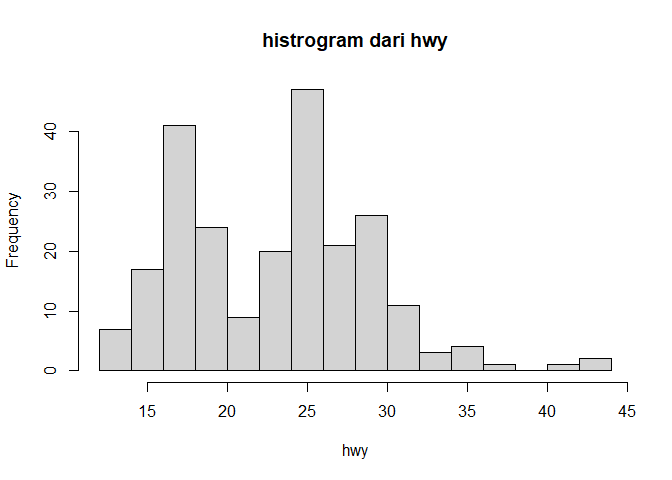
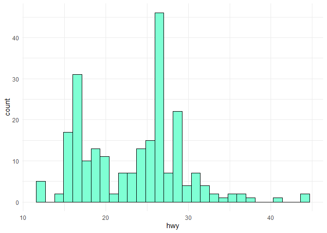
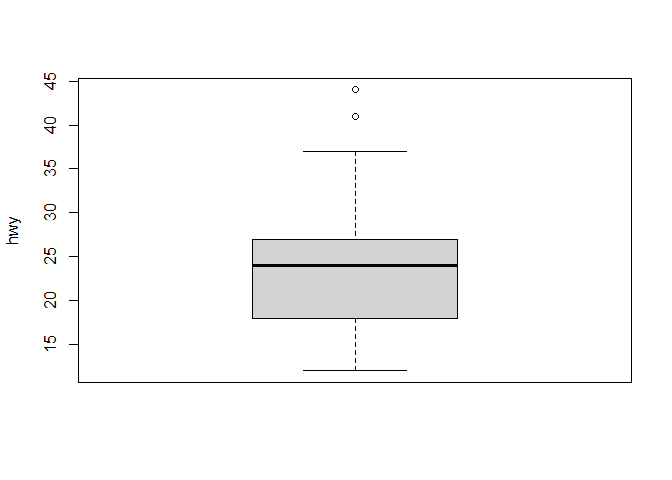
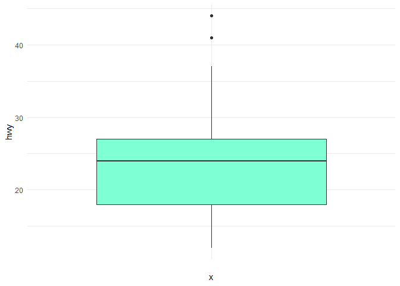
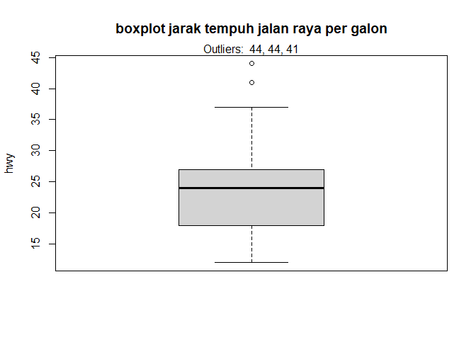
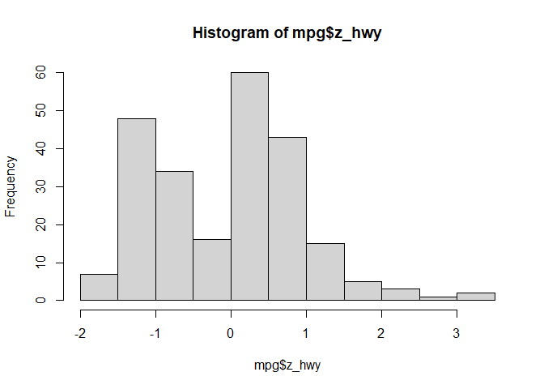
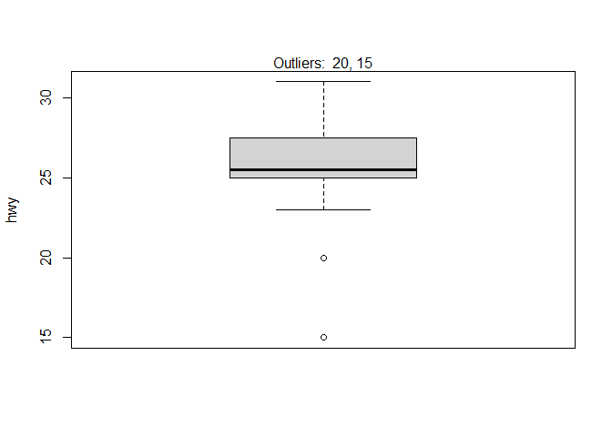
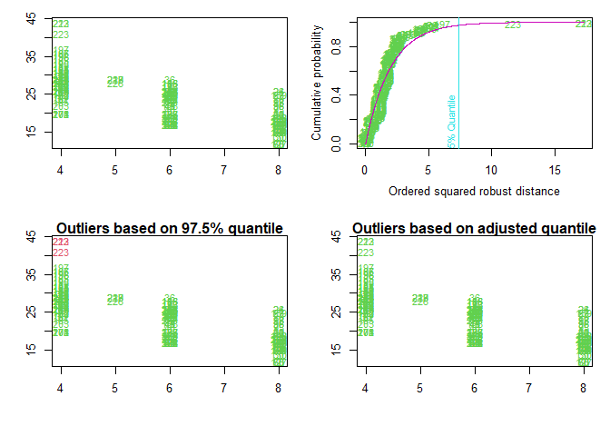

## Identifikasi Outlier dengan r

### Pendahuluan

Pencilan adalah nilai atau pengamatan yang jauh dari pengamatan lainnya,
yaitu titik data yang berbeda secara signifikan dari titik data lainnya.
Enderlein (1987) melangkah lebih jauh lagi karena penulis menganggap
pencilan sebagai nilai yang sangat menyimpang dari pengamatan lain
sehingga orang mungkin mengira ada mekanisme pengambilan sampel yang
berbeda.

Sebuah pengamatan harus selalu dibandingkan dengan pengamatan lain yang
dilakukan pada fenomena yang sama sebelum benar-benar menyebutnya
sebagai pencilan. Memang, seseorang yang memiliki tinggi 200 cm (6’7” di
Amerika Serikat) kemungkinan besar akan dianggap sebagai pencilan
dibandingkan dengan populasi umum, tetapi orang yang sama mungkin tidak
dianggap sebagai pencilan jika kita mengukur tinggi badan pemain bola
basket.

Pencilan mungkin disebabkan oleh variabilitas yang melekat pada fenomena
yang diamati. Sebagai contoh, sering kali terdapat pencilan ketika
mengumpulkan data gaji, karena beberapa orang menghasilkan lebih banyak
uang daripada yang lain.

Pencilan juga dapat muncul karena kesalahan eksperimen, pengukuran, atau
pengkodean. Sebagai contoh, seorang manusia dengan berat 786 kg (1733
pon) jelas merupakan kesalahan saat mengkodekan berat subjek. Berat
badannya kemungkinan besar 78,6 kg (173 pon) atau 7,86 kg (17 pon),
tergantung pada berat badan orang dewasa atau bayi yang diukur.

Karena alasan ini, terkadang masuk akal untuk membedakan dua kelas
pencilan secara formal: (i) nilai ekstrem dan (ii) kesalahan. Nilai
ekstrem secara statistik dan filosofis lebih menarik, karena merupakan
respons yang mungkin terjadi namun tidak mungkin terjadi.1

Dalam artikel ini, saya menyajikan beberapa pendekatan untuk mendeteksi
pencilan dalam R, dari teknik sederhana seperti statistik deskriptif
(termasuk minimum, maksimum, histogram, boxplot, dan persentil) hingga
teknik yang lebih formal seperti filter Hampel, Grubbs, Dixon, dan tes
Rosner untuk pencilan.

Meskipun tidak ada aturan yang ketat atau unik apakah pencilan harus
dihilangkan atau tidak dari dataset sebelum melakukan analisis
statistik, namun cukup umum untuk, setidaknya, menghilangkan atau
memperhitungkan pencilan yang disebabkan oleh kesalahan eksperimen atau
pengukuran (seperti berat 786 kg (1.733 pon) untuk manusia). Beberapa
tes statistik memerlukan ketiadaan pencilan untuk menarik kesimpulan
yang tepat, tetapi menghilangkan pencilan tidak disarankan dalam semua
kasus dan harus dilakukan dengan hati-hati.

Artikel ini tidak akan memberi tahu Anda apakah Anda harus menghapus
pencilan atau tidak (atau apakah Anda harus memperhitungkannya dengan
median, mean, modus, atau nilai lainnya), tetapi artikel ini akan
membantu Anda mendeteksi pencilan untuk, sebagai langkah pertama,
memverifikasinya. Setelah verifikasi, Anda dapat memilih untuk
mengecualikan atau memasukkannya ke dalam analisis Anda (dan hal ini
biasanya membutuhkan refleksi yang bijaksana dari sisi peneliti).

Menghapus atau mempertahankan pencilan sebagian besar bergantung pada
tiga faktor:

1.  Domain/konteks analisis Anda dan pertanyaan penelitian. Pada
    beberapa domain, menghapus outlier merupakan hal yang umum karena
    sering terjadi karena proses yang tidak berfungsi. Di bidang lain,
    outlier dipertahankan karena mengandung informasi yang berharga.
    Terkadang analisis dilakukan dua kali, sekali dengan dan sekali
    tanpa outlier untuk mengevaluasi dampaknya terhadap kesimpulan. Jika
    hasil berubah secara drastis karena beberapa nilai yang berpengaruh,
    hal ini harus menjadi peringatan bagi peneliti untuk membuat klaim
    yang terlalu ambisius.

2.  Apakah uji yang akan Anda terapkan kuat terhadap keberadaan pencilan
    atau tidak. Sebagai contoh, kemiringan regresi linier sederhana
    dapat bervariasi secara signifikan hanya dengan satu pencilan,
    sedangkan uji non-parametrik seperti uji Wilcoxon biasanya kuat
    terhadap pencilan.

3.  Seberapa jauh pencilan dari pengamatan lainnya? Beberapa pengamatan
    yang dianggap sebagai pencilan (menurut teknik yang disajikan di
    bawah ini) sebenarnya tidak terlalu ekstrem dibandingkan dengan
    semua pengamatan lainnya, sementara pencilan potensial lainnya
    mungkin sangat jauh dari pengamatan lainnya.

Dataset mpg dari paket {ggplot2} akan digunakan untuk mengilustrasikan
pendekatan yang berbeda untuk mendeteksi outlier dalam R, dan khususnya
kita akan fokus pada variabel hwy (mil jalan raya per galon).

### Statistik deskriptif

Ada beberapa metode yang menggunakan statistik deskriptif. Di bawah ini
kami sajikan yang paling umum.

``` r
library(tidyverse)
```

#### Minimum Dan Maximum

Langkah pertama untuk mendeteksi outlier dalam R adalah memulai dengan
beberapa statistik deskriptif, dan khususnya dengan minimum dan
maksimum.

Dalam R, hal ini dapat dengan mudah dilakukan dengan fungsi `summary()`:

``` r
data(mpg)

summary(mpg$hwy)
```

    ##    Min. 1st Qu.  Median    Mean 3rd Qu.    Max. 
    ##   12.00   18.00   24.00   23.44   27.00   44.00

di mana minimum dan maksimum masing-masing adalah nilai pertama dan
terakhir pada keluaran di atas.

Sebagai alternatif, mereka juga dapat dihitung dengan fungsi min() dan
max(), atau range():2

``` r
min(mpg$hwy)
```

    ## [1] 12

``` r
max(mpg$hwy)
```

    ## [1] 44

``` r
range(mpg$hwy)
```

    ## [1] 12 44

Beberapa kesalahan pengkodean yang jelas seperti berat 786 kg (1733 pon)
untuk manusia akan dengan mudah terdeteksi oleh teknik yang sangat
sederhana ini.

#### Histrogram

Cara dasar lain untuk mendeteksi pencilan adalah dengan menggambar
histogram data.

Menggunakan basis R (dengan jumlah bin yang sesuai dengan akar kuadrat
dari jumlah pengamatan untuk memiliki lebih banyak bin daripada opsi
default):

``` r
hist(mpg$hwy,
     xlab = "hwy",
     main = "histrogram dari hwy",
     breaks = sqrt(nrow(mpg)))
```

<!-- -->

atau menggunakan `ggplot`

``` r
ggplot(data = mpg, mapping = aes(x = hwy))+
  geom_histogram(fill = "aquamarine", color = "black", bins = 30)+
  theme_minimal()
```

<!-- -->

Dari histogram, tampaknya ada beberapa pengamatan yang lebih tinggi
daripada semua pengamatan lainnya (lihat batang di sisi kanan plot).

#### Boxplot

Selain histogram, boxplot juga berguna untuk mendeteksi potensi outlier.
Menggunakan basis R:

``` r
boxplot(mpg$hwy,
        ylab = "hwy")
```

<!-- -->

atau menggunakan `boxplot`

``` r
ggplot(data = mpg, mapping = aes(x = "", y = hwy))+
  geom_boxplot(fill = "aquamarine")+
  theme_minimal()
```

<!-- -->

Boxplot membantu memvisualisasikan variabel kuantitatif dengan
menampilkan lima ringkasan lokasi umum (minimum, median, kuartil pertama
dan ketiga, serta maksimum) dan pengamatan apa pun yang diklasifikasikan
sebagai pencilan yang dicurigai dengan menggunakan kriteria rentang
antar kuartil (interquartile range, IQR).

Kriteria IQR berarti bahwa semua pengamatan di atas $q_{0.75} + 1.5 \cdot \text{IQR}$ atau di bawahnya **$q_{0.25} - 1.5 \cdot IQR$** (dimana **$q_{0.25}$** dan **$q_{0.75}$** masing-masing sesuai dengan kuartil pertama dan kuartil ketiga, dan IQR adalah selisih antara kuartil ketiga dan kuartil pertama.)
dianggap pencilan potensial oleh R.

Dengan kata lain, semua pengamatan di luar interval berikut akan
dianggap sebagai pencilan potensial:

$I = [q_{0.25} - 1.5 \cdot IQR; q_{0.75} + 1.5 \cdot IQR]$

Pengamatan yang dianggap sebagai pencilan potensial oleh kriteria IQR
ditampilkan sebagai titik-titik di dalam boxplot. Berdasarkan kriteria
ini, terdapat 2 pencilan potensial (lihat 2 titik di atas garis
vertikal, di bagian atas boxplot).

Ingatlah bahwa bukan karena sebuah pengamatan dianggap sebagai pencilan
potensial oleh kriteria IQR, maka Anda harus menghapusnya. Menghapus
atau mempertahankan pencilan tergantung pada (i) konteks analisis Anda,
(ii) apakah pengujian yang akan Anda lakukan pada set data kuat terhadap
pencilan atau tidak, dan (iii) seberapa jauh pencilan tersebut dari
pengamatan lain.

Anda juga dapat mengekstrak nilai dari pencilan potensial berdasarkan
kriteria IQR berkat fungsi `boxplot.stats()$out`:

``` r
boxplot.stats(mpg$hwy)$out
```

    ## [1] 44 44 41

Seperti yang Anda lihat, sebenarnya ada 3 titik yang dianggap sebagai
pencilan potensial: 2 pengamatan dengan nilai 44 dan 1 pengamatan dengan
nilai 41.

Berkat fungsi `which()`, kita dapat mengekstrak nomor baris yang
berhubungan dengan pencilan ini:

``` r
out <- boxplot.stats(mpg$hwy)$out
out_ind <- which(mpg$hwy %in% c(out))
out_ind
```

    ## [1] 213 222 223

Dengan informasi ini, Anda sekarang dapat dengan mudah kembali ke baris
tertentu dalam kumpulan data untuk memverifikasinya, atau mencetak semua
variabel untuk pencilan ini:

dengan menggunakan fungsi `filter()`:

``` r
filter(mpg, hwy %in% c(out))
```

    ## # A tibble: 3 × 11
    ##   manufacturer model      displ  year   cyl trans  drv     cty   hwy fl    class
    ##   <chr>        <chr>      <dbl> <int> <int> <chr>  <chr> <int> <int> <chr> <chr>
    ## 1 volkswagen   jetta        1.9  1999     4 manua… f        33    44 d     comp…
    ## 2 volkswagen   new beetle   1.9  1999     4 manua… f        35    44 d     subc…
    ## 3 volkswagen   new beetle   1.9  1999     4 auto(… f        29    41 d     subc…

Anda juga dapat mencetak nilai outlier secara langsung pada boxplot
dengan fungsi `mtext()`:

``` r
boxplot(mpg$hwy,
        ylab = "hwy",
        main = "boxplot jarak tempuh jalan raya per galon"
        )
mtext(paste("Outliers: ", paste(out, collapse = ", ")))
```

<!-- -->

#### Persentil

Metode deteksi pencilan ini didasarkan pada persentil.

Dengan metode persentil, semua pengamatan yang berada di luar interval
yang dibentuk oleh persentil 2,5 dan 97,5 akan dianggap sebagai pencilan
potensial. Persentil lain seperti persentil 1 dan 99, atau persentil 5
dan 95 juga dapat dipertimbangkan untuk membangun interval.

Nilai persentil bawah dan atas (dan dengan demikian batas bawah dan atas
interval) dapat dihitung dengan fungsi `quantile()`:

``` r
lower_bound <- quantile(mpg$hwy, 0.025)
lower_bound
```

    ## 2.5% 
    ##   14

``` r
upper_bound <- quantile(mpg$hwy, 0.975)
upper_bound
```

    ##  97.5% 
    ## 35.175

Menurut metode ini, semua pengamatan di bawah 14 dan di atas 35,175 akan
dianggap sebagai pencilan potensial. Nomor baris dari pengamatan di luar
interval kemudian dapat diekstraksi dengan fungsi `which()`:

``` r
outlier_ind <- which(mpg$hwy < lower_bound | mpg$hwy > upper_bound)
outlier_ind
```

    ##  [1]  55  60  66  70 106 107 127 197 213 222 223

Kemudian nilai jarak tempuh jalan raya per galon dapat dicetak:

``` r
filter(mpg, hwy < lower_bound | hwy > upper_bound) %>%
  select(hwy)
```

    ## # A tibble: 11 × 1
    ##      hwy
    ##    <int>
    ##  1    12
    ##  2    12
    ##  3    12
    ##  4    12
    ##  5    36
    ##  6    36
    ##  7    12
    ##  8    37
    ##  9    44
    ## 10    44
    ## 11    41

Sebagai alternatif, semua variabel untuk outlier ini dapat dicetak:

``` r
filter(mpg, hwy < lower_bound | hwy > upper_bound)
```

    ## # A tibble: 11 × 11
    ##    manufacturer model      displ  year   cyl trans drv     cty   hwy fl    class
    ##    <chr>        <chr>      <dbl> <int> <int> <chr> <chr> <int> <int> <chr> <chr>
    ##  1 dodge        dakota pi…   4.7  2008     8 auto… 4         9    12 e     pick…
    ##  2 dodge        durango 4…   4.7  2008     8 auto… 4         9    12 e     suv  
    ##  3 dodge        ram 1500 …   4.7  2008     8 auto… 4         9    12 e     pick…
    ##  4 dodge        ram 1500 …   4.7  2008     8 manu… 4         9    12 e     pick…
    ##  5 honda        civic        1.8  2008     4 auto… f        25    36 r     subc…
    ##  6 honda        civic        1.8  2008     4 auto… f        24    36 c     subc…
    ##  7 jeep         grand che…   4.7  2008     8 auto… 4         9    12 e     suv  
    ##  8 toyota       corolla      1.8  2008     4 manu… f        28    37 r     comp…
    ##  9 volkswagen   jetta        1.9  1999     4 manu… f        33    44 d     comp…
    ## 10 volkswagen   new beetle   1.9  1999     4 manu… f        35    44 d     subc…
    ## 11 volkswagen   new beetle   1.9  1999     4 auto… f        29    41 d     subc…

Terdapat 11 pencilan potensial menurut metode persentil. Untuk
mengurangi jumlah ini, Anda dapat mengatur persentil ke 1 dan 99:

``` r
lower_bound <- quantile(mpg$hwy, 0.01)
upper_bound <- quantile(mpg$hwy, 0.99)

outlier_ind <- which(mpg$hwy < lower_bound | mpg$hwy > upper_bound)

mpg[outlier_ind, ]
```

    ## # A tibble: 3 × 11
    ##   manufacturer model      displ  year   cyl trans  drv     cty   hwy fl    class
    ##   <chr>        <chr>      <dbl> <int> <int> <chr>  <chr> <int> <int> <chr> <chr>
    ## 1 volkswagen   jetta        1.9  1999     4 manua… f        33    44 d     comp…
    ## 2 volkswagen   new beetle   1.9  1999     4 manua… f        35    44 d     subc…
    ## 3 volkswagen   new beetle   1.9  1999     4 auto(… f        29    41 d     subc…

Menetapkan persentil ke 1 dan 99 memberikan potensi outlier yang sama
dengan kriteria IQR.

#### Z-score

Jika data Anda berasal dari distribusi normal, Anda dapat menggunakan
z-skor, yang didefinisikan sebagai

$z_i = \frac{x_i - \overline{X}}{s_X}$

dimana $\overline{X}$ adalah rata-rata dari $\text{X}$ dan $\text{sX}$ adalah standar deviasi

Hal ini disebut sebagai penskalaan, yang dapat dilakukan dengan fungsi
`scale()` di R.

Menurut metode ini, setiap z-score:

- di bawah -2 atau di atas 2 dianggap langka
- di bawah -3 atau di atas 3 dianggap sangat jarang

Metode lain juga menggunakan z-score di bawah -3,29 atau di atas 3,29
untuk mendeteksi pencilan. Nilai 3,29 ini berasal dari fakta bahwa 1
dari 1000 pengamatan berada di luar interval ini jika data mengikuti
distribusi normal.

Dalam kasus :

``` r
mpg$z_hwy <- scale(mpg$hwy)

hist(mpg$z_hwy)
```

<!-- -->

``` r
summary(mpg$z_hwy)
```

    ##        V1          
    ##  Min.   :-1.92122  
    ##  1st Qu.:-0.91360  
    ##  Median : 0.09402  
    ##  Mean   : 0.00000  
    ##  3rd Qu.: 0.59782  
    ##  Max.   : 3.45274

Kami melihat bahwa ada beberapa pengamatan di atas 3,29, tetapi tidak
ada yang di bawah -3,29.

Untuk mengidentifikasi garis dalam kumpulan data pengamatan ini:

``` r
which(mpg$z_hwy > 3.29)
```

    ## [1] 213 222

Kami melihat bahwa observasi 213 dan 222 dapat dianggap sebagai pencilan
menurut metode ini.

#### Hampel filter

Metode lain, yang dikenal sebagai `Hampel filter` terdiri dari
mempertimbangkan sebagai outlier nilai-nilai diluar interval () yang
dibentuk oleh median, ditambah atau dikurangi dengan 3 deviasi absolut
median $\text{MAD}$

$\text{I = [median - 3 . MAD;median + 3 . MAD]}$

dimana $\text{MAD}$ adalah deviasi absolut median dan didefinisikan sebagai
median dari deviasi absolut dari median data $\tilde{X} = \text{median}(X)$:

$\text{MAD} = \text{median}(|X_i - \tilde{X}|)$


Untuk metode ini, pertama-tama kita akan mengatur batas interval dengan
menggunakan fungsi `median()` dan `mad()`:

``` r
lower_bound <- median(mpg$hwy) - 3 * mad(mpg$hwy, constant = 1)
lower_bound
```

    ## [1] 9

``` r
upper_bound <- median(mpg$hwy) + 3 * mad(mpg$hwy, constant = 1)
upper_bound
```

    ## [1] 39

Menurut metode ini, semua pengamatan di bawah 9 dan di atas 39 akan
dianggap sebagai pencilan potensial. Nomor baris dari pengamatan di luar
interval kemudian dapat diekstraksi dengan fungsi `which()`:

``` r
outlier_ind <- which(mpg$hwy < lower_bound | mpg$hwy > upper_bound)
outlier_ind
```

    ## [1] 213 222 223

Menurut filter Hampel, ada 3 pencilan untuk variabel `hwy`.

### Uji statistik

Pada bagian ini, kami menyajikan 3 teknik yang lebih formal untuk
mendeteksi pencilan:

- Uji Grubbs
- Uji Dixon
- Uji Rosner

Ketiga uji statistik ini merupakan bagian dari teknik yang lebih formal
untuk mendeteksi outlier karena ketiganya melibatkan penghitungan
statistik uji yang dibandingkan dengan nilai kritis yang ditabulasikan
(yang didasarkan pada ukuran sampel dan tingkat kepercayaan yang
diinginkan).

Perhatikan bahwa ketiga uji tersebut hanya sesuai jika data (tanpa
pencilan) **terdistribusi secara normal**. Asumsi normalitas harus
diverifikasi sebelum menerapkan tes-tes ini untuk pencilan (lihat cara
menguji asumsi normalitas dalam R).

#### Uji Grubbs

Uji Grubbs memungkinkan untuk mendeteksi apakah nilai tertinggi atau
terendah dalam dataset adalah pencilan.

Uji Grubbs mendeteksi satu pencilan dalam satu waktu (nilai tertinggi
atau terendah), sehingga hipotesis nol dan alternatifnya adalah sebagai
berikut:

- $\text H_0$ = nilai tertinggi bukan merupakan pencilan
- $\text H_1$ = nilai tertinggi adalah pencilan

jika kita ingin menguji nilai tertinggi, atau:

- $\text H_0$ = nilai terendah bukan merupakan pencilan
- $\text H_1$ = nilai terendah adalah pencilan

jika kita ingin menguji nilai terendah.

Untuk uji statistik apa pun, jika nilai **p** kurang dari ambang batas
signifikansi yang dipilih(umumnya = **0.05**)maka hipotesis nol ditolak
dan kita akan menyimpulkan bahwa **nilai terendah/tertinggi adalah
pencilan**.

Sebaliknya, jika p-value lebih besar atau sama dengan tingkat
signifikansi, maka hipotesis nol tidak ditolak, dan kita akan
menyimpulkan bahwa, berdasarkan data, kita tidak menolak hipotesis bahwa
nilai terendah/tertinggi bukanlah pencilan.

perhatikan bahwa uji Grubbs tidak sesuai untuk ukuran sampel 6 atau
kurang(***n*** $\leg$ ***6***)

Untuk melakukan uji Grubbs di R, kita menggunakan fungsi `grubbs.test()`
dari paket `{outliers}`:

``` r
library(outliers)
test <- grubbs.test(mpg$hwy)
test
```

    ## 
    ##  Grubbs test for one outlier
    ## 
    ## data:  mpg$hwy
    ## G = 3.45274, U = 0.94862, p-value = 0.05555
    ## alternative hypothesis: highest value 44 is an outlier

Nilai p-value adalah 0,056. Pada tingkat signifikansi 5%, kami tidak
menolak hipotesis bahwa nilai tertinggi 44 bukanlah pencilan.

Secara default, pengujian dilakukan pada nilai tertinggi (seperti yang
ditunjukkan pada output R:
`hipotesis alternatif: nilai tertinggi 44 adalah pencilan)`. Jika Anda
ingin melakukan pengujian untuk nilai terendah, cukup tambahkan argumen
`opposite = TRUE` pada fungsi `grubbs.test()`:

``` r
test <- grubbs.test(mpg$hwy, opposite = TRUE)
test
```

    ## 
    ##  Grubbs test for one outlier
    ## 
    ## data:  mpg$hwy
    ## G = 1.92122, U = 0.98409, p-value = 1
    ## alternative hypothesis: lowest value 12 is an outlier

Output R menunjukkan bahwa pengujian sekarang dilakukan pada nilai
terendah (lihat
`hipotesis alternatif: nilai terendah 12 adalah pencilan)`.

Nilai p-value adalah 1. Pada tingkat signifikansi 5%, kita tidak menolak
hipotesis bahwa nilai terendah 12 **bukanlah** pencilan.

Sebagai ilustrasi, sekarang kita akan mengganti pengamatan dengan nilai
yang lebih ekstrem dan melakukan uji Grubbs pada set data baru ini. Mari
kita ganti nilai 34^th dengan nilai 212:

``` r
mpg[34, "hwy"] <- 212
```

Dan sekarang kita menerapkan uji Grubbs untuk menguji apakah nilai
tertinggi adalah pencilan:

``` r
test <- grubbs.test(mpg$hwy)
test
```

    ## 
    ##  Grubbs test for one outlier
    ## 
    ## data:  mpg$hwy
    ## G = 13.72240, U = 0.18836, p-value < 2.2e-16
    ## alternative hypothesis: highest value 212 is an outlier

Nilai p-value adalah \< 0,001. Pada tingkat signifikansi 5%, kami
menyimpulkan bahwa nilai tertinggi 212 adalah pencilan.

#### Uji Dixon’s

Serupa dengan uji Grubbs, uji Dixon digunakan untuk menguji apakah satu
nilai rendah atau tinggi merupakan pencilan. Jadi, jika ada lebih dari
satu pencilan yang dicurigai, pengujian harus dilakukan pada pencilan
yang dicurigai ini secara individual.

Perhatikan bahwa uji Dixon paling berguna untuk ukuran sampel yang kecil
(biasanya $n \leq 25$).

Untuk melakukan uji Dixon di R, kami menggunakan fungsi `dixon.test()`
dari paket `{outliers}`. Namun, kami membatasi dataset kami pada 20
observasi pertama karena uji Dixon hanya dapat dilakukan pada ukuran
sampel yang kecil (R akan melemparkan kesalahan dan hanya menerima
dataset dengan 3 hingga 30 observasi):

``` r
submpg <- mpg[1:20, ]
test <- dixon.test(submpg$hwy)
test
```

    ## 
    ##  Dixon test for outliers
    ## 
    ## data:  submpg$hwy
    ## Q = 0.57143, p-value = 0.006508
    ## alternative hypothesis: lowest value 15 is an outlier

Hasilnya menunjukkan bahwa nilai terendah 15 adalah pencilan (p-value =
0,007).

Untuk menguji nilai tertinggi, cukup tambahkan argumen `opposite = TRUE`
ke fungsi `dixon.test()`:

``` r
test <- dixon.test(submpg$hwy, opposite = TRUE)
test
```

    ## 
    ##  Dixon test for outliers
    ## 
    ## data:  submpg$hwy
    ## Q = 0.25, p-value = 0.8582
    ## alternative hypothesis: highest value 31 is an outlier

Hasilnya menunjukkan bahwa nilai tertinggi 31 **bukanlah** pencilan
(p-value = 0,858).

Merupakan praktik yang baik untuk selalu memeriksa hasil uji statistik
untuk outlier terhadap boxplot untuk memastikan bahwa kita telah menguji
**semua** outlier yang potensial:

``` r
out <- boxplot.stats(submpg$hwy)$out
boxplot(submpg$hwy,
  ylab = "hwy"
)
mtext(paste("Outliers: ", paste(out, collapse = ", ")))
```

<!-- -->
Dari boxplot tersebut, kita dapat melihat bahwa kita juga dapat
menerapkan uji Dixon pada nilai 20 sebagai tambahan dari nilai 15 yang
telah dilakukan sebelumnya.

Hal ini dapat dilakukan dengan mencari nomor baris dari nilai minimum,
mengeluarkan nomor baris ini dari dataset dan akhirnya menerapkan uji
Dixon pada dataset baru ini:

``` r
# menemukan dan mengecualikan nilai terendah
remove_ind <- which.min(submpg$hwy)
subsubmpg <- submpg[-remove_ind, ]

#Uji Dixon pada set data tanpa minimum
test <- dixon.test(subsubmpg$hwy)
test
```

    ## 
    ##  Dixon test for outliers
    ## 
    ## data:  subsubmpg$hwy
    ## Q = 0.44444, p-value = 0.1297
    ## alternative hypothesis: lowest value 20 is an outlier

Hasilnya menunjukkan bahwa nilai terendah kedua, yaitu 20, **bukanlah**
pencilan (p-value = 0,13).

#### Uji Rosner’s

Uji Rosner untuk outlier memiliki kelebihan yaitu:

1.  digunakan untuk **mendeteksi beberapa outlier sekaligus** (tidak
    seperti uji Grubbs dan Dixon yang harus dilakukan secara iteratif
    untuk menyaring beberapa outlier), dan
2.  dirancang untuk menghindari masalah masking, di mana sebuah outlier
    yang nilainya dekat dengan outlier lain dapat tidak terdeteksi.

Tidak seperti uji Dixon, perlu diketahui bahwa uji Rosner paling tepat
digunakan ketika ukuran sampel besar ($n \ge 20$). oleh karena
itu, saya menggunakan dataset awal lagi `mpg`, yang mencangkup 234
observasi

Untuk melakukan uji Rosner, kami menggunakan fungsi `rosnerTest()` dari
paket `{EnvStats}`. Fungsi ini membutuhkan setidaknya 2 argumen: data
dan jumlah pencilan yang dicurigai `k` (dengan `k = 3` sebagai jumlah
pencilan yang dicurigai).

Untuk contoh ini, kami menetapkan jumlah dugaan pencilan sama dengan 3,
seperti yang disarankan oleh jumlah pencilan potensial yang diuraikan
dalam boxplot di awal artikel.

``` r
library(EnvStats)
```

``` r
test <- rosnerTest(mpg$hwy, k = 3)
test
```

    ## 
    ## Results of Outlier Test
    ## -------------------------
    ## 
    ## Test Method:                     Rosner's Test for Outliers
    ## 
    ## Hypothesized Distribution:       Normal
    ## 
    ## Data:                            mpg$hwy
    ## 
    ## Sample Size:                     234
    ## 
    ## Test Statistics:                 R.1 = 13.722399
    ##                                  R.2 =  3.459098
    ##                                  R.3 =  3.559936
    ## 
    ## Test Statistic Parameter:        k = 3
    ## 
    ## Alternative Hypothesis:          Up to 3 observations are not
    ##                                  from the same Distribution.
    ## 
    ## Type I Error:                    5%
    ## 
    ## Number of Outliers Detected:     1
    ## 
    ##   i   Mean.i      SD.i Value Obs.Num     R.i+1 lambda.i+1 Outlier
    ## 1 0 24.21795 13.684345   212      34 13.722399   3.652091    TRUE
    ## 2 1 23.41202  5.951835    44     213  3.459098   3.650836   FALSE
    ## 3 2 23.32328  5.808172    44     222  3.559936   3.649575   FALSE

Hasil yang menarik disediakan dalam tabel `$all.stats`:

``` r
test$all.stats
```

    ##   i   Mean.i      SD.i Value Obs.Num     R.i+1 lambda.i+1 Outlier
    ## 1 0 24.21795 13.684345   212      34 13.722399   3.652091    TRUE
    ## 2 1 23.41202  5.951835    44     213  3.459098   3.650836   FALSE
    ## 3 2 23.32328  5.808172    44     222  3.559936   3.649575   FALSE

Berdasarkan uji Rosner, kita melihat bahwa hanya ada satu pencilan
(lihat kolom `Outlier`), yaitu observasi 34 (lihat `Obs.Num`) dengan
nilai 212 (lihat `Value`).

#### Additional remarks

Anda akan menemukan banyak metode lain untuk mendeteksi pencilan:

1.  di dalam paket `{outliers}`,
2.  melalui fungsi `lofactor()` dari paket `{DMwR}`: Local Outlier
    Factor (LOF) adalah sebuah algoritma yang digunakan untuk
    mengidentifikasi pencilan dengan membandingkan densitas lokal dari
    sebuah titik dengan tetangga-tetangganya,
3.  `outlierTest()` dari paket `{car}` memberikan pengamatan yang paling
    ekstrim berdasarkan model yang diberikan dan memungkinkan untuk
    menguji apakah itu pencilan,
4.  dalam paket `{OutlierDetection}`, dan
5.  dengan fungsi `aq.plot()` dari paket `{mvoutlier}`:

``` r
library(mvoutlier)
```

``` r
y <- as.matrix(ggplot2::mpg[, c("cyl", "hwy")])
res <- aq.plot(y)
```

<!-- -->
Perhatikan juga bahwa beberapa transformasi dapat secara “alami”
menghilangkan pencilan. Log natural atau akar kuadrat dari suatu nilai
mengurangi variasi yang disebabkan oleh nilai ekstrem, sehingga dalam
beberapa kasus, penerapan transformasi ini akan menghilangkan pencilan.
